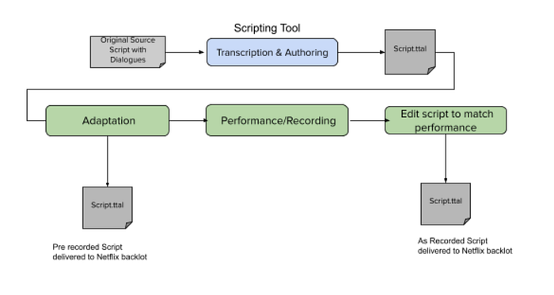

# Introducing Netflix Timed Text Authoring Lineage

_A Script Authoring Specification_

By: Bhanu Srikanth, Andy Swan, Casey Wilms, Patrick Pearson

## The Art of Dubbing and Subtitling

Dubbing and subtitling are inherently creative processes. At Netflix, we strive to make shows as joyful to watch in every language as in the original language, whether a member watches with original or dubbed audio, closed captions, forced narratives, subtitles or any combination they prefer. Capturing creative vision and nuances in translation is critical to achieving this goal. Creating a dub or a subtitle is a complex, multi-step process that involves:

- **Transcribing and timing the dialogue in the original language from a completed show to create a source transcription text**
- Notating dialogue events with character information and other annotations
- Generating localization notes to guide further adaptation
- Translating the dialogue to a target language
- Adapting the translation to the dubbing and subtitling specifications; ex. matching the actor’s lip movements in the case of dubs and considering reading speeds and shot changes for subtitles

## Authoring Scripts

Script files are the essence and the driving force in the localization workflow. They carry dialogue, timecodes and other information as they travel from one tool to another to be transcribed, translated, and adapted for performance by voice artists. Dub scripts, Audio Description, Forced Narratives, Closed Captions, and Subtitles all need to be authored in complex tools that manage the timing, location, and formatting of the text on screen.

Currently, scripts get delivered to Netflix in various ways — Microsoft Word, PDF, Microsoft Excel, Rich Text files, etc., to name a few. These carry crucial information such as dialogues, timecodes, annotations, and other localization contexts. However, the variety of these file formats and inconsistent way of specifying such information across them has made efforts to streamline the localization workflow unattainable in the past.

## Timed Text Authoring Lineage, an Authoring Specification

We decided to remove this stumbling block by developing a new authoring specification called Timed Text Authoring Lineage (TTAL). It enables a seamless exchange of script files between various authoring and prompting tools in the localization pipeline. A TTAL file carries all pertinent information such as type of script, dialogues, timecode, metadata, original language text, transcribed text, language information etc. We have designed TTAL to be robust and extensible to capture all of these details.

By defining vocabulary and annotations around timed text, we strive to simplify our approach to capturing, storing, and sharing materials across the localization pipeline. The name TTAL is carefully crafted to convey its purpose and usage:

- “Timed Text” in the name means it carries the dialogue along with the corresponding timecode
- “Authoring” underscores that this is used for authoring scripts in dubbing and subtitling
- The “Lineage” part of the name speaks to how the script has evolved from the time the show was produced in one language to the time when it was performed in another language by the voice actors or subtitled in other languages.

**In a nutshell, TTAL has been designed to simplify script authoring, so the creative energy is spent on the art of dubbing and subtitling rather than managing adapted and recorded script delivery.**

## Example TTAL Workflow In Dubbing

We have been piloting the authoring and exchange of TTAL scripts as well as the associated workflow with our technology partners and English dubbing partners over the last few months. We receive adapted scripts before recording and again once recording is complete. This workflow, illustrated below, has enabled our dubbing partners to deliver more accurate scripts at crucial moments.

## Prompting Tools

As an initial step, we worked closely with several dubbing technology providers to incorporate TTAL into their product using JSON as the underlying format. We appreciate the efforts put forth by the developers of these products for test driving TTAL and giving us crucial feedback to improve it.

Third-party tools that support import and export of scripts in TTAL are:

- [VoiceQ ](https://www.voiceq.com/releases)version 4.7.2 & above
- [Mosaic 2.0](https://www.noblurway.com/en/)
- [ADR Master 2](https://non-lethal-applications.com/products/adr-master-2/adr-master-2-editor)
- [Nuendo](https://new.steinberg.net/nuendo/), a [Netflix Production Technology Alliance](https://pta.netflixstudios.com/) partner product, is currently being updated to include support for TTAL.

## Servicing The Ultimate Goal

Having tools in the localization pipeline adopt TTAL as a unified way to exchange scripts will be beneficial to all players in the ecosystem in more ways than one. It will improve the capture of consistently structured dub scripts giving us the ability to better parse and leverage the contents of scripts, pave the path for streamlining the workflow, and enable interoperability between tools in the localization pipeline. Ultimately, all these will serve Netflix’s unwavering goal of fulfilling and maintaining the creative vision throughout the localization process.

## Moving Forward

This is just the beginning. We have laid a solid foundation for enabling interoperability by developing a specification for script authoring. We have worked with a few dubbing technology developers to incorporate TTAL into their products, and have modified the specification based on feedback from these early adopters. In addition, we have piloted the workflow with our English dubbing partners.

These efforts have proven that Timed Text Authoring Lineage fills a crucial gap and benefits the entire localization ecosystem, from individual transcribers and script authors, dubbing and subtitling service providers, to technology developers and content creators. We are confident that enabling tools to exchange scripts seamlessly will remove operational headaches and make additional time and effort available for the art of transcribing, translation and adaptation of subtitles and dubs.

Finally, TTAL is an evolving specification. As the adoption of TTAL continues, we expect to learn more and improve the specifications. We are committed to continued collaboration with our localization partners and tool developers to mature this further. If you are interested in incorporating TTAL in the tools you are developing, please reach out to us at [TTAL_Format@netflix.com](mailto:TTAL_Format@netflix.com) to learn more about this exciting new specification and explore how you can use TTAL in your workflows. Please check out [these videos](https://www.youtube.com/playlist?list=PLsJrJgQkAdTn3F-9ilvhKT8pQfr_hN-za) from various tool developers to learn how Netflix’s TTAL is being used in localization workflows.

---
**Tags:** Specifications · Subtitles · Dubbing · Localization · Timed Text
