# Introducing Netflix’s TimeSeries Data Abstraction Layer

By [Rajiv Shringi](https://www.linkedin.com/in/rajiv-shringi), [Vinay Chella](https://www.linkedin.com/in/vinaychella/), [Kaidan Fullerton](https://www.linkedin.com/in/kaidanfullerton/), [Oleksii Tkachuk](https://www.linkedin.com/in/oleksii-tkachuk-98b47375/), [Joey Lynch](https://www.linkedin.com/in/joseph-lynch-9976a431/)

## Introduction

As Netflix continues to expand and diversify into various sectors like **Video on Demand** and **Gaming**, the ability to ingest and store vast amounts of temporal data — often reaching petabytes — with millisecond access latency has become increasingly vital. In previous blog posts, we introduced the [**Key-Value Data Abstraction Layer**](./introducing-netflixs-key-value-data-abstraction-layer-1ea8a0a11b30.md) and the [**Data Gateway Platform**](https://netflixtechblog.medium.com/data-gateway-a-platform-for-growing-and-protecting-the-data-tier-f1ed8db8f5c6), both of which are integral to Netflix’s data architecture. The Key-Value Abstraction offers a flexible, scalable solution for storing and accessing structured key-value data, while the Data Gateway Platform provides essential infrastructure for protecting, configuring, and deploying the data tier.

Building on these foundational abstractions, we developed the **TimeSeries Abstraction** — a versatile and scalable solution designed to efficiently store and query large volumes of temporal event data with low millisecond latencies, all in a cost-effective manner across various use cases.

In this post, we will delve into the architecture, design principles, and real-world applications of the **TimeSeries Abstraction**, demonstrating how it enhances our platform’s ability to manage temporal data at scale.

**Note: **_Contrary to what the name may suggest, this system is not built as a general-purpose time series database. We do not use it for metrics, histograms, timers, or any such near-real time analytics use case. Those use cases are well served by the Netflix _[_Atlas_](https://netflixtechblog.com/introducing-atlas-netflixs-primary-telemetry-platform-bd31f4d8ed9a)_ telemetry system. Instead, we focus on addressing the challenge of storing and accessing extremely high-throughput, immutable temporal event data in a low-latency and cost-efficient manner._

## Challenges

At Netflix, temporal data is continuously generated and utilized, whether from user interactions like video-play events, asset impressions, or complex micro-service network activities. Effectively managing this data at scale to extract valuable insights is crucial for ensuring optimal user experiences and system reliability.

However, storing and querying such data presents a unique set of challenges:

- **High Throughput**: Managing up to 10 million writes per second while maintaining high availability.
- **Efficient Querying in Large Datasets**: Storing petabytes of data while ensuring primary key reads return results within low double-digit milliseconds, and supporting searches and aggregations across multiple secondary attributes.
- **Global Reads and Writes**: Facilitating read and write operations from anywhere in the world with adjustable consistency models.
- ****Tunable****** Configuration**: Offering the ability to partition datasets in either a single-tenant or multi-tenant datastore, with options to adjust various dataset aspects such as retention and consistency.
- **Handling Bursty Traffic**: Managing significant traffic spikes during high-demand events, such as new content launches or regional failovers.
- **Cost Efficiency**: Reducing the cost per byte and per operation to optimize long-term retention while minimizing infrastructure expenses, which can amount to millions of dollars for Netflix.

## TimeSeries Abstraction

The TimeSeries Abstraction was developed to meet these requirements, built around the following core design principles:

- **Partitioned Data**: Data is partitioned using a unique temporal partitioning strategy combined with an event bucketing approach to efficiently manage bursty workloads and streamline queries.
- **Flexible Storage**: The service is designed to integrate with various storage backends, including [Apache Cassandra](https://cassandra.apache.org/_/index.html) and [Elasticsearch](https://www.elastic.co/elasticsearch), allowing Netflix to customize storage solutions based on specific use case requirements.
- **Configurability**: TimeSeries offers a range of tunable options for each dataset, providing the flexibility needed to accommodate a wide array of use cases.
- ****Scalability******: The architecture supports both horizontal and vertical scaling, enabling the system to handle increasing throughput and data volumes as Netflix expands its user base and services.**
- **Sharded Infrastructure**: Leveraging the **Data Gateway Platform**, we can deploy single-tenant and/or multi-tenant infrastructure with the necessary access and traffic isolation.

Let’s dive into the various aspects of this abstraction.

## Data Model

We follow a unique event data model that encapsulates all the data we want to capture for events, while allowing us to query them efficiently.

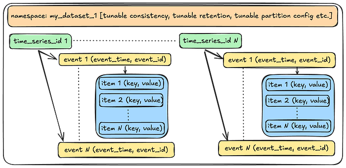

Let’s start with the smallest unit of data in the abstraction and work our way up.

- **Event Item**: An event item is a key-value pair that users use to store data for a given event. For example: _{“device_type”: “ios”}_.
- **Event**: An event is a structured collection of one or more such event items. An event occurs at a specific point in time and is identified by a client-generated timestamp and an event identifier (such as a UUID). This combination of **event_time** and **event_id** also forms part of the unique idempotency key for the event, enabling users to safely retry requests.
- **Time Series ID**: A **time_series_id** is a collection of one or more such events over the dataset’s retention period. For instance, a **device_id** would store all events occurring for a given device over the retention period. All events are immutable, and the TimeSeries service only ever appends events to a given time series ID.
- **Namespace**: A namespace is a collection of time series IDs and event data, representing the complete TimeSeries dataset. Users can create one or more namespaces for each of their use cases. The abstraction applies various tunable options at the namespace level, which we will discuss further when we explore the service’s control plane.

## API

The abstraction provides the following APIs to interact with the event data.

**WriteEventRecordsSync**: This endpoint writes a batch of events and sends back a durability acknowledgement to the client. This is used in cases where users require a guarantee of durability.

**WriteEventRecords**: This is the fire-and-forget version of the above endpoint. It enqueues a batch of events without the durability acknowledgement. This is used in cases like logging or tracing, where users care more about throughput and can tolerate a small amount of data loss.

```
{
  "namespace": "my_dataset",
  "events": [
    {
      "timeSeriesId": "profile100",
      "eventTime": "2024-10-03T21:24:23.988Z",
      "eventId": "550e8400-e29b-41d4-a716-446655440000",
      "eventItems": [
        {
          "eventItemKey": "deviceType",  
          "eventItemValue": "aW9z"
        },
        {
          "eventItemKey": "deviceMetadata",
          "eventItemValue": "c29tZSBtZXRhZGF0YQ=="
        }
      ]
    },
    {
      "timeSeriesId": "profile100",
      "eventTime": "2024-10-03T21:23:30.000Z",
      "eventId": "123e4567-e89b-12d3-a456-426614174000",
      "eventItems": [
        {
          "eventItemKey": "deviceType",  
          "eventItemValue": "YW5kcm9pZA=="
        }
      ]
    }
  ]
}
```

**ReadEventRecords**: Given a combination of a namespace, a timeSeriesId, a timeInterval, and optional eventFilters, this endpoint returns all the matching events, sorted descending by event_time, with low millisecond latency.

```
{
  "namespace": "my_dataset",
  "timeSeriesId": "profile100",
  "timeInterval": {
    "start": "2024-10-02T21:00:00.000Z",
    "end":   "2024-10-03T21:00:00.000Z"
  },
  "eventFilters": [
    {
      "matchEventItemKey": "deviceType",
      "matchEventItemValue": "aW9z"
    }
  ],
  "pageSize": 100,
  "totalRecordLimit": 1000
}
```

**SearchEventRecords**: Given a search criteria and a time interval, this endpoint returns all the matching events. These use cases are fine with eventually consistent reads.

```
{
  "namespace": "my_dataset",
  "timeInterval": {
    "start": "2024-10-02T21:00:00.000Z",
    "end": "2024-10-03T21:00:00.000Z"
  },
  "searchQuery": {
    "booleanQuery": {
      "searchQuery": [
        {
          "equals": {
            "eventItemKey": "deviceType",
            "eventItemValue": "aW9z"
          }
        },
        {
          "range": {
            "eventItemKey": "deviceRegistrationTimestamp",
            "lowerBound": {
              "eventItemValue": "MjAyNC0xMC0wMlQwMDowMDowMC4wMDBa",
              "inclusive": true
            },
            "upperBound": {
              "eventItemValue": "MjAyNC0xMC0wM1QwMDowMDowMC4wMDBa"
            }
          }
        }
      ],
      "operator": "AND"
    }
  },
  "pageSize": 100,
  "totalRecordLimit": 1000
}
```

**AggregateEventRecords**: Given a search criteria and an aggregation mode (e.g. DistinctAggregation) , this endpoint performs the given aggregation within a given time interval. Similar to the Search endpoint, users can tolerate eventual consistency and a potentially higher latency (in seconds).

```
{
  "namespace": "my_dataset",
  "timeInterval": {
    "start": "2024-10-02T21:00:00.000Z",
    "end": "2024-10-03T21:00:00.000Z"
  },
  "searchQuery": {...some search criteria...},
  "aggregationQuery": {
    "distinct": {
      "eventItemKey": "deviceType",
      "pageSize": 100
    }
  }
}
```

In the subsequent sections, we will talk about how we interact with this data at the storage layer.

## Storage Layer

The storage layer for TimeSeries comprises a primary data store and an optional index data store. The primary data store ensures data durability during writes and is used for primary read operations, while the index data store is utilized for search and aggregate operations. At Netflix, **Apache Cassandra** is the preferred choice for storing durable data in high-throughput scenarios, while **Elasticsearch** is the preferred data store for indexing. However, similar to our approach with the API, the storage layer is not tightly coupled to these specific data stores. Instead, we define storage API contracts that must be fulfilled, allowing us the flexibility to replace the underlying data stores as needed.

## Primary Datastore

In this section, we will talk about how we leverage **Apache Cassandra** for TimeSeries use cases.

### Partitioning Scheme

At Netflix’s scale, the continuous influx of event data can quickly overwhelm traditional databases. Temporal partitioning addresses this challenge by dividing the data into manageable chunks based on time intervals, such as hourly, daily, or monthly windows. This approach enables efficient querying of specific time ranges without the need to scan the entire dataset. It also allows Netflix to archive, compress, or delete older data efficiently, optimizing both storage and query performance. Additionally, this partitioning mitigates the performance issues typically associated with [wide partitions](https://thelastpickle.com/blog/2019/01/11/wide-partitions-cassandra-3-11.html) in Cassandra. By employing this strategy, we can operate at much higher disk utilization, as it reduces the need to reserve large amounts of disk space for compactions, thereby saving costs.

Here is what it looks like :

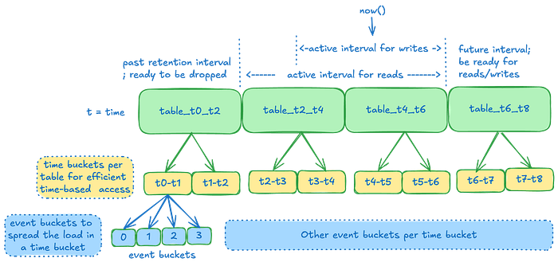

**Time Slice: **A** **time slice is the unit of data retention and maps directly to a Cassandra table. We create multiple such time slices, each covering a specific interval of time. An event lands in one of these slices based on the **event_time**. These slices are joined with _no time gaps_** **in between, with operations being _start-inclusive_ and _end-exclusive_, ensuring that all data lands in one of the slices. By utilizing these time slices, we can efficiently implement retention by dropping entire tables, which reduces storage space and saves on costs.

**Why not use row-based Time-To-Live (TTL)?**

Using TTL on individual events would generate a significant number of [tombstones](https://thelastpickle.com/blog/2016/07/27/about-deletes-and-tombstones.html) in Cassandra, degrading performance, especially during range scans. By employing discrete time slices and dropping them, we avoid the tombstone issue entirely. The tradeoff is that data may be retained slightly longer than necessary, as an entire table’s time range must fall outside the retention window before it can be dropped. **Additionally, TTLs are difficult to adjust later, w**hereas TimeSeries can extend the dataset retention instantly with a single control plane operation.

**Time Buckets**: Within a time slice, data is further partitioned into time buckets. This facilitates effective range scans by allowing us to target specific time buckets for a given query range. The tradeoff is that if a user wants to read the entire range of data over a large time period, we must scan many partitions. We mitigate potential latency by scanning these partitions in parallel and aggregating the data at the end. In most cases, the advantage of targeting smaller data subsets outweighs the read amplification from these scatter-gather operations. Typically, users read a smaller subset of data rather than the entire retention range.

**Event Buckets**: To manage extremely high-throughput write operations, which may result in a burst of writes for a given time series within a short period, we further divide the time bucket into event buckets. This prevents overloading the same partition for a given time range and also reduces partition sizes further, albeit with a slight increase in read amplification.

**Note**: _With Cassandra 4.x onwards, we notice a substantial improvement in the performance of scanning a range of data in a wide partition. See _**_Future Enhancements_**_ at the end to see the _**_Dynamic Event bucketing_**_ work that aims to take advantage of this._

### Storage Tables

We use two kinds of tables

- **Data tables**: These are the time slices that store the actual event data.
- **Metadata table**: This table stores information about how each time slice is configured _per namespace_.

### Data tables

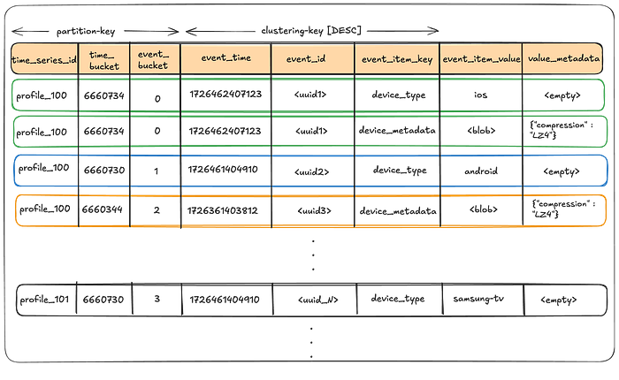

The partition key enables splitting events for a **time_series_id** over a range of **time_bucket(s)** and **event_bucket(s)**, **thus mitigating hot partitions**, while the clustering key allows us to keep data sorted on disk in the order we almost always want to read it. The **value_metadata** column stores metadata for the **event_item_value** such as compression.

**Writing to the data table:**

User writes will land in a given time slice, time bucket, and event bucket as a factor of the **event_time** attached to the event. This factor is dictated by the control plane configuration of a given namespace.

For example:


During this process, the writer makes decisions on how to handle the data before writing, such as whether to compress it. The **value_metadata** column records any such post-processing actions, ensuring that the reader can accurately interpret the data.

**Reading from the data table:**

The below illustration depicts at a high-level on how we scatter-gather the reads from multiple partitions and join the result set at the end to return the final result.

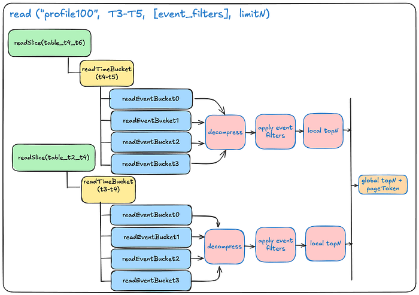

### Metadata table

This table stores the configuration data about the time slices for a given namespace.

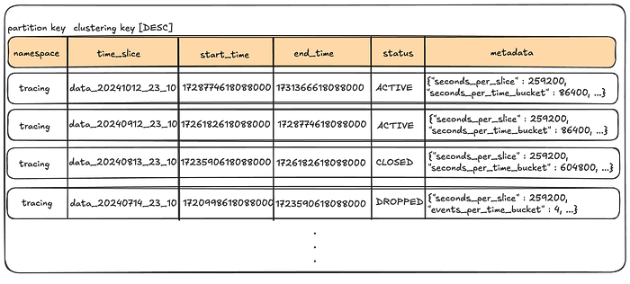

Note the following:

- **No Time Gaps**: The end_time of a given time slice overlaps with the start_time of the next time slice, ensuring all events find a home.
- **Retention**: The status indicates which tables fall inside and outside of the retention window.
- **Flexible**: This metadata can be adjusted per time slice, allowing us to tune the partition settings of future time slices based on observed data patterns in the current time slice.

There is a lot more information that can be stored into the **metadata** column (e.g., compaction settings for the table), but we only show the partition settings here for brevity.

## Index Datastore

To support secondary access patterns via non-primary key attributes, we index data into Elasticsearch. Users can configure a list of attributes per namespace that they wish to search and/or aggregate data on. The service extracts these fields from events as they stream in, indexing the resultant documents into Elasticsearch. Depending on the throughput, we may use Elasticsearch as a reverse index, retrieving the full data from Cassandra, or we may store the entire source data directly in Elasticsearch.

**Note**:_ Again, users are never directly exposed to Elasticsearch, just like they are not directly exposed to Cassandra. Instead, they interact with the Search and Aggregate API endpoints that translate a given query to that needed for the underlying datastore._

In the next section, we will talk about how we configure these data stores for different datasets.

## Control Plane

The data plane is responsible for executing the read and write operations, while the control plane configures every aspect of a namespace’s behavior. The data plane communicates with the TimeSeries control stack, which manages this configuration information. In turn, the TimeSeries control stack interacts with a sharded **Data Gateway Platform Control Plane** that oversees control configurations for all abstractions and namespaces.

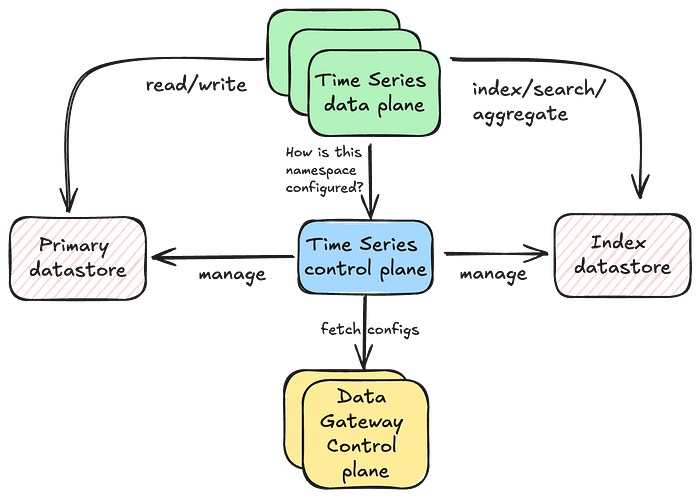

Separating the responsibilities of the data plane and control plane helps maintain the high availability of our data plane, as the control plane takes on tasks that may require some form of schema consensus from the underlying data stores.

## Namespace Configuration

The below configuration snippet demonstrates the immense flexibility of the service and how we can tune several things per namespace using our control plane.

```
"persistence_configuration": [
  {
    "id": "PRIMARY_STORAGE",
    "physical_storage": {
      "type": "CASSANDRA",                  // type of primary storage
      "cluster": "cass_dgw_ts_tracing",     // physical cluster name
      "dataset": "tracing_default"          // maps to the keyspace
    },
    "config": {
      "timePartition": {
        "secondsPerTimeSlice": "129600",    // width of a time slice
        "secondPerTimeBucket": "3600",      // width of a time bucket
        "eventBuckets": 4                   // how many event buckets within
      },
      "queueBuffering": {
        "coalesce": "1s",                   // how long to coalesce writes
        "bufferCapacity": 4194304           // queue capacity in bytes
      },
      "consistencyScope": "LOCAL",          // single-region/multi-region
      "consistencyTarget": "EVENTUAL",      // read/write consistency
      "acceptLimit": "129600s"              // how far back writes are allowed
    },
    "lifecycleConfigs": {
      "lifecycleConfig": [                  // Primary store data retention
        {
          "type": "retention",
          "config": {
            "close_after": "1296000s",      // close for reads/writes
            "delete_after": "1382400s"      // drop time slice
          }
        }
      ]
    }
  },
  {
    "id": "INDEX_STORAGE",
    "physicalStorage": {
      "type": "ELASTICSEARCH",              // type of index storage
      "cluster": "es_dgw_ts_tracing",       // ES cluster name
      "dataset": "tracing_default_useast1"  // base index name
    },
    "config": {
      "timePartition": {
        "secondsPerSlice": "129600"         // width of the index slice
      },
      "consistencyScope": "LOCAL",
      "consistencyTarget": "EVENTUAL",      // how should we read/write data
      "acceptLimit": "129600s",             // how far back writes are allowed
      "indexConfig": {
        "fieldMapping": {                   // fields to extract to index
          "tags.nf.app": "KEYWORD",
          "tags.duration": "INTEGER",
          "tags.enabled": "BOOLEAN"
        },
        "refreshInterval": "60s"            // Index related settings
      }
    },
    "lifecycleConfigs": {
      "lifecycleConfig": [
        {
          "type": "retention",              // Index retention settings
          "config": {
            "close_after": "1296000s",
            "delete_after": "1382400s"
          }
        }
      ]
    }
  }
]
```

## Provisioning Infrastructure

With so many different parameters, we need automated provisioning workflows to deduce the best settings for a given workload. When users want to create their namespaces, they specify a list of _workload_ _desires_, which the automation translates into concrete infrastructure and related control plane configuration. We highly encourage you to watch this [ApacheCon talk](https://www.youtube.com/watch?v=2aBVKXi8LKk), by one of our stunning colleagues **Joey Lynch,** on how we achieve this. We may go into detail on this subject in one of our future blog posts.

Once the system provisions the initial infrastructure, it then scales in response to the user workload. The next section describes how this is achieved.

## Scalability

Our users may operate with limited information at the time of provisioning their namespaces, resulting in best-effort provisioning estimates. Further, evolving use-cases may introduce new throughput requirements over time. Here’s how we manage this:

- **Horizontal scaling**: TimeSeries server instances can auto-scale up and down as per attached scaling policies to meet the traffic demand. The storage server capacity can be recomputed to accommodate changing requirements using our [capacity planner](https://github.com/Netflix-Skunkworks/service-capacity-modeling/tree/main/service_capacity_modeling).
- **Vertical scaling**: We may also choose to vertically scale our TimeSeries server instances or our storage instances to get greater CPU, RAM and/or attached storage capacity.
- **Scaling disk**: We may attach [EBS](https://aws.amazon.com/ebs/) to store data if the capacity planner prefers infrastructure that offers larger storage at a lower cost rather than SSDs optimized for latency. In such cases, we deploy jobs to scale the EBS volume when the disk storage reaches a certain percentage threshold.
- **Re-partitioning data**: Inaccurate workload estimates can lead to over or under-partitioning of our datasets. TimeSeries control-plane can adjust the partitioning configuration for upcoming time slices, once we realize the nature of data in the wild (via partition histograms). In the future we plan to support re-partitioning of older data and dynamic partitioning of current data.

## Design Principles

So far, we have seen how TimeSeries stores, configures and interacts with event datasets. Let’s see how we apply different techniques to improve the performance of our operations and provide better guarantees.

### Event Idempotency

We prefer to bake in idempotency in all mutation endpoints, so that users can retry or hedge their requests safely. [Hedging](https://research.google/pubs/the-tail-at-scale/) is when the client sends an identical competing request to the server, if the original request does not come back with a response in an expected amount of time. The client then responds with whichever request completes first. This is done to keep the tail latencies for an application relatively low. This can only be done safely if the mutations are idempotent. For TimeSeries, the combination of **event_time**, **event_id** and **event_item_key** form the idempotency key for a given **time_series_id** event.

### SLO-based Hedging

We assign Service Level Objectives (SLO) targets for different endpoints within TimeSeries, as an indication of what we think the performance of those endpoints should be _for a given namespace_. We can then hedge a request if the response does not come back in that configured amount of time.

```
"slos": {
  "read": {               // SLOs per endpoint
    "latency": {
      "target": "0.5s",   // hedge around this number
      "max": "1s"         // time-out around this number
    }
  },
  "write": {
    "latency": {
      "target": "0.01s",
      "max": "0.05s"
    }
  }
}
```

### Partial Return

Sometimes, a client may be sensitive to latency and willing to accept a partial result set. A real-world example of this is real-time frequency capping. Precision is not critical in this case, but if the response is delayed, it becomes practically useless to the upstream client. Therefore, the client prefers to work with whatever data has been collected so far rather than timing out while waiting for all the data. The TimeSeries client supports partial returns around SLOs for this purpose. Importantly, we still maintain the latest order of events in this partial fetch.

### Adaptive Pagination

All reads start with a default fanout factor, scanning 8 partition buckets in parallel. However, if the service layer determines that the time_series dataset is dense — i.e., most reads are satisfied by reading the first few partition buckets — then it dynamically adjusts the fanout factor of future reads in order to reduce the read amplification on the underlying datastore. Conversely, if the dataset is sparse, we may want to increase this limit with a reasonable upper bound.

### Limited Write Window

In most cases, the active range for writing data is smaller than the range for reading data — i.e., we want a range of time to become immutable as soon as possible so that we can apply optimizations on top of it. We control this by having a configurable “**acceptLimit**” parameter that prevents users from writing events older than this time limit. For example, an accept limit of 4 hours means that users cannot write events older than _now() — 4 hours_. We sometimes raise this limit for backfilling historical data, but it is tuned back down for regular write operations. Once a range of data becomes immutable, we can safely do things like caching, compressing, and compacting it for reads.

### Buffering Writes

We frequently leverage this service for handling bursty workloads. Rather than overwhelming the underlying datastore with this load all at once, we aim to distribute it more evenly by allowing events to coalesce over short durations (typically seconds). These events accumulate in in-memory queues running on each instance. Dedicated consumers then steadily drain these queues, grouping the events by their partition key, and batching the writes to the underlying datastore.

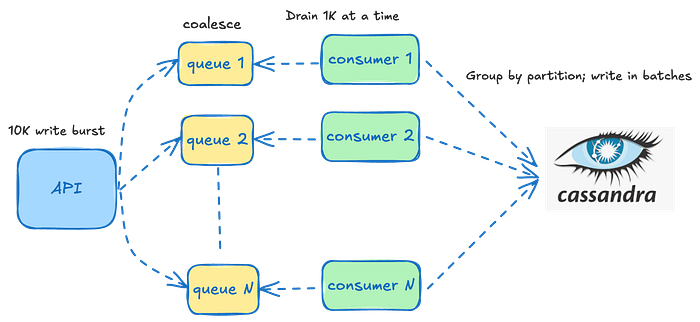

The queues are tailored to each datastore since their operational characteristics depend on the specific datastore being written to. For instance, the batch size for writing to Cassandra is significantly smaller than that for indexing into Elasticsearch, leading to different drain rates and batch sizes for the associated consumers.

While using in-memory queues does increase JVM garbage collection, we have experienced substantial improvements by transitioning to JDK 21 with ZGC. To illustrate the impact, ZGC has reduced our tail latencies by an impressive 86%:

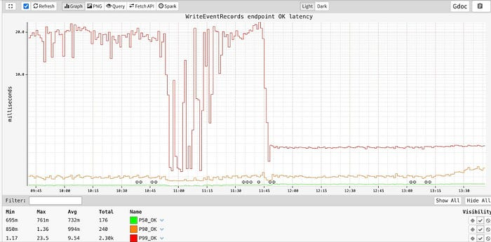

Because we use in-memory queues, we are prone to losing events in case of an instance crash. As such, these queues are only used for use cases that can tolerate some amount of data loss .e.g. tracing/logging. For use cases that need guaranteed durability and/or read-after-write consistency, these queues are effectively disabled and writes are flushed to the data store almost immediately.

### Dynamic Compaction

Once a time slice exits the active write window, we can leverage the immutability of the data to optimize it for read performance. This process may involve re-compacting immutable data using optimal compaction strategies, dynamically shrinking and/or splitting shards to optimize system resources, and other similar techniques to ensure fast and reliable performance.

The following section provides a glimpse into the real-world performance of some of our TimeSeries datasets.

## Real-world Performance

The service can write data in the order of low single digit milliseconds

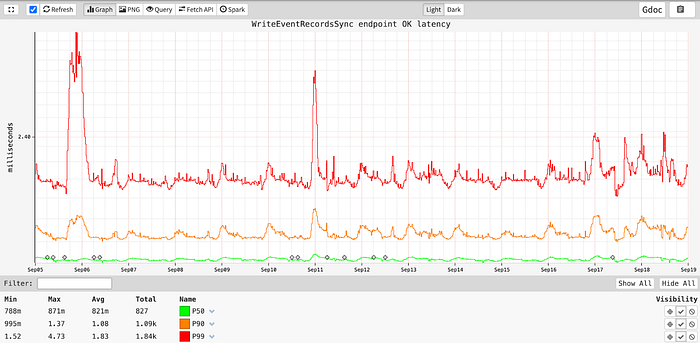

while consistently maintaining stable point-read latencies:

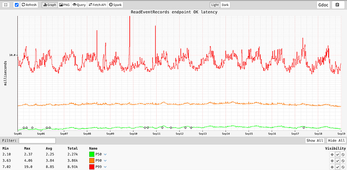

At the time of writing this blog, the service was processing close to _15 million events/second_ across all the different datasets at peak globally.

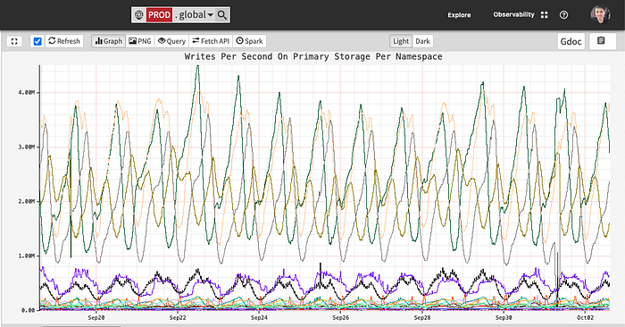

## Time Series Usage @ Netflix

The TimeSeries Abstraction plays a vital role across key services at Netflix. Here are some impactful use cases:

- **Tracing and Insights: **Logs traces across all apps and micro-services within Netflix, to understand service-to-service communication, aid in debugging of issues, and answer support requests.
- **User Interaction Tracking**: Tracks millions of user interactions — such as video playbacks, searches, and content engagement — providing insights that enhance Netflix’s recommendation algorithms in real-time and improve the overall user experience.
- **Feature Rollout and Performance Analysis**: Tracks the rollout and performance of new product features, enabling Netflix engineers to measure how users engage with features, which powers data-driven decisions about future improvements.
- **Asset Impression Tracking and Optimization**: Tracks asset impressions ensuring content and assets are delivered efficiently while providing real-time feedback for optimizations.
- **Billing and Subscription Management:** Stores historical data related to billing and subscription management, ensuring accuracy in transaction records and supporting customer service inquiries.

and more…

## Future Enhancements

As the use cases evolve, and the need to make the abstraction even more cost effective grows, we aim to make many improvements to the service in the upcoming months. Some of them are:

- **Tiered Storage for Cost Efficiency: **Support moving older, lesser-accessed data into cheaper object storage that has higher time to first byte, potentially saving Netflix millions of dollars.
- **Dynamic Event Bucketing: **Support real-time partitioning of keys into optimally-sized partitions as events stream in, rather than having a _somewhat_ static configuration at the time of provisioning a namespace. This strategy has a huge advantage of _not_ partitioning time_series_ids that don’t need it, thus saving the overall cost of read amplification. Also, with Cassandra 4.x, we have noted major improvements in reading a subset of data in a wide partition that could lead us to be less aggressive with partitioning the entire dataset ahead of time.
- **Caching: **Take advantage of immutability of data and cache it intelligently for discrete time ranges.
- **Count and other Aggregations: **Some users are only interested in counting events in a given time interval rather than fetching all the event data for it.

## Conclusion

The TimeSeries Abstraction is a vital component of Netflix’s online data infrastructure, playing a crucial role in supporting both real-time and long-term decision-making. Whether it’s monitoring system performance during high-traffic events or optimizing user engagement through behavior analytics, TimeSeries Abstraction ensures that Netflix operates seamlessly and efficiently on a global scale.

As Netflix continues to innovate and expand into new verticals, the TimeSeries Abstraction will remain a cornerstone of our platform, helping us push the boundaries of what’s possible in streaming and beyond.

Stay tuned for Part 2, where we’ll introduce our **Distributed Counter Abstraction**, a key element of **Netflix’s Composite Abstractions**, built on top of the TimeSeries Abstraction.

## Acknowledgments

Special thanks to our stunning colleagues who contributed to TimeSeries Abstraction’s success: [Tom DeVoe](https://www.linkedin.com/in/tomdevoe/) [Mengqing Wang](https://www.linkedin.com/in/mengqingwang/), [Kartik Sathyanarayanan](https://www.linkedin.com/in/kartik894/), [Jordan West](https://www.linkedin.com/in/jordan-west-8aa1731a3/), [Matt Lehman](https://www.linkedin.com/in/matt-lehman-39549719b/), [Cheng Wang](https://www.linkedin.com/in/cheng-wang-10323417/), [Chris Lohfink](https://www.linkedin.com/in/clohfink/) .
