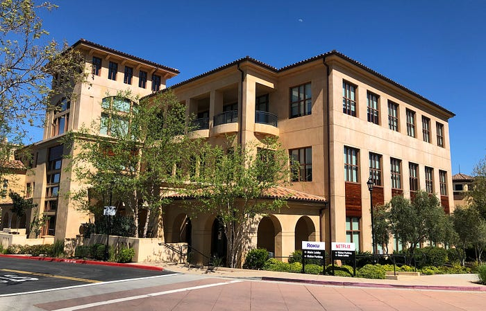
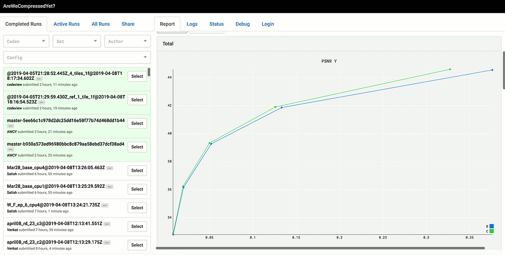

# Introducing SVT-AV1: a scalable open-source AV1 framework

> by Andrey Norkin, Joel Sole, Kyle Swanson, Mariana Afonso, Anush Moorthy, Anne Aaron

*Netflix Headquarters, Winchester Circle.*

Netflix headquarters circa 2014. It’s a nice building with good architecture! This was the primary home of Netflix for a number of years during the company’s growth, but at some point Netflix had outgrown its home and needed more space. One approach to solve this problem would have been to extend the building by attaching new rooms, hallways, and rebuilding the older ones. However, a more scalable approach would be to begin with a new foundation and begin a new building. Below you can see the new Netflix headquarters in Los Gatos, California. The facilities are modern, spacious and scalable. The new campus started with two buildings, connected together, and was further extended with more buildings when more space was needed. What does this example have to do with software development and video encoding? When you are building an encoder, sometimes you need to start with a clean slate too.

*New Netflix Buildings in Los Gatos.*

## What is SVT-AV1?

Intel and Netflix announced their collaboration on a software video encoder implementation called SVT-AV1 on April 8, 2019. Scalable Video Technology (SVT) is Intel’s open source framework that provides high-performance software video encoding libraries for developers of visual cloud technologies. In this tech blog, we describe the relevance of this partnership to the industry and cover some of our own experiences so far. We also describe how you can become a part of this development.

## A brief look into the history of video standards

Historically, video compression standards have been developed by two international standardization organizations, ITU-T and MPEG (ISO). The first successful digital video standard was MPEG-2, which truly enabled digital transmission of video. The success was repeated by H.264/AVC, currently, the most ubiquitous video compression standard supported by modern devices, often in hardware. On the other hand, there are examples of video codecs developed by companies, such as Microsoft’s VC-1 and Google’s VPx codecs. The advantage of adopting a video compression standard is interoperability. The standard specification describes in minute detail how a video bitstream should be processed in order to produce displayable video frames. This allows device manufacturers to independently work on their decoder implementations. When content providers encode their video according to the standard, this guarantees that all compliant devices are able to decode and display the video.

Recently, the adoption of the newest video codec standardized by ITU-T and ISO has been slow in light of widespread licensing uncertainty. A group of companies formed the Alliance for Open Media (AOM) with the goal of creating a modern, royalty-free video codec that would be widely adopted and supported by a plethora of devices. The AOM board currently includes Amazon, Apple, ARM, Cisco, Facebook, Google, IBM, Intel, Microsoft, Mozilla, Netflix, Nvidia, and Samsung, and [many companies](https://aomedia.org/membership/members/) joined as promoter members. In 2018, AOM has published a [specification](https://aomediacodec.github.io/av1-spec/av1-spec.pdf) for the AV1 video codec.

## Decoder specification is frozen, encoder being improved for years

As mentioned earlier, a standard specifies how the compressed bitstream is to be interpreted to produce displayable video, which means that encoders can vary in their characteristics, such as computational performance and achievable quality for a given bitrate. The encoder can typically be improved years after the standard has been frozen including varying speed and quality trade-offs. An example of such development is the [x264 encoder](https://www.videolan.org/developers/x264.html) that has been improving years after the H.264 standard was finalized.

To develop a conformant decoder, the standard specification should be sufficient. However, to guide codec implementers, the standardization committee also issues _reference software_, which includes a compliant decoder and encoder. Reference software serves as the basis for standard development, a framework, in which the performance of video coding tools is evaluated. The reference software typically evolves along with the development of the standard. In addition, when standardization is completed, the reference software can help to kickstart implementations of compliant decoders and encoders.

AOM has produced the reference software for AV1, which is called libaom and is available [online](https://aomedia.googlesource.com/aom/). The libaom was built upon the codebase from VP9, VP8, and previous generations of VPx video codecs. During the AV1 development, the software was further developed by the AOM video codec group.

## Netflix interest in SVT-AV1

Reference software typically focuses on the best possible compression at the expense of encoding speed. It is well known that encoding time of reference software for modern video codecs can be rather long.

One of Intel’s goals with SVT-AV1 development was to create a production-grade AV1 encoder that offers performance and scalability. SVT-AV1 uses parallelization at several stages of the encoding process, which allows it to adapt to the number of available cores including newest servers with significant core count. This makes it possible for SVT-AV1 to decrease encoding time while still maintaining compression efficiency.

In August 2018, Netflix’s Video Algorithms team and Intel’s Visual Cloud team decided to join forces on SVT-AV1 development. Since that time, Intel’s and Netflix’s teams closely collaborated on SVT-AV1 development, discussing architectural decisions, implementing new tools, and improving the compression efficiency. Netflix’s main interest in SVT-AV1 was somewhat different and complementary to Intel’s intention of building a production-grade highly scalable encoder.

**At ****Netflix****, we believe that the AV1 ecosystem would benefit from an alternative clean and efficient open-source encoder implementation. There exists at least one other alternative open-source AV1 encoder, ****[rav1e](https://github.com/xiph/rav1e)****. However, rav1e is written in Rust programming language, whereas an encoder written in C has a much broader base of potential developers.** The open-source encoder should also enable easy experimentation and a platform for testing new coding tools. Consequently, our requirements to the AV1 software are as follows:

- Easy to understand code with a low entry barrier and a test framework
- Competitive compression efficiency on par with the reference implementation
- Complete toolset and a decoder implementation sharing common code with the encoder, which simplifies experiments on new coding tools
- Decreased encoder runtime that enables quicker turn-around when testing new ideas

We believe that if SVT-AV1 is aligned with these characteristics, it can be used as a platform for future video coding standards development, such as the research and development efforts towards the AV2 video codec, and improved AV1 encoding.

Thus, Netflix and Intel approach SVT-AV1 with complementary goals. The encoder speed helps innovation, as it is faster to run experiments. Cleanliness of the code helps adoption in the open-source community, which is crucial for the success of an open-source project. It can be argued that extensive parallelization may have compression efficiency trade-offs but it also allows testing more encoding options. Moreover, we expect multi-core platforms be prevalently used for video encoding in the future, which makes it important to test new tools in an architecture supporting many threads.

## Our progress so far

We have accomplished the following milestones to achieve the goals of making SVT-AV1 an excellent experimentation platform and AV1 reference:

- Open-sourced SVT-AV1 on GitHub [https://github.com/OpenVisualCloud/SVT-AV1/](https://github.com/OpenVisualCloud/SVT-AV1/) with a BSD + patent license.
- Added a continuous integration (CI) framework for Linux, Windows, and MacOs.
- Added a unit tests framework based on Google Test. An external contractor is adding unit tests to achieve sufficient coverage for the code already developed. Furthermore, unit tests will cover new code.
- Added other types of testing in the CI framework, such as automatic encoding and Valgrind test.
- Started a decoder project that shares common parts of AV1 algorithms with the encoder.
- Introduced style guidelines and formatted the existing code accordingly.

SVT-AV1 is currently work in progress since it is still missing the implementation of some coding tools and therefore has an average gap of about 14% in PSNR BD-rate with the libaom encoder in a 1-pass mode. The following features are planned to be added and will decrease the BD-rate gap:

- Multi-reference pictures
- ALTREF pictures
- Eighth-pel motion compensation (1/8-pel)
- Global motion compensation
- OBMC
- Wedge prediction
- TMVP
- Palette prediction
- Adaptive transform block sizes
- Trellis Quantized Coefficient Optimization
- Segmentation
- 4:2:2 support
- Rate control (ABR, CBR, VBR)
- 2-pass encoding mode

There is still much work ahead, and we are committed to making the SVT-AV1 project satisfy the goal of being an excellent experimentation platform, as well as viable for production applications. You can track the SVT-AV1 performance progress on the beta of [AWCY](https://beta.arewecompressedyet.com/) (AreWeCompressedYet) website. AWCY was the framework used to evaluate AV1 tools during its development. In the figure below, you can see a comparison of two versions of the SVT-AV1 codec, the blue plot representing SVT-AV1 version from March 15, 2019, and the green one from March 19, 2019.

*Screenshot of the AreWeCompressedYet codec comparison page.*

SVT-AV1 already stands out in its speed. SVT-AV1 does not reach the compression efficiency of libaom at the slowest speed settings, but it performs encoding significantly faster than the fastest libaom mode. Currently, SVT-AV1 in the slowest mode uses about 13.5% more bits compared to the libaom encoder in a 1-pass mode with cpu_used=1 (the second slowest mode of libaom), while being about 4 times faster*. The BD-rate gap with 2-pass libaom encoding is wider and we are planning to address this by implementing 2-pass encoding in SVT-AV1. One could also note that faster encoding settings of SVT-AV1 decrease the encoding times even more dramatically providing significant encoder speed-up.

## Open-source video coding needs you!

If you are interested in helping us to build SVT-AV1, you can contribute on GitHub [https://github.com/OpenVisualCloud/SVT-AV1/](https://github.com/OpenVisualCloud/SVT-AV1/) with your suggestions, comments and of course your code.

---

*These results have been obtained for 8-bit encodes on the set of AOM test video sequences, Objective-1-fast.

---
**Tags:** Av1 · Video Codec · Aom · Svt · Encoder
