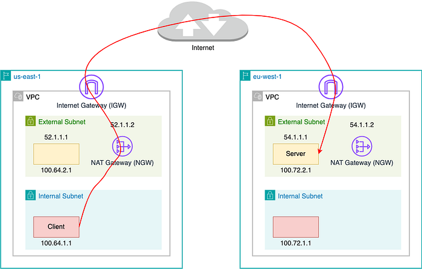
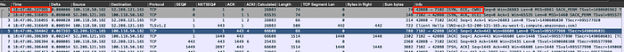
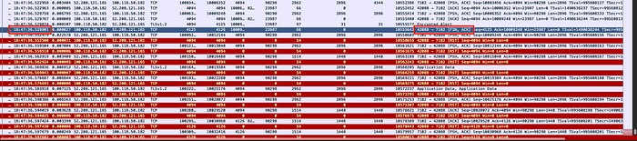
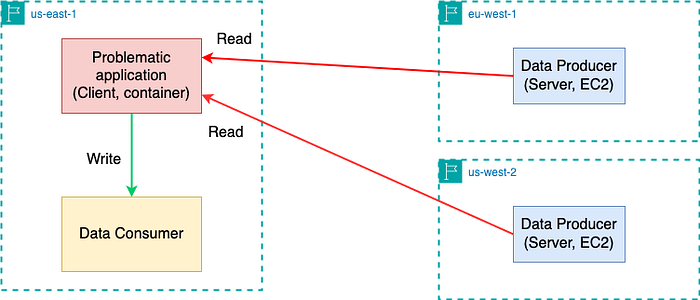
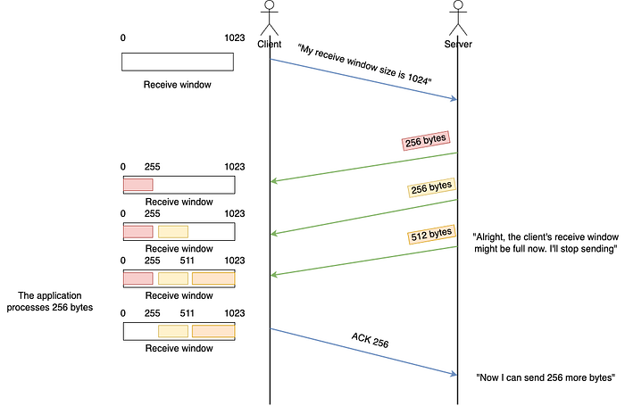

# Investigation of a Cross-regional Network Performance Issue

[Hechao Li](https://www.linkedin.com/in/hechaoli/), [Roger Cruz](https://www.linkedin.com/in/rogercruz/)

## Cloud Networking Topology

Netflix operates a highly efficient cloud computing infrastructure that supports a wide array of applications essential for our SVOD (Subscription Video on Demand), live streaming and gaming services. Utilizing Amazon AWS, our infrastructure is hosted across multiple geographic regions worldwide. This global distribution allows our applications to deliver content more effectively by serving traffic closer to our customers. Like any distributed system, our applications occasionally require data synchronization between regions to maintain seamless service delivery.

The following diagram shows a simplified cloud network topology for cross-region traffic.



## The Problem At First Glance

Our Cloud Network Engineering on-call team received a request to address a network issue affecting an application with cross-region traffic. Initially, it appeared that the application was experiencing timeouts, likely due to suboptimal network performance. As we all know, the longer the network path, the more devices the packets traverse, increasing the likelihood of issues. For this incident, **the client application is located in an internal subnet in the US region while the server application is located in an external subnet in a European region**. Therefore, it is natural to blame the network since packets need to travel long distances through the internet.

As network engineers, our initial reaction when the network is blamed is typically, “No, it can’t be the network,” and our task is to prove it. Given that there were no recent changes to the network infrastructure and no reported AWS issues impacting other applications, the on-call engineer suspected a noisy neighbor issue and sought assistance from the Host Network Engineering team.

## Blame the Neighbors

In this context, a noisy neighbor issue occurs when a container shares a host with other network-intensive containers. **These noisy neighbors consume excessive network resources, causing other containers on the same host to suffer from degraded network performance. ****Despite each container having bandwidth limitations, oversubscription can still lead to such issues.**

Upon investigating other containers on the same host — most of which were part of the same application — we quickly eliminated the possibility of noisy neighbors. **The network throughput for both the problematic container and all others was significantly below the set bandwidth limits.** We attempted to resolve the issue by removing these bandwidth limits, allowing the application to utilize as much bandwidth as necessary. However, the problem persisted.

## Blame the Network

We observed some **TCP packets in the network marked with the RST flag**, a flag indicating that a connection should be immediately terminated. Although the frequency of these packets was not alarmingly high, the presence of any RST packets still raised suspicion on the network. To determine whether this was indeed a network-induced issue, we conducted a tcpdump on the client. In the packet capture file, we spotted one TCP stream that was closed after exactly 30 seconds.

SYN at 18:47:06



After the 3-way handshake (SYN,SYN-ACK,ACK), the traffic started flowing normally. Nothing strange until FIN at 18:47:36 (30 seconds later)



The packet capture results clearly indicated that **it was the client application that initiated the connection termination by sending a FIN packet**. Following this, the server continued to send data; however, since the client had already decided to close the connection, it responded with RST packets to all subsequent data from the server.

To ensure that the client wasn’t closing the connection due to packet loss, we also conducted a packet capture on the server side to verify that all packets sent by the server were received. This task was complicated by the fact that the packets passed through a NAT gateway (NGW), which meant that on the server side, the client’s IP and port appeared as those of the NGW, differing from those seen on the client side. Consequently, to accurately match TCP streams, **we needed to identify the TCP stream on the client side, locate the raw TCP sequence number, and then use this number as a filter on the server side to find the corresponding TCP stream.**

With packet capture results from both the client and server sides, we confirmed that **all packets sent by the server were correctly received before the client sent a FIN**.

Now, from the network point of view, the story is clear. The client initiated the connection requesting data from the server. The server kept sending data to the client with no problem. However, at a certain point, **despite the server still having data to send, the client chose to terminate the reception of data**. This led us to suspect that the issue might be related to the client application itself.

## Blame the Application

In order to fully understand the problem, we now need to understand how the application works. As shown in the diagram below, the application runs in the us-east-1 region. **It reads data from cross-region servers and writes the data to consumers within the same region.** The client runs as containers, whereas the servers are EC2 instances.

**Notably, the cross-region read was problematic **while the write path was smooth. Most importantly, there is a 30-second application-level timeout for reading the data. The application (client) errors out if it fails to read an initial batch of data from the servers within 30 seconds. When we increased this timeout to 60 seconds, everything worked as expected. **This explains why the client initiated a FIN — because it lost patience waiting for the server to transfer data**.



Could it be that the server was updated to send data more slowly? Could it be that the client application was updated to receive data more slowly? Could it be that the data volume became too large to be completely sent out within 30 seconds? Sadly, **we received negative answers for all 3 questions from the application owner.** The server had been operating without changes for over a year, there were no significant updates in the latest rollout of the client, and the data volume had remained consistent.

## Blame the Kernel

If both the network and the application weren’t changed recently, then what changed? In fact, we discovered that the issue coincided with a recent **Linux kernel upgrade from version 6.5.13 to 6.6.10**. To test this hypothesis, we rolled back the kernel upgrade and it did restore normal operation to the application.

Honestly speaking, at that time I didn’t believe it was a kernel bug because I assumed the TCP implementation in the kernel should be solid and stable (Spoiler alert: How wrong was I!). But we were also out of ideas from other angles.

There were about 14k commits between the good and bad kernel versions. Engineers on the team methodically and diligently bisected between the two versions. When the bisecting was narrowed to a couple of commits, **a change with “tcp” in its commit message caught our attention. The final bisecting confirmed that **[**this commit**](https://lore.kernel.org/netdev/20230717152917.751987-1-edumazet@google.com/T/)** was our culprit**.

Interestingly, while reviewing the email history related to this commit, we found that [another user had reported a Python test failure following the same kernel upgrade](https://github.com/eventlet/eventlet/issues/821). Although their solution was not directly applicable to our situation, it suggested that **a simpler test might also reproduce our problem**. Using _strace_, we observed that the application configured the following socket options when communicating with the server:

```
[pid 1699] setsockopt(917, SOL_IPV6, IPV6_V6ONLY, [0], 4) = 0
[pid 1699] setsockopt(917, SOL_SOCKET, SO_KEEPALIVE, [1], 4) = 0
[pid 1699] setsockopt(917, SOL_SOCKET, SO_SNDBUF, [131072], 4) = 0
[pid 1699] setsockopt(917, SOL_SOCKET, SO_RCVBUF, [65536], 4) = 0
[pid 1699] setsockopt(917, SOL_TCP, TCP_NODELAY, [1], 4) = 0
```

We then developed a minimal client-server C application that transfers a file from the server to the client, with the client configuring the same set of socket options. During testing, we used a 10M file, which represents the volume of data typically transferred within 30 seconds before the client issues a FIN. **On the old kernel, this cross-region transfer completed in 22 seconds, whereas on the new kernel, it took 39 seconds to finish.**

## The Root Cause

With the help of the minimal reproduction setup, we were ultimately able to pinpoint the root cause of the problem. In order to understand the root cause, it’s essential to have a grasp of the TCP receive window.

### TCP Receive Window

Simply put, **the TCP receive window is how the receiver tells the sender “This is how many bytes you can send me without me ACKing any of them”**. Assuming the sender is the server and the receiver is the client, then we have:



### The Window Size

Now that we know the TCP receive window size could affect the throughput, the question is, how is the window size calculated? As an application writer, you can’t decide the window size, however, you can decide how much memory you want to use for buffering received data. This is configured using **_SO_RCVBUF_ socket option** we saw in the _strace_ result above. However, note that the value of this option means how much **application data** can be queued in the receive buffer. In [man 7 socket](https://man7.org/linux/man-pages/man7/socket.7.html), there is

> SO_RCVBUFSets or gets the maximum socket receive buffer in bytes.  
>  The kernel doubles this value (to allow space for  
>  bookkeeping overhead) when it is set using setsockopt(2),  
>  and this doubled value is returned by getsockopt(2). The  
>  default value is set by the  
>  /proc/sys/net/core/rmem_default file, and the maximum  
>  allowed value is set by the /proc/sys/net/core/rmem_max  
>  file. The minimum (doubled) value for this option is 256.

This means, when the user gives a value X, then [the kernel stores 2X in the variable sk->sk_rcvbuf](https://elixir.bootlin.com/linux/v6.9-rc1/source/net/core/sock.c#L976). In other words, **the kernel assumes that the bookkeeping overhead is as much as the actual data (i.e. 50% of the sk_rcvbuf)**.

### sysctl_tcp_adv_win_scale

However, the assumption above may not be true because the actual overhead really depends on a lot of factors such as Maximum Transmission Unit (MTU). Therefore, **the kernel provided this _sysctl_tcp_adv_win_scale_ which you can use to tell the kernel what the actual overhead is**. (I believe 99% of people also don’t know how to set this parameter correctly and I’m definitely one of them. You’re the kernel, if you don’t know the overhead, how can you expect me to know?).

According to [the _sysctl_ doc](https://docs.kernel.org/networking/ip-sysctl.html),

> _tcp_adv_win_scale — INTEGER__Obsolete since linux-6.6 Count buffering overhead as bytes/2^tcp_adv_win_scale (if tcp_adv_win_scale > 0) or bytes-bytes/2^(-tcp_adv_win_scale), if it is <= 0.__Possible values are [-31, 31], inclusive.__Default: 1_

For 99% of people, we’re just using the default value 1, which in turn means the overhead is calculated by _rcvbuf/2^tcp_adv_win_scale = 1/2 * rcvbuf_. This matches the assumption when setting the _SO_RCVBUF_ value.

Let’s recap. Assume you set _SO_RCVBUF_ to 65536, which is the value set by the application as shown in the _setsockopt_ syscall. Then we have:

- SO_RCVBUF = 65536
- rcvbuf = 2 * 65536 = 131072
- overhead = rcvbuf / 2 = 131072 / 2 = 65536
- receive window size = rcvbuf — overhead = 131072–65536 = 65536

(Note, this calculation is simplified. The real calculation is more complex.)

In short, the receive window size before the kernel upgrade was 65536. With this window size, the application was able to transfer 10M data within 30 seconds.

### The Change

[This commit](https://lore.kernel.org/netdev/20230717152917.751987-1-edumazet@google.com/T/) obsoleted _sysctl_tcp_adv_win_scale_ and introduced a _scaling_ratio_ that can more accurately calculate the overhead or window size, which is the right thing to do. With the change, the window size is now _rcvbuf * scaling_ratio_.

So how is _scaling_ratio_ calculated? It is calculated using **_skb->len/skb->truesize_** where _skb->len_ is the length of the tcp data length in an _skb_ and _truesize_ is the total size of the _skb_. **This is surely a more accurate ratio based on real data rather than a hardcoded 50%.** Now, here is the next question: during the TCP handshake **before any data is transferred, how do we decide the initial _scaling_ratio_? **The answer is, a magic and conservative ratio was chosen with the value being roughly 0.25.

Now we have:

- SO_RCVBUF = 65536
- rcvbuf = 2 * 65536 = 131072
- receive window size = rcvbuf * 0.25 = 131072 * 0.25 = 32768

In short, **the receive window size halved after the kernel upgrade. Hence the throughput was cut in half**,** causing the data transfer time to double.**

Naturally, you may ask, I understand that the initial window size is small, but **why doesn’t the window grow when we have a more accurate ratio of the payload later** (i.e. _skb->len/skb->truesize_)? With some debugging, we eventually found out that the _scaling_ratio_ does [get updated to a more accurate _skb->len/skb->truesize_](https://elixir.bootlin.com/linux/v6.7.9/source/net/ipv4/tcp_input.c#L248), which in our case is around 0.66. However, another variable, _window_clamp_, is not updated accordingly. _window_clamp_ is the [maximum receive window allowed to be advertised](https://elixir.bootlin.com/linux/v6.7.9/source/include/linux/tcp.h#L256), which is also initialized to _0.25 * rcvbuf _using the initial _scaling_ratio_. As a result, **the receive window size is capped at this value and can’t grow bigger**.

## The Fix

In theory, the fix is to update _window_clamp_ along with _scaling_ratio_. However, in order to have a simple fix that doesn’t introduce other unexpected behaviors, [our final fix was to increase the initial _scaling_ratio_ from 25% to 50%](https://git.kernel.org/pub/scm/linux/kernel/git/netdev/net-next.git/commit/?id=697a6c8cec03). This will make the receive window size backward compatible with the original default _sysctl_tcp_adv_win_scale_.

Meanwhile, notice that the problem is not only caused by the changed kernel behavior but also by the fact that the application sets _SO_RCVBUF_ and has a 30-second application-level timeout. In fact, the application is Kafka Connect and both settings are the default configurations ([_receive.buffer.bytes=64k_](https://kafka.apache.org/documentation/#connectconfigs_receive.buffer.bytes) and [_request.timeout.ms=30s_](https://kafka.apache.org/documentation/#consumerconfigs_request.timeout.ms)). We also[ created a kafka ticket to change receive.buffer.bytes to -1](https://issues.apache.org/jira/browse/KAFKA-16496) to allow Linux to auto tune the receive window.

## Conclusion

This was a very interesting debugging exercise that covered many layers of Netflix’s stack and infrastructure. While it technically wasn’t the “network” to blame, this time it turned out the culprit was the software components that make up the network (i.e. the TCP implementation in the kernel).

If tackling such technical challenges excites you, consider joining our Cloud Infrastructure Engineering teams. Explore opportunities by visiting [Netflix Jobs](https://jobs.netflix.com/) and searching for Cloud Engineering positions.

## Acknowledgments

Special thanks to our stunning colleagues [Alok Tiagi](https://www.linkedin.com/in/alok-tiagi-99205015/), [Artem Tkachuk](https://www.linkedin.com/in/artemtkachuk/), [Ethan Adams](https://www.linkedin.com/in/jethanadams/), [Jorge Rodriguez](https://www.linkedin.com/in/jorge-rodriguez-12b5595/), [Nick Mahilani](https://www.linkedin.com/in/nickmahilani/), [Tycho Andersen](https://tycho.pizza/) and [Vinay Rayini](https://www.linkedin.com/in/vinay-rayini/) for investigating and mitigating this issue. We would also like to thank Linux kernel network expert [Eric Dumazet](https://www.linkedin.com/in/eric-dumazet-ba252942/) for reviewing and applying the patch.

---
**Tags:** Network · Tcp · Linux · Kernel · Debugging
