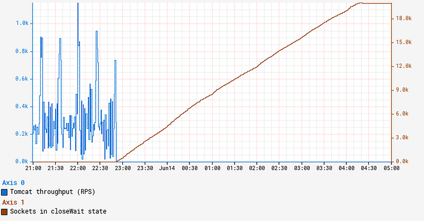
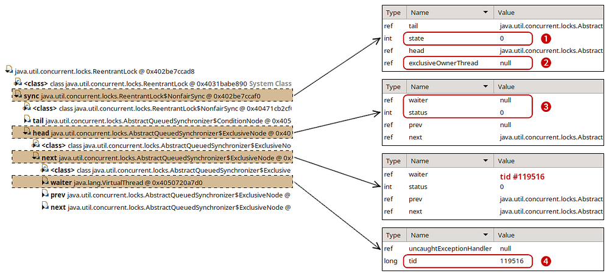

# Java 21 Virtual Threads - Dude, Where’s My Lock?

> Getting real with virtual threads

By [Vadim Filanovsky](https://www.linkedin.com/in/vfilanovsky/), [Mike Huang](https://www.linkedin.com/in/mike-huang-a552781/), [Danny Thomas](https://www.linkedin.com/in/danny-thomas-a623413/) and [Martin Chalupa](https://www.linkedin.com/in/martinchalupa/)

## Intro

Netflix has an extensive history of using Java as our primary programming language across our vast fleet of microservices. As we pick up newer versions of Java, our JVM Ecosystem team seeks out new language features that can improve the ergonomics and performance of our systems. In a [recent article](./bending-pause-times-to-your-will-with-generational-zgc-256629c9386b.md), we detailed how our workloads benefited from switching to generational ZGC as our default garbage collector when we migrated to Java 21. Virtual threads is another feature we are excited to adopt as part of this migration.

For those new to virtual threads, [they are described](https://docs.oracle.com/en/java/javase/21/core/virtual-threads.html) as “lightweight threads that dramatically reduce the effort of writing, maintaining, and observing high-throughput concurrent applications.” Their power comes from their ability to be suspended and resumed automatically via continuations when blocking operations occur, thus freeing the underlying operating system threads to be reused for other operations. Leveraging virtual threads can unlock higher performance when utilized in the appropriate context.

In this article we discuss one of the peculiar cases that we encountered along our path to deploying virtual threads on Java 21.

## The problem

Netflix engineers raised several independent reports of intermittent timeouts and hung instances to the Performance Engineering and JVM Ecosystem teams. Upon closer examination, we noticed a set of common traits and symptoms. In all cases, the apps affected ran on Java 21 with SpringBoot 3 and embedded Tomcat serving traffic on REST endpoints. The instances that experienced the issue simply stopped serving traffic even though the JVM on those instances remained up and running. One clear symptom characterizing the onset of this issue is a persistent increase in the number of sockets in `closeWait` state as illustrated by the graph below:



## Collected diagnostics

Sockets remaining in `closeWait` state indicate that the remote peer closed the socket, but it was never closed on the local instance, presumably because the application failed to do so. This can often indicate that the application is hanging in an abnormal state, in which case application thread dumps may reveal additional insight.

In order to troubleshoot this issue, we first leveraged our [alerts system](./improved-alerting-with-atlas-streaming-eval-e691c60dc61e.md) to catch an instance in this state. Since we periodically collect and persist thread dumps for all JVM workloads, we can often retroactively piece together the behavior by examining these thread dumps from an instance. However, we were surprised to find that all our thread dumps show a perfectly idle JVM with no clear activity. Reviewing recent changes revealed that these impacted services enabled virtual threads, and we knew that virtual thread call stacks do not show up in `jstack`-generated thread dumps. To obtain a more complete thread dump containing the state of the virtual threads, we used the “`jcmd Thread.dump_to_file`” command instead. As a last-ditch effort to introspect the state of JVM, we also collected a heap dump from the instance.

## Analysis

Thread dumps revealed thousands of “blank” virtual threads:

```
#119821 "" virtual

#119820 "" virtual

#119823 "" virtual

#120847 "" virtual

#119822 "" virtual
...
```

These are the VTs (virtual threads) for which a thread object is created, but has not started running, and as such, has no stack trace. In fact, there were approximately the same number of blank VTs as the number of sockets in closeWait state. To make sense of what we were seeing, we need to first understand how VTs operate.

A virtual thread is not mapped 1:1 to a dedicated OS-level thread. Rather, we can think of it as a task that is scheduled to a fork-join thread pool. When a virtual thread enters a blocking call, like waiting for a `Future`, it relinquishes the OS thread it occupies and simply remains in memory until it is ready to resume. In the meantime, the OS thread can be reassigned to execute other VTs in the same fork-join pool. This allows us to multiplex a lot of VTs to just a handful of underlying OS threads. In JVM terminology, the underlying OS thread is referred to as the “carrier thread” to which a virtual thread can be “mounted” while it executes and “unmounted” while it waits. A great in-depth description of virtual thread is available in [JEP 444](https://openjdk.org/jeps/444).

In our environment, we utilize a blocking model for Tomcat, which in effect holds a worker thread for the lifespan of a request. By enabling virtual threads, Tomcat switches to virtual execution. Each incoming request creates a new virtual thread that is simply scheduled as a task on a [Virtual Thread Executor](https://github.com/apache/tomcat/blob/10.1.24/java/org/apache/tomcat/util/threads/VirtualThreadExecutor.java). We can see Tomcat creates a `VirtualThreadExecutor` [here](https://github.com/apache/tomcat/blob/10.1.24/java/org/apache/tomcat/util/net/AbstractEndpoint.java#L1070-L1071).

**Tying this information back to our problem, the symptoms correspond to a state when Tomcat keeps creating a new web worker VT for each incoming request, but there are no available OS threads to mount them onto.**

## Why is Tomcat stuck?

What happened to our OS threads and what are they busy with? As [described here](https://docs.oracle.com/en/java/javase/21/core/virtual-threads.html#GUID-04C03FFC-066D-4857-85B9-E5A27A875AF9), a VT will be pinned to the underlying OS thread if it performs a blocking operation while inside a `synchronized` block or method. This is exactly what is happening here. Here is a relevant snippet from a thread dump obtained from the stuck instance:

```
#119515 "" virtual
      java.base/jdk.internal.misc.Unsafe.park(Native Method)
      java.base/java.lang.VirtualThread.parkOnCarrierThread(VirtualThread.java:661)
      java.base/java.lang.VirtualThread.park(VirtualThread.java:593)
      java.base/java.lang.System$2.parkVirtualThread(System.java:2643)
      java.base/jdk.internal.misc.VirtualThreads.park(VirtualThreads.java:54)
      java.base/java.util.concurrent.locks.LockSupport.park(LockSupport.java:219)
      java.base/java.util.concurrent.locks.AbstractQueuedSynchronizer.acquire(AbstractQueuedSynchronizer.java:754)
      java.base/java.util.concurrent.locks.AbstractQueuedSynchronizer.acquire(AbstractQueuedSynchronizer.java:990)
      java.base/java.util.concurrent.locks.ReentrantLock$Sync.lock(ReentrantLock.java:153)
      java.base/java.util.concurrent.locks.ReentrantLock.lock(ReentrantLock.java:322)
      zipkin2.reporter.internal.CountBoundedQueue.offer(CountBoundedQueue.java:54)
      zipkin2.reporter.internal.AsyncReporter$BoundedAsyncReporter.report(AsyncReporter.java:230)
      zipkin2.reporter.brave.AsyncZipkinSpanHandler.end(AsyncZipkinSpanHandler.java:214)
      brave.internal.handler.NoopAwareSpanHandler$CompositeSpanHandler.end(NoopAwareSpanHandler.java:98)
      brave.internal.handler.NoopAwareSpanHandler.end(NoopAwareSpanHandler.java:48)
      brave.internal.recorder.PendingSpans.finish(PendingSpans.java:116)
      brave.RealSpan.finish(RealSpan.java:134)
      brave.RealSpan.finish(RealSpan.java:129)
      io.micrometer.tracing.brave.bridge.BraveSpan.end(BraveSpan.java:117)
      io.micrometer.tracing.annotation.AbstractMethodInvocationProcessor.after(AbstractMethodInvocationProcessor.java:67)
      io.micrometer.tracing.annotation.ImperativeMethodInvocationProcessor.proceedUnderSynchronousSpan(ImperativeMethodInvocationProcessor.java:98)
      io.micrometer.tracing.annotation.ImperativeMethodInvocationProcessor.process(ImperativeMethodInvocationProcessor.java:73)
      io.micrometer.tracing.annotation.SpanAspect.newSpanMethod(SpanAspect.java:59)
      java.base/jdk.internal.reflect.DirectMethodHandleAccessor.invoke(DirectMethodHandleAccessor.java:103)
      java.base/java.lang.reflect.Method.invoke(Method.java:580)
      org.springframework.aop.aspectj.AbstractAspectJAdvice.invokeAdviceMethodWithGivenArgs(AbstractAspectJAdvice.java:637)
...
```

In this stack trace, we enter the synchronization in `brave.RealSpan.finish([RealSpan.java:134](https://github.com/openzipkin/brave/blob/6.0.3/brave/src/main/java/brave/RealSpan.java#L134))`. **This virtual thread is effectively pinned** — it is mounted to an actual OS thread even while it waits to acquire a reentrant lock. There are 3 VTs in this exact state and another VT identified as “`<redacted> @DefaultExecutor - 46542`” that also follows the same code path. These 4 virtual threads are pinned while waiting to acquire a lock. Because the app is deployed on an instance with 4 vCPUs, [the fork-join pool that underpins VT execution](https://github.com/openjdk/jdk21u/blob/jdk-21.0.3-ga/src/java.base/share/classes/java/lang/VirtualThread.java#L1102-L1134) also contains 4 OS threads. Now that we have exhausted all of them, no other virtual thread can make any progress. This explains why Tomcat stopped processing the requests and why the number of sockets in `closeWait` state keeps climbing. Indeed, Tomcat accepts a connection on a socket, creates a request along with a virtual thread, and passes this request/thread to the executor for processing. However, the newly created VT cannot be scheduled because all of the OS threads in the fork-join pool are pinned and never released. So these newly created VTs are stuck in the queue, while still holding the socket.

## Who has the lock?

Now that we know VTs are waiting to acquire a lock, the next question is: Who holds the lock? Answering this question is key to understanding what triggered this condition in the first place. Usually a thread dump indicates who holds the lock with either “`- locked <0x…> (at …)`” or “`Locked ownable synchronizers`,” but neither of these show up in our thread dumps. As a matter of fact, no locking/parking/waiting information is included in the `jcmd`-generated thread dumps. This is a limitation in Java 21 and will be addressed in the future releases. Carefully combing through the thread dump reveals that there are a total of 6 threads contending for the same `ReentrantLock` and associated `Condition`. Four of these six threads are detailed in the previous section. Here is another thread:

```
#119516 "" virtual
      java.base/java.lang.VirtualThread.park(VirtualThread.java:582)
      java.base/java.lang.System$2.parkVirtualThread(System.java:2643)
      java.base/jdk.internal.misc.VirtualThreads.park(VirtualThreads.java:54)
      java.base/java.util.concurrent.locks.LockSupport.park(LockSupport.java:219)
      java.base/java.util.concurrent.locks.AbstractQueuedSynchronizer.acquire(AbstractQueuedSynchronizer.java:754)
      java.base/java.util.concurrent.locks.AbstractQueuedSynchronizer.acquire(AbstractQueuedSynchronizer.java:990)
      java.base/java.util.concurrent.locks.ReentrantLock$Sync.lock(ReentrantLock.java:153)
      java.base/java.util.concurrent.locks.ReentrantLock.lock(ReentrantLock.java:322)
      zipkin2.reporter.internal.CountBoundedQueue.offer(CountBoundedQueue.java:54)
      zipkin2.reporter.internal.AsyncReporter$BoundedAsyncReporter.report(AsyncReporter.java:230)
      zipkin2.reporter.brave.AsyncZipkinSpanHandler.end(AsyncZipkinSpanHandler.java:214)
      brave.internal.handler.NoopAwareSpanHandler$CompositeSpanHandler.end(NoopAwareSpanHandler.java:98)
      brave.internal.handler.NoopAwareSpanHandler.end(NoopAwareSpanHandler.java:48)
      brave.internal.recorder.PendingSpans.finish(PendingSpans.java:116)
      brave.RealScopedSpan.finish(RealScopedSpan.java:64)
      ...
```

Note that while this thread seemingly goes through the same code path for finishing a span, it does not go through a `synchronized` block. Finally here is the 6th thread:

```
#107 "AsyncReporter <redacted>"
      java.base/jdk.internal.misc.Unsafe.park(Native Method)
      java.base/java.util.concurrent.locks.LockSupport.park(LockSupport.java:221)
      java.base/java.util.concurrent.locks.AbstractQueuedSynchronizer.acquire(AbstractQueuedSynchronizer.java:754)
      java.base/java.util.concurrent.locks.AbstractQueuedSynchronizer$ConditionObject.awaitNanos(AbstractQueuedSynchronizer.java:1761)
      zipkin2.reporter.internal.CountBoundedQueue.drainTo(CountBoundedQueue.java:81)
      zipkin2.reporter.internal.AsyncReporter$BoundedAsyncReporter.flush(AsyncReporter.java:241)
      zipkin2.reporter.internal.AsyncReporter$Flusher.run(AsyncReporter.java:352)
      java.base/java.lang.Thread.run(Thread.java:1583)
```

This is actually a normal platform thread, not a virtual thread. Paying particular attention to the line numbers in this stack trace, it is peculiar that the thread seems to be blocked within the internal `acquire()` method _after_ [completing the wait](https://github.com/openjdk/jdk21u/blob/jdk-21.0.3-ga/src/java.base/share/classes/java/util/concurrent/locks/AbstractQueuedSynchronizer.java#L1761). In other words, this calling thread owned the lock upon entering `awaitNanos()`. We know the lock was explicitly acquired [here](https://github.com/openzipkin/zipkin-reporter-java/blob/3.4.0/core/src/main/java/zipkin2/reporter/internal/CountBoundedQueue.java#L76). However, by the time the wait completed, it could not reacquire the lock. Summarizing our thread dump analysis:

There are 5 virtual threads and 1 regular thread waiting for the lock. Out of those 5 VTs, 4 of them are pinned to the OS threads in the fork-join pool. There’s still no information on who owns the lock. As there’s nothing more we can glean from the thread dump, our next logical step is to peek into the heap dump and introspect the state of the lock.

## Inspecting the lock

Finding the lock in the heap dump was relatively straightforward. Using the excellent [Eclipse MAT](https://eclipse.dev/mat/) tool, we examined the objects on the stack of the `AsyncReporter` non-virtual thread to identify the lock object. Reasoning about the current state of the lock was perhaps the trickiest part of our investigation. Most of the relevant code can be found in the [AbstractQueuedSynchronizer.java](https://github.com/openjdk/jdk21u/blob/jdk-21.0.3-ga/src/java.base/share/classes/java/util/concurrent/locks/AbstractQueuedSynchronizer.java). While we don’t claim to fully understand the inner workings of it, we reverse-engineered enough of it to match against what we see in the heap dump. This diagram illustrates our findings:



First off, the `exclusiveOwnerThread` field is `null` (2), signifying that no one owns the lock. We have an “empty” `ExclusiveNode` (3) at the head of the list (`waiter` is `null` and `status` is cleared) followed by another `ExclusiveNode` with `waiter` pointing to one of the virtual threads contending for the lock — `#119516` (4). The only place we found that clears the `exclusiveOwnerThread` field is within the `ReentrantLock.Sync.tryRelease()` method ([source link](https://github.com/openjdk/jdk21u/blob/jdk-21.0.3-ga/src/java.base/share/classes/java/util/concurrent/locks/ReentrantLock.java#L178)). There we also set `state = 0` matching the state that we see in the heap dump (1).

With this in mind, we traced the [code path](https://github.com/openjdk/jdk21u/blob/jdk-21.0.3-ga/src/java.base/share/classes/java/util/concurrent/locks/AbstractQueuedSynchronizer.java#L1058-L1064) to `release()` the lock. After successfully calling `tryRelease()`, the lock-holding thread attempts to [signal the next waiter](https://github.com/openjdk/jdk21u/blob/jdk-21.0.3-ga/src/java.base/share/classes/java/util/concurrent/locks/AbstractQueuedSynchronizer.java#L641-L647) in the list. At this point, the lock-holding thread is still at the head of the list, even though ownership of the lock is _effectively released_. The _next _node in the list points to the thread that is _about to acquire the lock_.

To understand how this signaling works, let’s look at the [lock acquire path](https://github.com/openjdk/jdk21u/blob/jdk-21.0.3-ga/src/java.base/share/classes/java/util/concurrent/locks/AbstractQueuedSynchronizer.java#L670-L765) in the `AbstractQueuedSynchronizer.acquire()` method. Grossly oversimplifying, it’s an infinite loop, where threads attempt to acquire the lock and then park if the attempt was unsuccessful:

```
while(true) {
   if (tryAcquire()) {
      return; // lock acquired
   }
   park();
}
```

When the lock-holding thread releases the lock and signals to unpark the next waiter thread, the unparked thread iterates through this loop again, giving it another opportunity to acquire the lock. Indeed, our thread dump indicates that all of our waiter threads are parked on [line 754](https://github.com/openjdk/jdk21u/blob/jdk-21.0.3-ga/src/java.base/share/classes/java/util/concurrent/locks/AbstractQueuedSynchronizer.java#L754). Once unparked, the thread that managed to acquire the lock should end up in [this code block](https://github.com/openjdk/jdk21u/blob/jdk-21.0.3-ga/src/java.base/share/classes/java/util/concurrent/locks/AbstractQueuedSynchronizer.java#L716-L723), effectively resetting the head of the list and clearing the reference to the waiter.

To restate this more concisely, the lock-owning thread is referenced by the head node of the list. Releasing the lock notifies the next node in the list while acquiring the lock resets the head of the list to the current node. This means that what we see in the heap dump reflects the state when one thread has already released the lock but the next thread has yet to acquire it. It’s a weird in-between state that should be transient, but our JVM is stuck here. We know thread `#119516` was notified and is about to acquire the lock because of the `ExclusiveNode` state we identified at the head of the list. However, thread dumps show that thread `#119516` continues to wait, just like other threads contending for the same lock. How can we reconcile what we see between the thread and heap dumps?

## The lock with no place to run

Knowing that thread `#119516` was actually notified, we went back to the thread dump to re-examine the state of the threads. Recall that we have 6 total threads waiting for the lock with 4 of the virtual threads each pinned to an OS thread. These 4 will not yield their OS thread until they acquire the lock and proceed out of the `synchronized` block. `#107 “AsyncReporter <redacted>”` is a regular platform thread, so nothing should prevent it from proceeding if it acquires the lock. This leaves us with the last thread: `#119516`. It is a VT, but it is not pinned to an OS thread. Even if it’s notified to be unparked, it cannot proceed because there are no more OS threads left in the fork-join pool to schedule it onto. That’s exactly what happens here — although `#119516` is signaled to unpark itself, it cannot leave the parked state because the fork-join pool is occupied by the 4 other VTs waiting to acquire the same lock. None of those pinned VTs can proceed until they acquire the lock. It’s a variation of the [classic deadlock problem](https://en.wikipedia.org/wiki/Deadlock), but instead of 2 locks we have one lock and a semaphore with 4 permits as represented by the fork-join pool.

Now that we know exactly what happened, it was easy to come up with a [reproducible test case](https://gist.github.com/DanielThomas/0b099c5f208d7deed8a83bf5fc03179e).

## Conclusion

Virtual threads are expected to improve performance by reducing overhead related to thread creation and context switching. Despite some sharp edges as of Java 21, virtual threads largely deliver on their promise. In our quest for more performant Java applications, we see further virtual thread adoption as a key towards unlocking that goal. We look forward to Java 23 and beyond, which brings a wealth of upgrades and hopefully addresses the integration between virtual threads and locking primitives.

This exploration highlights just one type of issue that performance engineers solve at Netflix. We hope this glimpse into our problem-solving approach proves valuable to others in their future investigations.

---
**Tags:** Java · Performance · Distributed Systems · Troubleshooting · Concurrency
