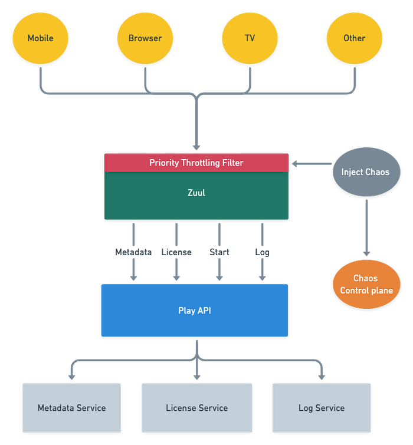
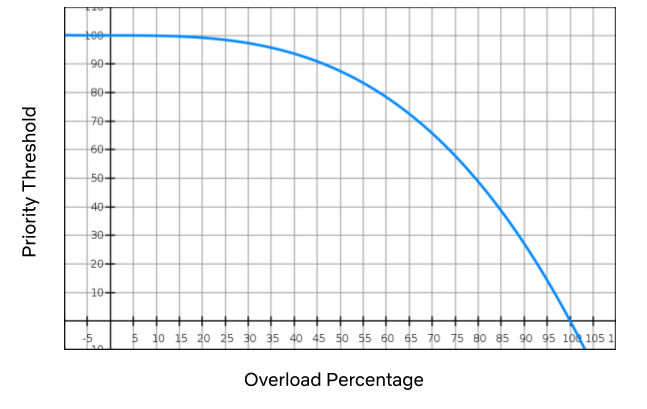
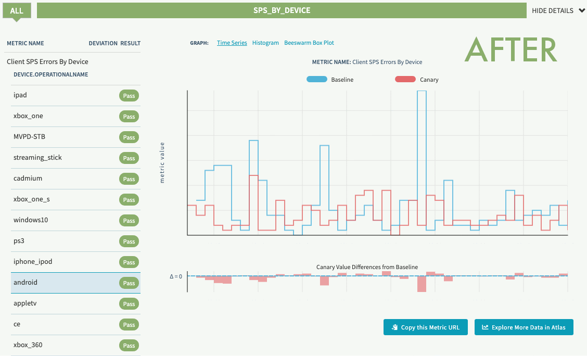
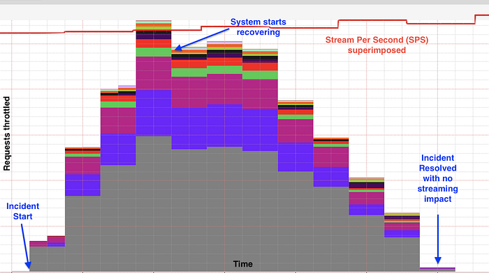

# Keeping Netflix Reliable Using Prioritized Load Shedding

> How viewers are able to watch their favorite show on Netflix while the infrastructure self-recovers from a system failure

By [Manuel Correa](https://twitter.com/mcorreadev), [Arthur Gonigberg](https://twitter.com/agonigberg), and [Daniel West](https://www.linkedin.com/in/danieljwest/)

Getting stuck in traffic is one of the most frustrating experiences for drivers around the world. Everyone slows to a **crawl**, sometimes for a minor issue or sometimes for no reason at all. As engineers at Netflix, we are constantly reevaluating how to redesign traffic management. What if we knew the urgency of each traveler and could selectively route cars through, rather than making everyone wait?

In Netflix engineering, we’re driven by ensuring Netflix is there when you need it to be. Yet, as recent as last year, our systems were susceptible to metaphorical traffic jams; we had on/off [circuit breakers](https://netflixtechblog.com/introducing-hystrix-for-resilience-engineering-13531c1ab362), but no progressive way to shed load. Motivated by improving the lives of our members, we’ve introduced priority-based progressive load shedding.

**The animation below shows the behavior of the Netflix viewer experience when the backend is throttling traffic based on priority. While the lower priority requests are throttled, the playback experience remains uninterrupted and the viewer is able to enjoy their title. Let’s dig into how we accomplished this.**

Failure can occur due to a myriad of reasons: misbehaving clients that trigger a retry storm, an under-scaled service in the backend, a bad deployment, a network blip, or issues with the cloud provider. All such failures can put a system under unexpected load, and at some point in the past, every single one of these examples has prevented our members’ ability to play. With these incidents in mind, we set out to make Netflix more resilient with these goals:

1. Consistently prioritize requests across device types (Mobile, Browser, and TV)
2. Progressively throttle requests based on priority
3. Validate assumptions by using [Chaos Testing](https://netflixtechblog.com/chap-chaos-automation-platform-53e6d528371f) (deliberate fault injection) for requests of specific priorities

The resulting architecture that we envisioned with priority throttling and chaos testing included is captured below.

*High level playback architecture with priority throttling and chaos testing*

## Building a request taxonomy

We decided to focus on three dimensions in order to categorize request traffic: throughput, functionality, and criticality. Based on these characteristics, traffic was classified into the following:

- **NON_CRITICAL**: This traffic does not affect playback or members’ experience. Logs and background requests are examples of this type of traffic. These requests are usually high throughput which contributes to a large percentage of load in the system.
- **DEGRADED_EXPERIENCE**: This traffic affects members’ experience, but not the ability to play. The traffic in this bucket is used for features like: stop and pause markers, language selection in the player, viewing history, and others.
- **CRITICAL**: This traffic affects the ability to play. Members will see an error message when they hit play if the request fails.

Using attributes of the request, the API gateway service ([Zuul](https://github.com/Netflix/zuul)) categorizes the requests into NON_CRITICAL, DEGRADED_EXPERIENCE and CRITICAL buckets, and computes a priority score between 1 to 100 for each request given its individual characteristics. The computation is done as a first step so that it is available for the rest of the request lifecycle.

Most of the time, the request workflow proceeds normally without taking the request priority into account. However, as with any service, sometimes we reach a point when either one of our backends is in trouble or Zuul itself is in trouble. When that happens requests with higher priority get preferential treatment. The higher priority requests will get served, while the lower priority ones will not. The implementation is analogous to a priority queue with a dynamic priority threshold. This allows Zuul to drop requests with a priority lower than the current threshold.

## Finding the best place to throttle traffic

Zuul can apply load shedding in two moments during the request lifecycle: when it routes requests to a specific back-end service (service throttling) or at the time of initial request processing, which affects all back-end services (global throttling).

### Service throttling

Zuul can sense when a back-end service is in trouble by monitoring the error rates and concurrent requests to that service. Those two metrics are approximate indicators of failures and latency. When the threshold percentage for one of these two metrics is crossed, we reduce load on the service by throttling traffic.

### Global throttling

Another case is when Zuul itself is in trouble. As opposed to the scenario above, global throttling will affect _all_ back-end services behind Zuul, rather than a _single_ back-end service. The impact of this global throttling can cause much bigger problems for members. The key metrics used to trigger global throttling are CPU utilization, concurrent requests, and connection count. When any of the thresholds for those metrics are crossed, Zuul will aggressively throttle traffic to keep itself up and healthy while the system recovers. This functionality is critical: if Zuul goes down, no traffic can get through to our backend services, resulting in a total outage.

## Introducing priority-based progressive load shedding

Once we had the prioritization piece in place, we were able to combine it with our load shedding mechanism to dramatically improve streaming reliability. When we’re in a bad situation (i.e. any of the thresholds above are exceeded), we progressively drop traffic, starting with the lowest priority. A cubic function is used to manage the level of throttling. If things get really, really bad the level will hit the sharp side of the curve, throttling everything.

The graph above is an example of how the cubic function is applied. As the overload percentage increases (i.e. the range between the throttling threshold and the max capacity), the priority threshold trails it very slowly: at 35%, it’s still in the mid-90s. If the system continues to degrade, we hit priority 50 at 80% exceeded and then eventually 10 at 95%, and so on.

**Given that a relatively small amount of requests impact streaming availability, throttling low priority traffic may affect certain product features but will not prevent members pressing “play” and watching their favorite show. By adding progressive priority-based load shedding, Zuul can shed ****_enough_**** traffic to stabilize services without members noticing.**

### Handling retry storms

When Zuul decides to drop traffic, it sends a signal to devices to let them know that we need them to back off. It does this by indicating how many retries they can perform and what kind of time window they can perform them in. For example:

**{ “maxRetries” : <max-retries>, “retryAfterSeconds”: <seconds> }**

Using this backpressure mechanism, we can stop retry storms much faster than we could in the past. We automatically adjust these two dials based on the priority of the request. Requests with higher priority will retry more aggressively than lower ones, also increasing streaming availability.

## Validating which requests are right for the job

To validate our request taxonomy assumptions on whether a specific request fell into the NON_CRITICAL, DEGRADED, or CRITICAL bucket, we needed a way to test the user’s experience when that request was shed. To accomplish this, we leveraged our internal failure injection tool ([FIT](https://netflixtechblog.com/fit-failure-injection-testing-35d8e2a9bb2)) and created a failure injection point in Zuul that allowed us to shed any request based on a supplied priority. This enabled us to manually simulate a load shedded experience by blocking ranges of priorities for a specific device or member, giving us an idea of which requests could be safely shed without impacting the user.

## Continually ensuring those requests are still right for the job

One of the goals here is to reduce members’ pain by shedding requests that are not expected to affect the user’s streaming experience. However, Netflix changes quickly and requests that were thought to be noncritical can unexpectedly become critical. In addition, Netflix has a wide variety of client devices, client versions, and ways to interact with the system. To make sure we weren’t causing members pain when throttling NON_CRITICAL requests in any of these scenarios, we leveraged our infrastructure experimentation platform [ChAP](https://netflixtechblog.com/chap-chaos-automation-platform-53e6d528371f).

This platform allows us to stage an A/B experiment that will allocate a small number of production users to either a control or treatment group for 45 minutes while throttling a range of priorities for the treatment group. This lets us capture a variety of live use cases and measure the impact to their playback experience. ChAP analyzes the members’ KPIs per device to determine if there is a deviation between the control and the treatment groups.

In our first experiment, we detected a race condition in both Android and iOS devices for a low priority request that caused sporadic playback errors. Since we practice continuous experimentation, once the initial experiments were run and the bugs were fixed, we scheduled them to run on a periodic basis. This allows us to detect regressions early and keep users streaming.

*Experiment regression detection before and after fix (SPS indicates streaming availability)*

## Reaping the benefits

In 2019, before progressive load shedding was in place, the Netflix streaming services experienced an outage that resulted in a sizable percentage of members who were not able to play for a period of time. In 2020, days after the implementation was deployed, the team started seeing the benefit of the solution. Netflix experienced a similar issue with the same potential impact as the outage seen in 2019. Unlike then, Zuul’s progressive load shedding kicked in and started shedding traffic until the service was in a healthy state without impacting members’ ability to play at all.

The graph below shows a stable streaming availability metric [stream per second (SPS)](https://netflixtechblog.com/sps-the-pulse-of-netflix-streaming-ae4db0e05f8a) while Zuul is performing progressive load shedding based on request priority during the incident. The different colors in the graph represent requests with different priority being throttled.

Members were happily watching their favorite show on Netflix while the infrastructure was self-recovering from a system failure.

## We are not done yet

For future work, the team is looking into expanding the use of request priority for other use cases like better retry policies between devices and back-ends, dynamically changing load shedding thresholds, tuning the request priorities using Chaos Testing as a guiding principle, and other areas that will make Netflix even more resilient.

If you’re interested in helping Netflix stay up in the face of shifting systems and unexpected failures, reach out to us. [We’re hiring](https://jobs.netflix.com/)!

---
**Tags:** Load Shedding · Netflix · Reliability · Resilience · Chaos Engineering
