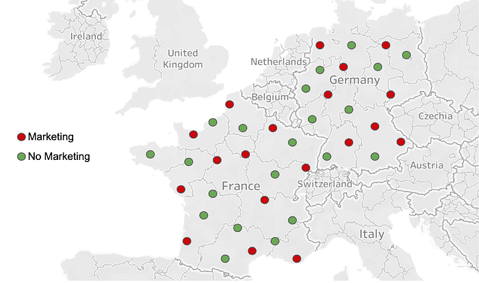

# Key Challenges with Quasi Experiments at Netflix

[_Kamer Toker-Yildiz_](https://www.linkedin.com/in/kamertokeryildiz/)_, _[_Colin McFarland_](https://www.linkedin.com/in/mcfrl/)_, _[_Julia Glick_](https://www.linkedin.com/in/julia-glick-3279903b/)

At Netflix, when we can’t run A/B experiments we run [quasi experiments](https://medium.com/@NetflixTechBlog/quasi-experimentation-at-netflix-566b57d2e362)! We run quasi experiments with various objectives such as non-member experiments focusing on acquisition, member experiments focusing on member engagement, or video streaming experiments focusing on content delivery. Consolidating on one methodology could be a challenge, as we may face different design or data constraints or optimization goals. **We discuss some key challenges and approaches Netflix has been using to handle small sample size and limited pre-intervention data in quasi experiments.**

*Within-country quasi design to measure the impact of TV ads in France and Germany. Geographic units are defined based on the lowest level of media buying capability.*

## Design and Randomization

We face various business problems where we cannot run individual level A/B tests but can benefit from quasi experiments. For instance, consider the case where we want to measure the impact of TV or billboard advertising on member engagement. It is impossible for us to have identical treatment and control groups at the member level as we cannot hold back individuals from such forms of advertising. Our solution is to randomize our member base at the smallest possible level. For instance, TV advertising can be bought at TV media market level only in most countries. This usually involves groups of cities in closer geographic proximity.

One of the major problems we face in quasi experiments is having small sample size where asymptotic properties may not practically hold. We typically have a small number of geographic units due to test limitations and also use broader or distant groups of units to minimize geographic spillovers. **We are also more likely to face high variation and uneven distributions in treatment and control groups due to heterogeneity across units.** For example, let’s say we are interested in measuring the impact of marketing _Lost in Space _series on sci-fi viewing in the UK. London with its high population is randomly assigned to the treatment cell, and people in London love sci-fi much more than other cities. If we ignore the latter fact, we will overestimate the true impact of marketing — which is now _confounded_. In summary, simple randomization and mean comparison we typically utilize in A/B testing with millions of members may not work well for quasi experiments.

Completely tackling these problems during the design phase may not be possible. We use some statistical approaches during design and analysis to minimize bias and maximize precision of our estimates. During design, one approach we utilize is running repeated randomizations, i.e. ‘_re-randomization’_. In particular, we keep randomizing until we find a randomization that gives us the maximum desired level of balance on key variables across test cells. This approach generally enables us to define more similar test groups (i.e. getting closer to apples to apples comparison). However, we may still face two issues: 1) we can only simultaneously balance on a limited number of observed variables, and it is very difficult to find identical geographic units on all dimensions, and 2) we can still face noisy results with large confidence intervals due to small sample size. We next discuss some of our analysis approaches to further tackle these problems.

## Analysis

### Going Beyond Simple Comparisons

Difference in differences (diff-in-diff or DID) comparison is a very common approach used in quasi experiments. In diff-in-diff, we usually consider two time periods; pre and post intervention. We utilize the pre-intervention period to generate baselines for our metrics, and normalize post intervention values by the baseline. This normalization is a simple but very powerful way of controlling for inherent differences between treatment and control groups. For example, let’s say our success metric is signups and we are running a quasi experiment in France. We have Paris and Lyon in two test cells. We cannot directly compare signups in two cities as populations are very different. Normalizing with respect to pre-intervention signups would reduce variation and help us make comparisons at the same scale. Although the diff-in-diff approach generally works reasonably well, we have observed some cases where it may not be as applicable as we discuss next.

### Success Metrics With Historical Observations But Small Sample Size

In our non-member focused tests, we can observe historical acquisition metrics, e.g. signup counts, however, we don’t typically observe any other information about non-members. High variation in outcome metrics combined with small sample size can be a problem to design a well powered experiment using traditional diff-in-diff like approaches. To tackle this problem, we try to implement designs involving _multiple interventions_ in each unit over an extended period of time whenever possible (i.e. instead of a typical experiment with single intervention period). This can help us gather enough evidence to run a well-powered experiment even with a very small sample size (i.e. few geographic units).

**In particular, we turn the intervention (e.g. advertising) “on” and “off” repeatedly over time in different patterns and geographic units to capture short term effects.** Every time we “toggle” the intervention, it gives us another chance to read the effect of the test. So even if we only have few geographic units, we can eventually read a reasonably precise estimate of the effect size (although, of course, results may not be generalizable to others if we have very few units). As our analysis approach, we can use observations from steady-state units to estimate what would otherwise have happened in units that are changing. To estimate the treatment effect, we fit a dynamic linear model (aka DLM), a type of state space model where the observations are conditionally Gaussian. DLMs are a very flexible category of models, but we only use a narrow subset of possible DLM structures to keep things simple. We currently have a robust internal package embedded in our internal tool, Quasimodo, to cover experiments that have similar structure. Our model is comparable to Google’s CausalImpact package, but uses a multivariate structure to let us analyze more than a single point-in-time intervention in a single region.

### Success Metrics Without Historical Observations

In our member focused tests, we sometimes face cases where we don’t have success metrics with historical observations. **For example, Netflix promotes its new shows that are yet to be launched on service to increase member engagement once the show is available**. For a new show, we start observing metrics only when the show launches. As a result, our success metrics inherently don’t have any historical observations making it impossible to utilize the benefits of similar time series based approaches.

In these cases, we utilize the benefits of richer member data to measure and control for members’ inherent engagement or interest with the show. We do this by using relevant pre-treatment proxies, e.g. viewing of similar shows, interest in Netflix originals or similar genres. We have observed that controlling for geographic as well as individual level differences work best in minimizing confounding effects and improving precision. For example, if members in Toronto watch more Netflix originals than members in other cities in Canada, we should then control for pre-treatment Netflix originals viewing at both individual and city level to capture within and between unit variation separately.

This is in nature very similar to covariate adjustment. However, we do more than just running a simple regression with a large set of control variables. **At Netflix, we have worked on developing approaches at the intersection of regression covariate adjustment and machine learning based propensity score matching by using a wide set of relevant member features.** Such combined approaches help us explicitly control for members’ inherent interest in the new show using hundreds of features while minimizing linearity assumptions and degrees of freedom challenges we may face. We thus gain significant wins in both reducing potential confounding effects as well as maximizing precision to more accurately capture the treatment effect we are interested in.

## Next Steps

We have excelled in the quasi experimentation space with many measurement strategies now in play across Netflix for various use cases. However we are not done yet! We can expand methodologies to more use cases and continue to improve the measurement. As an example, another exciting area we have yet to explore is combining these approaches for those metrics where we can use both time series approaches and a rich set of internal features (e.g. general member engagement metrics). If you’re interested in working on these and other causal inference problems, [join our dream team](https://research.netflix.com/research-area/experimentation-and-causal-inference)!

---
**Tags:** Experimentation · Data Science · Ab Testing
