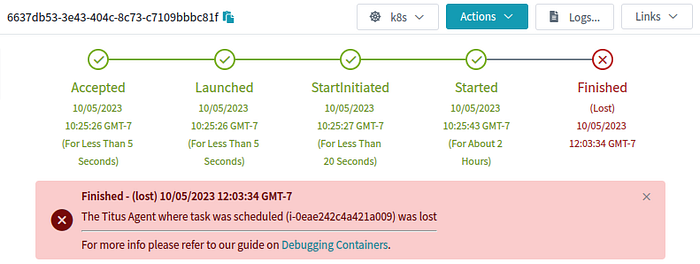
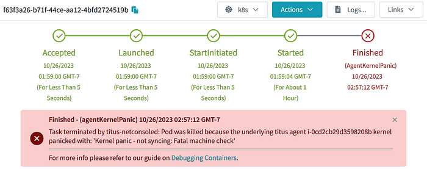

# Kubernetes And Kernel Panics

How Netflix’s Container Platform Connects Linux Kernel Panics to Kubernetes Pods

_By Kyle Anderson_

With a recent effort to reduce customer (engineers, not end users) pain on our container platform [Titus](https://netflixtechblog.com/tagged/titus), I started investigating “orphaned” pods. There are pods that never got to finish and had to be garbage collected with no real satisfactory final status. Our Service job (think [ReplicatSet](https://kubernetes.io/docs/concepts/workloads/controllers/replicaset/)) owners don’t care too much, but our Batch users care a lot. Without a real return code, how can they know if it is safe to retry or not?

These orphaned pods represent real pain for our users, even if they are a small percentage of the total pods in the system. Where are they going, exactly? Why did they go away?

This blog post shows how to connect the dots from the worst case scenario (a kernel panic) through to Kubernetes (k8s) and eventually up to us operators so that we can track how and why our k8s nodes are going away.

## Where Do Orphaned Pods Come From?

Orphaned pods get lost because the underlying k8s node object goes away. Once that happens a [GC](https://kubernetes.io/docs/concepts/workloads/pods/pod-lifecycle/#pod-garbage-collection) process deletes the pod. On Titus we run a custom controller to store the history of Pod and Node objects, so that we can save some explanation and show it to our users. This failure mode looks like this in our UI:


*What it looks like to our users when a k8s node and its pods disappear*

This is _an _explanation, but it wasn’t very satisfying to me or to our users. _Why_ was the agent lost?

## Where Do Lost Nodes Come From?

Nodes can go away for any reason, especially in “the cloud”. When this happens, usually a k8s cloud-controller provided by the cloud vendor will detect that the actual server, in our case an EC2 Instance, has actually gone away, and will in turn delete the k8s node object. That still doesn’t really answer the question of _why_.

How can we make sure that every instance that goes away has a reason, account for that reason, and bubble it up all the way to the pod? It all starts with an annotation:

```
{
     "apiVersion": "v1",
     "kind": "Pod",
     "metadata": {
          "annotations": {
               "pod.titus.netflix.com/pod-termination-reason": "Something really bad happened!",
...
```

Just making a place to put this data is a great start. Now all we have to do is make our GC controllers aware of this annotation, and then sprinkle it into any process that could potentially make a pod or node go away unexpectedly. Adding an annotation (as opposed to patching the status) preserves the rest of the pod as-is for historical purposes. (We also add annotations for what did the terminating, and a short `reason-code` for tagging)

The `pod-termination-reason` annotation is useful to populate human readable messages like:

- “This pod was preempted by a higher priority job ($id)”
- “This pod had to be terminated because the underlying hardware failed ($failuretype)”
- “This pod had to be terminated because $user ran sudo halt on the node”
- **“This pod died unexpectedly because the underlying node kernel panicked!”**

But wait, how are we going to annotate a pod for a node that kernel panicked?

## Capturing Kernel Panics

When the Linux kernel panics, there is just not much you can do. But what if you could send out some sort of “with my final breath, I curse Kubernetes!” UDP packet?

Inspired by this [Google Spanner paper](https://research.google/pubs/pub45855/), where Spanner nodes send out a “last gasp” UDP packet to release leases & locks, you too can configure your servers to do the same upon kernel panic using a stock Linux module: `[netconsole](https://www.kernel.org/doc/Documentation/networking/netconsole.txt)`.

## Configuring Netconsole

**The fact that the Linux kernel can even send out UDP packets with the string ‘kernel panic’, ****_while it is panicking_****, is kind of amazing.** This works because netconsole needs to be configured with almost the entire IP header filled out already beforehand. That is right, you have to tell Linux exactly what your source MAC, IP, and UDP Port are, as well as the destination MAC, IP, and UDP ports. You are practically constructing the UDP packet for the kernel. But, with that prework, when the time comes, the kernel can easily [construct](https://github.com/torvalds/linux/blob/94f6f0550c625fab1f373bb86a6669b45e9748b3/drivers/net/netconsole.c#L932) the packet and get it out the (preconfigured) network interface as things come crashing down. Luckily the `[netconsole-setup](https://manpages.ubuntu.com/manpages/jammy/en/man8/netconsole-setup.8.html)` command makes the setup pretty easy. All the configuration options can be set [dynamically](https://wiki.ubuntu.com/Kernel/Netconsole#Step_3:_Initialize_netconsole_at_boot_time) as well, so that when the endpoint changes one can point to the new IP.

Once this is setup, kernel messages will start flowing right after `modprobe`. Imagine the whole thing operating like a `dmesg | netcat -u $destination 6666`, but in kernel space.

## Netconsole “Last Gasp” Packets

With `netconsole` setup, the last gasp from a crashing kernel looks like a set of UDP packets exactly like one might expect, where the data of the UDP packet is simply the text of the kernel message. In the case of a kernel panic, it will look something like this (one UDP packet per line):

```
Kernel panic - not syncing: buffer overrun at 0x4ba4c73e73acce54
[ 8374.456345] CPU: 1 PID: 139616 Comm: insmod Kdump: loaded Tainted: G OE
[ 8374.458506] Hardware name: Amazon EC2 r5.2xlarge/, BIOS 1.0 10/16/2017
[ 8374.555629] Call Trace:
[ 8374.556147] <TASK>
[ 8374.556601] dump_stack_lvl+0x45/0x5b
[ 8374.557361] panic+0x103/0x2db
[ 8374.558166] ? __cond_resched+0x15/0x20
[ 8374.559019] ? do_init_module+0x22/0x20a
[ 8374.655123] ? 0xffffffffc0f56000
[ 8374.655810] init_module+0x11/0x1000 [kpanic]
[ 8374.656939] do_one_initcall+0x41/0x1e0
[ 8374.657724] ? __cond_resched+0x15/0x20
[ 8374.658505] ? kmem_cache_alloc_trace+0x3d/0x3c0
[ 8374.754906] do_init_module+0x4b/0x20a
[ 8374.755703] load_module+0x2a7a/0x3030
[ 8374.756557] ? __do_sys_finit_module+0xaa/0x110
[ 8374.757480] __do_sys_finit_module+0xaa/0x110
[ 8374.758537] do_syscall_64+0x3a/0xc0
[ 8374.759331] entry_SYSCALL_64_after_hwframe+0x62/0xcc
[ 8374.855671] RIP: 0033:0x7f2869e8ee69
...
```

## Connecting to Kubernetes

The last piece is to connect is Kubernetes (k8s). We need a k8s controller to do the following:

1. Listen for netconsole UDP packets on port 6666, watching for things that look like kernel panics from nodes.
2. Upon kernel panic, lookup the k8s node object associated with the IP address of the incoming netconsole packet.
3. For that k8s node, find all the pods bound to it, annotate, then delete those pods (they are toast!).
4. For that k8s node, annotate the node and then delete it too (it is also toast!).

Parts 1&2 might look like this:

```
for {
    n, addr, err := serverConn.ReadFromUDP(buf)
    if err != nil {
        klog.Errorf("Error ReadFromUDP: %s", err)
    } else {
        line := santizeNetConsoleBuffer(buf[0:n])
        if isKernelPanic(line) {
            panicCounter = 20
            go handleKernelPanicOnNode(ctx, addr, nodeInformer, podInformer, kubeClient, line)
        }
    }
    if panicCounter > 0 {
        klog.Infof("KernelPanic context from %s: %s", addr.IP, line)
        panicCounter++
    }
}
```

And then parts 3&4 might look like this:

```
func handleKernelPanicOnNode(ctx context.Context, addr *net.UDPAddr, nodeInformer cache.SharedIndexInformer, podInformer cache.SharedIndexInformer, kubeClient kubernetes.Interface, line string) {
    node := getNodeFromAddr(addr.IP.String(), nodeInformer)
    if node == nil {
        klog.Errorf("Got a kernel panic from %s, but couldn't find a k8s node object for it?", addr.IP.String())
    } else {
        pods := getPodsFromNode(node, podInformer)
        klog.Infof("Got a kernel panic from node %s, annotating and deleting all %d pods and that node.", node.Name, len(pods))
        annotateAndDeletePodsWithReason(ctx, kubeClient, pods, line)
        err := deleteNode(ctx, kubeClient, node.Name)
        if err != nil {
            klog.Errorf("Error deleting node %s: %s", node.Name, err)
        } else {
            klog.Infof("Deleted panicked node %s", node.Name)
        }
    }
}
```

With that code in place, as soon as a kernel panic is detected, the pods and nodes immediately go away. No need to wait for any GC process. The annotations help document what happened to the node & pod:


*A real pod lost on a real k8s node that had a real kernel panic!*

## Conclusion

Marking that a job failed because of a kernel panic may not be _that_ satisfactory to our customers. But they can take satisfaction in knowing that we now have the required observability tools to start fixing those kernel panics!

Do you also enjoy really getting to the bottom of why things fail in your systems or think kernel panics are cool? Join us on the [Compute Team](https://jobs.netflix.com/jobs/198642264) where we are building a world-class container platform for our engineers.

---
**Tags:** Kubernetes · Linux · Kernel Panic
