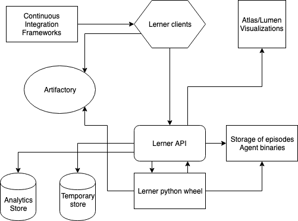
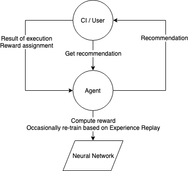
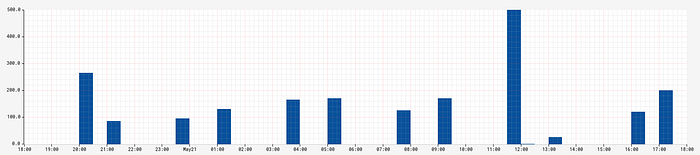
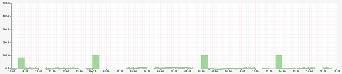

# Lerner — using RL agents for test case scheduling

By: [Stanislav Kirdey](https://www.linkedin.com/in/skirdey/), [Kevin Cureton](https://www.linkedin.com/in/kevincureton/), [Scott Rick](https://www.linkedin.com/in/scottsrick/), [Sankar Ramanathan](https://www.linkedin.com/in/rsankar/), [Mrinal Shukla](https://www.linkedin.com/in/mrinalshukla/)

## Introduction

Netflix brings delightful customer experiences to homes on a [variety of devices](https://www.linkedin.com/pulse/team-behind-netflix-onanydevice-christophe-jouin/) that continues to grow each day.

Partners across the globe leverage Netflix device certification process on a continual basis to ensure that quality products and experiences are delivered to their customers. The certification process involves the verification of partner’s implementation of features provided by the Netflix SDK.

The Partner Device Ecosystem organization in Netflix is responsible for ensuring successful integration and testing of the Netflix application on all partner devices. Netflix engineers run a series of tests and benchmarks to validate the device across multiple dimensions including compatibility of the device with the Netflix SDK, device performance, audio-video playback quality, license handling, encryption and security. All this leads to a plethora of test cases, most of them automated, that need to be executed to validate the functionality of a device running Netflix.

## Problem

With a collection of tests that, by nature, are time consuming to run and sometimes require manual intervention, we need to prioritize and schedule test executions in a way that will expedite detection of test failures. There are several problems efficient test scheduling could help us solve:

1. Quickly detect a regression in the integration of the Netflix SDK on a consumer electronic or MVPD (multichannel video programming distributor) device.
2. Detect a regression in a test case. Using the Netflix Reference Application and known good devices, ensure the test case continues to function and tests what is expected.
3. When code many test cases are dependent on has changed, choose the right test cases among thousands of affected tests to quickly validate the change before committing it and running extensive, and expensive, tests.
4. Choose the most promising subset of tests out of thousands of test cases available when running continuous integration against a device.
5. Recommend a set of test cases to execute against the device that would increase the probability of failing the device in real-time.

Solving the above problems could help Netflix and our Partners save time and money during the entire lifecycle of device design, build, test, and certification.

These problems could be solved in several different ways. In our quest to be objective, scientific, and inline with the Netflix philosophy of using data to drive solutions for intriguing problems, we proceeded by leveraging machine learning.

Our inspiration was the findings in a research paper “[Reinforcement Learning for Automatic Test Case Prioritization and Selection in Continuous Integration](https://arxiv.org/abs/1811.04122)” by Helge Spieker, et. al. We thought that reinforcement learning would be a promising approach that could provide great flexibility in the training process. Likewise it has very low requirements on the initial amount of training data.

In the case of continuously testing a Netflix SDK integration on a new device, we usually lack relevant data for model training in the early phases of integration. In this situation training an agent is a great fit as it allows us to start with very little input data and let the agent explore and exploit the patterns it learns in the process of SDK integration and regression testing. The agent in reinforcement learning is an entity that performs a decision on what action to take considering the current state of the environment, and gets a reward based on the quality of the action.

## Solution

We built a system called Lerner that consists of a set of microservices and a python library that allows scalable agent training and inference for test case scheduling. We also provide an API client in Python.

Lerner works in tandem with our continuous integration framework that executes on-device tests using the [Netflix Test Studio](https://medium.com/netflix-techblog/nts-real-time-streaming-for-test-automation-7cb000e933a1) platform. Tests are run on Netflix Reference Applications (running as containers on [Titus](https://netflix.github.io/titus/)), as well as on physical devices.

There were several motivations that led to building a custom solution:

1. We wanted to keep the APIs and integrations as simple as possible.
2. We needed a way to run agents and tie the runs to the internal infrastructure for analytics, reporting, and visualizations.
3. We wanted the to tool be available as a standalone library as well as scalable API service.

Lerner provides ability to setup any number of agents making it the first component in our re-usable reinforcement learning framework for device certification.

Lerner, as a web-service, relies on Amazon Web Services (AWS) and Netflix’s Open Source Software (OSS) tools. We use [Spinnaker](https://medium.com/netflix-techblog/spinnaker-sets-sail-to-the-continuous-delivery-foundation-e81cd2cbbfeb) to deploy instances and host the API containers on [Titus](https://netflix.github.io/titus/) — which allows fast deployment times and rapid scalability. Lerner uses AWS services to store binary versions of the agents, agent configurations, and training data. To maintain the quality of Lerner APIs, we are using the [server-less paradigm](https://en.m.wikipedia.org/wiki/Serverless_computing) for Lerner’s own integration testing by utilizing [AWS Lambda](https://aws.amazon.com/lambda/).

The agent training library is written in Python and supports versions 2.7, 3.5, 3.6, and 3.7. The library is available in the artifactory repository for easy installation. It can be used in [Python notebooks](https://medium.com/netflix-techblog/notebook-innovation-591ee3221233) — allowing for rapid experimentation in isolated environments without a need to perform API calls. The agent training library exposes different types of learning agents that utilize neural networks to approximate action.

The neural network (NN)-based agent uses a deep net with fully connected layers. The NN gets the state of a particular test case (the input) and outputs a continuous value, where a higher number means an earlier position in a test execution schedule. The inputs to the neural network include: general historical features such as the** last N executions and several domain specific features that provide meta-information about a test case.**

The Lerner APIs are split into three areas:

1. Storing execution results.
2. Getting recommendations based on the current state of the environment.
3. Assign reward to the agent based on the execution result and predicted recommendations.

A process of getting recommendations and rewarding the agent using APIs consists of 4 steps:

1. Out of all available test cases for a particular job — form a request that can be interpreted by Lerner. This involves aggregation of historical results and additional features.
2. Lerner returns a recommendation identified with a unique episode id.
3. A CI system can execute the recommendation and submit the execution results to Lerner based on the episode id.
4. Call an API to assign a reward based on the agent id and episode id.

Below is a diagram of the services and persistence layers that support the functionality of the Lerner API.

The self-service nature of the tool makes it easy for service owners to integrate with Lerner, create agents, ask agents for recommendations and reward them after execution results are available.

The metrics relevant to the training and recommendation process are reported to [Atlas](https://github.com/Netflix/atlas/wiki) and visualized using Netflix’s [Lumen](https://medium.com/netflix-techblog/lumen-custom-self-service-dashboarding-for-netflix-8c56b541548c). Users of the service can track the statistics specific to the agents they setup and deploy, which allows them to build their own dashboards.

We have identified some interesting patterns while doing online reinforcement learning.

- The recommendation/execution reward cycle can happen without any prior training data.
- We can bootstrap several CI jobs that would use agents with different reward functions, and gain additional insight based on agents performance. It could help us design and implement more targeted reward functions.
- We can keep a small amount of historical data to train agents. The data can be truncated after each execution and offloaded to a long-term storage for further analysis.

Some of the downsides:

- It might take time for an agent to stop exploring and start exploiting the accumulated experience.
- As agents stored in a binary format in the database, an update of an agent from multiple jobs could cause a race condition in its state. Handling concurrency in the training process is cumbersome and requires trade offs. We achieved the desired state by relying on the locking mechanisms of the underlying persistence layer that stores and serves agent binaries.

Thus, we have the luxury of training as many agents as we want that could prioritize and recommend test cases based on their unique learning experiences.

## Outcome

We are currently piloting the system and have live agents serving predictions for various CI runs. At the moment we run Lerner-based CIs in parallel with CIs that either execute test cases in random order or use simple heuristics as sorting test cases by time and execute everything that previously failed.

The system was built with simplicity and performance in mind, so the set of APIs are minimal. We developed client libraries that allow seamless, but opinionated, integration with Lerner.

We collect several metrics to evaluate the performance of a recommendation, with main metrics being time taken to first failure and time taken to complete a whole scheduled run.

Lerner-based recommendations are proving to be different and more insightful than random runs, as they allow us to fit a particular time budget and detect patterns such as cases that tend to fail together in a cluster, cases that haven’t been run in a long time, and so on.

The below graphs shows more or less an artificial case when a schedule of 100+ test cases would contain several flaky tests. The Y-axis represents how many minutes it took to complete the schedule or reach a first failed test case. In blue, we have random recommendations with no time budget constraints. In green you can see executions based on Lerner recommendations under a time constraint of 60 minutes. The green spikes represent Lerner exploring the environment, where the wiggly lines around 0 are the executions that failed quickly as Lerner was exploiting its policy.

*Execution of schedules that were randomly generated. Y-axis represents time to finish execution or reach first failure.*

*Execution of Lerner based schedules. You can see moments when Lerner was exploring the environment, and the wiggly lines represent when the schedule was generated based on exploiting existing knowledge.*

## Next Steps

The next phases of the project will focus on:

- Reward functions that are aware of a comprehensive domain context, such as assigning appropriate rewards to states where infrastructure is fragile and test case could not be run appropriately.
- Administrative user-interface to manage agents.
- More generic, simple, and user-friendly framework for reinforcement learning and agent deployment.
- Using Lerner on all available CIs jobs against all SDK versions.
- Experiment with different neural network architectures.

**If you would like to be a part of our team, come **[**join us.**](https://jobs.netflix.com/jobs/f412a426-3907-44b6-9f1e-0b802b235ae8)

---
**Tags:** Machine Learning · Reinforcement Learning · Python · Data Science · Deep Learning
