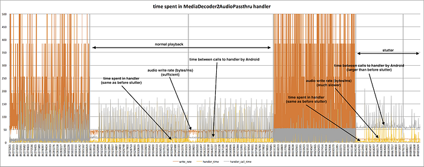

# Life of a Netflix Partner Engineer — The case of the extra 40 ms

By: [John Blair](https://www.linkedin.com/in/x1jdb/), Netflix Partner Engineering

The Netflix application runs on hundreds of smart TVs, streaming sticks and pay TV set top boxes. The role of a Partner Engineer at Netflix is to help device manufacturers launch the Netflix application on their devices. In this article we talk about one particularly difficult issue that blocked the launch of a device in Europe.

## The mystery begins

Towards the end of 2017, I was on a conference call to discuss an issue with the Netflix application on a new set top box. The box was a new Android TV device with 4k playback, based on Android Open Source Project (AOSP) version 5.0, aka “Lollipop”. I had been at Netflix for a few years, and had shipped multiple devices, but this was my first Android TV device.

All four players involved in the device were on the call: there was the large European pay TV company (the operator) launching the device, the contractor integrating the set-top-box firmware (the integrator), the system-on-a-chip provider (the chip vendor), and myself (Netflix).

The integrator and Netflix had already completed the rigorous Netflix certification process, but** during the TV operator’s internal trial an executive at the company reported a serious issue: Netflix playback on his device was “stuttering.”, i.e. video would play for a very short time, then pause, then start again, then pause.** It didn’t happen all the time, but would reliably start to happen within a few days of powering on the box. They supplied a video and it looked terrible.

The device integrator had found a way to reproduce the problem: repeatedly start Netflix, start playback, then return to the device UI. They supplied a script to automate the process. Sometimes it took as long as five minutes, but the script would always reliably reproduce the bug.

Meanwhile, a field engineer for the chip vendor had diagnosed the root cause: Netflix’s Android TV application, called Ninja, was not delivering audio data quickly enough. The stuttering was caused by buffer starvation in the device audio pipeline. Playback stopped when the decoder waited for Ninja to deliver more of the audio stream, then resumed once more data arrived. The integrator, the chip vendor and the operator all thought the issue was identified and their message to me was clear: Netflix, you have a bug in your application, and you need to fix it. I could hear the stress in the voices from the operator. Their device was late and running over budget and they expected results from me.

## The investigation

I was skeptical. The same Ninja application runs on millions of Android TV devices, including smart TVs and other set top boxes. If there was a bug in Ninja, why is it only happening on this device?

I started by reproducing the issue myself using the script provided by the integrator. I contacted my counterpart at the chip vendor, asked if he’d seen anything like this before (he hadn’t). Next I started reading the Ninja source code. I wanted to find the precise code that delivers the audio data. I recognized a lot, but I started to lose the plot in the playback code and I needed help.

I walked upstairs and found the engineer who wrote the audio and video pipeline in Ninja, and he gave me a guided tour of the code. I spent some quality time with the source code myself to understand its working parts, adding my own logging to confirm my understanding. The Netflix application is complex, but at its simplest it streams data from a Netflix server, buffers several seconds worth of video and audio data on the device, then delivers video and audio frames one-at-a-time to the device’s playback hardware.

*Figure 1: Device Playback Pipeline (simplified)*

Let’s take a moment to talk about the audio/video pipeline in the Netflix application. Everything up until the “decoder buffer” is the same on every set top box and smart TV, but moving the A/V data into the device’s decoder buffer is a device-specific routine running in its own thread. This routine’s job is to keep the decoder buffer full by calling a Netflix provided API which provides the next frame of audio or video data. In Ninja, this job is performed by an Android [Thread](https://developer.android.com/reference/java/lang/Thread). There is a simple state machine and some logic to handle different play states, but under normal playback the thread copies one frame of data into the Android playback API, then tells the thread scheduler to wait 15 ms and invoke the handler again. When you create an Android thread, you can request that the thread be run repeatedly, as if in a loop, but it is the Android Thread scheduler that calls the handler, not your own application.

To play a 60fps video, the highest frame rate available in the Netflix catalog, the device must render a new frame every 16.66 ms, so checking for a new sample every 15ms is just fast enough to stay ahead of any video stream Netflix can provide. Because the integrator had identified the audio stream as the problem, I zeroed in on the specific thread handler that was delivering audio samples to the Android audio service.

I wanted to answer this question: where is the extra time? I assumed some function invoked by the handler would be the culprit, so I sprinkled log messages throughout the handler, assuming the guilty code would be apparent. What was soon apparent was that there was nothing in the handler that was misbehaving, and the handler was running in a few milliseconds even when playback was stuttering.

## Aha, Insight

In the end, I focused on three numbers: the rate of data transfer, the time when the handler was invoked and the time when the handler passed control back to Android. I wrote a script to parse the log output, and made the graph below which gave me the answer.

*Figure 2: Visualizing Audio Throughput and Thread Handler Timing*

The orange line is the rate that data moved from the streaming buffer into the Android audio system, in bytes/millisecond. You can see three distinct behaviors in this chart:

1. The two, tall spiky parts where the data rate reaches 500 bytes/ms. This phase is buffering, before playback starts. The handler is copying data as fast as it can.
2. The region in the middle is normal playback. Audio data is moved at about 45 bytes/ms.
3. The stuttering region is on the right, when audio data is moving at closer to 10 bytes/ms. This is not fast enough to maintain playback.

The unavoidable conclusion: the orange line confirms what the chip vendor’s engineer reported: Ninja is not delivering audio data quickly enough.

To understand why, let’s see what story the yellow and grey lines tell.

The yellow line shows the time spent in the handler routine itself, calculated from timestamps recorded at the top and the bottom of the handler. In both normal and stutter playback regions, the time spent in the handler was the same: about 2 ms. The spikes show instances when the runtime was slower due to time spent on other tasks on the device.

## The real root cause

The grey line, the time between calls invoking the handler, tells a different story. In the normal playback case you can see the handler is invoked about every 15 ms. In the stutter case, on the right, the handler is invoked approximately every 55 ms. There are an extra 40 ms between invocations, and there’s no way that can keep up with playback. But why?

I reported my discovery to the integrator and the chip vendor (look, it’s the Android Thread scheduler!), but they continued to push back on the Netflix behavior. Why don’t you just copy more data each time the handler is called? This was a fair criticism, but changing this behavior involved deeper changes than I was prepared to make, and I continued my search for the root cause. I dove into the Android source code, and learned that Android Threads are a userspace construct, and the thread scheduler uses the epoll() system call for timing. I knew epoll() performance isn’t guaranteed, so I suspected something was affecting epoll() in a systematic way.

At this point I was saved by another engineer at the chip supplier, who discovered [a bug](https://android.googlesource.com/platform/system/core/+/4cdce42%5E%21/#F0) that had already been fixed in the next version of Android, named Marshmallow. The Android thread scheduler changes the behavior of threads depending whether or not an application is running in the foreground or the background. Threads in the background are assigned an extra 40 ms (40000000 ns) of wait time.

A bug deep in the plumbing of Android itself meant this extra timer value was retained when the thread moved to the foreground. Usually the audio handler thread was created while the application was in the foreground, but sometimes the thread was created a little sooner, while Ninja was still in the background. When this happened, playback would stutter.

## Lessons learned

This wasn’t the last bug we fixed on this platform, but it was the hardest to track down. It was outside of the Netflix application, in a part of the system that was outside of the playback pipeline, and all of the initial data pointed to a bug in the Netflix application itself.

This story really exemplifies an aspect of my job I love: I can’t predict all of the issues that our partners will throw at me, and I know that to fix them I have to understand multiple systems, work with great colleagues, and constantly push myself to learn more. What I do has a direct impact on real people and their enjoyment of a great product. I know when people enjoy Netflix in their living room, I’m an essential part of the team that made it happen.

---
**Tags:** Netflix · Debugging · Engineering · Streaming · Set Top Box
