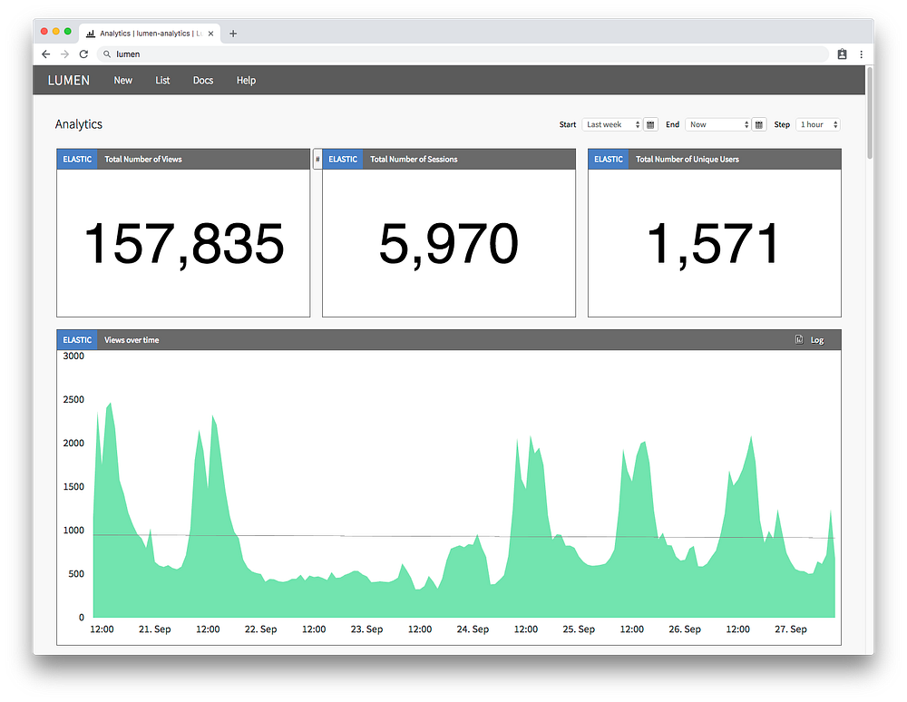
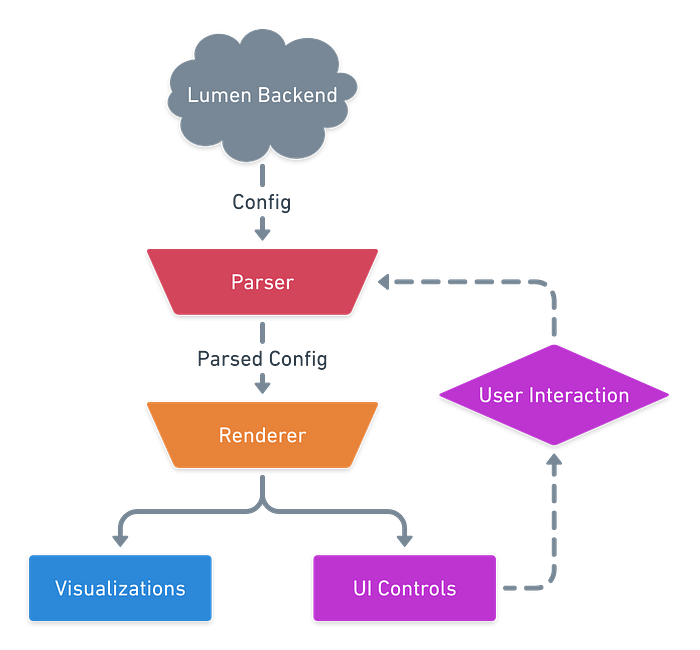
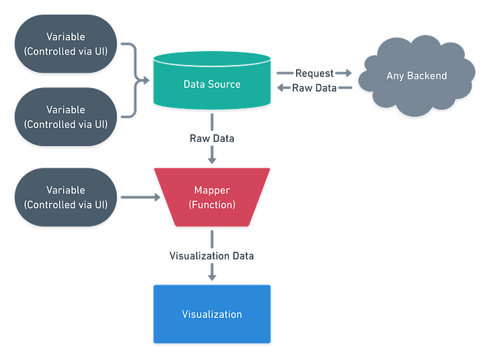
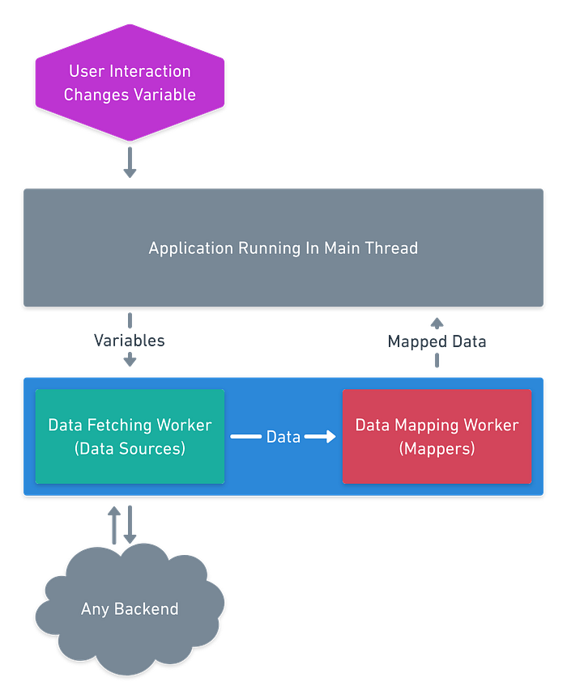
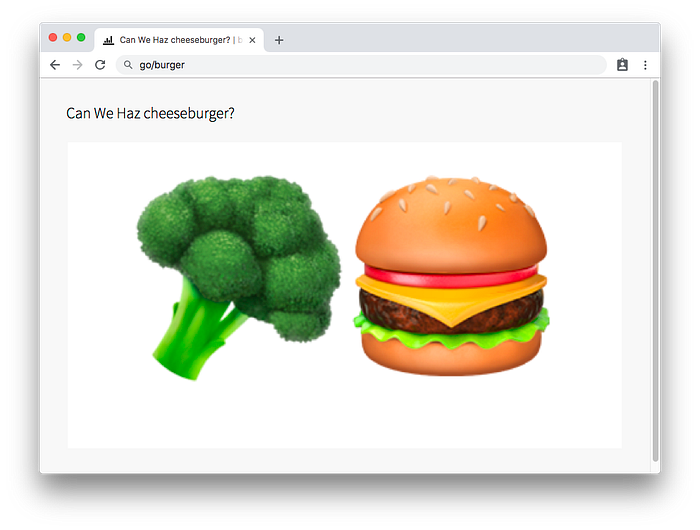

# Lumen: Custom, Self-Service Dashboarding For Netflix

> By Trent Willis

Netflix generates a lot of data. One of the ways that we gain useful insights is by visualizing that data in [dashboards](https://en.wikipedia.org/wiki/Dashboard_(business)) which allow us to comprehend large amounts of information quickly. This is particularly important when operational issues arise as our engineers need to be able to quickly diagnose problem areas and work to correct them.

Operational issues, however, are just one potential use case for dashboards at Netflix. We also use dashboards to track and chart key business metrics, compare the results of experiments, monitor real-time data, and even find out if burgers are on the menu for lunch.

In short, _dashboards are important to Netflix_, but not just any dashboarding platform would work well for us.

In particular, any dashboarding platform for Netflix has the following constraints that must be met:

- Users need to be able to construct dynamic dashboards on their own. Since Netflix engineers are [Full Cycle Developers](https://medium.com/netflix-techblog/full-cycle-developers-at-netflix-a08c31f83249), our platform should be self-service such that a centralized team doesn’t become the bottleneck for addressing the various needs of engineers and the services they own.
- Following from the above, it must support a wide variety of use cases and usage patterns, so the solution needs to be very flexible and allow custom dashboard creation.
- Must support data coming from a myriad of different sources utilizing different transport methods, such as streaming data over WebSockets, long-running queries that redirect to a cache upon completion, and standard RESTful APIs.
- In the event of an operational incident, dashboards need to be fast and responsive so that quick analysis and, potentially, exploration can be done to identify and remediate issues.
- Must provide first-class support for [Atlas](https://github.com/Netflix/atlas) and other Netflix technologies critical to operations.

Our platform needs to be highly flexible, dynamic, and performant while giving users a great amount of control. When we first invested in a dashboarding platform for our operational metrics over eight years ago, there was no reasonable solution that met the constraints above while continuing to be cost-effective for Netflix. So, we built our own. It is called _Lumen_.

*A screenshot of a dashboard in Lumen about Lumen’s usage. So meta.*

## Designing For Flexibility

Lumen is a dashboarding platform that allows users to define JSON configuration files that are parsed at runtime in the browser to generate custom dashboards.

At a high-level, Lumen’s architecture seems relatively simplistic. A config is loaded from the backend store and then parsed into an internal data structure. That data structure is then passed to a renderer, which generates the visualizations and UI controls for the dashboard. When a user then interacts with one of the rendered UI controls, the process repeats with new values applied to the same config.

*A high-level overview of Lumen’s architecture.*

What this simple architecture hides is that Lumen configs can be quite complicated. Users can configure most aspects of their dashboards, including the visualizations shown, what data sources are used, and which UI controls to display, and they can even write configs which reconfigure themselves at runtime based on variable conditions.

Being JSON-driven allows our users to easily create and edit their own dashboards while also integrating nicely with other tools that can produce JSON. While these configs can be complicated, as we have refined Lumen and ironed out the common patterns our users need, we have identified a few core concepts from which most other features and patterns can be implemented through composition.

So now, each dashboard in Lumen is mainly comprised of the following concepts:

- _Data Sources _— Define how to load a certain type of data into the dashboard for use. They can either be generic, such as a REST data source, or typed, such as an Atlas data source. The typed data sources can be built on top of the core, generic types of data sources. For instance, an [Elasticsearch](https://www.elastic.co/products/elasticsearch) data source could be built as a REST data source that is configured to POST a query to an Elasticsearch API.
- _Visualizations_ — Define how to display some data in the dashboard. Lumen supports a variety of visualizations from your standard line or bar charts to custom Markdown formatted tables. These visualization types are independent of any specific data source, but they do require the input data to have a specific structure.
- _Mappers _— Define how to transform the payload from a Data Source into a format that Lumen can understand and use, such as for the data structures expected by visualizations. This is how Lumen enables any data source to be used with any visualization. Mappers can also be used to transform the dashboard configs themselves or map data into variables, as discussed next.
- _Variables_ — Define values which can then be substituted into other portions of the configuration. Variables can be statically defined in the config but they can also be defined as controls, such as inputs or toggles, that the user can then modify from the UI. For instance, you could add a variable control that allows users to switch between viewing data for a production environment or a test environment. Variables allow you to add dynamic values to your dashboard and can even be used to modify the output of a mapper for even greater flexibility.

*The architecture of a visualization “cell” in Lumen. A single dashboard can have many cells, with each one representing a different set of data or a different way of looking at data.*

Composing these four concepts gives our users the flexibility to build dynamic and reactive dashboards on their own using whatever data they want. These concepts also come together nicely for each visualization “cell” that gets rendered to make them reusable across multiple dashboards when desired.

Our users control exactly which fields and values they want to be dynamic and controllable from the user interface. This allows some users to build dashboards targeted at very specific use cases while others can build dashboards that serve very broad and exploratory use cases.

*A short video demonstrating variables being used to control data for a visualization that is powered by an Elasticsearch backend.*

## Staying Responsive While Flexible

While the architecture of Lumen provides a flexible and dynamic platform for our users, it doesn’t necessarily lend itself to a snappy and responsive user experience by default. For instance, Lumen has little-to-no knowledge of how the data sources for a given dashboard will behave. Will they send large payloads? Will they require a lot of client-side data processing? Will they have reasonable latencies?

In order to meet the needs of our operational use cases and make for a pleasant user experience, we quickly realized that we couldn’t do data fetching and parsing the way we normally would in a web application.

Most web applications fetch and parse data on the main JavaScript thread in the browser. When you deal with large amounts of data or complex user logic, this can lead to “jank” in the browser which is most noticeable as your app begins to lag and even freeze while the main thread is busy.

**To circumvent this and related issues, the majority of data operations in Lumen are done in ****[Web Workers](https://developer.mozilla.org/en-US/docs/Web/API/Web_Workers_API/Using_web_workers)****. This allows Lumen to keep the main thread free for user interactions, such as scrolling and interacting with individual charts, as the dashboard loads all of its data.**

*Data flow in Lumen from user interaction to visualization rendering. Much of the work is done “off the main thread” to ensure a smooth user experience.*

This design means we also load and execute mapper functions within workers. Since users are able to define custom transformations, this is beneficial as it allows us to minimize the blast radius of failures or bugs; even if a data transformation fails catastrophically, it won’t cause the entire application to crash. This happens in addition to keeping data transformation from blocking the main thread.

Beyond workers, we have also invested in utilizing native [Web Component](https://www.webcomponents.org/) technology to keep the application lightweight and its components portable. While not everything makes sense to share, aspects of Lumen such as our interactive [Atlas graphs](https://github.com/Netflix/atlas/wiki/Examples), URL management library, and more can be shared amongst other internal tools easily.

## Looking To The Future

Lumen has evolved a lot since it was first conceived to become a powerful, flexible, and dynamic platform to serve Netflix’s varied dashboarding needs. It receives more than 150,000 views each week across roughly 5,000 unique dashboards from around 1,500 unique users. Those views generate more than 450,000 charts each day from more than a dozen different backend data sources.

The flexibility of the platform has been a huge boon to Lumen’s adoption internally and we are continually confronted with our users finding new and interesting use cases for the platform, including fun “hacks”, like building dashboards for lunch food.

*A screenshot of a “dashboard” that reports if burgers are on the menu for lunch. Looks like it’s veggie burger day!*

As Netflix continues to grow, we expect the need for a robust dashboarding platform to continue to increase and are excited to continue improving Lumen. There are currently three major areas we see for improvement in Lumen.

The first is to reduce legacy features that no longer fit in with the core concepts Lumen is now based on. As with many long-lived projects, some features added in the past no longer make sense; some were too specific to a limited use-case and others have been replaced by more general solutions that give users more control.

The second is to improve the usability of Lumen by making it easier for users to create and manage their dashboards. Currently, this means improving the config editing tools we provide users with. In the future, this will mean giving users a robust, [WYSIWYG](https://en.wikipedia.org/wiki/WYSIWYG)-style interface that reduces cognitive load while making it easier to discover the powerful features Lumen provides.

Finally, we want to continue investing in the extensibility of Lumen. While the current architecture makes it easy to bring your own data source, creating custom visualizations or adding first-class support for integrations with other tools requires changes to Lumen’s source code. We plan to make the system much more pluggable such that users are able to extend the platform without needing direct support from maintainers.

Our ultimate goal with Lumen is to meet all the challenges for our myriad users while providing them an experience that allows them to focus on the critical information and value in their dashboards instead of the tool they’re using. The future for Lumen is bright!

---

_Lumen is developed and maintained by Trent Willis, John Tregoning, and Matthew Johnson at Netflix._ _We are always looking for new ideas and ways to improve. So, if you’re interested in contributing or just chatting about ideas in this space, please reach out on _[_LinkedIn_](https://www.linkedin.com/in/trentmwillis/)_ or _[_Twitter_](https://twitter.com/trentmwillis)_!_

---
**Tags:** Data Visualization · Dashboard · UI · Insights · DevOps
