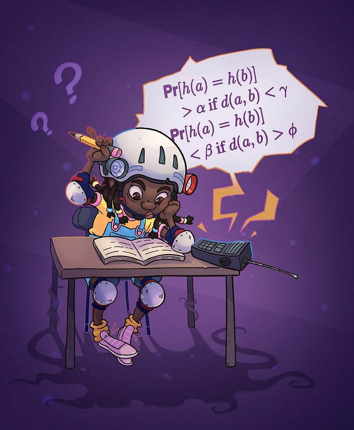
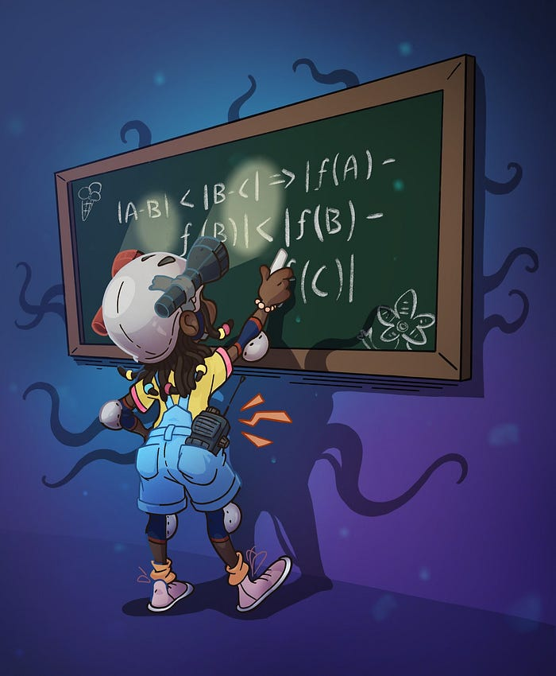
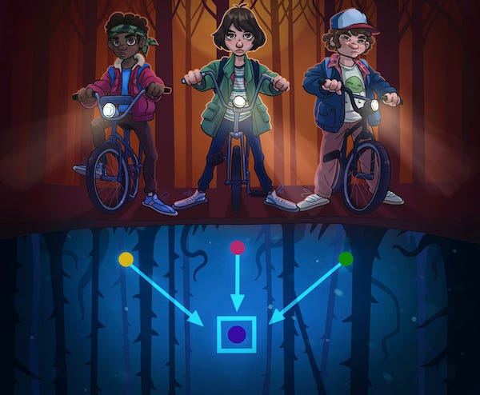
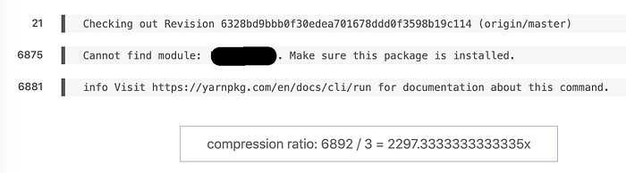

# Machine Learning for a Better Developer Experience

[Stanislav Kirdey](https://www.linkedin.com/in/skirdey/), [William High](https://www.linkedin.com/in/fwhigh/)

Imagine having to go through 2.5GB (not often, but does happen time to time) log entries from a failed software build — 3 million lines — to search for a bug or a regression that happened on line 1M. It’s probably not even doable manually! However, one smart approach to make it tractable might be to [diff](https://en.wikipedia.org/wiki/Diff) the lines against a recent successful build, with the hope that the bug produces unusual lines in the logs.

Standard [md5](https://en.wikipedia.org/wiki/MD5) diff would run quickly but still produce at least hundreds of thousands candidate lines to look through because it surfaces character-level differences between lines. Fuzzy diffing using k-nearest neighbors clustering from machine learning (the kind of thing [logreduce](https://help.sumologic.com/05Search/LogReducehttps://help.sumologic.com/05Search/LogReduce) does) produces around 40,000 candidate lines but takes an hour to complete. Our solution produces 20,000 candidate lines in 20 min of computing — and thanks to the magic of open source, it’s only about a hundred lines of Python code.

The application is a combination of [neural embeddings](https://en.wikipedia.org/wiki/Word_embedding), which encode the semantic information in words and sentences, and [locality sensitive hashing](http://tylerneylon.com/a/lsh1/), which efficiently assigns approximately nearby items to the same buckets and faraway items to different buckets. Combining embeddings with LSH is a great idea that appears to be [less](https://www.researchgate.net/publication/272821025_A_Neural_Network_Model_for_Large-Scale_Stream_Data_Learning_Using_Locally_Sensitive_Hashing) [than](https://sites.cs.ucsb.edu/~tyang/papers/www2019.pdf) a [decade](https://towardsdatascience.com/fast-near-duplicate-image-search-using-locality-sensitive-hashing-d4c16058efcb) [old](https://towardsdatascience.com/finding-similar-images-using-deep-learning-and-locality-sensitive-hashing-9528afee02f5).

> Note — we used Tensorflow 2.2 on CPU with eager execution for transfer learning and scikit-learn NearestNeighbor for k-nearest-neighbors. There are [sophisticated approximate nearest neighbors implementations](https://github.com/erikbern/ann-benchmarks) that would be better for a model-based nearest neighbors solution.

## What embeddings are and why we needed them

Assembling a [k-hot bag-of-words](https://en.wikipedia.org/wiki/One-hot) is a typical (useful!) starting place for deduplication, search, and similarity problems around un- or semi-structured text. This type of bag-of-words encoding looks like a dictionary with individual words and their counts. Here’s what it would look like for the sentence “log in error, check log”.

> {“log”: 2, “in”: 1, “error”: 1, “check”: 1}

This encoding can also be represented using a vector where the index corresponds to a word and the value is the count. Here is “log in error, check log” as a vector, where the first entry is reserved for “log” word counts, the second for “in” word counts, and so forth.

> [2, 1, 1, 1, 0, 0, 0, 0, 0, …]

Notice that the vector consists of many zeros. Zero-valued entries represent all the other words in the dictionary that were not present in that sentence. The total number of vector entries possible, or _dimensionality_ of the vector, is the size of your language’s dictionary, which is often millions or more but down to hundreds of thousands with some [clever](https://nlp.stanford.edu/IR-book/html/htmledition/stemming-and-lemmatization-1.html) [tricks](https://en.wikipedia.org/wiki/Feature_hashing#Feature_vectorization_using_hashing_trick).

Now let’s look at the dictionary and vector representations of “problem authenticating”. The words corresponding to the first five vector entries do not appear at all in the new sentence.

> {“problem”: 1, “authenticating”: 1}  
> [0, 0, 0, 0, 1, 1, 0, 0, 0, …]

These two sentences are semantically similar, which means they mean essentially the same thing, but lexically are as different as they can be, which is to say they have no words in common. **In a fuzzy diff setting, we might want to say that these sentences are too similar to highlight, but md5 and k-hot document encoding with kNN do not support that.**

*Erica Sinclair is helping us get LSH probabilities right*

Dimensionality reduction uses linear algebra or artificial neural networks to place semantically similar words, sentences, and log lines near to each other in a new vector space, using representations known as embeddings. In our example, “log in error, check log” might have a five-dimensional embedding vector

> [0.1, 0.3, -0.5, -0.7, 0.2]

and “problem authenticating” might be

> [0.1, 0.35, -0.5, -0.7, 0.2]

These embedding vectors are near to each other by distance measures like [cosine similarity](https://en.wikipedia.org/wiki/Cosine_similarity), unlike their k-hot bag-of-word vectors. Dense, low dimensional representations are really useful for short documents, like lines of a build or a system log.

In reality, you’d be replacing the thousands or more dictionary dimensions with just 100 information-rich embedding dimensions (not five). State-of-the-art approaches to dimensionality reduction include singular value decomposition of a word co-occurrence matrix ([GloVe](https://nlp.stanford.edu/pubs/glove.pdf)) and specialized neural networks ([word2vec](https://arxiv.org/pdf/1310.4546.pdf), [BERT](https://arxiv.org/pdf/1810.04805.pdf), [ELMo](https://arxiv.org/pdf/1802.05365.pdf)).

*Erica Sinclair and locality-preserving hashing*

## What about clustering? Back to the build log application

We joke internally that Netflix is a log-producing service that sometimes streams videos. We deal with hundreds of thousands of requests per second in the fields of exception monitoring, log processing, and stream processing. Being able to scale our NLP solutions is just a must-have if we want to use applied machine learning in telemetry and logging spaces. This is why we cared about scaling our text deduplication, semantic similarity search, and textual outlier detection — there is no other way if the business problems need to be solved in real-time.

Our diff solution involves embedding each line into a low dimensional vector and (optionally “fine-tuning” or updating the embedding model at the same time), assigning it to a cluster, and identifying lines in different clusters as “different”. [Locality sensitive hashing](https://en.wikipedia.org/wiki/Locality-sensitive_hashing) is a probabilistic algorithm that permits constant time cluster assignment and near-constant time nearest neighbors search.

LSH works by mapping a vector representation to a scalar number, or more precisely a collection of scalars. While standard hashing algorithms aim to avoid [collisions](https://medium.com/@glaslos/locality-sensitive-fuzzy-hashing-66127178ebdc) between any two inputs that are not the same, LSH aims to avoid collisions if the inputs are far apart and _promote_ them if they are different but near to each other in the vector space.

The embedding vector for “log in error, check log” might be mapped to binary number 01 — and 01 then represents the cluster. The embedding vector for “problem authenticating” would with high probability be mapped to the same binary number, 01. This is how LSH enables fuzzy matching, and the inverse problem, fuzzing diffing. Early applications of LSH were over high dimensional bag-of-words vector spaces — we couldn’t think of any reason it wouldn’t work on embedding spaces just as well, and there are signs that [others](https://towardsdatascience.com/finding-similar-images-using-deep-learning-and-locality-sensitive-hashing-9528afee02f5) [have](https://towardsdatascience.com/fast-near-duplicate-image-search-using-locality-sensitive-hashing-d4c16058efcb) [had](https://sites.cs.ucsb.edu/~tyang/papers/www2019.pdf) the same thought.

*Using LSH to place characters in the same bucket but in the Upside Down.*

The work we did on applying LSH and neural embeddings in-text outlier detection on build logs now allows an engineer to look through a small fraction of the log’s lines to identify and fix errors in potentially business-critical software, and it also allows us to achieve semantic clustering of almost any log line in real-time.

We now bring this benefit from semantic LSH to every build at Netflix. The semantic part lets us group seemingly dissimilar items based on their meanings and surface them in outlier reports.

## A few examples

This is our favorite example of a semantic diff, from 6,892 lines to just 3.

Another example, this build produced 6,044 lines, but only 171 were left in the report. And the main issue surfaced almost immediately on line 4,036.

*Quickly parse 171 lines, instead 6,044*

Coming back to the example in the beginning, how did we end up with such large logs in builds? Some of our thousands of build jobs [stress tests against consumer electronics](./bringing-rich-experiences-to-memory-constrained-tv-devices-6de771eabb16.md) where they run with trace mode. The amount of data they produce is hard to consume without any pre-processing. One example on the lighter end drops from 91,366 to 455 lines to parse.

> compression ratio: 91,366 / 455 = 200x

*Quickly parse 455 lines, instead of 91,366*

There are various examples that capture also semantic differences across many different frameworks, languages, and build scenarios.

## Conclusion

The mature state of open source transfer learning data products and SDKs has allowed us to solve semantic nearest neighbor search via LSH in remarkably few lines of code. We became especially interested in investigating the special benefits that transfer learning and fine-tuning might bring to the application. We’re excited to have an opportunity to solve such problems and to help people do what they do better and faster than before.

We hope you’ll consider joining Netflix and becoming one of the stunning colleagues whose life we make easier with machine learning. Inclusion is a core Netflix value and we are particularly interested in fostering a diversity of perspectives on our technical teams. So if you are in analytics, engineering, data science, or any other field and have a background that is atypical for the industry we’d especially like to hear from you!

If you have any questions about opportunities at Netflix, please reach out to the authors on LinkedIn.

---
**Tags:** Machine Learning · Data Science · Neural Networks · Developer Productivity
