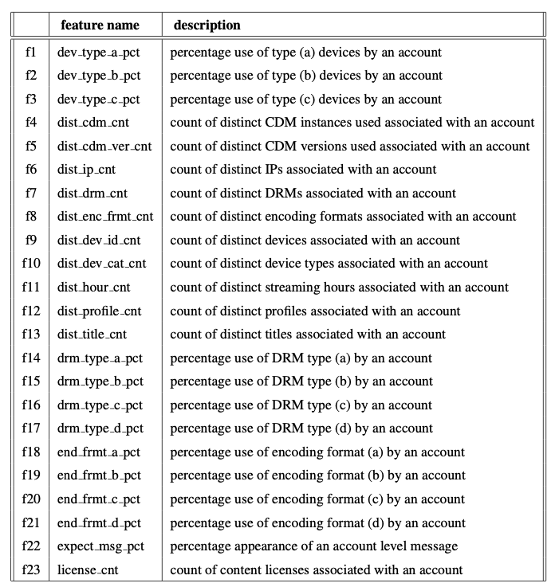
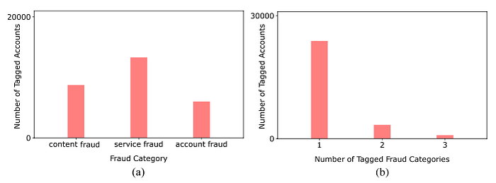
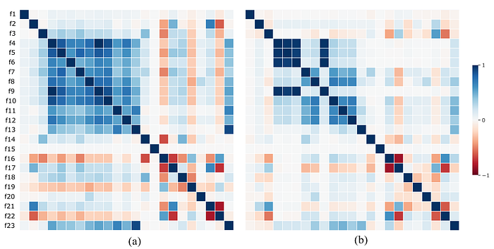
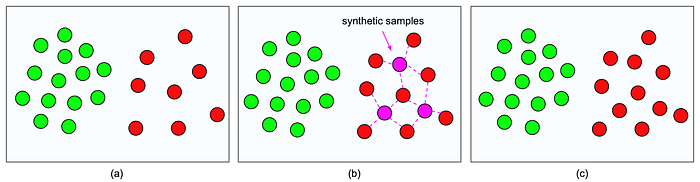
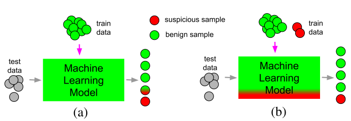
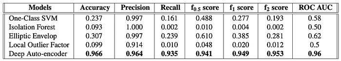
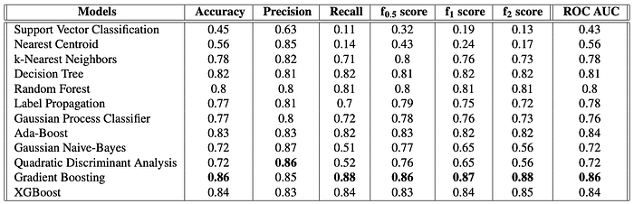
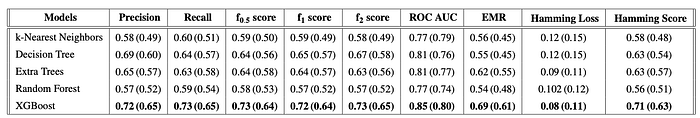
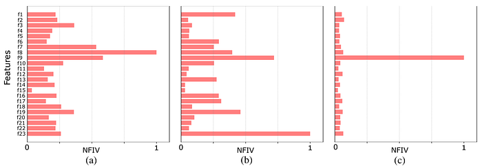

# Machine Learning for Fraud Detection in Streaming Services

By [Soheil Esmaeilzadeh](https://www.linkedin.com/in/drsoheilesmaeilzadeh/), [Negin Salajegheh](https://www.linkedin.com/in/salajegheh/), [Amir Ziai](https://www.linkedin.com/in/amirziai/), [Jeff Boote](https://www.linkedin.com/in/jboote/)

## Introduction

Streaming services serve content to millions of users all over the world. These services allow users to stream or download content across a broad category of devices including mobile phones, laptops, and televisions. However, some restrictions are in place, such as the number of active devices, the number of streams, and the number of downloaded titles. Many users across many platforms make for a uniquely large attack surface that includes **content fraud**, account fraud, and abuse of terms of service. Detection of fraud and abuse at scale and in real-time is highly challenging.

Data analysis and machine learning techniques are great candidates to help secure large-scale streaming platforms. Even though such techniques can scale security solutions proportional to the service size, they bring their own set of challenges such as requiring labeled data samples, defining effective features, and finding appropriate algorithms. In this work, by relying on the knowledge and experience of streaming security experts, we define features based on the expected streaming behavior of the users and their interactions with devices. We present a systematic overview of the unexpected streaming behaviors together with a set of model-based and data-driven anomaly detection strategies to identify them.

## Background on Anomaly Detection

**Anomalies (also known as outliers) are defined as certain patterns (or incidents) in a set of data samples that do not conform to an agreed-upon notion of normal behavior in a given context.**

There are two main anomaly detection approaches, namely, (i) rule-based, and (ii) model-based. Rule-based anomaly detection approaches use a set of rules which rely on the knowledge and experience of domain experts. Domain experts specify the characteristics of anomalous incidents in a given context and develop a set of rule-based functions to discover the anomalous incidents. As a result of this reliance, the deployment and use of rule-based anomaly detection methods become prohibitively expensive and time-consuming at scale, and cannot be used for real-time analyses. Furthermore, the rule-based anomaly detection approaches require constant supervision by experts in order to keep the underlying set of rules up-to-date for identifying novel threats. Reliance on experts can also make rule-based approaches biased or limited in scope and efficacy.

On the other hand, in model-based anomaly detection approaches, models are built and used to detect anomalous incidents in a fairly automated manner. Although model-based anomaly detection approaches are more scalable and suitable for real-time analysis, they highly rely on the availability of (often labeled) context-specific data. Model-based anomaly detection approaches, in general, are of three kinds, namely, (i) supervised, (ii) semi-supervised, and (iii) unsupervised. Given a labeled dataset, a supervised anomaly detection model can be built to distinguish between anomalous and benign incidents. In semi-supervised anomaly detection models, only a set of benign examples are required for training. These models learn the distributions of benign samples and leverage that knowledge for identifying anomalous samples at the inference time. Unsupervised anomaly detection models do not require any labeled data samples, but it is not straightforward to reliably evaluate their efficacy.

*Figure 1. Schematic of a streaming service platform: (a) illustrates device types that can be used for streaming, (b) designates the set of authentication and authorization systems such as license and manifest servers for providing encrypted contents as well as decryption keys and manifests, and (c) shows the streaming service provider, as a surrogate entity for digital content providers, that interacts with the other two components.*

## Streaming Platforms

Commercial streaming platforms shown in Figure 1 mainly rely on Digital Rights Management (DRM) systems. DRM is a collection of access control technologies that are used for protecting the copyrights of digital media such as movies and music tracks. DRM helps the owners of digital products prevent illegal access, modification, and distribution of their copyrighted work. DRM systems provide continuous content protection against unauthorized actions on digital content and restrict it to streaming and in-time consumption. The backbone of DRM is the use of digital licenses, which specify a set of usage rights for the digital content and contain the permissions from the owner to stream the content via an on-demand streaming service.

On the client’s side, a request is sent to the streaming server to obtain the protected encrypted digital content. In order to stream the digital content, the user requests a license from the clearinghouse that verifies the user’s credentials. Once a license gets assigned to a user, using a Content Decryption Module (CDM), the protected content gets decrypted and becomes ready for preview according to the usage rights enforced by the license. A decryption key gets generated using the license, which is specific to a certain movie title, can only be used by a particular account on a given device, has a limited lifetime, and enforces a limit on how many concurrent streams are allowed.

Another relevant component that is involved in a streaming experience is the concept of manifest. Manifest is a list of video, audio, subtitles, etc. which comes in the form of a few Uniform Resource Locators (URLs) that are used by the clients to get the movie streams. Manifest is requested by the client and gets delivered to the player before the license request, and it itemizes the available streams.

## Data

### Data Labeling

For the task of anomaly detection in streaming platforms, as we have neither an already trained model nor any labeled data samples, we use structural a priori domain-specific rule-based assumptions, for data labeling. Accordingly, we define a set of rule-based _heuristics_ used for identifying anomalous streaming behaviors of clients and label them as anomalous or benign. The fraud categories that we consider in this work are (i) content fraud, (ii) service fraud, and (iii) account fraud. With the help of security experts, we have designed and developed heuristic functions in order to discover a wide range of suspicious behaviors. We then use such heuristic functions for automatically labeling the data samples. In order to label a set of benign (non-anomalous) accounts a group of vetted users that are highly trusted to be free of any forms of fraud is used.

Next, we share three examples as a subset of our in-house heuristics that we have used for tagging anomalous accounts:

- (i) _Rapid license acquisition_: a heuristic that is based on the fact that benign users usually watch one content at a time and it takes a while for them to move on to another content resulting in a relatively low rate of license acquisition. Based on this reasoning, we tag all the accounts that acquire licenses very quickly as anomalous.
- (ii) _Too many failed attempts at streaming_: a heuristic that relies on the fact that most devices stream without errors while a device, in trial and error mode, in order to find the “right’’ parameters leaves a long trail of errors behind. Abnormally high levels of errors are an indicator of a fraud attempt.
- (iii) _Unusual combinations of device types and DRMs_: a heuristic that is based on the fact that a device type (e.g., a browser) is normally matched with a certain DRM system (e.g., Widevine). Unusual combinations could be a sign of compromised devices that attempt to bypass security enforcements.

**It should be noted that the heuristics, even though work as a great proxy to embed the knowledge of security experts in tagging anomalous accounts, may not be completely accurate and they might wrongly tag accounts as anomalous (i.e., false-positive incidents), for example in the case of a buggy client or device. That’s up to the machine learning model to discover and avoid such false-positive incidents.**

**Data Featurization**

A complete list of features used in this work is presented in Table 1. The features mainly belong to two distinct classes. One class accounts for the number of distinct occurrences of a certain parameter/activity/usage in a day. For instance, the `dist_title_cnt` feature characterizes the number of distinct movie titles streamed by an account. The second class of features on the other hand captures the percentage of a certain parameter/activity/usage in a day.

Due to confidentiality reasons, we have partially obfuscated the features, for instance, `dev_type_a_pct`, `drm_type_a_pct`, and `end_frmt_a_pct` are intentionally obfuscated and we do not explicitly mention devices, DRM types, and encoding formats.

*Table 1. The list of streaming related features with the suffixes pct and cnt respectively referring to percentage and count*

## Data Statistics

In this part, we present the statistics of the features presented in Table 1. Over 30 days, we have gathered 1,030,005 benign and 28,045 anomalous accounts. The anomalous accounts have been identified (labeled) using the heuristic-aware approach. Figure 2(a) shows the number of anomalous samples as a function of fraud categories with 8,741 (31%), 13,299 (47%), 6,005 (21%) data samples being tagged as content fraud, service fraud, and account fraud, respectively. Figure 2(b) shows that out of 28,045 data samples being tagged as anomalous by the heuristic functions, 23,838 (85%), 3,365 (12%), and 842 (3%) are respectively considered as incidents of one, two, and three fraud categories.

Figure 3 presents the correlation matrix of the 23 data features described in Table 1 for clean and anomalous data samples. As we can see in Figure 3 there are positive correlations between features that correspond to device signatures, e.g., `dist_cdm_cnt` and `dist_dev_id_cnt`, and between features that refer to title acquisition activities, e.g., `dist_title_cnt` and `license_cnt`.

*Figure 2. Number of anomalous samples as a function of (a) fraud categories and (b) number of tagged categories.*

*Figure 3. Correlation matrix of the features presented in Table 1 for (a) clean and (b) anomalous data samples.*

## Label Imbalance Treatment

It is well known that class imbalance can compromise the accuracy and robustness of the classification models. Accordingly, in this work, we use the Synthetic Minority Over-sampling Technique (SMOTE) to over-sample the minority classes by creating a set of synthetic samples.

Figure 4 shows a high-level schematic of Synthetic Minority Over-sampling Technique (**SMOTE**) with two classes shown in green and red where the red class has fewer number of samples present, i.e., is the minority class, and gets synthetically upsampled.

*Figure 4. Synthetic Minority Over-sampling Technique*

## Evaluation Metrics

For evaluating the performance of the anomaly detection models we consider a set of evaluation metrics and report their values. For the one-class as well as binary anomaly detection task, such metrics are accuracy, precision, recall, f0.5, f1, and f2 scores, and area under the curve of the receiver operating characteristic (ROC AUC). For the multi-class multi-label task we consider accuracy, precision, recall, f0.5, f1, and f2 scores together with a set of additional metrics, namely, exact match ratio (EMR) score, Hamming loss, and Hamming score.

## Model Based Anomaly Detection

In this section, we briefly describe the modeling approaches that are used in this work for anomaly detection. We consider two model-based anomaly detection approaches, namely, (i) semi-supervised, and (ii) supervised as presented in Figure 5.

*Figure 5. Model-based anomaly detection approaches: (a) semi-supervised and (b) supervised.*

## Semi-Supervised Anomaly Detection

The key point about the semi-supervised model is that at the training step the model is supposed to learn the distribution of the benign data samples so that at the inference time it would be able to distinguish between the benign samples (that has been trained on) and the anomalous samples (that has not observed). Then at the inference stage, the anomalous samples would simply be those that fall out of the distribution of the benign samples. The performance of One-Class methods could become sub-optimal when dealing with complex and high-dimensional datasets. However, supported by the literature, deep neural autoencoders can perform better than One-Class methods on complex and high-dimensional anomaly detection tasks.

As the One-Class anomaly detection approaches, in addition to a deep auto-encoder, we use the One-Class SVM, Isolation Forest, Elliptic Envelope, and Local Outlier Factor approaches.

## Supervised Anomaly Detection

**Binary Classification: **In the anomaly detection task using binary classification, we only consider two classes of samples namely benign and anomalous and we do not make distinctions between the types of the anomalous samples, i.e., the three fraud categories. For the binary classification task we use multiple supervised classification approaches, namely, (i) Support Vector Classification (SVC), (ii) K-Nearest Neighbors classification, (iii) Decision Tree classification, (iv) Random Forest classification, (v) Gradient Boosting, (vi) AdaBoost, (vii) Nearest Centroid classification (viii) Quadratic Discriminant Analysis (QDA) classification (ix) Gaussian Naive Bayes classification (x) Gaussian Process Classifier (xi) Label Propagation classification (xii) XGBoost. Finally, upon doing stratified k-fold cross-validation, we carry out an efficient grid search to tune the hyper-parameters in each of the aforementioned models for the binary classification task and only report the performance metrics for the optimally tuned hyper-parameters.

**Multi-Class Multi-Label Classification: **In the anomaly detection task using multi-class multi-label classification, we consider the three fraud categories as the possible anomalous classes (hence multi-class), and each data sample is assigned one or more than one of the fraud categories as its set of labels (hence multi-label) using the heuristic-aware data labeling strategy presented earlier. For the multi-class multi-label classification task we use multiple supervised classification techniques, namely, (i) K-Nearest Neighbors, (ii) Decision Tree, (iii) Extra Trees, (iv) Random Forest, and (v) XGBoost.

## Results and Discussion

Table 2 shows the values of the evaluation metrics for the semi-supervised anomaly detection methods. As we see from Table 2, the deep auto-encoder model performs the best among the semi-supervised anomaly detection approaches with an accuracy of around 96% and f1 score of 94%. Figure 6(a) shows the distribution of the Mean Squared Error (MSE) values for the anomalous and benign samples at the inference stage.

*Table 2. The values of the evaluation metrics for a set of semi-supervised anomaly detection models.*

*Figure 6. For the deep auto-encoder model: (a) distribution of the Mean Squared Error (MSE) values for anomalous and benign samples at the inference stage — (b) confusion matrix across benign and anomalous samples- (c) Mean Squared Error (MSE) values averaged across the anomalous and benign samples for each of the 23 features.*

*Table 3. The values of the evaluation metrics for a set of supervised binary anomaly detection classifiers.*

*Table 4. The values of the evaluation metrics for a set of supervised multi-class multi-label anomaly detection approaches. The values in parenthesis refer to the performance of the models trained on the original (not upsampled) dataset.*

Table 3 shows the values of the evaluation metrics for a set of supervised binary anomaly detection models. Table 4 shows the values of the evaluation metrics for a set of supervised multi-class multi-label anomaly detection models.

In Figure 7(a), for the content fraud category, the three most important features are the count of distinct encoding formats (`dist_enc_frmt_cnt`), the count of distinct devices (`dist_dev_id_cnt`), and the count of distinct DRMs (`dist_drm_cnt`). This implies that for content fraud the uses of multiple devices, as well as encoding formats, stand out from the other features. For the service fraud category in Figure 7(b) we see that the three most important features are the count of content licenses associated with an account (`license_cnt`), the count of distinct devices (`dist_dev_id_cnt`), and the percentage use of type (a) devices by an account (`dev_type_a_pct`). This shows that in the service fraud category the counts of content licenses and distinct devices of type (a) stand out from the other features. Finally, for the account fraud category in Figure 7(c), we see that the count of distinct devices (`dist_dev_id_cnt`) dominantly stands out from the other features.

*Figure 7. The normalized feature importance values (NFIV) for the multi-class multi-label anomaly detection task using the XGBoost approach in Table 4 across the three anomaly classes, i.e., (a) content fraud, (b) service fraud, and (c) account fraud.*

You can find more technical details in our paper [here](https://arxiv.org/abs/2203.02124).

Are you interested in solving challenging problems at the intersection of [machine learning](https://jobs.netflix.com/search?q=%22machine+learning%22) and [security](https://jobs.netflix.com/search?q=security)? We are always looking for great people to join us.

---
**Tags:** Machine Learning · Security · Anomaly Detection
