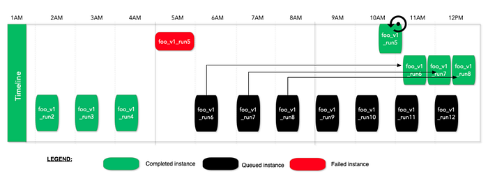
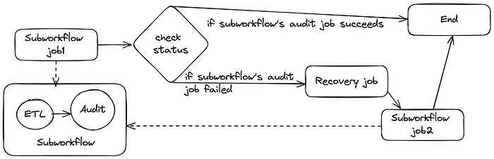
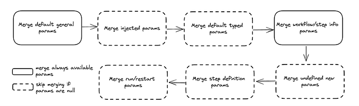
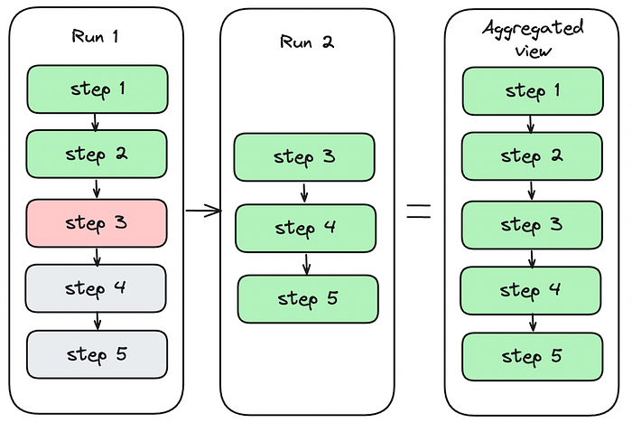
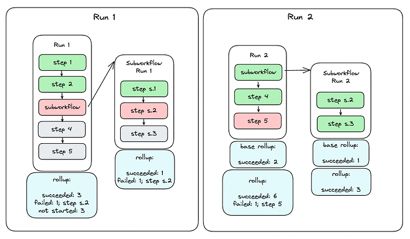
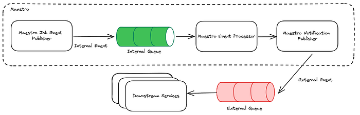

# Maestro: Data/ML Workflow Orchestrator at Netflix

By [Jun He](https://www.linkedin.com/in/jheua/), [Natallia Dzenisenka](https://www.linkedin.com/in/natalliadzenisenka/), [Praneeth Yenugutala](https://www.linkedin.com/in/praneethy91/), [Yingyi Zhang](https://www.linkedin.com/in/yingyi-zhang-a0a164111/), and [Anjali Norwood](https://www.linkedin.com/in/anjali-norwood-9521a16)

## TL;DR

We are thrilled to announce that the Maestro source code is now open to the public! Please visit the [Maestro GitHub repository](https://github.com/Netflix/maestro) to get started. If you find it useful, please [give us a star](https://github.com/Netflix/maestro).

### What is Maestro

Maestro is a horizontally scalable workflow orchestrator designed to manage large-scale Data/ML workflows such as data pipelines and machine learning model training pipelines. It oversees the entire lifecycle of a workflow, from start to finish, including retries, queuing, task distribution to compute engines, etc.. Users can package their business logic in various formats such as Docker images, notebooks, bash script, SQL, Python, and more. Unlike traditional workflow orchestrators that only support Directed Acyclic Graphs (DAGs), Maestro supports both acyclic and cyclic workflows and also includes multiple reusable patterns, including foreach loops, subworkflow, and conditional branch, etc.

### Our Journey with Maestro

Since we first introduced Maestro in [this blog post](./orchestrating-data-ml-workflows-at-scale-with-netflix-maestro-aaa2b41b800c.md), we have successfully migrated hundreds of thousands of workflows to it on behalf of users with minimal interruption. The transition was seamless, and Maestro has met our design goals by handling our ever-growing workloads. Over the past year, we’ve seen a remarkable 87.5% increase in executed jobs. Maestro now launches thousands of workflow instances and runs half a million jobs daily on average, and has completed around 2 million jobs on particularly busy days.

### Scalability and Versatility

Maestro is a fully managed workflow orchestrator that provides Workflow-as-a-Service to thousands of end users, applications, and services at Netflix. It supports a wide range of workflow use cases, including ETL pipelines, ML workflows, AB test pipelines, pipelines to move data between different storages, etc. Maestro’s horizontal scalability ensures it can manage both a large number of workflows and a large number of jobs within a single workflow.

At Netflix, workflows are intricately connected. Splitting them into smaller groups and managing them across different clusters adds unnecessary complexity and degrades the user experience. This approach also requires additional mechanisms to coordinate these fragmented workflows. Since Netflix’s data tables are housed in a single data warehouse, we believe a single orchestrator should handle all workflows accessing it.

Join us on this exciting journey by exploring the [Maestro GitHub repository](https://github.com/Netflix/maestro) and contributing to its ongoing development. Your support and feedback are invaluable as we continue to improve the Maestro project.

## Introducing Maestro

Netflix Maestro offers a comprehensive set of features designed to meet the diverse needs of both engineers and non-engineers. It includes the common functions and reusable patterns applicable to various use cases in a loosely coupled way.

**A workflow definition is defined in a JSON format.** Maestro combines user-supplied fields with those managed by Maestro to form a flexible and powerful orchestration definition. An example can be found in the [Maestro repository wiki](https://github.com/Netflix/maestro/wiki/Workflow-definition-example).

A Maestro workflow definition comprises two main sections: properties and versioned workflow including its metadata. Properties include author and owner information, and execution settings. Maestro preserves key properties across workflow versions, such as author and owner information, run strategy, and concurrency settings. This consistency simplifies management and aids in trouble-shootings. If the ownership of the current workflow changes, the new owner can claim the ownership of the workflows without creating a new workflow version. Users can also enable the triggering or alerting features for a given workflow over the properties.

Versioned workflow includes attributes like a unique identifier, name, description, tags, timeout settings, and criticality levels (low, medium, high) for prioritization. Each workflow change creates a new version, enabling tracking and easy reversion, with the active or the latest version used by default. A workflow consists of steps, which are the nodes in the workflow graph defined by users. Steps can represent jobs, another workflow using subworkflow step, or a loop using foreach step. Steps consist of unique identifiers, step types, tags, input and output step parameters, step dependencies, retry policies, and failure mode, step outputs, etc. Maestro supports configurable retry policies based on error types to enhance step resilience.

This high-level overview of Netflix Maestro’s workflow definition and properties highlights its flexibility to define complex workflows. Next, we dive into some of the useful features in the following sections.

### Workflow Run Strategy

Users want to automate data pipelines while retaining control over the execution order. This is crucial when workflows cannot run in parallel or must halt current executions when new ones occur. Maestro uses predefined run strategies to decide whether a workflow instance should run or not. Here is the list of predefined run strategies Maestro offers.

**Sequential Run Strategy**  
This is the default strategy used by maestro, which runs workflows one at a time based on a First-In-First-Out (FIFO) order. With this run strategy, Maestro runs workflows in the order they are triggered. Note that an execution does not depend on the previous states. Once a workflow instance reaches one of the terminal states, whether succeeded or not, Maestro will start the next one in the queue.

**Strict Sequential Run Strategy  
**With this run strategy, Maestro will run workflows in the order they are triggered but block execution if there’s a blocking error in the workflow instance history. Newly triggered workflow instances are queued until the error is resolved by manually restarting the failed instances or marking the failed ones unblocked.

In the above example, run5 fails at 5AM, then later runs are queued but do not run. When someone manually marks run5 unblocked or restarts it, then the workflow execution will resume. This run strategy is useful for time insensitive but business critical workflows. This gives the workflow owners the option to review the failures at a later time and unblock the executions after verifying the correctness.

**First-only Run Strategy**  
With this run strategy, Maestro ensures that the running workflow is complete before queueing a new workflow instance. If a new workflow instance is queued while the current one is still running, Maestro will remove the queued instance. Maestro will execute a new workflow instance only if there is no workflow instance currently running, effectively turning off queuing with this run strategy. This approach helps to avoid idempotency issues by not queuing new workflow instances.

**Last-only Run Strategy**  
With this run strategy, Maestro ensures the running workflow is the latest triggered one and keeps only the last instance. If a new workflow instance is queued while there is an existing workflow instance already running, Maestro will stop the running instance and execute the newly triggered one. This is useful if a workflow is designed to always process the latest data, such as processing the latest snapshot of an entire table each time.

**Parallel with Concurrency Limit Run Strategy**  
With this run strategy, Maestro will run multiple triggered workflow instances in parallel, constrained by a predefined concurrency limit. This helps to fan out and distribute the execution, enabling the processing of large amounts of data within the time limit. A common use case for this strategy is for backfilling the old data.

### Parameters and Expression Language Support

In Maestro, parameters play an important role. Maestro supports dynamic parameters with code injection, which is super useful and powerful. This feature significantly enhances the flexibility and dynamism of workflows, allowing using parameters to control execution logic and enable state sharing between workflows and their steps, as well as between upstream and downstream steps. Together with other Maestro features, it makes the defining of workflows dynamic and enables users to define parameterized workflows for complex use cases.

However, code injection introduces significant security and safety concerns. For example, users might unintentionally write an infinite loop that creates an array and appends items to it, eventually crashing the server with out-of-memory (OOM) issues. While one approach could be to ask users to embed the injected code within their business logic instead of the workflow definition, this would impose additional work on users and tightly couple their business logic with the workflow. In certain cases, this approach blocks users to design some complex parameterized workflows.

To mitigate these risks and assist users to build parameterized workflows, we developed our own customized expression language parser, a simple, secure, and safe expression language (SEL). SEL supports code injection while incorporating validations during syntax tree parsing to protect the system. It leverages the Java Security Manager to restrict access, ensuring a secure and controlled environment for code execution.

**Simple, Secure, and Safe Expression Language (SEL)  
**SEL is a homemade simple, secure, and safe expression language (SEL) to address the risks associated with code injection within Maestro parameterized workflows. It is a simple expression language and the grammar and syntax follow JLS ([Java Language Specifications](https://docs.oracle.com/javase/specs/)). SEL supports a subset of JLS, focusing on Maestro use cases. For example, it supports data types for all Maestro parameter types, raising errors, datetime handling, and many predefined utility methods. SEL also includes additional runtime checks, such as loop iteration limits, array size checks, object memory size limits and so on, to enhance security and reliability. For more details about SEL, please refer to the [Maestro GitHub documentation](https://github.com/Netflix/maestro/blob/main/netflix-sel/docs/index.md#welcome-to-sel).

**Output Parameters**  
To further enhance parameter support, Maestro allows for callable step execution, which returns output parameters from user execution back to the system. The output data is transmitted to Maestro via its REST API, ensuring that the step runtime does not have direct access to the Maestro database. This approach significantly reduces security concerns.

**Parameterized Workflows**  
Thanks to the powerful parameter support, users can easily create parameterized workflows in addition to static ones. Users enjoy defining parameterized workflows because they are easy to manage and troubleshoot while being powerful enough to solve complex use cases.

- Static workflows are simple and easy to use but come with limitations. Often, users have to duplicate the same workflow multiple times to accommodate minor changes. Additionally, workflow and jobs cannot share the states without using parameters.
- On the other hand, completely dynamic workflows can be challenging to manage and support. They are difficult to debug or troubleshoot and hard to be reused by others.
- Parameterized workflows strike a balance by being initialized step by step at runtime based on user defined parameters. This approach provides great flexibility for users to control the execution at runtime while remaining easy to manage and understand.

As we described in [the previous Maestro blog post](./orchestrating-data-ml-workflows-at-scale-with-netflix-maestro-aaa2b41b800c.md), parameter support enables the creation of complex parameterized workflows, such as backfill data pipelines.

### Workflow Execution Patterns

Maestro provides multiple useful building blocks that allow users to easily define dataflow patterns or other workflow patterns. It provides support for common patterns directly within the Maestro engine. Direct engine support not only enables us to optimize these patterns but also ensures a consistent approach to implementing them. Next, we will talk about the three major building blocks that Maestro provides.

**Foreach Support**  
In Maestro, the foreach pattern is modeled as a dedicated step within the original workflow definition. Each iteration of the foreach loop is internally treated as a separate workflow instance, which scales similarly as any other Maestro workflow based on the step executions (i.e. a sub-graph) defined within the foreach definition block. The execution of sub-graph within a foreach step is delegated to a separate workflow instance. Foreach step then monitors and collects the status of these foreach workflow instances, each managing the execution of a single iteration. For more details, please refer to [our previous Maestro blog post](./orchestrating-data-ml-workflows-at-scale-with-netflix-maestro-aaa2b41b800c.md).

The foreach pattern is frequently used to repeatedly run the same jobs with different parameters, such as data backfilling or machine learning model tuning. It would be tedious and time consuming to request users to explicitly define each iteration in the workflow definition (potentially hundreds of thousands of iterations). Additionally, users would need to create new workflows if the foreach range changes, further complicating the process.

**Conditional Branch Support**  
The conditional branch feature allows subsequent steps to run only if specific conditions in the upstream step are met. These conditions are defined using the SEL expression language, which is evaluated at runtime. Combined with other building blocks, users can build powerful workflows, e.g. doing some remediation if the audit check step fails and then run the job again.

**Subworkflow Support  
**The subworkflow feature allows a workflow step to run another workflow, enabling the sharing of common functions across multiple workflows. This effectively enables “workflow as a function” and allows users to build a graph of workflows. For example, we have observed complex workflows consisting of hundreds of subworkflows to process data across hundreds tables, where subworkflows are provided by multiple teams.

These patterns can be combined together to build composite patterns for complex workflow use cases. For instance, we can loop over a set of subworkflows or run nested foreach loops. One example that Maestro users developed is an auto-recovery workflow that utilizes both conditional branch and subworkflow features to handle errors and retry jobs automatically.

In this example, subworkflow `job1` runs another workflow consisting of extract-transform-load (ETL) and audit jobs. Next, a status check job leverages the Maestro parameter and SEL support to retrieve the status of the previous job. Based on this status, it can decide whether to complete the workflow or to run a recovery job to address any data issues. After resolving the issue, it then executes subworkflow `job2`, which runs the same workflow as subworkflow `job1`.

### Step Runtime and Step Parameter

**Step Runtime Interface  
**In Maestro, we use step runtime to describe a job at execution time. The step runtime interface defines two pieces of information:

1. A set of basic APIs to control the behavior of a step instance at execution runtime.
2. Some simple data structures to track step runtime state and execution result.

Maestro offers a few step runtime implementations such as foreach step runtime, subworkflow step runtime (mentioned in previous section). Each implementation defines its own logic for start, execute and terminate operations. At runtime, these operations control the way to initialize a step instance, perform the business logic and terminate the execution under certain conditions (i.e. manual intervention by users).

Also, Maestro step runtime internally keeps track of runtime state as well as the execution result of the step. The runtime state is used to determine the next state transition of the step and tell if it has failed or terminated. The execution result hosts both step artifacts and the timeline of step execution history, which are accessible by subsequent steps.

**Step Parameter Merging  
**To control step behavior in a dynamic way, Maestro supports both runtime parameters and tags injection in step runtime. This makes a Maestro step more flexible to absorb runtime changes (i.e. overridden parameters) before actually being started. Maestro internally maintains a step parameter map that is initially empty and is updated by merging step parameters in the order below:

- **Default General Parameters**: Parameters merging starts from default parameters that in general every step should have. For example, workflow_instance_id, step_instance_uuid, step_attempt_id and step_id are required parameters for each maestro step. They are internally reserved by maestro and cannot be passed by users.
- **Injected Parameters**: Maestro then merges injected parameters (if present) into the parameter map. The injected parameters come from step runtime, which are dynamically generated based on step schema. Each type of step can have its own schema with specific parameters associated with this step. The step schema can evolve independently with no need to update Maestro code.
- **Default Typed Parameters**: After injecting runtime parameters, Maestro tries to merge default parameters that are related to a specific type of step. For example, foreach step has loop_params and loop_index default parameters which are internally set by maestro and used for foreach step only.
- **Workflow and Step Info Parameters**: These parameters contain information about step and the workflow it belongs to. This can be identity information, i.e. workflow_id and will be merged to step parameter map if present.
- **Undefined New Parameters**: When starting or restarting a maestro workflow instance, users can specify new step parameters that are not present in initial step definition. ParamsManager merges these parameters to ensure they are available at execution time.
- **Step Definition Parameters**: These step parameters are defined by users at definition time and get merged if they are not empty.
- **Run and Restart Parameters**: When starting or restarting a maestro workflow instance, users can override defined parameters by providing run or restart parameters. These two types of parameters are merged at the end so that step runtime can see the most recent and accurate parameter space.

The parameters merging logic can be visualized in the diagram below.

### Step Dependencies and Signals

Steps in the Maestro execution workflow graph can express execution dependencies using step dependencies. A step dependency specifies the data-related conditions required by a step to start execution. These conditions are usually defined based on signals, which are pieces of messages carrying information such as parameter values and can be published through step outputs or external systems like SNS or Kafka messages.

Signals in Maestro serve both signal trigger pattern and signal dependencies (a publisher-subscriber) pattern. One step can publish an output signal ([a sample example](https://github.com/Netflix/maestro/blob/main/maestro-common/src/testFixtures/resources/fixtures/instances/sample-step-instance-failed.json#L151-L215)) that can unblock the execution of multiple other steps that depend on it. A [signal definition](https://github.com/Netflix/maestro/blob/main/maestro-common/src/main/java/com/netflix/maestro/models/definition/SignalOutputsDefinition.java) includes a list of mapped parameters, allowing Maestro to perform “signal matching” on a subset of fields. Additionally, Maestro supports [signal operators](https://github.com/Netflix/maestro/blob/main/maestro-common/src/main/java/com/netflix/maestro/models/parameter/SignalOperator.java) like <, >, etc., on signal parameter values.

Netflix has built various abstractions on top of the concept of signals. For instance, a ETL workflow can update a table with data and send signals that unblock steps in downstream workflows dependent on that data. Maestro supports “signal lineage,” which allows users to navigate all historical instances of signals and the workflow steps that match (i.e. publishing or consuming) those signals. Signal triggering guarantees exactly-once execution for the workflow subscribing a signal or a set of joined signals. This approach is efficient, as it conserves resources by only executing the workflow or step when the specified conditions in the signals are met. A signal service is implemented for those advanced abstractions. Please refer to the [Maestro blog](./orchestrating-data-ml-workflows-at-scale-with-netflix-maestro-aaa2b41b800c.md) for further details on it.

### Breakpoint

Maestro allows users to set breakpoints on workflow steps, functioning similarly to code-level breakpoints in an IDE. When a workflow instance executes and reaches a step with a breakpoint, that step enters a “paused” state. This halts the workflow graph’s progression until a user manually resumes from the breakpoint. If multiple instances of a workflow step are paused at a breakpoint, resuming one instance will only affect that specific instance, leaving the others in a paused state. Deleting the breakpoint will cause all paused step instances to resume.

This feature is particularly useful during the initial development of a workflow, allowing users to inspect step executions and output data. It is also beneficial when running a step multiple times in a “foreach” pattern with various input parameters. Setting a single breakpoint on a step will cause all iterations of the foreach loop to pause at that step for debugging purposes. Additionally, the breakpoint feature allows human intervention during the workflow execution and can also be used for other purposes, e.g. supporting mutating step states while the workflow is running.

### Timeline

Maestro includes a step execution timeline, capturing all significant events such as execution state machine changes and the reasoning behind them. This feature is useful for debugging, providing insights into the status of a step. For example, it logs transitions such as “Created” and “Evaluating params”, etc. An example of a timeline is included [here](https://github.com/Netflix/maestro/blob/main/maestro-common/src/testFixtures/resources/fixtures/instances/sample-step-instance-failed.json#L137-L150) for reference. The implemented step runtimes can add the timeline events into the timeline to surface the execution information to the end users.

### Retry Policies

Maestro supports retry policies for steps that reach a terminal state due to failure. Users can specify the number of retries and configure retry policies, including delays between retries and exponential backoff strategies, in addition to fixed interval retries. Maestro distinguishes between two types of retries: “platform” and “user.” Platform retries address platform-level errors unrelated to user logic, while user retries are for user-defined conditions. Each type can have its own set of retry policies.

Automatic retries are beneficial for handling transient errors that can be resolved without user intervention. Maestro provides the flexibility to set retries to zero for non-idempotent steps to avoid retry. This feature ensures that users have control over how retries are managed based on their specific requirements.

### Aggregated View

Because a workflow instance can have multiple runs, it is important for users to see an aggregated state of all steps in the workflow instance. Aggregated view is computed by merging base aggregated view with current runs instance step statuses. For example, as you can see on the figure below simulating a simple case, there is a first run, where step1 and step2 succeeded, step3 failed, and step4 and step5 have not started. When the user restarts the run, the run starts from step3 in run 2 with step1 and step2 skipped which succeeded in the previous run. After all steps succeed, the aggregated view shows the run states for all steps.

### Rollup

Rollup provides a high-level summary of a workflow instance, detailing the status of each step and the count of steps in each status. It flattens steps across the current instance and any nested non-inline workflows like subworkflows or foreach steps. For instance, if a successful workflow has three steps, one of which is a subworkflow corresponding to a five-step workflow, the rollup will indicate that seven steps succeeded. Only leaf steps are counted in the rollup, as other steps serve merely as pointers to concrete workflows.

Rollup also retains references to any non-successful steps, offering a clear overview of step statuses and facilitating easy navigation to problematic steps, even within nested workflows. The aggregated rollup for a workflow instance is calculated by combining the current run’s runtime data with a base rollup. The current state is derived from the statuses of active steps, including aggregated rollups for foreach and subworkflow steps. The base rollup is established when the workflow instance begins and includes statuses of inline steps (excluding foreach and subworkflows) from the previous run that are not part of the current run.

For subworkflow steps, the rollup simply reflects the rollup of the subworkflow instance. For foreach steps, the rollup combines the base rollup of the foreach step with the current state rollup. The base is derived from the previous run’s aggregated rollup, excluding the iterations to be restarted in the new run. The current state is periodically updated by aggregating rollups of running iterations until all iterations reach a terminal state.

Due to these processes, the rollup model is eventually consistent. While the figure below illustrates a straightforward example of rollup, the calculations can become complex and recursive, especially with multiple levels of nested foreaches and subworkflows.

### Maestro Event Publishing

When workflow definition, workflow instance or step instance is changed, Maestro generates an event, processes it internally and publishes the processed event to external system(s). Maestro has both internal and external events. The internal event tracks changes within the life cycle of workflow, workflow instance or step instance. It is published to an internal queue and processed within Maestro. After internal events are processed, some of them will be transformed into external event and sent out to the external queue (i.e. SNS, Kafka). The external event carries maestro status change information for downstream services. The event publishing flow is illustrated in the diagram below:

As shown in the diagram, the Maestro event processor bridges the two aforementioned Maestro events. It listens on the internal queue to get the published [internal events](https://github.com/Netflix/maestro/tree/main/maestro-engine/src/main/java/com/netflix/maestro/engine/jobevents). Within the processor, the internal job event is processed based on its type and gets converted to an [external event](https://github.com/Netflix/maestro/tree/main/maestro-common/src/main/java/com/netflix/maestro/models/events) if needed. The notification publisher at the end emits the external event so that downstream services can consume.

The downstream services are mostly event-driven. The Maestro event carries the most useful message for downstream services to capture different changes in Maestro. In general, these changes can be classified into two categories: workflow change and instance status change. The workflow change event is associated with actions at workflow level, i.e definition or properties of a workflow has changed. Meanwhile, instance status change tracks status transition on workflow instance or step instance.

## Get Started with Maestro

Maestro has been extensively used within Netflix, and today, we are excited to make the Maestro source code publicly available. We hope that the scalability and usability that Maestro offers can expedite workflow development outside Netflix. We invite you to try Maestro, use it within your organization, and contribute to its development.

You can find the Maestro code repository at [github.com/Netflix/maestro](https://github.com/Netflix/maestro). If you have any questions, thoughts, or comments about Maestro, please feel free to create a [GitHub issue](https://github.com/Netflix/maestro/issues) in the Maestro repository. We are eager to hear from you.

We are taking workflow orchestration to the next level and constantly solving new problems and challenges, please stay tuned for updates. If you are passionate about solving large scale orchestration problems, please [join us](https://jobs.netflix.com/search?team=Data+Platform).

## Acknowledgements

Thanks to other Maestro team members, [Binbing Hou](https://www.linkedin.com/in/binbing-hou/), [Zhuoran Dong](http://linkedin.com/in/zhuoran-d-96848b154), [Brittany Truong](https://www.linkedin.com/in/brittany-truong-a35b54bb), [Deepak Ramalingam](https://www.linkedin.com/in/rdeepak2002/), [Moctar Ba](http://linkedin.com/in/moctarba), for their contributions to the Maestro project. Thanks to our Product Manager [Ashim Pokharel](https://www.linkedin.com/in/ashpokh/) for driving the strategy and requirements. We’d also like to thank [Andrew Seier](https://www.linkedin.com/in/andrew-seier/), [Romain Cledat](https://www.linkedin.com/in/romain-cledat-4a211a5), [Olek Gorajek](https://www.linkedin.com/in/agorajek/), and other stunning colleagues at Netflix for their contributions to the Maestro project. We also thank Prashanth Ramdas, Eva Tse, David Noor, Charles Smith and other leaders of Netflix engineering organizations for their constructive feedback and suggestions on the Maestro project.

---
**Tags:** Workflow · Orchestration · Data · Machine Learning · Distributed Systems
