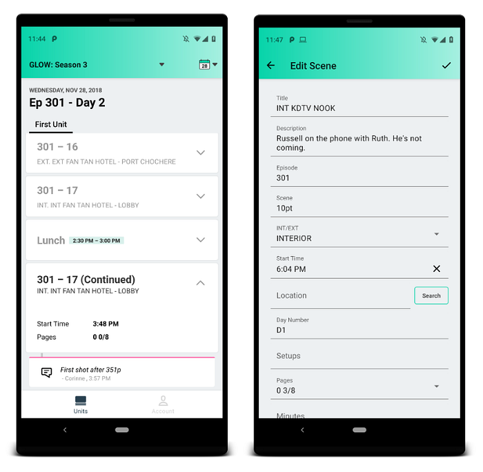
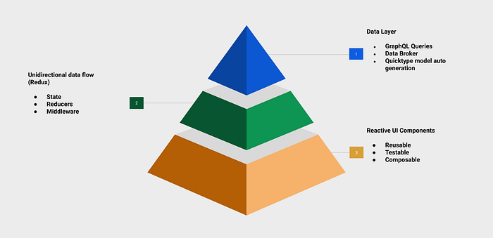
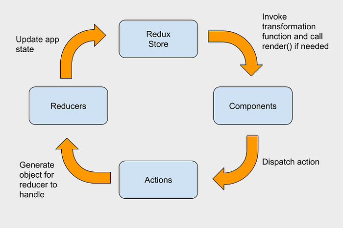

# Making our Android Studio Apps Reactive with UI Components & Redux

By [Juliano Moraes](https://twitter.com/juliano_moraes), [David Henry](http://www.linkedin.com/in/davidmatthewhenry), Corey Grunewald & [Jim Isaacs](https://www.linkedin.com/in/jimpisaacs)

Recently Netflix has started building mobile apps to [bring technology and innovation to our Studio Physical Productions](https://medium.com/netflix-techblog/netflixs-production-technology-voltron-ab0e091d232d), the portion of the business responsible for producing our TV shows and movies.

Our very first mobile app is called Prodicle and was built for Android & iOS using the same reactive architecture in both platforms, which allowed us to build 2 apps from scratch in 3 months with 4 software engineers.

The app helps production crews organize their shooting days through shooting milestones and keeps everyone in a production informed about what is currently happening.

Here is a shooting day for [Glow](https://twitter.com/GlowNetflix) Season 3.

We’ve been experimenting with an idea to use reactive components on Android for the last two years. While there are some frameworks that implement this, we wanted to stay very close to the Android native framework. It was extremely important to the team that we did not completely change the way our engineers write Android code.

We believe reactive components are the key foundation to achieve composable UIs that are scalable, reusable, unit testable and AB test friendly. Composable UIs contribute to fast engineering velocity and produce less side effect bugs.

Our current player UI in the Netflix Android app is using our first iteration of this [componentization architecture](https://www.youtube.com/watch?v=dS9gho9Rxn4). We took the opportunity with building Prodicle to improve upon what we learned with the Player UI, and build the app from scratch using [Redux](https://redux.js.org/), Components, and 100% Kotlin.

## Overall Architecture

## Fragments & Activities

> — Fragment is not your view.

Having large Fragments or Activities causes all sorts of problems, it makes the code hard to read, maintain, and extend. Keeping them small helps with code encapsulation and better separation of concerns — **the presentation logic should be inside a component or a class that represents a view and not in the Fragment.**

This is how a clean Fragment looks in our app, there is no business logic. During the _onViewCreated_ we pass pre-inflated view containers and the global redux store’s dispatch function.

## UI Components

Components are responsible for owning their own XML layout and inflating themselves into a container. They implement a single **render(state: ComponentState)** interface and have their state defined by a [Kotlin data class](https://kotlinlang.org/docs/reference/data-classes.html).

A component’s render method is a pure function that can easily be tested by creating a permutation of possible states variances.

Dispatch functions are the way components fire actions to change app state, make network requests, communicate with other components, etc.

A component defines its own state as a data class in the top of the file. That’s how its render() function is going to be invoked by the render loop.

It receives a ViewGroup container that will be used to inflate the component’s own layout file, _R.layout.list_header_ in this example.

**All the Android views are instantiated using a lazy approach and the render function is the one that will set all the values in the views.**

## Layout

All of these components are independent by design, which means they do not know anything about each other, but somehow we need to layout our components within our screens. The architecture is very flexible and provides different ways of achieving it:

1. **Self Inflation into a Container**: A Component receives a ViewGroup as a container in the constructor, it inflates itself using Layout Inflater. Useful when the screen has a skeleton of containers or is a Linear Layout.
2. **Pre inflated views.** Component accepts a View in its constructor, no need to inflate it. This is used when the layout is owned by the screen in a single XML.
3. **Self Inflation into a Constraint Layout**: Components inflate themselves into a Constraint Layout available in its constructor, it exposes a _getMainViewId_ to be used by the parent to set constraints programmatically.

## Redux

Redux provides an event driven unidirectional data flow architecture through a global and centralized application state that can only be mutated by _Actions_ followed by _Reducers_. When the app state changes it cascades down to all the subscribed components.

Having a centralized app state makes disk persistence very simple using serialization. It also provides the ability to rewind actions that have affected the state for free. After persisting the current state to the disk the next app launch will put the user in exactly the same state they were before. This removes the requirement for all the boilerplate associated with Android’s _onSaveInstanceState()_ and _onRestoreInstanceState()_.

The Android _FragmentManager_ has been abstracted away in favor of Redux managed navigation. Actions are fired to Push, Pop, and Set the current route. Another Component, _NavigationComponent_ listens to changes to the _backStack_ and handles the creation of new Screens.

## The Render Loop

Render Loop is the mechanism which loops through all the components and invokes **component.render()** if it is needed.

Components need to subscribe to changes in the App State to have their _render()_ called. For optimization purposes, they can specify a transformation function containing the portion of the App State they care about — using _selectWithSkipRepeats_ prevents unnecessary render calls if a part of the state changes that the component does not care about.

The ComponentManager is responsible for subscribing and unsubscribing Components. It extends Android _ViewModel_ to persist state on configuration change, and has a 1:1 association with Screens (_Fragments_). It is lifecycle aware and unsubscribes all the components when _onDestroy_ is called.

Below is our fragment with its subscriptions and transformation functions:

ComponentManager code is below:

## Recycler Views

Components should be flexible enough to work inside and outside of a list. To work together with Android’s _recyclerView_ implementation we’ve created a _UIComponent_ and _UIComponentForList_, the only difference is the second extends a _ViewHolder_ and does not subscribe directly to the Redux Store.

Here is how all the pieces fit together.

**Fragment:**

The Fragment initializes a _MilestoneListComponent_ subscribing it to the Store and implements its transformation function that will define how the global state is translated to the component state.

**List Component:**

A List Component uses a custom adapter that supports multiple component types, provides async diff in the background thread through _adapter.update()_ interface and invokes item components _render()_ function during _onBind()_ of the list item.

**Item List Component:**

Item List Components can be used outside of a list, they look like any other component except for the fact that _UIComponentForList_ extends Android’s _ViewHolder_ class. As any other component it implements the render function based on a state data class it defines.

## Unit Tests

Unit tests on Android are generally hard to implement and slow to run. Somehow we need to mock all the dependencies — Activities, Context, Lifecycle, etc in order to start to test the code.

Considering our components render methods are pure functions we can easily test it by making up states without any additional dependencies.

In this unit test example we initialize a UI Component inside the _before() _and for every test we directly invoke the _render() _function with a state that we define. There is no need for activity initialization or any other dependency.

## Conclusion & Next Steps

The first version of our app using this architecture was released a couple months ago and we are very happy with the results we’ve achieved so far. It has proven to be composable, reusable and testable — currently we have 60% unit test coverage.

Using a common architecture approach allows us to move very fast by having one platform implement a feature first and the other one follow. Once the data layer, business logic and component structure is figured out it becomes very easy for the following platform to implement the same feature by translating the code from Kotlin to Swift or vice versa.

To fully embrace this architecture we’ve had to think a bit outside of the platform’s provided paradigms. The goal is not to fight the platform, but instead to smooth out some rough edges.

---
**Tags:** Reactive · Components · Mobile App Development · Android App Development · Redux
