# Match Cutting: Finding Cuts with Smooth Visual Transitions Using Machine Learning

By [Boris Chen](https://www.linkedin.com/in/boris-chen-b921a214/), [Kelli Griggs](https://www.linkedin.com/in/kelli-griggs-32990125/), [Amir Ziai](https://www.linkedin.com/in/amirziai/), [Yuchen Xie](https://scholar.google.com/citations?user=qzAe9XkAAAAJ&hl=en), [Becky Tucker](https://www.linkedin.com/in/tuckerbecky), [Vi Iyengar](https://www.linkedin.com/in/vi-pallavika-iyengar-144abb1b/), [Ritwik Kumar](https://www.linkedin.com/in/ritwik-kumar), [Keila Fong](https://www.linkedin.com/in/keilafong/), [Nagendra Kamath](https://www.linkedin.com/in/nagendrak/), [Elliot Chow](https://www.linkedin.com/in/ellchow/), [Robert Mayer](https://www.linkedin.com/in/mayerr/), [Eugene Lok](https://www.linkedin.com/in/eugene-lok-6465045b/), [Aly Parmelee](https://www.linkedin.com/in/aly-parmelee-042ba01a/), [Sarah Blank](https://www.linkedin.com/in/sarah-blank-1b0aa9172/)

> [Creating Media with Machine Learning](https://netflixtechblog.medium.com/new-series-creating-media-with-machine-learning-5067ac110bcd) episode 1

## Introduction

At Netflix, part of what we do is **build tools** to help our **creatives** make exciting **videos** to **share** with the world. Today, we’d like to share some of the work we’ve been doing on match cuts.

> In film, a **match cut** is a transition between two shots that uses similar visual framing, composition, or action to fluidly bring the viewer from one scene to the next. It is a powerful **visual storytelling** tool used to create a connection between two scenes.

[Spoiler alert] consider this scene from [Squid Game](https://www.netflix.com/title/81040344):

The players voted to leave the game after red-light green-light, and are back in the real world. After a rough night, Gi Hung finds another calling card and considers returning to the game. As he waits for the van, a series of powerful match cuts begins, showing the other characters doing the exact same thing. We never see their stories, but because of the way it was edited, we instinctively understand that they made the same decision. This creates an emotional bond between these characters and ties them together.

A more common example is a cut from an older person to a younger person (or vice versa), usually used to signify a **flashback** (or flashforward). This is sometimes used to develop the story of a character. This could be done with words verbalized by a narrator or a character, but that could ruin the flow of a film, and it is not nearly as elegant as a single well executed match cut.

*An example from Oldboy. A child wipes their eyes on a train, which cuts to a flashback of a younger child also wiping their eyes. We as the viewer understand that the next scene must be from this child’s upbringing.*

*A flashforward from a young Indiana Jones to an older Indiana Jones conveys to the viewer that what we just saw about his childhood makes him the person he is today.*

Here is one of the most famous examples from [Stanley Kubrik’s 2001: A Space Odyssey](https://en.wikipedia.org/wiki/2001:_A_Space_Odyssey_(film)). A bone is thrown into the air. As it spins, a single instantaneous cut brings the viewer from the prehistoric first act of the film into the futuristic second act.

Match cutting is also widely used outside of film. They can be found in **trailers**, like this sequence of shots from the [trailer](https://www.youtube.com/watch?v=tdRwkkt-7GU) for [Firefly Lane](https://www.netflix.com/title/80994340).

Match cutting is considered one of the **most difficult** **video editing techniques**, because finding a pair of shots that match can take days, if not weeks. An editor typically watches one or more long-form videos and relies on memory or manual tagging to identify shots that would match to a reference shot observed earlier.

A typical two hour movie might have around **2,000 shots**, which means there are roughly **2 million pairs** of shots to compare. It quickly becomes impossible to do this many comparisons manually, especially when trying to find match cuts across a 10 episode series, or multiple seasons of a show, or across multiple different shows.

> What’s needed in the art of match cutting is tools to help editors find shots that match well together, which is what we’ve started building.

## Our Initial Approach

Collecting **training data** is much more difficult compared to more common computer vision tasks. While some types of match cuts are more obvious, others are more **subtle** and **subjective**.

For instance, consider this match cut from [Lawrence of Arabia](https://en.wikipedia.org/wiki/Lawrence_of_Arabia_(film)). A man blows a match out, which cuts into a long, silent shot of a sunrise. It’s difficult to explain why this works, but many creatives recognize this as one of the greatest match cuts in film.

To avoid such complexities, we started with a more well-defined flavor of match cuts: ones where the visual framing of a person is aligned, aka **frame matching**. This came from the intuition of our video editors, who said that a large percentage of match cuts are centered around matching the silhouettes of people.

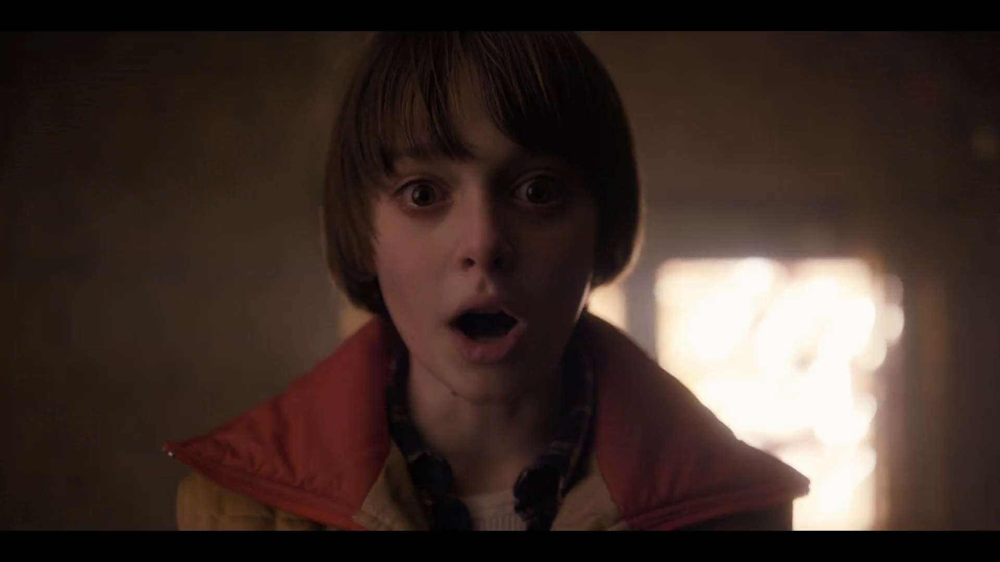

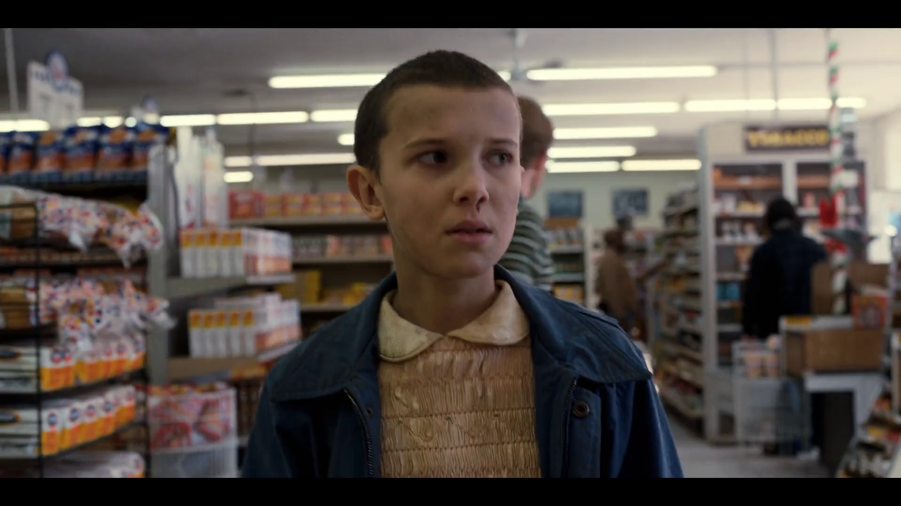

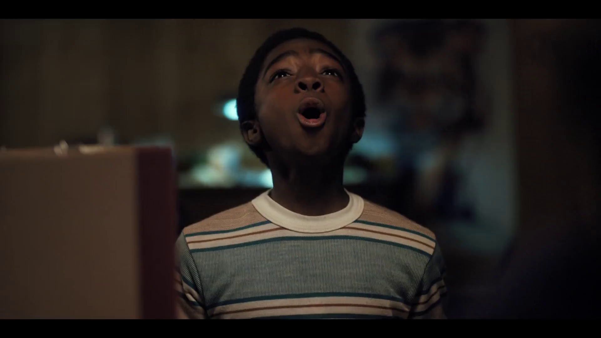

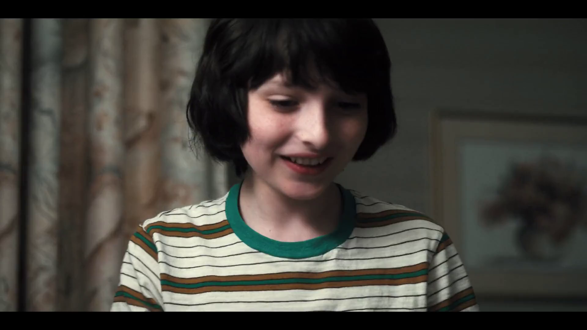
*Frame matches from Stranger Things.*

We tried several approaches, but ultimately what worked well for frame matching was [**instance segmentation**](https://pytorch.org/tutorials/intermediate/torchvision_tutorial.html). The output of segmentation models gives us a pixel mask of which pixels belong to which objects. We take the segmentation output of two different frames, and **compute ****[intersection over union](https://en.wikipedia.org/wiki/Jaccard_index)**** (******IoU******) **between the two. We then rank pairs using IoU and surface high-scoring pairs as candidates.

A few other details were added along the way. To deal with not having to brute force every single pair of frames, we only took the **middle frame** of each shot, since many frames look visually similar within a single shot. To deal with similar frames from different shots, we performed image **deduplication** upfront. In our early research, we simply discarded any mask that wasn’t a person to keep things simple. Later on, we added non-person masks back to be able to find frame match cuts of animals and objects.

*A series of frame match cuts of animals from Our planet.*

*Object frame match from Paddington 2.*

### Action and Motion

At this point, we decided to move onto a second flavor of match cutting: **action matching**. This type of match cut involves the **continuation of motion** of object or person A’s motion to the object or person B’s motion in another shot (A and B can be the same so long as the background, clothing, time of day, or some other attribute changes between the two shots).

*An action match cut from Resident Evil.*

*A series of action mat cuts from Extraction, Red Notice, Sandman, Glow, Arcane, Sea Beast, and Royalteen.*

To capture this type of information, we had to move beyond image level and extend into video understanding, action recognition, and motion. [**Optical flow**](https://github.com/princeton-vl/RAFT) is a common technique used to capture motion, so that’s what we tried first.

Consider the following shots and the corresponding optical flow representations:

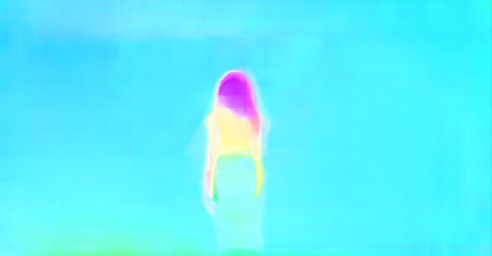
*Shots from The Umbrella Academy.*

A **red pixel** means the pixel is moving to the right. A **blue** **pixel** means the pixel is moving to the left. The **intensity** of the color represents the magnitude of the motion. The optical flow representations on the right show a temporal average of all the frames. While averaging can be a simple way to match the dimensionality of the data for clips of different duration, the downside is that some valuable information is lost.

When we substituted optical flow in as the **shot representations** (replacing instance segmentation masks) and used **cosine similarity** in place of IoU, we found some interesting results.

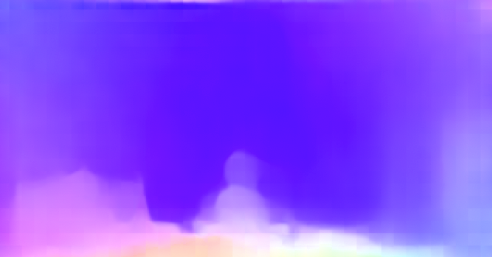

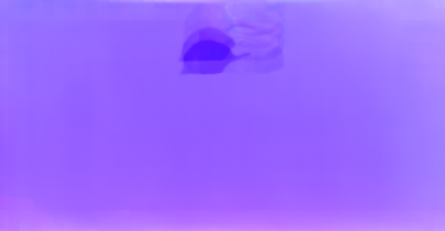
*Shots from The Umbrella Academy.*

We saw that a large percentage of the top matches were actually matching based on similar **camera movement**. In the example above, purple in the optical flow diagram means the pixel is moving up. This wasn’t what we were expecting, but it made sense after we saw the results. For most shots, the number of **background** pixels outnumbers the number of **foreground** pixels. Therefore, it’s not hard to see why a generic similarity metric giving equal weight to each pixel would surface many shots with similar camera movement.

Here are a couple of matches found using this method:

*Camera movement match cut from Bridgerton.*

*Camera movement match cut from Blood & Water.*

While this wasn’t what we were initially looking for, our video editors were **delighted** by this output, so we decided to ship this feature as is.

> Our research into true action matching still remains as future work, where we hope to leverage **action recognition** and foreground**-background segmentation**.

---

## Match cutting system

The two flavors of match cutting we explored share a number of **common components**. We realized that we can break the process of finding matching pairs into **five steps**.

![System diagram for match cutting. The input is a video file (film or series episode) and the output is K match cut candidates of the desired flavor. Each colored square represents a different shot. The original input video is broken into a sequence of shots in step 1. In Step 2, duplicate shots are removed (in this example the fourth shot is removed). In step 3, we compute a representation of each shot depending on the flavor of match cutting that we’re interested in. In step 4 we enumerate all pairs and compute a score for each pair. Finally, in step 5, we sort pairs and extract the top K (e.g. K=3 in this illustration).](../images/d7bd9cd19d9a0986.png)
*System diagram for match cutting. The input is a video file (film or series episode) and the output is K match cut candidates of the desired flavor. Each colored square represents a different shot. The original input video is broken into a sequence of shots in step 1. In Step 2, duplicate shots are removed (in this example the fourth shot is removed). In step 3, we compute a representation of each shot depending on the flavor of match cutting that we’re interested in. In step 4 we enumerate all pairs and compute a score for each pair. Finally, in step 5, we sort pairs and extract the top K (e.g. K=3 in this illustration).*

### 1- Shot segmentation

Movies, or episodes in a series, consist of a number of scenes. **Scenes** typically transpire in a single location and continuous time. Each scene can be one or many shots- where a **shot** is defined as a sequence of frames between two cuts. Shots are a very natural unit for match cutting, and our first task was to segment a movie into shots.

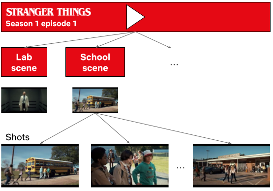
*Stranger Things season 1 episode 1 broken down into scenes and shots.*

Shots are typically a few seconds long, but can be much shorter (less than a second) or minutes long in rare cases. Detecting **shot boundaries** is largely a visual task and very accurate computer vision algorithms have been designed and are available. We used an in-house shot segmentation algorithm, but similar results can be achieved with open source solutions such as [PySceneDetect](http://scenedetect.com/en/latest/) and [TransNet v2](https://arxiv.org/abs/2008.04838).

### 2- Shot deduplication

Our early attempts surfaced many **near-duplicate** shots. Imagine two people having a conversation in a scene. It’s common to cut back and forth as each character delivers a line.

*A dialogue sequence from Stranger Things Season 1.*

These near-duplicate shots are not very interesting for match cutting and we quickly realized that we need to **filter** them out. Given a sequence of shots, we identified groups of near-duplicate shots and only retained the earliest shot from each group.

**Identifying near-duplicate shots**

Given the following pair of shots, how do you determine if the two are near-duplicates?

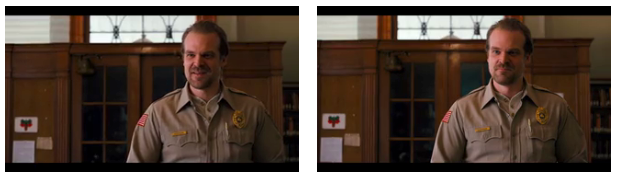
*Near-duplicate shots from Stranger Things.*

You would probably **inspect** the two **visually** and look for differences in colors, presence of characters and objects, poses, and so on. We can use computer vision algorithms to mimic this approach. Given a shot, we can use an algorithm that’s been trained on a large dataset of videos (or images) and can describe it using a vector of numbers.

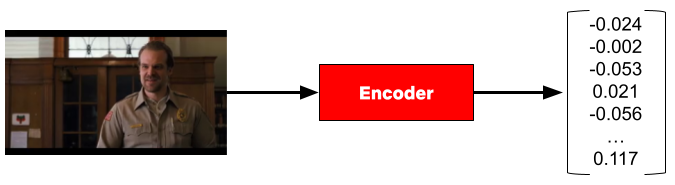
*An encoder represents a shot from Stranger Things using a vector of numbers.*

Given this algorithm (typically called an **encoder** in this context), we can extract a vector (aka **embedding**) for a pair of shots, and compute how similar they are. The vectors that such encoders produce tend to be high dimensional (hundreds or thousands of dimensions).

To build some intuition for this process, let’s look at a contrived example with 2 dimensional vectors.

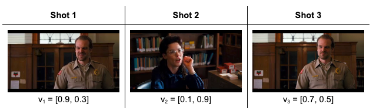
*Three shots from Stranger Things and the corresponding vector representations.*

The following is a depiction of these vectors:

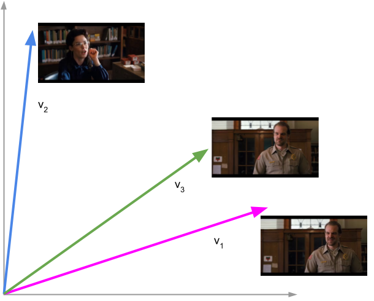
*Shots 1 and 3 are near-duplicates. The vectors representing these shots are close to each other. All shots are from Stranger Things.*

Shots 1 and 3 are near-duplicates and we see that vectors 1 and 3 are close to each other. We can quantify closeness between a pair of vectors using [**cosine similarity**](https://en.wikipedia.org/wiki/Cosine_similarity), which is a value between -1 and 1. Vectors with cosine similarity close to 1 are considered similar.

The following table shows the cosine similarity between pairs of shots:

*Shots 1 and 3 have high cosine similarity (0.96) and are considered near-duplicates while shots 1 and 2 have a smaller cosine similarity value (0.42) and are not considered near-duplicates. Note that the cosine similarity of a vector with itself is 1 (i.e. it’s perfectly similar to itself) and that cosine similarity is commutative. All shots are from Stranger Things.*

This approach helps us to formalize a concrete algorithmic notion of similarity.

### 3- Compute representations

Steps 1 and 2 are agnostic to the flavor of match cutting that we’re interested in finding. This step is meant for capturing the **matching semantics** that we are interested in. As we discussed earlier, for frame match cutting, this can be instance segmentation, and for camera movement, we can use optical flow.

However, there are many other possible options to represent each shot that can help us do the matching. These can be **heuristically** defined ahead of time based on our knowledge of the flavors, or can be **learned** from labeled data.

### 4- Compute pair scores

In this step, we compute a **similarity score** for all pairs. The similarity score function takes a pair of representations and produces a number. The higher this number, the more similar the pairs are deemed to be.

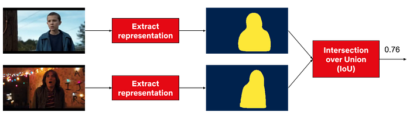
*Steps 3 and 4 for a pair of shots from Stranger Things. In this example the representation is the person instance segmentation mask and the metric is IoU.*

### 5- Extract top-K results

Similar to the first two steps, this step is also agnostic to the flavor. We simply rank pairs by the computed score in step 4, and take the top K (a parameter) pairs to be surfaced to our video editors.

Using this flexible abstraction, we have been able to explore many different options by picking different concrete implementations for steps 3 and 4.

---

## Dataset

How well does this system work? To answer this question, we decided to collect a labeled dataset of approximately **20k labeled pairs**. Each pair was annotated by **3 video editors**. For frame match cutting, the three video editors were in **perfect agreement** (i.e. all three selected the same label) **84%** of the time. For motion match cutting, which is a more nuanced and subjective task, perfect agreement was **75%**.

We then took the **majority label** for each pair and used it to evaluate our model.

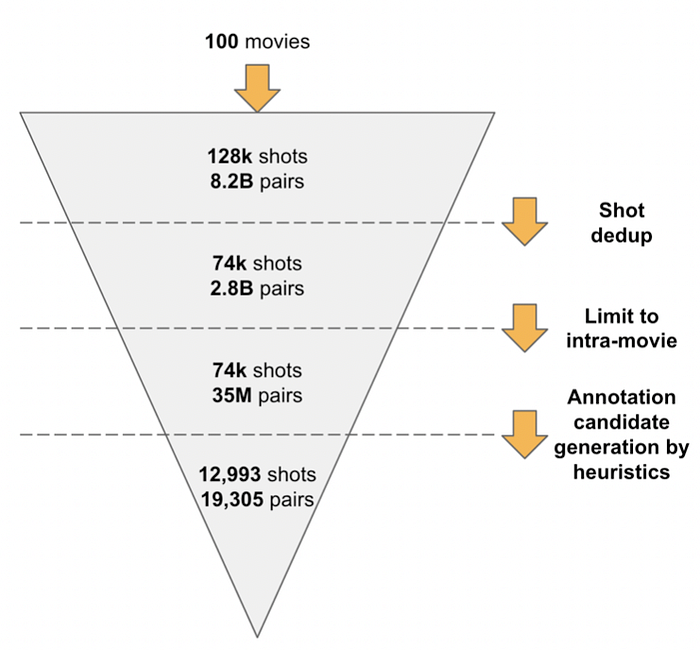
*We started with 100 movies, which produced 128k shots and 8.2 billion unique pairs. This diagram depicts the process of reducing this set down to the final set of 19,305 pairs that were annotated.*

---

## Evaluation

### Binary classification with frozen embeddings

With the above dataset with binary labels, we are armed to train our first model. We extracted **fixed embeddings** from a variety of image, video, and audio **encoders** (a model or algorithm that extracts a representation given a video clip) for each pair and then aggregated the results into a single feature vector to learn a classifier on top of.

*We extracted fixed embeddings using the same encoder for each shot. Then we aggregated the embeddings and passed the aggregation results to a classification model.*

We surface top ranking pairs to video editors. A high quality match cutting system places match cuts at the top of the list by producing higher scores. We used [**Average Precision**](https://en.wikipedia.org/wiki/Evaluation_measures_(information_retrieval)#Average_precision)** (AP)** as our evaluation metric. AP is an information retrieval metric that is suitable for ranking scenarios such as ours. AP ranges between 0 and 1, where higher values reflect a higher quality model.

The following table summarizes our results:

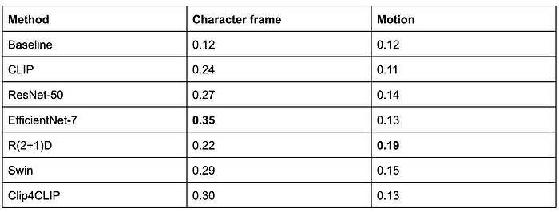
*Reporting AP on the test set. Baseline is a random ranking of the pairs, which for AP is equivalent to the positive prevalence of each task in expectation.*

[EfficientNet7](https://arxiv.org/abs/1905.11946) and [R(2+1)D](https://arxiv.org/abs/1711.11248v3) perform best for frame and motion respectively.

### Metric learning

A second approach we considered was [metric learning](https://en.wikipedia.org/wiki/Similarity_learning#Metric_learning). This approach gives us transformed embeddings which can be indexed and retrieved using Approximate Nearest Neighbor ([ANN](https://en.wikipedia.org/wiki/Nearest_neighbor_search#Approximation_methods)) methods.

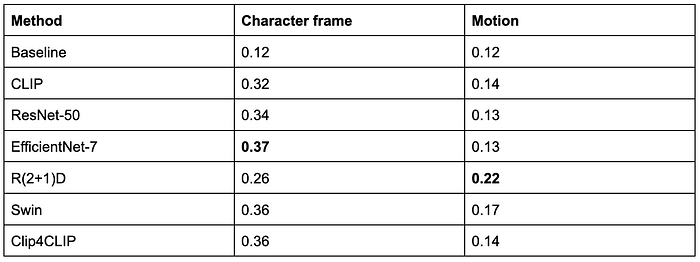
*Reporting AP on the test set. Baseline is a random ranking of the pairs similar to the previous section.*

> Leveraging ANN, we have been able to find matches across hundreds of shows (on the order of tens of millions of shots) in seconds.

You can find more technical details in our **WACV 2023 paper **[here](https://openaccess.thecvf.com/content/WACV2023/html/Chen_Match_Cutting_Finding_Cuts_With_Smooth_Visual_Transitions_WACV_2023_paper.html).

## Conclusion

There are many more ideas that have yet to be tried: other types of match cuts such as **action**, **light**, **color**, and **sound**, better representations, and end-to-end model training, just to name a few.

*Match cuts from Partner Track.*

*An action match cut from Lost In Space and Cowboy Bebop.*

*A series of match cuts from 1899.*

We’ve only scratched the surface of this work and will continue to build tools like this to empower our creatives. If this type of work interests you, we are always looking for collaboration opportunities and hiring great [machine learning](https://jobs.netflix.com/search?q=%22machine+learning%22) engineers, researchers, and [interns](https://jobs.netflix.com/jobs/234882269) to help build exciting tools.

We’ll leave you with this teaser for Firefly Lane, edited by [Aly Parmelee](http://www.alyparmelee.com/), which was the first piece made with the help of the match cutting tool:

_Special thanks to _[_Anna Pulido_](https://www.linkedin.com/in/anna-pulido-61025063/)_, _[_Luca Aldag_](https://www.linkedin.com/in/luca-aldag/)_, _[_Shaun Wright_](https://www.linkedin.com/in/shaun-wright-28b74248/)_ , _[_Sarah Soquel Morhaim_](https://www.linkedin.com/in/sarah-soquel-morhaim-3875831a3/)

---
**Tags:** Machine Learning · Computer Vision · Video Editing
