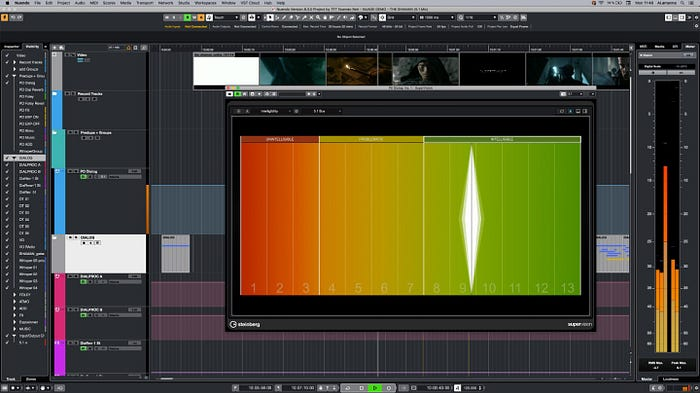
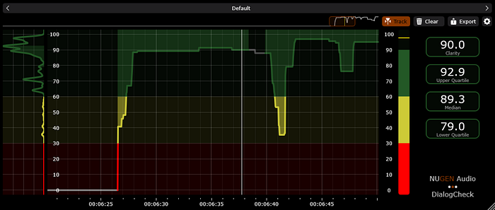

# Measuring Dialogue Intelligibility for Netflix Content

_Enhancing Member Experience Through Strategic Collaboration_

[Ozzie Sutherland](https://www.linkedin.com/in/ozziesutherland/), [Iroro Orife](https://www.linkedin.com/in/iroroorife/), [Chih-Wei Wu](https://www.linkedin.com/in/chih-wei-wu-73081689/), [Bhanu Srikanth](https://www.linkedin.com/in/bhanusrikanth/)

At Netflix, delivering the best possible experience for our members is at the heart of everything we do, and we know we can’t do it alone. That’s why we work closely with a diverse ecosystem of technology partners, combining their deep expertise with our creative and operational insights. Together, we explore new ideas, develop practical tools, and push technical boundaries in service of storytelling. This collaboration not only empowers the talented creatives working on our shows with better tools to bring their vision to life, but also helps us innovate in service of our members. By building these partnerships on trust, transparency, and shared purpose, we’re able to move faster and more meaningfully, always with the goal of making our stories more immersive, accessible, and enjoyable for audiences everywhere. One area where this collaboration is making a meaningful impact is in improving dialogue intelligibility, from set to screen. We call this the Dialogue Integrity Pipeline.

### Dialogue Integrity Pipeline

We’ve all been there, settling in for a night of entertainment, only to find ourselves straining to catch what was just said on screen. You’re wrapped up in the story, totally invested, when suddenly a key line of dialogue vanishes into thin air. “Wait, what did they say? I can’t understand the dialogue! What just happened?”

You may pick up the remote and rewind, turn up the volume, or try to stay with it and hope this doesn’t happen again. Creating sophisticated, modern series and films requires an incredible artistic & technical effort. At Netflix, we strive to ensure those great stories are easy for the audience to enjoy. Dialogue intelligibility can break down at multiple points in what we call the **Dialogue Integrity Pipeline**, the journey from on-set capture to final playback at home. Many facets of the process can contribute to dialogue that’s difficult to understand:

- Naturalistic acting styles, diverse speech patterns, and accents
- Noisy locations, microphone placement problems on set
- Cinematic (high dynamic range) mixing styles, excessive dialogue processing, substandard equipment
- Audio compromises through the distribution pipeline
- TVs with inadequate speakers, noisy home environments

Addressing these issues is critical to maintaining the standard of excellence our content deserves.

### Measurement at Scale

Netflix utilizes industry-standard loudness meters to measure content and its adherence to our core loudness specifications. This tool also provides feedback on audio dynamic range (loud to soft) which impacts dialogue intelligibility. The Audio Algorithms team at Netflix wanted to take these measurements further and develop a holistic understanding of dialogue intelligibility throughout the runtime of a given title.

The team developed a Speech Intelligibility measurement system based on the Short-time Objective Intelligibility (STOI) metric [[Taal et al.](https://www.researchgate.net/profile/Cees-Taal/publication/224219052_An_Algorithm_for_Intelligibility_Prediction_of_Time-Frequency_Weighted_Noisy_Speech/links/0deec51da9fbbc5eea000000/An-Algorithm-for-Intelligibility-Prediction-of-Time-Frequency-Weighted-Noisy-Speech.pdf) (IEEE _Transactions on Audio, Speech, and Language Processing_)]. Firstly, a speech activity detector analyses the dialogue stem to render speech utterances, which are then compared to non-speech sounds in the mix, typically Music and Effects. Then the system calculates the Signal-to-Noise ratio, in each speech frequency band, the results of which are summarized succinctly, per-utterance on the range [0, 1.0], to quantify the degree to which competing Music and Effects can distract the listener.

![This chart shows how eSTOI (extended Short-Time Objective Intelligibility) method measures dialogue (fg [foreground] stem in the graphic) against non-speech (bg [background] stem in the graphic) to judge intelligibility based on competing non-speech sound.](../images/b79e931e01d13062.png)
*This chart shows how eSTOI (extended Short-Time Objective Intelligibility) method measures dialogue (fg [foreground] stem in the graphic) against non-speech (bg [background] stem in the graphic) to judge intelligibility based on competing non-speech sound.*

### Optimizing Dialogue Prior to Delivery

Understanding dialogue intelligibility across Netflix titles is invaluable, but our mission goes beyond analysis — we strive to empower creators with the tools to craft mixes that resonate seamlessly with audiences at home.

Seeing the lack of dedicated Dialogue Intelligibility Meter plugins for Digital Audio Workstations, we teamed up with industry leaders, Fraunhofer Institute for Digital Media Technology IDMT (Fraunhofer IDMT) and Nugen Audio to pioneer a solution that enhances creative control and ensures crystal-clear dialogue from mix to final delivery.

We collaborated with Fraunhofer IDMT to adapt their machine-learning-based speech intelligibility solution for cross-platform plugin standards and brought in Nugen Audio to develop DAW-compatible plugins.

### Fraunhofer IDMT

The Fraunhofer Department of Hearing, Speech, and Audio Technology HSA has done significant research and development on media processing tools that measure speech intelligibility. In 2020, the machine learning-based method was integrated into Steinberg’s Nuendo Digital Audio Workstation. We approached the Fraunhofer engineering team with a collaboration proposal to make their technology accessible to other audio workstations through the cross-platform VST (Virtual Studio Technology) and AAX (Avid Audio Extension) plugin standards. The scientists were keen on the project and provided their dialogue intelligibility library.

*The Fraunhofer IDMT Dialogue Intelligibility Meter integrated into the Steinberg Nuendo Digital Audio Workstation.*

### Nugen Audio

Nugen Audio created the VisLM plugin to provide sound teams with an efficient and accurate way to measure mixes for conformance to traditional broadcast & streaming specifications — Full Mix Loudness, Dialogue Loudness, and True Peak. Since then, VisLM has become a widely used tool throughout the global post-production industry. Nugen Audio partnered with Fraunhofer, integrating the Fraunhofer IDMT Dialogue Intelligibility libraries into a new industry-first tool — Nugen DialogCheck. This tool gives **re-recording mixers** real-time insights, helping them adjust dialogue clarity at the most crucial points in the mixing process, ensuring every word is clear and understood.

### Clearer Dialogue Through Collaboration

Crafting crystal-clear dialogue isn’t just a technical challenge — it’s an art that requires continuous innovation and strong industry collaboration. To empower creators, Netflix and its partners are embedding advanced intelligibility measurement tools directly into DAWs, giving sound teams the ability to:

- Detect and resolve dialogue clarity issues early in the mix.
- Fine-tune speech intelligibility **without compromising artistic intent**.
- Deliver immersive, accessible storytelling to every viewer, in any listening environment.

At Netflix, we’re committed to pushing the boundaries of audio excellence, from innovating scaled intelligibility measurements to collaborating with Fraunhofer and Nugen Audio on cutting-edge tools like the DialogCheck Plugin, we’re setting a new standard for dialogue clarity — ensuring every word is heard exactly as creators intended. But innovation doesn’t happen in isolation. By working together with our partners, we can continue to push the limits of what’s possible, fueling creativity and driving the future of storytelling.

Finally, we’d like to extend a heartfelt thanks to Scott Kramer for his contributions to this initiative.

---
**Tags:** Dialogue · Intelligibility
