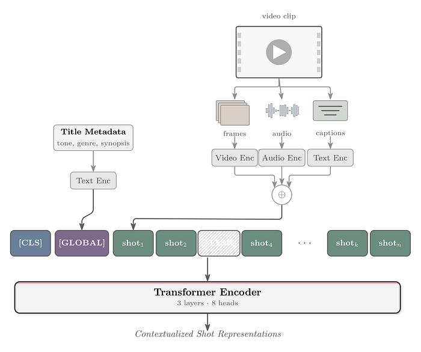
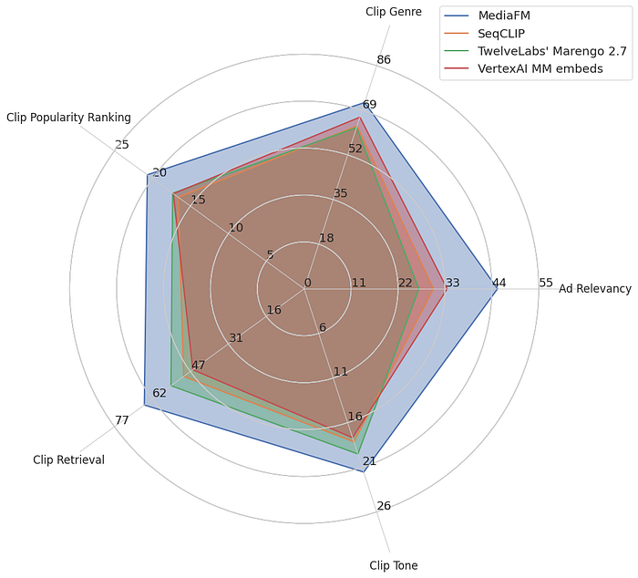
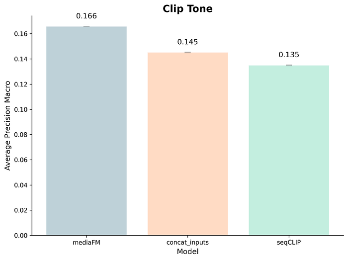
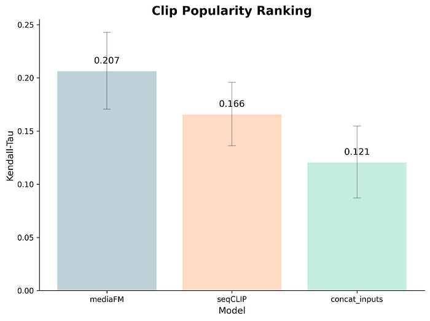
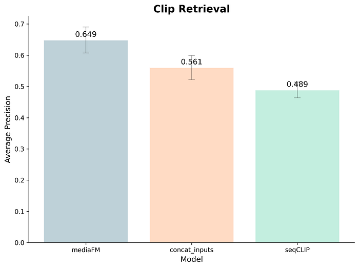

# MediaFM: The Multimodal AI Foundation for Media Understanding at Netflix

[Avneesh Saluja](https://www.linkedin.com/in/avneesh/), [Santiago Castro](https://www.linkedin.com/in/santiagocastroserra/), [Bowei Yan](https://www.linkedin.com/in/bowei-yan-0080a326/), [Ashish Rastogi](https://www.linkedin.com/in/ashish-rastogi-11362a/)

### Introduction

Netflix’s core mission is to connect millions of members around the world with stories they’ll love. This requires not just an incredible catalog, but also a deep, machine-level understanding of every piece of content in that catalog, from the biggest blockbusters to the most niche documentaries. As we onboard new types of content such as live events and podcasts, the need to scalably understand these nuances becomes even more critical to our productions and member-facing experiences.

Many of these media-related tasks require sophisticated long-form video understanding e.g., identifying subtle narrative dependencies and emotional arcs that span entire episodes or films. [Previous work](./detecting-scene-changes-in-audiovisual-content-77a61d3eaad6.md) has found that to truly grasp the content’s essence, our models must leverage the full multimodal signal. For example, the audio soundtrack is a crucial, non-visual modality that can help more precisely identify clip-level tones or when a new scene starts. Can we use our collection of shows and movies to learn how to **a) fuse modalities like audio, video, and subtitle text together and b) develop robust representations that leverage the narrative structure that is present in long form entertainment?** Consisting of tens of millions of individual [shots](https://en.wikipedia.org/wiki/Shot_(filmmaking)) across multiple titles, our diverse yet entertainment-specific dataset provides the perfect foundation to train multimodal media understanding models that enable many capabilities across the company such as [ads relevancy, clip popularity prediction, and clip tagging](./mediafm-the-multimodal-ai-foundation-for-media-understanding-at-netflix-e8c28df82e2d.md).

For these reasons, we developed the **Netflix Media Foundational Model (MediaFM)**, our new, in-house, multimodal content embedding model. MediaFM is the first tri-modal (audio, video, text) model pretrained on portions of the Netflix catalog. Its core is a multimodal, Transformer-based encoder designed to generate rich, contextual embeddings¹ for shots from our catalog by learning the temporal relationships between them through integrating visual, audio, and textual information. The resulting shot-level embeddings are powerful representations designed to create a deeper, more nuanced, and machine-readable understanding of our content, providing the critical backbone for effective cold start of newly launching titles in recommendations, optimized promotional assets (like art and trailers), and internal content analysis tools.

*Figure 1: MediaFM Architecture*

### Input Representation & Preprocessing

The model’s fundamental unit of input is a shot, derived by segmenting a movie or episode (collectively referred to as “title”) using a [shot boundary detection](https://arxiv.org/abs/2008.04838) algorithm. For each shot, we generate three distinct embeddings from its core modalities:

- **Video**: an internal model called [SeqCLIP](./building-in-video-search-936766f0017c.md) (a CLIP-style model fine-tuned on video retrieval datasets) is used to embed frames sampled at uniform intervals from segmented shots
- **Audio**: the audio samples from the same shots are embedded using Meta FAIR’s [wav2vec2](https://arxiv.org/abs/2006.11477)
- **Timed Text**: OpenAI’s `text-embedding-3-large` [model](https://openai.com/index/new-embedding-models-and-api-updates/) is used to encode the corresponding timed text (e.g., closed captions, audio descriptions, or subtitles) for each shot

For each shot, the three embeddings² are concatenated and unit-normed to form a single 2304-dimensional fused embedding vector. The transformer encoder is trained on sequences of shots, so each example in our dataset is a temporally-ordered sequence of these fused embeddings from the same movie or episode (up to 512 shots per sequence). We also have access to title-level metadata which is used to provide global context for each sequence (via the `[GLOBAL]`token). The title-level embedding is computed by passing title-level metadata (such as synopses and tags) through the `text-embedding-3-large` model.

### Model Architecture and Training Objective

The core of our model is a transformer encoder, architecturally similar to BERT. A sequence of preprocessed shot embeddings is passed through the following stages:

1. **Input Projection**: The fused shot embeddings are first projected down to the model’s hidden dimension via a linear layer.
2. **Sequence Construction & Special Tokens**: Before entering the Transformer, two special embeddings are prepended to the sequence:  
• a learnable `[CLS]` embedding is added at the very beginning.  
• the title-level embedding is projected to the model’s hidden dimension and inserted after the `[CLS]` token as the `[GLOBAL]` token, providing title-level context to every shot in the sequence and participating in the self-attention process.
3. **Contextualization**: The sequence is enhanced with positional embeddings and fed through the Transformer stack to provide shot representations based on their surrounding context.
4. **Output Projection**: The contextualized hidden states from the Transformer are passed through a final linear layer, projecting them from the hidden layers back up to the 2304-dimensional fused embedding space for prediction.

We train the model using a **Masked Shot Modeling (MSM)** objective. In this self-supervised task, we randomly mask 20% of the input shot embeddings in each sequence by replacing them with a learnable `[MASK]` embedding. The model’s objective is to predict the original, unmasked fused embedding for these masked positions. The model is optimized by minimizing the **cosine distance** between its predicted embedding and the ground-truth embedding for each masked shot.

We optimized the hidden parameters with Muon and the remaining parameters with AdamW. It’s worth noting that the switch to Muon resulted in noticeable improvements.

### Evaluation

To evaluate the learned embeddings, we learn task-specific linear layers on top of frozen representations (i.e., linear probes). Most of the tasks are clip-level, i.e., each example is a short clip ranging from a few seconds to a minute which are often presented to our members while recommending a title to them. When embedding these clips, we find that “embedding in context”, namely extracting the embeddings from within a larger sequence (e.g., the episode containing the clip), naturally does much better than embedding only the shots from a clip.

### Tasks

Our embeddings are foundational and we find that they bring value to applications across Netflix. Here are a few:

- **Ad Relevancy:** A multilabel classification task to categorize Netflix clips for relevant ad placement, measured by **Average Precision**. In this task, these representations operate at the retrieval stage, where they help in identifying the candidate set and in turn are fed into the ad serving system for relevance optimization.
- **Clip Popularity Ranking:** A ranking task to predict the relative performance (in click-through rate, [CTR](https://en.wikipedia.org/wiki/Click-through_rate)) of a media clip relative to other clips from that show or movie, measured by a ten-fold with **Kendall’s tau correlation coefficient**.
- **Clip Tone:** A multi-label classification of hook clips into 100 tone categories (e.g., creepy, scary, humorous) from our internal Metadata & Ratings team, measured by **micro Average Precision **(averaged across tone categories).
- **Clip Genre:** A multi-label classification of clips into eleven core genres (Action, Anime, Comedy, Documentary, Drama, Fantasy, Horror, Kids, Romance, Sci-fi, Thriller) derived from the genre of the parent title, measured by **macro Average Precision **(averaged across genres).
- **Clip Retrieval: **a binary classification of clips from movies or episodes into “clip-worthy” (i.e., a good clip to showcase the title) or not, as determined by human annotators, and as measured by **Average Precision**. The positive to negative clip ratio is 1:3, and for each title we select 6–10 positive clips and the corresponding number of negatives.

It’s worth noting that for the tasks above (as well as other tasks that use our model), the model outputs are utilized as information that the relevant teams use when driving to a decision rather than being used in a completely end-to-end fashion. Many of the improvements are also in various stages of deployment.

### Results

Figure 2³ compares MediaFM to several strong baselines:

- The previously mentioned SeqCLIP, which also provides the video embedding input for MediaFM
- Google’s [VertexAI multimodal embeddings](https://docs.cloud.google.com/vertex-ai/generative-ai/docs/embeddings/get-multimodal-embeddings)
- TwelveLabs’ [Marengo 2.7 embeddings](https://www.twelvelabs.io/blog/introducing-marengo-2-7)

*Figure 2: Performance of MediaFM vs. external and internal models.*

On all tasks, MediaFM is better than the baselines. Improvements seem to be larger for tasks that require more detailed narrative understanding e.g., predicting the most relevant ads for an ad break given the surrounding context. We look further into this next.

### Ablations

MediaFM’s primary improvements over previous Netflix work stem from two key areas: combining multiple modalities and learning to contextualize shot representations. To determine the contribution of each factor across different tasks, we compared MediaFM to a baseline. This baseline concatenates the three input embeddings, essentially providing the same complete, shot-level input as MediaFM but without the contextualization step. This comparison allows us to isolate which tasks benefit most from the contextualization aspect.

Additional modalities help somewhat for tone but the main improvement comes from contextualization.

Oddly, multiple uncontextualized modalities **hurts **the clip popularity ranking model, but adding contextualization significantly improves performance.

For clip retrieval we see a natural progression of around 15% for each improvement.

### Next Steps

MediaFM presents a way to learn how to fuse and/or contextualize shot-level information by leveraging Netflix’s catalog in a self-supervised manner. With this perspective, we are actively investigating how pretrained multimodal (audio, video/image, text) LLMs like [Qwen3-Omni](https://qwen.ai/blog?id=65f766fc2dcba7905c1cb69cc4cab90e94126bf4&from=research.latest-advancements-list), where the modality fusion has already been learned, can provide an even stronger starting point for subsequent model generations.

Next in this series of blog posts, we will present our method to embed title-level metadata and adapt it to our needs. Stay tuned!

### Footnotes

1. We chose embeddings over generative text outputs to prioritize modular design. This provides a tighter, cleaner abstraction layer: we generate the representation once, and it is consumed across our entire suite of services. This avoids the architectural fragility of fine-tuning, allowing us to enhance our existing embedding-based workflows with new modalities more flexibly.
2. All of our data has audio and video; we zero-pad for missing timed text data, which is relatively likely to occur (e.g., in shots without dialogue).
3. The title-level tasks couldn’t be evaluated with the VertexAI MM and Marengo embedding models as the videos exceed the length limit set by the APIs.

### Acknowledgements

We would like to thank [Matt Thanabalan](https://www.linkedin.com/in/matt-t-58b99948/) and [Chaitanya Ekanadham](https://www.linkedin.com/in/chaitue/) for their contributions to this work.

---
**Tags:** Artificial Intelligence · Machine Learning · Multimodal · Foundation Models · Media
