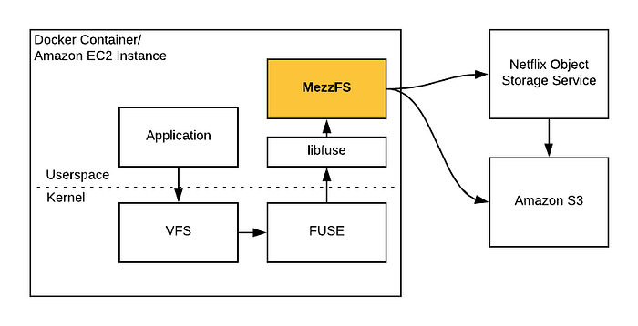
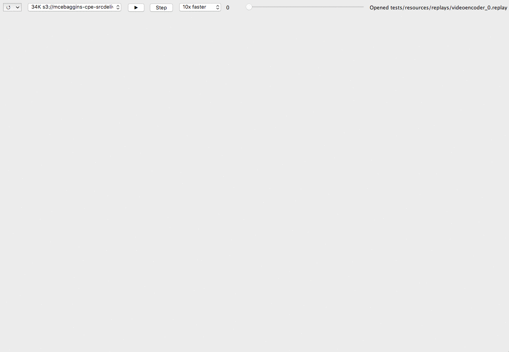
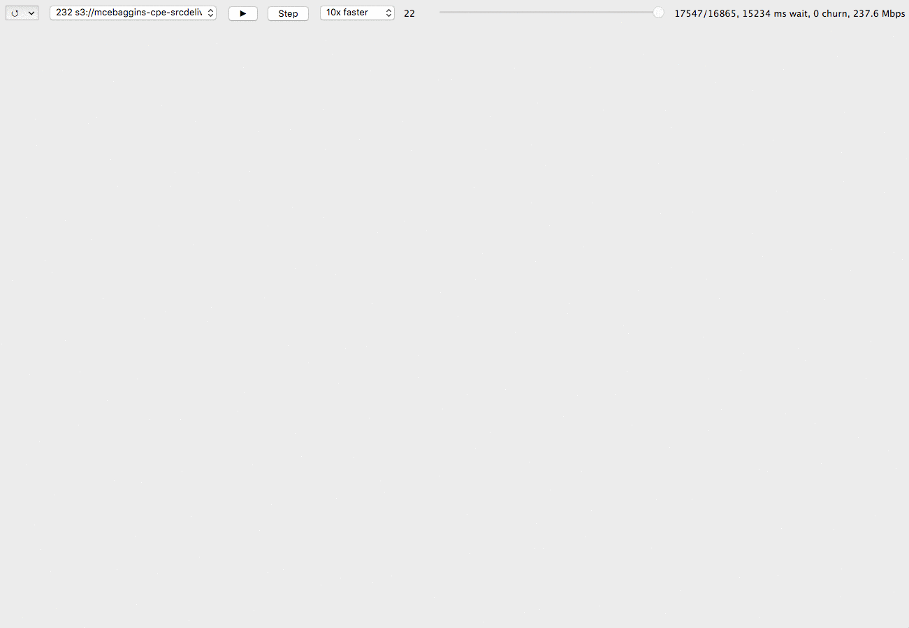
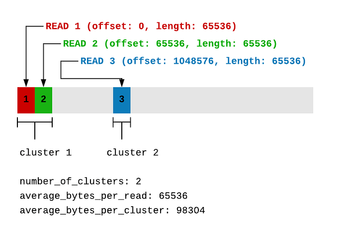

# MezzFS — Mounting object storage in Netflix’s media processing platform

_By _[_Barak Alon_](https://www.linkedin.com/in/barakalon/)_ (on behalf of Netflix’s Media Cloud Engineering team)_

MezzFS (short for “Mezzanine File System”) is a tool we’ve developed at Netflix that [mounts](https://en.wikipedia.org/wiki/Mount_(computing)) [cloud objects](https://en.wikipedia.org/wiki/Object_storage) as local files via [FUSE](https://en.wikipedia.org/wiki/Filesystem_in_Userspace). It’s used extensively in our media processing platform, which includes services like [Archer](https://medium.com/netflix-techblog/simplifying-media-innovation-at-netflix-with-archer-3f8cbb0e2bcb) and runs features like [video encoding](https://medium.com/netflix-techblog/high-quality-video-encoding-at-scale-d159db052746) and [title image generation](https://medium.com/netflix-techblog/extracting-image-metadata-at-scale-c89c60a2b9d2) on tens of thousands of [Amazon EC2](https://aws.amazon.com/ec2/) instances. There are similar tools out there, but we’ve developed some unique features like “replays” and “adaptive buffering” that we think are worth sharing.

## What problem are we solving?

We are [constantly innovating](https://medium.com/netflix-techblog/tagged/video-encoding) on video encoding technology at Netflix, and we have a lot of content to encode. Video encoding is what MezzFS was originally designed for and remains one of its canonical use cases, so we’ll focus on video encoding to describe the problem that MezzFS solves.

Video encoding is the process of converting an uncompressed video into a compressed format defined by a [codec](https://en.wikipedia.org/wiki/Video_codec), and it’s an essential part of preparing content to be streamed on Netflix. A single movie at Netflix might be encoded dozens of times for different codecs and video resolutions. Encoding is not a one-time process — large portions of the entire Netflix catalog are re-encoded whenever we’ve made significant advancements in encoding technology.

We scale out video encoding by processing segments of an uncompressed video ([we segment movies by scene](https://medium.com/netflix-techblog/optimized-shot-based-encodes-now-streaming-4b9464204830)) in parallel. We have one file — the original, raw movie file — and many worker processes, all encoding different segments of the file. That file is stored in our object storage service, which splits and encrypts the file into separate chunks, storing the chunks in Amazon S3. This object storage service also handles content security, auditing, disaster recovery, and more.

The individual video encoders process their segments of the movie with tools like [FFmpeg](https://www.ffmpeg.org/), which doesn’t speak our object storage service’s API and expects to deal with a file on the local filesystem. Furthermore, the movie file is very large (often several 100s of GB), and we want to avoid downloading the entire file for each individual video encoder that might be processing only a small segment of the whole movie.

This is just one of many use cases that MezzFS supports, but all the use cases share a similar theme: stream the right bits of a remote object efficiently and expose those bits as a file on the filesystem.

## The solution: MezzFS

MezzFS is a Python application that implements the FUSE interface. It’s built as a Debian package and installed by applications running on our media processing platform, which use MezzFS’s command line interface to mount remote objects as local files.

MezzFS has a number of features, including:

- **Stream objects** —** **MezzFS exposes multi-terabyte objects without requiring any disk space.
- **Assemble and decrypt parts **— Our object storage service splits objects into many parts and stores them in S3. MezzFS knows how to assemble and decrypt the parts.
- **Mount multiple objects **—** **Multiple cloud objects can be mounted on the local filesystem simultaneously.
- **Disk Caching **—** **MezzFS can be configured to cache objects on the local disk.
- **Mount ranges of objects **—** **Arbitrary ranges of a cloud object can be mounted as separate files on the local file system. This is particularly useful in media computing, where it is common to mount the frames of a movie scene as separate files.
- **Regional caching **— Netflix operates in multiple AWS regions. If an application in region A is using MezzFS to read from an object stored in region B, MezzFS will cache the object in region A. In addition to improving download speed, this is useful for cutting down on cross-region transfer costs when many workers will be processing the same data — we only pay the transfer costs for one worker, and the rest use the cached object.
- **Replays **— More on this below…
- **Adaptive buffering** — More on this below…

We’ve been using MezzFS in production for 5 years, and have validated it at scale — during a typical week at Netflix, MezzFS performs ~100 million mounts for dozens of different use cases and streams about ~25 petabytes of data.

## MezzFS “replays”

MezzFS has become a crucial tool for us, and we don’t just send it out into the wild with a packed lunch and hope it will be fine.

MezzFS collects metrics on data throughput, download efficiency, resource usage, etc. in [Atlas](https://github.com/Netflix/atlas), Netflix’s in-memory dimensional time series database. Its logs are collected in an [ELK](https://www.elastic.co/elk-stack) stack. But one of the more novel tools we’ve developed for debugging and developing is the MezzFS “replay”.

At mount time, MezzFS can be configured to record a “replay” file. This file includes:

1. **Metadata** — This includes: the remote objects that were mounted, the environment in which MezzFS is running, etc.
2. **File operations** — All “open” and “read” operations. That is, all mounted files that were opened and every single byte range read that MezzFS received.
3. **Actions** — MezzFS records everything it buffers and everything it caches
4. **Statistics** — Finally, MezzFS will record various statistics about the mount, including: total bytes downloaded, total bytes read, total time spent reading, etc.

A single replay may include million of file operations, so these files are packed in a custom binary format to **minimize** their footprint.

Based on these replay files, we’ve built tools that:

### Visualize a replay

This has proven very useful for quickly gaining insight into data access patterns and why they might be causing performance issues.

Here’s a GIF of what these visualization look like:

*Visualization of a MezzFS “replay”*

The bytes of a remote object are represented by pixels on the screen, where the top left is the start of the remote object and the bottom right is the end. The different colors mean different things — green means the bytes have been scheduled for downloading, yellow means the bytes are being actively downloaded, blue means the bytes have been successfully returned, etc. What we see in the above visualization is a very simple access pattern — a remote object is mounted and then streamed through sequentially.

Here is a more interesting, “sparse” access pattern, and one that inspired “adaptive buffering” described later in this post. We can see lots of little green bars quickly sprinkle the screen — these bars represent the bytes that were downloaded:

*Visualization of a sparse MezzFS “replay”*

### Rerun a replay

We mount the same objects and rerun all of the operations recorded in the replay file. We use this to debug errors and performance issues in specific mounts.

### Rerun a batch of replays

We collect replays from actual MezzFS mounts in production, and we rerun large batches of replays for regression and performance tests. We’ve integrated these tests into our build pipeline, where a build will fail if there are any errors across the gamut of replays or if the performance of a new MezzFS commit falls below some threshold. We parallelize rerun jobs with [Titus](https://netflix.github.io/titus/), Netflix’s container management platform, which allows us to exercise many hundreds of replay files in minutes. The results are aggregated in [Elasticsearch](https://www.elastic.co/), allowing us to quickly analyze MezzFS’s performance across the entire batch.

## Adaptive Buffering

These replays have proven essential for developing optimizations like “adaptive buffering”.

One of the challenges of efficiently streaming bits in a FUSE system is that the kernel will break reads into chunks. This means that if an application reads, for example, 1 GB from a mounted file, MezzFS might receive that as 16,384 consecutive reads of 64KB. Making 16,384 separate HTTP calls to S3 for 64KB will suffer significant overhead, so it’s better to “read ahead” larger chunks of data from S3, speeding up subsequent reads by anticipating that the data will be read sequentially. We call the size of the chunks being read ahead the “buffer size”.

While large buffer sizes speed up sequential data access, they can _slow down_ “sparse” data access — that is, the application is not reading through the file consecutively, but is reading small segments dispersed throughout the file (as shown in the visualization above). In this scenario, most of the buffered data isn’t actually going to be used, leading to a lot of unnecessary downloading and very slow reads.

One option is to expect applications to specify a buffer size when mounting with MezzFS. This is not always easy for application developers to do, since applications might be using third party tools and developers might not actually know their access pattern. It gets even messier when an application changes access patterns during a single MezzFS mount.

With “adaptive buffering,” we aimed to make MezzFS “just work” for a variety of access patterns, without requiring application developers to maintain MezzFS configuration.

### How it works

MezzFS records a sliding window of the most recent reads. When it receives a read for data that has not already been buffered, it calculates an appropriate buffer size. It does this by first grouping the window of reads into “clusters”, where a cluster is a contiguous set of reads.

Here’s an illustration of how reads relate to clusters:

If the average number of bytes per read divided by the average number of bytes per cluster is close to 1, we classify the access pattern as “sparse”. In the “sparse” case, we try to match the buffer size to the average number of bytes per read. If number is closer to 0, we classify the access pattern as “dense”, and we set the buffer size to the maximum allowed buffer size divided by the number of clusters (We divide by the number of clusters to account for a common case when an application might have multiple threads all reading different parts from the same file, but each thread is reading its part “densely.” If we used the maximum allowed buffer size for each thread, our buffers would consume too much memory).

Here’s an attempt to represent this logic with some pseudo code:

There is a limit on the throughput you can get out of a single HTTP connection to S3. So when the calculated buffer size is large, we divide the buffer into separate requests and parallelize them across multiple threads. So for “sparse” access patterns we improve performance by choosing a small buffer size, and for “dense” access patterns we improve performance by buffering lots of data in parallel.

### How much faster is this?

We’ve been using adaptive buffering in production across a number of different use cases. For the purpose of clarity in demonstration, we used the “rerun a batch of replays” technique described above to run a quick and dirty test comparing the old buffering technique against the new.

Two replay files that represent two canonical access patterns were used:

1. **Dense/Sequential** — Sequentially read 1GB from a remote object.
2. **Sparse/Random** — Read 32MB in chunks of 64KB, dispersed randomly throughout a remote object.

And we compared two buffering strategies:

1. **Fixed Sized Buffering**— This is the old technique, where the buffer size is fixed at 8MB (we chose 8MB as a “one-size-fits-all” buffer size after running some experiments across MezzFS use cases at the time).
2. **Adaptive Buffering**— The shiny new technique described above.

We ran each combination of replay file and buffering strategy 10 times each inside containers with 2 Gbps network and 16 CPUs, recording the total time to process all the operations in the replay files. The following table represents the _minimum _of all 10 runs (while mean and standard deviation often seem like good aggregations, we use minimum here because variability is often caused by other processes interrupting MezzFS, or variability in network conditions outside of MezzFS’s control).

Looking at the dense/sequential replay, fixed buffering has a throughput of ~0.5 Gbps, while adaptive buffering has a throughput of ~1.1Gbps.

While a handful of seconds might not seem worth all the trouble, these seconds become hours for many of our use cases that stream significantly more bytes. And shaving off hours is especially beneficial in latency sensitive workflows, like encoding videos that are released on Netflix the day they are shot.

## Conclusion

MezzFS has become a core part of our media transformation and innovation platform. We’ve built some pretty fancy tools around it that we’re actively using to quickly and confidently develop new features and optimizations.

The next big feature on our roadmap is support for writes, which has exciting potential for our next generation media processing platform and our growing, global network of movie production studios.

---

_Netflix’s media processing platform is maintained by the Media Cloud Engineering (MCE) team. If you’re excited about large-scale distributed computing problems in media processing, _[_we’re hiring_](https://jobs.netflix.com/search?q=%22media+cloud+engineering%22+or+%22content+engineering%22)_!_

---
**Tags:** Distributed Systems · Python · Algorithms · Video Encoding · Amazon S3
