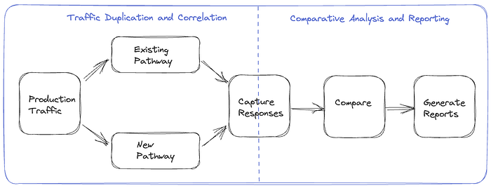
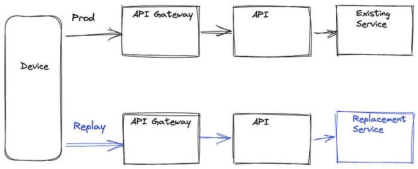
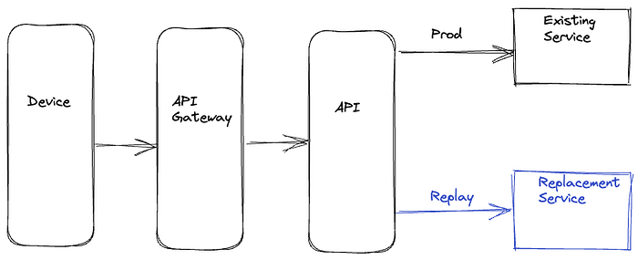
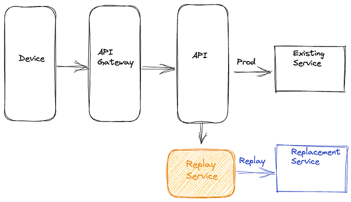
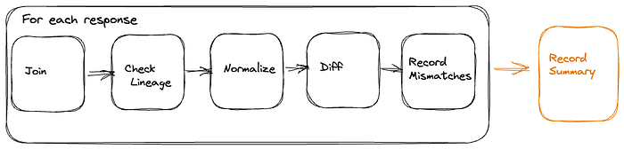

# Migrating Critical Traffic At Scale with No Downtime — Part 1

[Shyam Gala](https://www.linkedin.com/in/shyam-gala-5891224/), [Javier Fernandez-Ivern](https://www.linkedin.com/in/ivern/), [Anup Rokkam Pratap](https://www.linkedin.com/in/rokkampratap/), [Devang Shah](https://www.linkedin.com/in/shahdewang/)

Hundreds of millions of customers tune into Netflix every day, expecting an uninterrupted and immersive streaming experience. Behind the scenes, a myriad of systems and services are involved in orchestrating the product experience. These backend systems are consistently being evolved and optimized to meet and exceed customer and product expectations.

**When undertaking system migrations, one of the main challenges is establishing confidence and ******seamlessly transitioning the traffic to the upgraded architecture without adversely impacting the customer experience******. This blog series will examine the tools, techniques, and strategies we have utilized to achieve this goal.**

The backend for the streaming product utilizes a highly distributed microservices architecture; hence these migrations also happen at different points of the service call graph. **It can happen on an edge API system servicing customer devices, between the edge and mid-tier services, or from mid-tiers to data stores.** Another relevant factor is that the migration could be happening on APIs that are stateless and idempotent, or it could be happening on stateful APIs.

**We have categorized the tools and techniques we have used to facilitate these migrations in two high-level phases. The first phase involves validating functional correctness, scalability, and performance concerns and ensuring the new systems’ resilience before the migration. The second phase involves migrating the traffic over to the new systems in a manner that mitigates the risk of incidents while continually monitoring and confirming that we are meeting crucial metrics tracked at multiple levels. These include Quality-of-Experience(QoE) measurements at the customer device level, Service-Level-Agreements (SLAs), and business-level Key-Performance-Indicators(KPIs).**

**This blog post will provide a detailed analysis of replay traffic testing, a versatile technique we have applied in the preliminary validation phase for multiple migration initiatives**.** In a **[**follow-up blog post**](https://netflixtechblog.medium.com/migrating-critical-traffic-at-scale-with-no-downtime-part-2-4b1c8c7155c1)**, we will focus on the second phase and look deeper at some of the tactical steps that we use to migrate the traffic over in a controlled manner.**

## Replay Traffic Testing

Replay traffic refers to production traffic that is cloned and forked over to a different path in the service call graph, allowing us to exercise new/updated systems in a manner that simulates actual production conditions. In this testing strategy, we execute a copy (replay) of production traffic against a system’s existing and new versions to perform relevant validations. This approach has a handful of benefits.

- Replay traffic testing enables **sandboxed testing at scale** without significantly impacting production traffic or customer experience.
- Utilizing cloned real traffic, we can exercise the diversity of inputs from a** **wide range of devices and device application software versions in production. This is particularly important for complex APIs that have many high cardinality inputs. Replay traffic provides the **reach and coverage** required to test the ability of the system to handle infrequently used input combinations and** **edge cases.
- This technique facilitates** validation on multiple fronts**. It allows us to assert functional correctness and provides a mechanism to load test the system and tune the system and scaling parameters** **for optimal functioning.
- By simulating a real production environment, we can **characterize system performance** over an extended period while considering the expected and unexpected traffic pattern shifts. It provides a good read on the availability and latency ranges under different production conditions.
- Provides a platform to ensure that relevant **operational insights**, metrics, logging, and alerting are in place before migration.

### Replay Solution

The replay traffic testing solution comprises two essential components.

1. Traffic Duplication and Correlation: The initial step requires the implementation of a mechanism to clone and fork production traffic to the newly established pathway, along with a process to record and correlate responses from the original and alternative routes.
2. Comparative Analysis and Reporting: Following traffic duplication and correlation, we need a framework to compare and analyze the responses recorded from the two paths and get a comprehensive report for the analysis.

*Replay Testing Framework*

We have tried different approaches for the traffic duplication and recording step through various migrations, making improvements along the way. These include options where replay traffic generation is orchestrated on the device, on the server, and via a dedicated service. We will examine these alternatives in the upcoming sections.

**Device Driven**

In this option, the device makes a request on the production path and the replay path, then discards the response on the replay path. These requests are executed in parallel to minimize any potential delay on the production path. The selection of the replay path on the backend can be driven by the URL the device uses when making the request or by utilizing specific request parameters in routing logic at the appropriate layer of the service call graph. The device also includes a unique identifier with identical values on both paths, which is used to correlate the production and replay responses. The responses can be recorded at the most optimal location in the service call graph or by the device itself, depending on the particular migration.

*Device Driven Replay*

The device-driven approach’s obvious downside is that we are wasting device resources. There is also a risk of impact on device QoE, especially on low-resource devices. Adding forking logic and complexity to the device code can create dependencies on device application release cycles that generally run at a slower cadence than service release cycles, leading to bottlenecks in the migration. Moreover, allowing the device to execute untested server-side code paths can inadvertently expose an attack surface area for potential misuse.

**Server Driven**

To address the concerns of the device-driven approach, the other option we have used is to handle the replay concerns entirely on the backend. The replay traffic is cloned and forked in the appropriate service upstream of the migrated service. The upstream service calls the existing and new replacement services concurrently to minimize any latency increase on the production path. The upstream service records the responses on the two paths along with an identifier with a common value that is used to correlate the responses. This recording operation is also done asynchronously to minimize any impact on the latency on the production path.

*Server Driven Replay*

The server-driven approach’s benefit is that the entire complexity of replay logic is encapsulated on the backend, and there is no wastage of device resources. Also, since this logic resides on the server side, we can iterate on any required changes faster. However, we are still inserting the replay-related logic alongside the production code that is handling business logic, which can result in unnecessary coupling and complexity. There is also an increased risk that bugs in the replay logic have the potential to impact production code and metrics.

**Dedicated Service**

The latest approach that we have used is to completely isolate all components of replay traffic into a separate dedicated service. In this approach, we record the requests and responses for the service that needs to be updated or replaced to an offline event stream asynchronously. Quite often, this logging of requests and responses is already happening for operational insights. Subsequently, we use [Mantis](https://netflixtechblog.com/stream-processing-with-mantis-78af913f51a6), a distributed stream processor, to capture these requests and responses and replay the requests against the new service or cluster while making any required adjustments to the requests. After replaying the requests, this dedicated service also records the responses from the production and replay paths for offline analysis.

*Dedicated Replay Service*

This approach centralizes the replay logic in an isolated, dedicated code base. Apart from not consuming device resources and not impacting device QoE, this approach also reduces any coupling between production business logic and replay traffic logic on the backend. It also decouples any updates on the replay framework away from the device and service release cycles.

### Analyzing Replay Traffic

Once we have run replay traffic and recorded a statistically significant volume of responses, we are ready for the comparative analysis and reporting component of replay traffic testing. Given the scale of the data being generated using replay traffic, we record the responses from the two sides to a cost-effective cold storage facility using technology like [Apache Iceberg](https://iceberg.apache.org/). We can then create offline distributed batch processing jobs to correlate & compare the responses across the production and replay paths and generate detailed reports on the analysis.

**Normalization**

Depending on the nature of the system being migrated, the responses might need some preprocessing before being compared. For example, if some fields in the responses are timestamps, those will differ. Similarly, if there are unsorted lists in the responses, it might be best to sort them before comparing. In certain migration scenarios, there may be intentional alterations to the response generated by the updated service or component. For instance, a field that was a list in the original path is represented as key-value pairs in the new path. In such cases, we can apply specific transformations to the response on the replay path to simulate the expected changes. Based on the system and the associated responses, there might be other specific normalizations that we might apply to the response before we compare the responses.

**Comparison**

After normalizing, we diff the responses on the two sides and check whether we have matching or mismatching responses. The batch job creates a high-level summary that captures some key comparison metrics. These include the total number of responses on both sides, the count of responses joined by the correlation identifier, matches and mismatches. The summary also records the number of passing/ failing responses on each path. This summary provides an excellent high-level view of the analysis and the overall match rate across the production and replay paths. Additionally, for mismatches, we record the normalized and unnormalized responses from both sides to another big data table along with other relevant parameters, such as the diff. We use this additional logging to debug and identify the root cause of issues driving the mismatches. Once we discover and address those issues, we can use the replay testing process iteratively to bring down the mismatch percentage to an acceptable number.

**Lineage**

When comparing responses, a common source of noise arises from the utilization of non-deterministic or non-idempotent dependency data for generating responses on the production and replay pathways. For instance, envision a response payload that delivers media streams for a playback session. The service responsible for generating this payload consults a metadata service that provides all available streams for the given title. Various factors can lead to the addition or removal of streams, such as identifying issues with a specific stream, incorporating support for a new language, or introducing a new encode. Consequently, there is a potential for discrepancies in the sets of streams used to determine payloads on the production and replay paths, resulting in divergent responses.

A comprehensive summary of data versions or checksums for all dependencies involved in generating a response, referred to as a lineage, is compiled to address this challenge. Discrepancies can be identified and discarded by comparing the lineage of both production and replay responses in the automated jobs analyzing the responses. This approach mitigates the impact of noise and ensures accurate and reliable comparisons between production and replay responses.

### Comparing Live Traffic

An alternative method to recording responses and performing the comparison offline is to perform a live comparison. In this approach, we do the forking of the replay traffic on the upstream service as described in the `Server Driven` section. The service that forks and clones the replay traffic directly compares the responses on the production and replay path and records relevant metrics. This option is feasible if the response payload isn’t very complex, such that the comparison doesn’t significantly increase latencies or if the services being migrated are not on the critical path. Logging is selective to cases where the old and new responses do not match.

*Replay Traffic Analysis*

### Load Testing

Besides functional testing, replay traffic allows us to stress test the updated system components. We can regulate the load on the replay path by controlling the amount of traffic being replayed and the new service’s horizontal and vertical scale factors. This approach allows us to evaluate the performance of the new services under different traffic conditions. We can see how the availability, latency, and other system performance metrics, such as CPU consumption, memory consumption, garbage collection rate, etc, change as the load factor changes. Load testing the system using this technique allows us to identify performance hotspots using actual production traffic profiles. It helps expose memory leaks, deadlocks, caching issues, and other system issues. It enables the tuning of thread pools, connection pools, connection timeouts, and other configuration parameters. Further, it helps in the determination of reasonable scaling policies and estimates for the associated cost and the broader cost/risk tradeoff.

### Stateful Systems

We have extensively utilized replay testing to build confidence in migrations involving stateless and idempotent systems. Replay testing can also validate migrations involving stateful systems, although additional measures must be taken. The production and replay paths must have distinct and isolated data stores that are in identical states before enabling the replay of traffic. Additionally, all different request types that drive the state machine must be replayed. In the recording step, apart from the responses, we also want to capture the state associated with that specific response. Correspondingly in the analysis phase, we want to compare both the response and the related state in the state machine. Given the overall complexity of using replay testing with stateful systems, we have employed other techniques in such scenarios. We will look at one of them in the follow-up blog post in this series.

## Summary

We have adopted replay traffic testing at Netflix for numerous migration projects. A recent example involved leveraging replay testing to validate an extensive re-architecture of the edge APIs that drive the playback component of our product. Another instance included migrating a mid-tier service from REST to gRPC. In both cases, replay testing facilitated comprehensive functional testing, load testing, and system tuning at scale using real production traffic. This approach enabled us to identify elusive issues and rapidly build confidence in these substantial redesigns.

Upon concluding replay testing, we are ready to start introducing these changes in production. In an [upcoming blog post](https://netflixtechblog.medium.com/migrating-critical-traffic-at-scale-with-no-downtime-part-2-4b1c8c7155c1), we will look at some of the techniques we use to roll out significant changes to the system to production in a gradual risk-controlled way while building confidence via metrics at different levels.

---
**Tags:** Distributed Systems · System Migration · Testing · Netflix · Streaming
