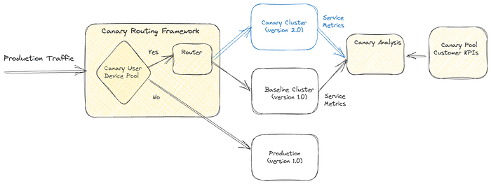
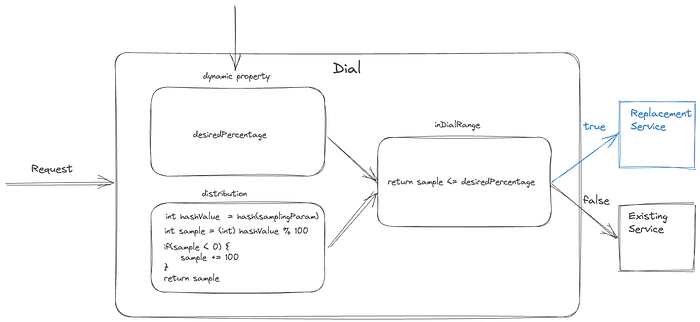
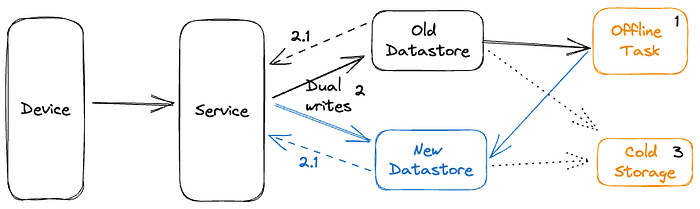

# Migrating Critical Traffic At Scale with No Downtime — Part 2

[Shyam Gala](https://www.linkedin.com/in/shyam-gala-5891224/), [Javier Fernandez-Ivern](https://www.linkedin.com/in/ivern/), [Anup Rokkam Pratap](https://www.linkedin.com/in/rokkampratap/), [Devang Shah](https://www.linkedin.com/in/shahdewang/)

Picture yourself enthralled by the latest episode of your beloved Netflix series, delighting in an uninterrupted, high-definition streaming experience. Behind these perfect moments of entertainment is a complex mechanism, with numerous gears and cogs working in harmony. But what happens when this machinery needs a transformation? This is where large-scale system migrations come into play. Our [previous blog post](./migrating-critical-traffic-at-scale-with-no-downtime-part-1-ba1c7a1c7835.md) presented replay traffic testing — a crucial instrument in our toolkit that allows us to implement these transformations with precision and reliability.

**Replay traffic testing gives us the initial foundation of validation, but as our migration process unfolds, we are met with the need for a carefully controlled migration process. A process that doesn’t just minimize risk, but also facilitates a continuous evaluation of the rollout’s impact. This blog post will delve into the techniques leveraged at Netflix to introduce these changes to production.**

## Sticky Canaries

[Canary](https://netflixtechblog.com/automated-canary-analysis-at-netflix-with-kayenta-3260bc7acc69) deployments are an effective mechanism for validating changes to a production backend service in a controlled and limited manner, thus mitigating the risk of unforeseen consequences that may arise due to the change. This process involves creating two new clusters for the updated service; a baseline cluster containing the current version running in production and a canary cluster containing the new version of the service. A small percentage of production traffic is redirected to the two new clusters, allowing us to monitor the new version’s performance and compare it against the current version. By collecting and analyzing key performance metrics of the service over time, we can assess the impact of the new changes and determine if they meet the availability, latency, and performance requirements.

Some product features require a lifecycle of requests between the customer device and a set of backend services to drive the feature. For instance, video playback functionality on Netflix involves requesting URLs for the streams from a service, calling the CDN to download the bits from the streams, requesting a license to decrypt the streams from a separate service, and sending telemetry indicating the successful start of playback to yet another service. By tracking metrics only at the level of service being updated, we might miss capturing deviations in broader end-to-end system functionality.

[Sticky Canary](https://www.infoq.com/presentations/sticky-canaries/) is an improvement to the traditional canary process that addresses this limitation. In this variation, the canary framework creates a pool of unique customer devices and then routes traffic for this pool consistently to the canary and baseline clusters for the duration of the experiment. Apart from measuring service-level metrics, the canary framework is able to keep track of broader system operational and customer metrics across the canary pool and thereby detect regressions on the entire request lifecycle flow.

*Sticky Canary*

It is important to note that with sticky canaries, devices in the canary pool continue to be routed to the canary throughout the experiment, potentially resulting in undesirable behavior persisting through retries on customer devices. Therefore, the canary framework is designed to monitor operational and customer KPI metrics to detect persistent deviations and terminate the canary experiment if necessary.

**Canaries and sticky canaries are valuable tools in the system migration process. Compared to replay testing, canaries allow us to extend the validation scope beyond the service level. They enable verification of the broader end-to-end system functionality across the request lifecycle for that functionality, giving us confidence that the migration will not cause any disruptions to the customer experience. Canaries also provide an opportunity to measure system performance under different load conditions, allowing us to identify and resolve any performance bottlenecks. They enable us to further fine-tune and configure the system, ensuring the new changes are integrated smoothly and seamlessly.**

## A/B Testing

A/B testing is a widely recognized method for verifying hypotheses through a controlled experiment. It involves dividing a portion of the population into two or more groups, each receiving a different treatment. The results are then evaluated using specific metrics to determine whether the hypothesis is valid. The industry frequently employs the technique to assess hypotheses related to product evolution and user interaction. It is also [widely utilized at Netflix](https://netflixtechblog.com/a-b-testing-and-beyond-improving-the-netflix-streaming-experience-with-experimentation-and-data-5b0ae9295bdf) to test changes to product behavior and customer experience.

A/B testing is also a valuable tool for assessing significant changes to backend systems. We can determine A/B test membership in either device application or backend code and selectively invoke new code paths and services. Within the context of migrations, A/B testing enables us to limit exposure to the migrated system by enabling the new path for a smaller percentage of the member base. Thereby controlling the risk of unexpected behavior resulting from the new changes. A/B testing is also a key technique in migrations where the updates to the architecture involve changing device contracts as well.

**Canary experiments are typically conducted over periods ranging from hours to days. However, in certain instances, migration-related experiments may be required to span weeks or months to obtain a more accurate understanding of the impact on specific Quality of Experience (QoE) metrics. Additionally, in-depth analyses of particular business Key Performance Indicators (KPIs) may require longer experiments. For instance, envision a migration scenario where we enhance the playback quality, anticipating that this improvement will lead to more customers engaging with the play button. Assessing relevant metrics across a considerable sample size is crucial for obtaining a reliable and confident evaluation of the hypothesis. A/B frameworks work as effective tools to accommodate this next step in the confidence-building process.**

In addition to supporting extended durations, A/B testing frameworks offer other supplementary capabilities. This approach enables test allocation restrictions based on factors such as geography, device platforms, and device versions, while also allowing for analysis of migration metrics across similar dimensions. This ensures that the changes do not disproportionately impact specific customer segments. A/B testing also provides adaptability, permitting adjustments to allocation size throughout the experiment.

We might not use A/B testing for every backend migration. Instead, we use it for migrations in which changes are expected to impact device QoE or business KPIs significantly. For example, as discussed earlier, if the planned changes are expected to improve client QoE metrics, we would test the hypothesis via A/B testing.

## Dialing Traffic

After completing the various stages of validation, such as replay testing, sticky canaries, and A/B tests, we can confidently assert that the planned changes will not significantly impact SLAs (service-level-agreement), device level QoE, or business KPIs. However, it is imperative that the final rollout is regulated to ensure that any unnoticed and unexpected problems do not disrupt the customer experience. To this end, we have implemented traffic dialing as the last step in mitigating the risk associated with enabling the changes in production.

A dial is a software construct that enables the controlled flow of traffic within a system. This construct samples inbound requests using a distribution function and determines whether they should be routed to the new path or kept on the existing path. The decision-making process involves assessing whether the distribution function’s output aligns within the range of the predefined target percentage. The sampling is done consistently using a fixed parameter associated with the request. The target percentage is controlled via a globally scoped dynamic property that can be updated in real-time. By increasing or decreasing the target percentage, traffic flow to the new path can be regulated instantaneously.

*Dial*

The selection of the actual sampling parameter depends on the specific migration requirements. A dial can be used to randomly sample all requests, which is achieved by selecting a variable parameter like a timestamp or a random number. Alternatively, in scenarios where the system path must remain constant with respect to customer devices, a constant device attribute such as deviceId is selected as the sampling parameter. Dials can be applied in several places, such as device application code, the relevant server component, or even at the API gateway for edge API systems, making them a versatile tool for managing migrations in complex systems.

**Traffic is dialed over to the new system in measured discrete steps. At every step, relevant stakeholders are informed, and key metrics are monitored, including service, device, operational, and business metrics. If we discover an unexpected issue or notice metrics trending in an undesired direction during the migration, the dial gives us the capability to quickly roll back the traffic to the old path and address the issue.**

The dialing steps can also be scoped at the data center level if traffic is served from multiple data centers. We can start by dialing traffic in a single data center to allow for an easier side-by-side comparison of key metrics across data centers, thereby making it easier to observe any deviations in the metrics. The duration of how long we run the actual discrete dialing steps can also be adjusted. Running the dialing steps for longer periods increases the probability of surfacing issues that may only affect a small group of members or devices and might have been too low to capture and perform shadow traffic analysis. We can complete the final step of migrating all the production traffic to the new system using the combination of gradual step-wise dialing and monitoring.

## Migrating Persistent Stores

Stateful APIs pose unique challenges that require different strategies. While the replay testing technique discussed in the previous part of this blog series can be employed, additional measures [outlined earlier](./migrating-critical-traffic-at-scale-with-no-downtime-part-1-ba1c7a1c7835.md) are necessary.

This alternate migration strategy has proven effective for our systems that meet certain criteria. Specifically, our data model is simple, self-contained, and immutable, with no relational aspects. Our system doesn’t require strict consistency guarantees and does not use database transactions. We adopt an ETL-based dual-write strategy that roughly follows this sequence of steps:

- **Initial Load through an ETL process:** Data is extracted from the source data store, transformed into the new model, and written to the newer data store through an offline job. We use custom queries to verify the completeness of the migrated records.
- **Continuous migration via Dual-writes:** We utilize an active-active/dual-writes strategy to migrate the bulk of the data. As a safety mechanism, we use dials (discussed previously) to control the proportion of writes that go to the new data store. To maintain state parity across both stores, we write all state-altering requests of an entity to both stores. This is achieved by selecting a sampling parameter that makes the dial sticky to the entity’s lifecycle. We incrementally turn the dial up as we gain confidence in the system while carefully monitoring its overall health. The dial also acts as a switch to turn off all writes to the new data store if necessary.
- **Continuous verification of records:** When a record is read, the service reads from both data stores and verifies the functional correctness of the new record if found in both stores. One can perform this comparison live on the request path or offline based on the latency requirements of the particular use case. In the case of a live comparison, we can return records from the new datastore when the records match. This process gives us an idea of the functional correctness of the migration.
- **Evaluation of migration completeness:** To verify the completeness of the records, cold storage services are used to take periodic data dumps from the two data stores and compared for completeness. Gaps in the data are filled back with an ETL process.
- **Cut-over and clean-up:** Once the data is verified for correctness and completeness, dual writes and reads are disabled, any client code is cleaned up, and read/writes only occur to the new data store.

*Migrating Stateful Systems*

## Clean-up

Clean-up of any migration-related code and configuration after the migration is crucial to ensure the system runs smoothly and efficiently and we don’t build up tech debt and complexity. Once the migration is complete and validated, all migration-related code, such as traffic dials, A/B tests, and replay traffic integrations, can be safely removed from the system. This includes cleaning up configuration changes, reverting to the original settings, and disabling any temporary components added during the migration. In addition, it is important to document the entire migration process and keep records of any issues encountered and their resolution. By performing a thorough clean-up and documentation process, future migrations can be executed more efficiently and effectively, building on the lessons learned from the previous migrations.

## Parting Thoughts

We have utilized a range of techniques outlined in our blog posts to conduct numerous large, medium, and small-scale migrations on the Netflix platform. Our efforts have been largely successful, with minimal to no downtime or significant issues encountered. Throughout the process, we have gained valuable insights and refined our techniques. It should be noted that not all of the techniques presented are universally applicable, as each migration presents its own unique set of circumstances. Determining the appropriate level of validation, testing, and risk mitigation requires careful consideration of several factors, including the nature of the changes, potential impacts on customer experience, engineering effort, and product priorities. Ultimately, we aim to achieve seamless migrations without disruptions or downtime.

In a series of forthcoming blog posts, we will explore a selection of specific use cases where the techniques highlighted in this blog series were utilized effectively. They will focus on a [comprehensive analysis of the Ads Tier Launch](./ensuring-the-successful-launch-of-ads-on-netflix-f99490fdf1ba.md) and [an extensive GraphQL migration for various product APIs](./migrating-netflix-to-graphql-safely-8e1e4d4f1e72.md). These posts will offer readers invaluable insights into the practical application of these methodologies in real-world situations.

---
**Tags:** Distributed Systems · System Migration · Testing · Netflix · Streaming
