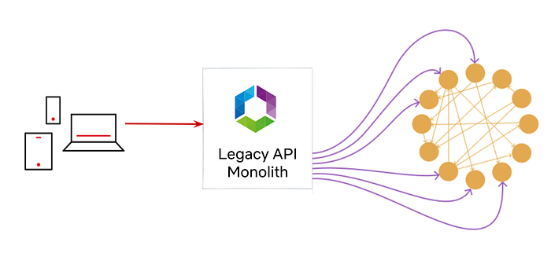
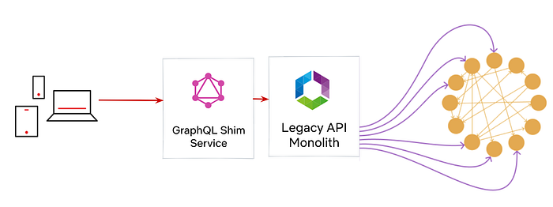
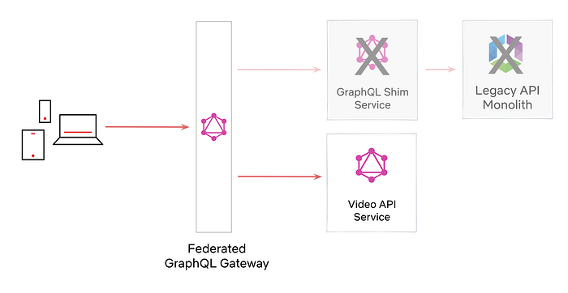
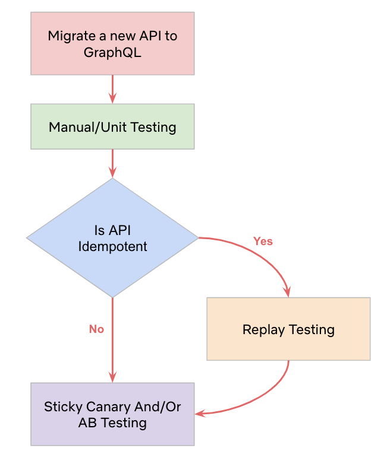
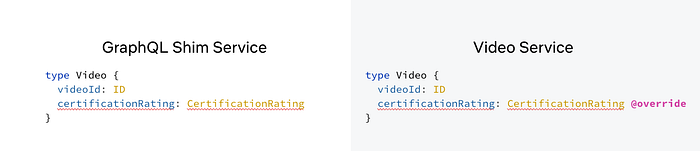
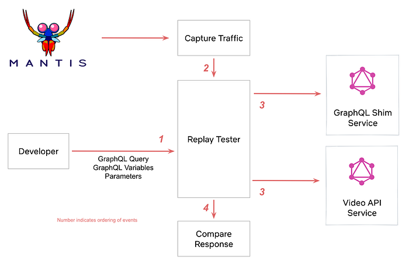
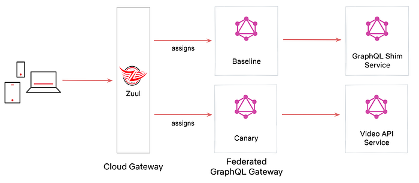
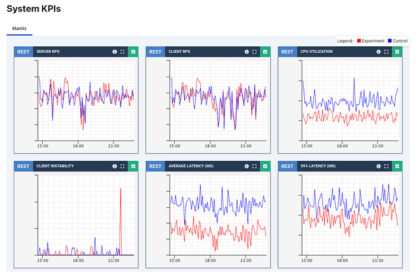

# Migrating Netflix to GraphQL Safely

By [Jennifer Shin](https://www.linkedin.com/in/jennifer-shin-0019a516/), [Tejas Shikhare](https://www.linkedin.com/in/tejas-shikhare-81027b19/), [Will Emmanuel](https://www.linkedin.com/in/willemmanuel/)

In 2022, a major change was made to Netflix’s iOS and Android applications. We migrated Netflix’s mobile apps to GraphQL with zero downtime, which involved a total overhaul from the client to the API layer.

Until recently, an internal API framework, [Falcor](https://netflix.github.io/falcor/), powered our mobile apps. They are now backed by [Federated GraphQL](./how-netflix-scales-its-api-with-graphql-federation-part-1-ae3557c187e2.md), a distributed approach to APIs where domain teams can independently manage and own specific sections of the API.

Doing this **safely** for 100s of millions of customers without disruption is exceptionally challenging, especially considering the many dimensions of change involved. This blog post will share broadly-applicable techniques (beyond GraphQL) we used to perform this migration. The three strategies we will discuss today are **AB Testing**, **Replay Testing,** and **Sticky Canaries**.

## Migration Details

Before diving into these techniques, let’s briefly examine the migration plan.

**Before GraphQL: Monolithic Falcor API implemented and maintained by the API Team**



Before moving to GraphQL, our API layer consisted of a monolithic server built with [Falcor](https://netflix.github.io/falcor/). A single API team maintained both the Java implementation of the Falcor framework _and_ the API Server.

## Phase 1

**Created a GraphQL Shim Service on top of our existing Monolith Falcor API.**



By the summer of 2020, many UI engineers were ready to move to GraphQL. Instead of embarking on a full-fledged migration top to bottom, we created a GraphQL shim on top of our existing Falcor API. The GraphQL shim enabled client engineers to move quickly onto GraphQL, figure out client-side concerns like cache normalization, experiment with different GraphQL clients, and investigate client performance without being blocked by server-side migrations. To launch Phase 1 safely, we used **AB Testing**.

## Phase 2

**Deprecate the GraphQL Shim Service and Legacy API Monolith in favor of GraphQL services owned by the domain teams.**



We didn’t want the legacy Falcor API to linger forever, so we leaned into Federated GraphQL to power a single GraphQL API with multiple GraphQL servers.

We could also swap out the implementation of a field from GraphQL Shim to Video API with federation directives. To launch Phase 2 safely, we used **Replay Testing** and **Sticky Canaries**.

## Testing Strategies: A Summary

Two key factors determined our testing strategies:

- Functional vs. non-functional requirements
- Idempotency

If we were testing **functional requirements** like data accuracy, and if the request was **idempotent**, we relied on **Replay Testing**. We knew we could test the same query with the same inputs and consistently expect the same results.

We couldn’t replay test GraphQL queries or mutations that requested non-idempotent fields.



And we definitely couldn’t replay test **non-functional requirements** like caching and logging user interaction. In such cases, we were not testing for response data but overall behavior. So, we relied on higher-level metrics-based testing: **AB Testing **and** Sticky Canaries**.

Let’s discuss the three testing strategies in further detail.

## Tool: AB Testing

Netflix traditionally uses AB Testing to evaluate whether new product features resonate with customers. **In Phase 1,** we leveraged the AB testing framework to isolate a user segment into two groups totaling 1 million users. The control group’s traffic utilized the legacy Falcor stack, while the experiment population leveraged the new GraphQL client and was directed to the GraphQL Shim. To determine customer impact, we could compare various metrics such as error rates, latencies, and time to render.

We set up a client-side AB experiment that tested Falcor versus GraphQL and reported coarse-grained quality of experience metrics (**QoE**). The AB experiment results hinted that GraphQL’s correctness was not up to par with the legacy system. We spent the next few months diving into these high-level metrics and fixing issues such as cache TTLs, flawed client assumptions, etc.

### Wins

**High-Level Health Metrics: **AB Testing provided the assurance we needed in our overall client-side GraphQL implementation. This helped us successfully migrate 100% of the traffic on the mobile homepage canvas to GraphQL in 6 months.

### Gotchas

**Error Diagnosis: **With an AB test, we could see coarse-grained metrics which pointed to potential issues, but it was challenging** to diagnose** the exact issues.

## Tool: Replay Testing — Validation at Scale!

The next phase in the migration was to reimplement our existing Falcor API in a GraphQL-first server (Video API Service). The Falcor API had become a logic-heavy monolith with over a decade of tech debt. So we had to ensure that the reimplemented Video API server was bug-free and identical to the already productized Shim service.

We developed a Replay Testing tool to verify that **idempotent** APIs were migrated correctly from the GraphQL Shim to the Video API service.

## How does it work?

The Replay Testing framework leverages the _@override_ directive available in GraphQL Federation. This directive tells the GraphQL Gateway to route to one GraphQL server over another. Take, for instance, the following two GraphQL schemas defined by the Shim Service and the Video Service:



The GraphQL Shim first defined the _certificationRating_ field (things like Rated R or PG-13) in Phase 1. In Phase 2, we stood up the VideoService and defined the same _certificationRating_ field marked with the _@override_ directive. The presence of the identical field with the _@override_ directive informed the GraphQL Gateway to route the resolution of this field to the new Video Service rather than the old Shim Service.

The Replay Tester tool samples raw traffic streams from [Mantis](https://netflix.github.io/mantis/). With these sampled events, the tool can capture a live request from production and run an **identical** GraphQL query against both the GraphQL Shim and the new Video API service. The tool then compares the results and outputs any differences in response payloads.



**Note: We do not replay test Personally Identifiable Information. It’s used only for non-sensitive product features on the Netflix UI.**

Once the test is completed, the engineer can view the diffs displayed as a _flattened JSON node_. You can see the control value on the left side of the comma in parentheses and the experiment value on the right.

```
/data/videos/0/tags/3/id: (81496962, null)
```

```
/data/videos/0/tags/5/displayName: (Série, value: “S\303\251rie”)
```

We captured two diffs above, the first had missing data for an ID field in the experiment, and the second had an encoding difference. We also saw differences in localization, date precisions, and floating point accuracy. It gave us confidence in replicated business logic, where subscriber plans and user geographic location determined the customer’s catalog availability.

### Wins

- **Confidence** in parity between the two GraphQL Implementations
- **Enabled tuning** **configs** in cases where data was missing due to over-eager timeouts
- **Tested** **business logic** that required many (unknown) inputs and where correctness can be hard to eyeball

### Gotchas

- **PII** and non-idempotent APIs should **not** be tested using Replay Tests, and it would be valuable to have a mechanism to **_prevent_** that.
- **Manually constructed queries** are only as good as the features the developer remembers to test. We ended up with untested fields simply because we forgot about them.
- **Correctness:** The idea of correctness can be confusing too. For example, is it more correct for an array to be empty or null, or is it just noise? Ultimately, we matched the existing behavior as much as possible because verifying the robustness of the client’s error handling was difficult.

Despite these shortcomings, Replay Testing was a key indicator that we had achieved functional correctness of _most_ idempotent queries.

## Tool: Sticky Canary

While Replay Testing validates the functional correctness of the new GraphQL APIs, it does not provide any performance or business metric insight, such as the **overall perceived health of user interaction**. Are users clicking play at the same rates? Are things loading in time before the user loses interest? Replay Testing also cannot be used for non-idempotent API validation. We reached for a Netflix tool called the Sticky Canary to build confidence.

A Sticky Canary is an infrastructure experiment where customers are assigned either to a canary or baseline host for the entire duration of an experiment. All incoming traffic is allocated to an experimental or baseline host based on their device and profile, similar to a bucket hash. The experimental host deployment serves all the customers assigned to the experiment. Watch our [Chaos Engineering](https://www.youtube.com/watch?v=Xbn65E-BQhA) talk from AWS Reinvent to learn more about Sticky Canaries.



In the case of our GraphQL APIs, we used a Sticky Canary experiment to** run two instances of our GraphQL gateway**. The **baseline** gateway used the existing schema, which routes all traffic to the GraphQL Shim. The **experimental** gateway used the new proposed schema, which routes traffic to the latest Video API service. [Zuul](https://github.com/Netflix/zuul), our primary edge gateway, assigns traffic to either cluster based on the experiment parameters.

We then collect and analyze the performance of the two clusters. Some KPIs we monitor closely include:

- Median and tail latencies
- Error rates
- Logs
- Resource utilization–CPU, network traffic, memory, disk
- Device QoE (Quality of Experience) metrics
- Streaming health metrics



We started small, with tiny customer allocations for hour-long experiments. After validating performance, we slowly built up scope. We increased the percentage of customer allocations, introduced multi-region tests, and eventually 12-hour or day-long experiments. Validating along the way is essential since Sticky Canaries impact live production traffic and are assigned persistently to a customer.

After several sticky canary experiments, we had assurance that phase 2 of the migration improved all core metrics, and we could dial up GraphQL globally with confidence.

### Wins

Sticky Canaries was essential to build confidence in our new GraphQL services.

- **Non-Idempotent APIs:** these tests are compatible with mutating or non-idempotent APIs
- **Business metrics:** Sticky Canaries validated our core Netflix business metrics had improved after the migration
- **System performance:** Insights into latency and resource usage help us understand how scaling profiles change after migration

### Gotchas

- **Negative Customer Impact: **Sticky Canaries can impact real users. We needed confidence in our new services before persistently routing some customers to them. This is partially mitigated by _real-time impact detection_, which will automatically cancel experiments.
- **Short-lived:** Sticky Canaries are meant for short-lived experiments. For longer-lived tests, a full-blown AB test should be used.

## In Summary

**Technology is constantly changing, and we, as engineers, spend a large part of our careers performing migrations. The question is not whether we are migrating but whether we are migrating ******_safely_******, with zero downtime, in a timely manner.**

At Netflix, we have developed tools that ensure confidence in these migrations, targeted toward each specific use case being tested. We covered three tools, **AB testing**, **Replay Testing**, and **Sticky Canaries** that we used for the GraphQL Migration.

This blog post is part of our Migrating Critical Traffic series. Also, check out: Migrating Critical Traffic at Scale ([part 1](./migrating-critical-traffic-at-scale-with-no-downtime-part-1-ba1c7a1c7835.md), [part 2](https://netflixtechblog.medium.com/migrating-critical-traffic-at-scale-with-no-downtime-part-2-4b1c8c7155c1)) and [Ensuring the Successful Launch of Ads](./ensuring-the-successful-launch-of-ads-on-netflix-f99490fdf1ba.md).

---
**Tags:** GraphQL · Migration · Testing Tools · Distributed Systems · Scale
