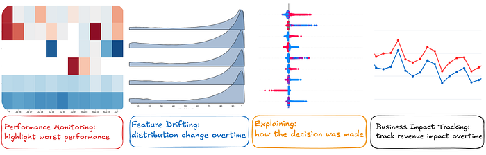
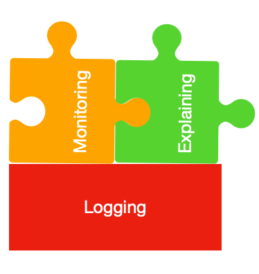
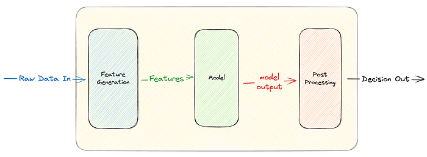
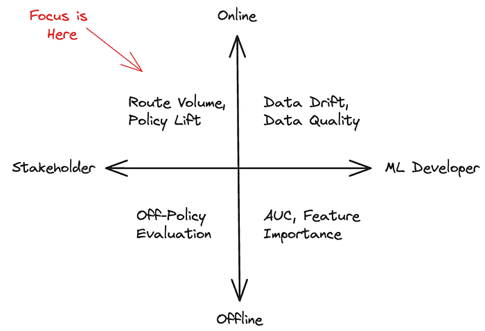
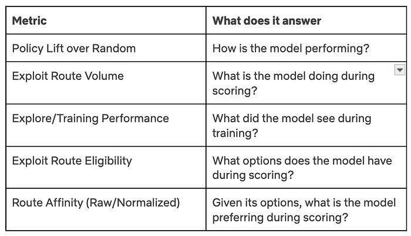
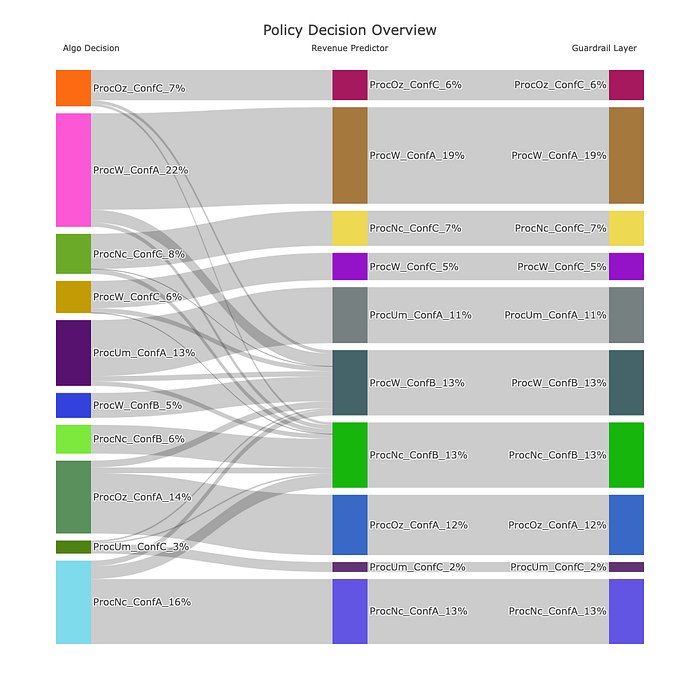
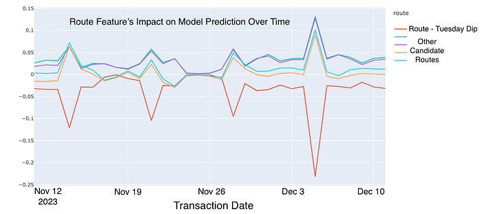
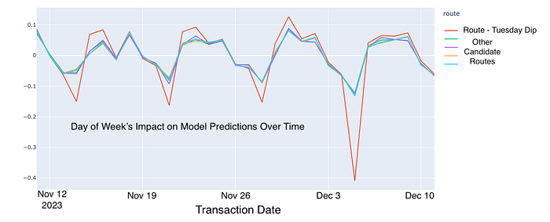

# ML Observability: Bringing Transparency to Payments and Beyond

By [Tanya Tang](http://www.linkedin.com/in/tang), [Andrew Mehrmann](https://www.linkedin.com/in/dkmehrmann)

At Netflix, the importance of ML observability cannot be overstated. ML observability refers to the ability to monitor, understand, and gain insights into the performance and behavior of machine learning models in production. It involves tracking key metrics, detecting anomalies, diagnosing issues, and ensuring models are operating reliably and as intended. ML observability helps teams identify data drift, model degradation, and operational problems, enabling faster troubleshooting and continuous improvement of ML systems.

One specific area where ML observability plays a crucial role is in payment processing. At Netflix, we strive to ensure that technical or process-related payment issues never become a barrier for someone wanting to sign up or continue using our service. By leveraging ML to optimize payment processing, and using ML observability to monitor and explain these decisions, we can reduce payment friction. This ensures that new members can subscribe seamlessly and existing members can renew without hassle, allowing everyone to enjoy Netflix without interruption.

## ML Observability: A Primer

ML Observability is a set of practices and tools to help ML practitioners and stakeholders alike gain a deeper, end to end understanding of their ML systems across all stages of its lifecycle, from development to deployment to ongoing operations. An effective ML Observability framework not only facilitates automatic detection and surfacing of issues but also provides detailed root cause analysis, acting as a guardrail to ensure ML systems perform reliably over time. This enables teams to iterate and improve their models rapidly, reduce time to detection for incidents, while also increasing the buy-in and trust of their stakeholders by providing rich context about the system’s’ behaviors and impact.

Some examples of these tools include long-term production performance monitoring and analysis, feature, target, and prediction drift monitoring, automated data quality checks, and model explainability. For example, a good observability system would detect aberrations in input data, the feature pipeline, predictions, and outcomes as well provide insight into the likely causes of model decisions and/or performance.

As an ML portfolio grows, ad-hoc monitoring becomes increasingly challenging. Greater complexity also raises the likelihood of interactions between different model components, making it unrealistic to treat each model as an isolated black box. At this stage, investing strategically in observability is essential — not only to support the current portfolio, but also to prepare for future growth.

## Stakeholder-Facing Observability Modules

In order to reliably and responsibly evolve our payments processing system to be increasingly ML-driven, we invested heavily up-front in ML observability solutions. To provide confidence to our business stakeholders through this evolution, we looked beyond technical metrics such as precision and recall and placed greater emphasis on real-world outcomes like “how much traffic did we send down this route” and “where are the regions that ML is underperforming.”

Using this as a guidepost, we designed a collection of interconnected modules for machine learning observability: **logging, monitoring, and explaining.**

## Logging

In order to support the monitoring and explaining we wanted to do, we first needed to log the appropriate data. This seems obvious and trivial, but as usual the devil is in the details: what fields exactly do we need to log and when? How does this work for simple models vs. more complex ones? What about models that are actually made of multiple models?

Consider the following, relatively straightforward model. It takes some input data, creates features, passes these to a model which creates some score between 0 and 1, and then that score is translated into a decision (say, whether to process a card as Debit or Credit).

There are several elements you may wish to log: a unique identifier for each record that is trained and scored, the raw data, the final features that fed the model, a unique identifier for the model, the feature importances for that model, the raw model score, the cutoffs used to map a score to a decision, timestamps for the decision as well as the model, etc.

To address this, we drafted an initial data schema that would enable our various ML observability initiatives. We identified the following logical entities to be necessary for the observability initiatives we were pursuing:

## Monitoring

The goal of monitoring is twofold: 1) enable self-serve analytics and 2) provide opinionated views into key model insights. It can be helpful to think of this as “business analytics on your models,” as a lot of the key concepts (online analytical processing cubes, visualizations, metric definitions, etc) carry over. Following this analogy, we can craft key metrics that help us understand our models. There are several considerations when defining metrics, including whether your needs are understanding real-world model behavior versus offline model metrics, and whether your audience are ML practitioners or model stakeholders.

Due to our particular needs, our bias for metrics is toward online, stakeholder-focused metrics. Online metrics tell us what actually happened in the real world, rather than in an idealized counterfactual universe that might have its own biases. Additionally, our stakeholders’ focus is on business outcomes, so our metrics tend to be outcome-focused rather than abstract and technical model metrics.

We focused on simple, easy to explain metrics:

These metrics begin to suggest reasons for changing trends in the model’s behavior over time, as well as more generally how the model is performing. This gives us an overall view of model health and an intuitive approximation of what we think the model should have done. For example, if payment processor A starts receiving more traffic in a certain market compared to payment processor B, you might ask:

- Has the model seen something to make it prefer processor A?
- Have more transactions become eligible to go to processor A?

However, to truly explain specific decisions made by the model, especially which features are responsible for current trends, we need to use more advanced explainability tools, which will be discussed in the next section.

## Explaining

Explainability means understanding the “why” behind ML decisions. This can mean the “why” in aggregate (e.g. why are so many of our transactions suddenly going down one particular route) or the “why” for a single instance (e.g. what factors led to this particular transaction being routed a particular way). This gives us the ability to approximate the previous status quo where we could inspect our static rules for insights about route volume.

One of the most effective tools we can leverage for ML explainability is SHAP (Shapley Additive exPlanations, _Lundberg & Lee 2017_). At a high level, SHAP values are derived from cooperative game theory, specifically the Shapley values concept. The core idea is to fairly distribute the “payout” (in our case, the model’s prediction) among the “players” (the input features) by considering their contribution to the prediction.

### Key Benefits of SHAP:

1. **Model-Agnostic:** SHAP can be applied to any ML model, making it a versatile tool for explainability.
2. **Consistent and Local Explanations:** SHAP provides consistent explanations for individual predictions, helping us understand the contribution of each feature to a specific decision.
3. **Global Interpretability:** By aggregating SHAP values across many predictions, we can gain insights into the overall behavior of the model and the importance of different features.
4. **Mathematical properties: **SHAP satisfies important mathematical axioms such as efficiency, symmetry, dummy, and additivity. These properties allow us to compute explanations at the individual level and aggregate them for any ad-hoc groups that stakeholders are interested in, such as country, issuing bank, processor, or any combinations thereof.

Because of the above advantages, we leverage SHAP as one core algorithm to unpack a variety of models and open the black box for stakeholders. Its well-documented [Python interface](https://shap.readthedocs.io/en/latest/example_notebooks/overviews/An%20introduction%20to%20explainable%20AI%20with%20Shapley%20values.html) makes it easy to integrate into our workflows.

### Explaining Complex ML Systems

For ML systems that score single events and use the output scores directly for business decisions, explainability is relatively straightforward, as the production decision is directly tied to the model’s output. However, in the case of a bandit algorithm, explainability can be more complex because the bandit policy may involve multiple layers, meaning the model’s output may not be the final decision used in production. For example, we may have a classifier model to predict the likelihood of transaction approval for each route, but we might want to penalize certain routes due to higher processing fees.

Here is an example of a plot we built to visualize these layers. The traffic that the model would have selected on its own is on the left, and different penalty or guardrail layers impact final volume as you move left to right. For example, the model originally allocated 22% traffic to processor W with Configuration A, however for cost and contractual considerations, the traffic was reduced to 19% with 3% being allocated to Processor W with Configuration B, and Processor Nc with Configuration B.

While individual event analysis is crucial, such as in fraud detection where false positives need to be scrutinized, in payment processing, stakeholders are more interested in explaining model decisions at a group level (e.g., decisions for one issuing bank from a country). This is essential for business conversations with external parties. SHAP’s mathematical properties allow for flexible aggregation at the group level while maintaining consistency and accuracy.

Additionally, due to the multi-candidate structure, when stakeholders inquire about why a particular candidate was chosen, they are often interested in the differential perspective — specifically, why another similar candidate was not selected. We leverage SHAP to segment populations into cohorts that share the same candidates and identify the features that make subtle but critical differences. For example, while Feature A might be globally important, if we compare two candidates that both have the same value for Feature A, the local differences become crucial. This facilitates stakeholders discussions and helps understand subtle differences among different routes or payment partners.

Earlier, we were alerted that our ML model consistently reduced traffic to a particular route every Tuesday. By leveraging our explanation system, we identified that two features — _route_ and _day of the week_ — were contributing negatively to the predictions on Tuesdays. **Further analysis revealed that this route had experienced an outage on a previous Tuesday, which the model had learned and encoded into the ****_route_**** and ****_day of the week_**** features**. This raises an important question: should outage data be included in model training? This discovery opens up discussions with stakeholders and provides opportunities to further enhance our ML system.

The explanation system not only demystifies our machine learning models but also fosters transparency and trust among our stakeholders, enabling more informed and confident decision-making.

## Wrapping Up

At Netflix, we face the challenge of routing thousands of payment transactions per minute in our mission to entertain the world. To help meet this challenge, we introduced an observability framework and set of tools to allow us to open the ML black box and understand the intricacies of how we route billions of dollars of transactions in hundreds of countries every year. This has led to a massive operational complexity reduction in addition to improved transaction approval rate, while also allowing us to focus on innovation rather than operations.

Looking ahead, we are generalizing our solution with a standardized data schema. This will simplify applying our advanced ML observability tools to other models across various domains. By creating a versatile and scalable framework, we aim to empower ML developers to quickly deploy and improve models, bring transparency to stakeholders, and accelerate innovation.

_We also thank _[_Karthik Chandrashekar_](https://www.linkedin.com/in/ckarthiksriram/)_, _[_Zainab Mahar Mir_](https://www.linkedin.com/in/zainabmir/)_, _[_Josh Karoly_](https://www.linkedin.com/in/joshuakaroly/)_ and _[_Josh Korn_](https://www.linkedin.com/in/joshkornpublicpolicy/)_ for their helpful suggestions._

---
**Tags:** Ml Observability · Payments · Machine Learning · Payment Processing · Ml Explainability
