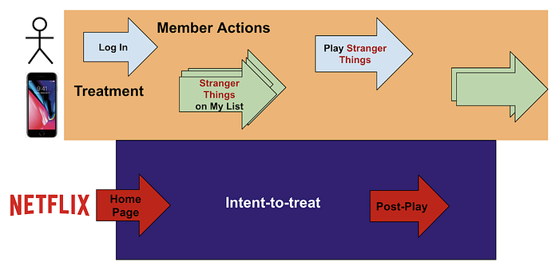

# ML Platform Meetup: Infra for Contextual Bandits and Reinforcement Learning

> Faisal Siddiqi

**_Infrastructure for Contextual Bandits and Reinforcement Learning — _**_theme of the ML Platform meetup hosted at Netflix, Los Gatos on Sep 12, 2019._

**Contextual and Multi-armed Bandits enable faster and adaptive alternatives to traditional A/B Testing.** They enable rapid learning and better decision-making for product rollouts. Broadly speaking, these approaches can be seen as a stepping stone to full-on Reinforcement Learning (RL) with closed-loop, on-policy evaluation and model objectives tied to reward functions. At Netflix, we are running several such experiments. For example, one set of experiments is focussed on [personalizing our artwork](https://medium.com/netflix-techblog/artwork-personalization-c589f074ad76) assets to quickly select and leverage the “winning” images for a title we recommend to our members.

As with other traditional machine learning and deep learning paths, a lot of what the core algorithms can do depends upon the support they get from the surrounding infrastructure and the tooling that the ML platform provides. Given the infrastructure space for RL approaches is still relatively nascent, we wanted to understand what others in the community are doing in this space.

This was the motivation for the meetup’s theme. It featured three relevant talks from LinkedIn, Netflix and Facebook, and a platform architecture overview talk from first time participant Dropbox.

## LinkedIn

[Slides](https://www.slideshare.net/FaisalZakariaSiddiqi/linkedin-talk-at-netflix-ml-platform-meetup-sep-2019)

After a brief introduction on the theme and motivation of its choice, the talks were kicked off by [Kinjal Basu](https://www.linkedin.com/in/kinjalbasu/) from LinkedIn who talked about _Online Parameter Selection for Web-Based Ranking via Bayesian Optimization_. In this talk, Kinjal used the example of the LinkedIn Feed, to demonstrate how they use bandit algorithms to solve for the optimal parameter selection problem efficiently.

He started by laying out some of the challenges around inefficiencies of engineering time when manually optimizing for weights/parameters in their business objective functions. The key insight was that by assuming a latent Gaussian Process (GP) prior on the key business metric actions like viral engagement, job applications, etc., they were able to reframe the problem as a straight-forward black-box optimization problem. This allowed them to use BayesOpt techniques to solve this problem.

The algorithm used to solve this reformulated optimization problem is a popular E/E technique known as Thompson Sampling. He talked about the infrastructure used to implement this. They have built an offline BayesOpt library, a parameter store to retrieve the right set of parameters, and an online serving layer to score the objective at serving time given the parameter distribution for a particular member.

He also described some practical considerations, like member-parameter stickiness, to avoid per session variance in a member’s experience. Their offline parameter distribution is recomputed hourly, so the member experience remains consistent within the hour. Some simulation results and some online A/B test results were shared, demonstrating substantial lifts in the primary business metrics, while keeping the secondary metrics above preset guardrails.

He concluded by stressing the efficiency their teams had achieved by doing online parameter exploration instead of the much slower human-in-the-loop manual explorations. In the future, they plan to explore adding new algorithms like UCB, considering formulating the problem as a grey-box optimization problem, and switching between the various business metrics to identify which is the optimal metric to optimize.

## Netflix

[Slides](https://www.slideshare.net/FaisalZakariaSiddiqi/netflix-talk-at-ml-platform-meetup-sep-2019)

The second talk was by Netflix on our Bandit Infrastructure built for personalization use cases. [Fernando Amat](https://www.linkedin.com/in/fernando-amat-6110931/) and [Elliot Chow](https://www.linkedin.com/in/ellchow/) jointly gave this talk.

Fernando started the first part of the talk and described the core recommendation problem of identifying the top few titles in a large catalog that will maximize the probability of play. Using the example of evidence personalization — images, text, trailers, synopsis, all assets that come together to add meaning to a title — he described how the problem is essentially a slate recommendation task and is well suited to be solved using a Bandit framework.

If such a framework is to be generic, it must support different contexts, attributions and reward functions. He described a simple Policy API that models the Slate tasks. This API supports the selection of a state given a list of options using the appropriate algorithm and a way to quantify the propensities, so the data can be de-biased. Fernando ended his part by highlighting some of the Bandit Metrics they implemented for offline policy evaluation, like Inverse Propensity Scoring (IPS), Doubly Robust (DR), and Direct Method (DM).

For Bandits, where attribution is a critical part of the equation, it’s imperative to have a flexible and robust data infrastructure. Elliot started the second part of the talk by describing the real-time framework they have built to bring together all signals in one place making them accessible through a queryable API. These signals include member activity data (login, search, playback), intent-to-treat (what title/assets the system wants to impress to the member) and the treatment (impressions of images, trailers) that actually made it to the member’s device.

Elliot talked about what is involved in “Closing the loop”. First, the intent-to-treat needs to be joined with the treatment logging along the way, the policies in effect, the features used and the various propensities. Next, the reward function needs to be updated, in near real time, on every logged action (like a playback) for both short-term and long-term rewards. And finally each new observation needs to update the policy, compute offline policy evaluation metrics and then push the policy back to production so it can generate new intents to treat.

To be able to support this, the team had to standardize on several infrastructure components. Elliot talked about the three key components — a) Standardized Logging from the treatment services, b) Real-time stream processing over Apache Flink for member activity joins, and c) an Apache Spark client for attribution and reward computation. The team has also developed a few common attribution datasets as “out-of-the-box” entities to be used by the consuming teams.

Finally, Elliot ended by talking about some of the challenges in building this Bandit framework. In particular, he talked about the misattribution potential in a complex microservice architecture where often intermediary results are cached. He also talked about common pitfalls of stream-processed data like out of order processing.

This framework has been in production for almost a year now and has been used to support several A/B tests across different recommendation use cases at Netflix.

## Facebook

[Slides](https://www.slideshare.net/FaisalZakariaSiddiqi/facebook-talk-at-netflix-ml-platform-meetup-sep-2019)

After a short break, the second session started with a talk from Facebook focussed on practical solutions to exploration problems. [Sam Daulton](https://www.linkedin.com/in/samuel-daulton/) described how the infrastructure and product use cases came along. He described how the adaptive experimentation efforts are aimed at enabling fast experimentation with a goal of adding varying degrees of automation for experts using the platform in an ad hoc fashion all the way to no-human-in-the-loop efforts.

He dived into a policy search problem they tried to solve: _How many posts to load for a user depending upon their device’s connection quality._ They modeled the problem as an infinite-arm bandit problem and used Gaussian Process (GP) regression. They used Bayesian Optimization to perform multi-metric optimization — e.g., jointly optimizing decrease in CPU utilization along with increase in user engagement. One of the challenges he described was how to efficiently choose a decision point, when the joint optimization search presented a Pareto frontier in the possible solution space. They used constraints on individual metrics in the face of noisy experiments to allow business decision makers to arrive at an optimal decision point.

Not all spaces can be efficiently explored online, so several research teams at Facebook use Simulations offline. For example, a ranking team would ingest live user traffic and subject it to a number of ranking configurations and simulate the event outcomes using predictive models running on canary rankers. The simulations were often biased and needed de-biasing (using multi-task GP regression) for them to be used alongside online results. They observed that by combining their online results with de-biased simulation results they were able to substantially improve their model fit.

To support these efforts, they developed and open sourced some tools along the way. Sam described Ax and BoTorch — Ax is a library for managing adaptive experiments and BoTorch is a library for Bayesian Optimization research. There are many applications already in production for these tools from both basic hyperparameter exploration to more involved AutoML use cases.

The final section of Sam’s talk focussed on Constrained Bayesian Contextual Bandits. They described the problem of video uploads to Facebook where the goal is to maximize the quality of the video without a decrease in reliability of the upload. They modeled it as a Thompson Sampling optimization problem using a Bayesian Linear model. To enforce the constraints, they used a modified algorithm, Constrained Thompson Sampling, to ensure a non-negative change in reliability. The reward function also similarly needed some shaping to align with the constrained objective. With this reward shaping optimization, Sam shared some results that showed how the Constrained Thompson Sampling algorithm surfaced many actions that satisfied the reliability constraints, where vanilla Thompson Sampling had failed.

## Dropbox

[Slides](https://www.slideshare.net/TsahiGlik/ml-infrastracture-dropbox)

The last talk of the event was a system architecture introduction by Dropbox’s [Tsahi Glik](https://www.linkedin.com/in/tsahi-glik-92041b2/). As a first time participant, their talk was more of an architecture overview of the ML Infra in place at Dropbox.

Tsahi started off by giving some ML usage examples at Dropbox like Smart Sync which predicts which file you will use on a particular device, so it’s preloaded. Some of the challenges he called out were the diversity and size of the disparate data sources that Dropbox has to manage. Data privacy is increasingly important and presents its own set of challenges. From an ML practice perspective, they also have to deal with a wide variety of development processes and ML frameworks, custom work for new use cases and challenges with reproducibility of training.

He shared a high level overview of their ML platform showing the various common stages of developing and deploying a model categorized by the online and offline components. He then dived into some individual components of the platform.

The first component he talked about was a user activity service to collect the input signals for the models. This service, Antenna, provides a way to query user activity events and summarizes the activity with various aggregations. The next component he dived deeper into was a content ingestion pipeline for OCR (optical character recognition). As an example, he explained how the image of a receipt is converted into contextual text. The pipeline takes the image through multiple models for various subtasks. The first classifies whether the image has some detectable text, the second does corner detection, the third does word box detection followed by deep LSTM neural net that does the core sequence based OCR. The final stage performs some lexicographical post processing.

He talked about the practical considerations of ingesting user content — they need to prevent malicious content from impacting the service. To enable this they have adopted a plugin based architecture and each task plugin runs in a sandbox jail environment.

Their offline data preparation ETLs run on Spark and they use Airflow as the orchestration layer. Their training infrastructure relies on a hybrid cloud approach. They have built a layer and command line tool called `dxblearn` that abstracts the training paths, allowing the researchers to train either locally or leverage AWS. `dxblearn` also allows them to fire off training jobs for hyperparameter tuning.

Published models are sent to a model store in S3 which are then picked up by their central model prediction service that does online inferencing for all use cases. Using a central inferencing service allows them to partition compute resources appropriately and having a standard API makes it easy to share and also run inferencing in the cloud.

They have also built a common “suggest backend” that is a generic predictive application that can be used by the various edge and production facing services that regularizes the data fetching, prediction and experiment configuration needed for a product prediction use case. This allows them to do live experimentation more easily.

The last part of Tsahi’s talk described a product use case leveraging their ML Platform. He used the example of a promotion campaign ranker, (eg “Try Dropbox business”) for up-selling. This is modeled as a multi-armed bandit problem, an example well in line with the meetup theme.

The biggest value of such meetups lies in the high bandwidth exchange of ideas from like-minded practitioners. In addition to some great questions after the talks, the 150+ attendees stayed well past 2 hours in the reception exchanging stories and lessons learnt solving similar problems at scale.

In the Personalization org at Netflix, we are always interested in exchanging ideas about this rapidly evolving ML space in general and the bandits and reinforcement learning space in particular. We are committed to sharing our learnings with the community and hope to discuss progress here, especially our work on Policy Evaluation and Bandit Metrics in future meetups. If you are interested in working on this exciting space, there are many[ open opportunities](https://jobs.netflix.com/search?subteam=Personalization+Engineering) on both engineering and research endeavors.

---
**Tags:** Netflix · Machine Learning · Reinforcement Learning · Ml Platform · Contextual Bandit
