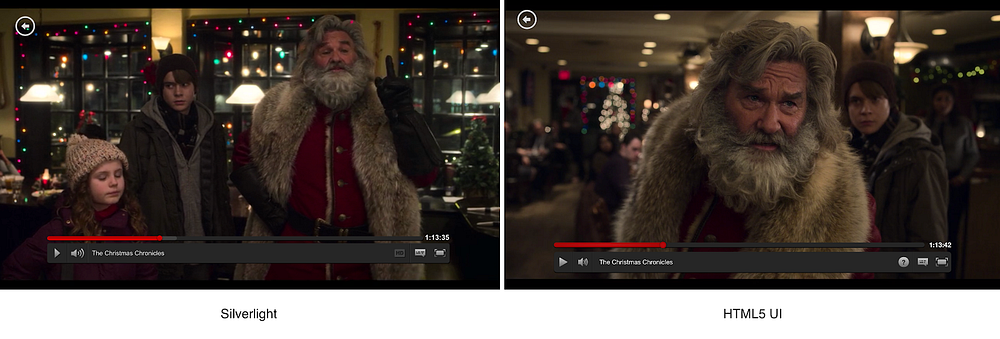
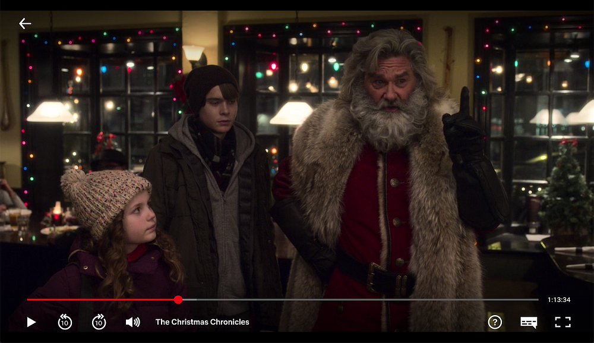
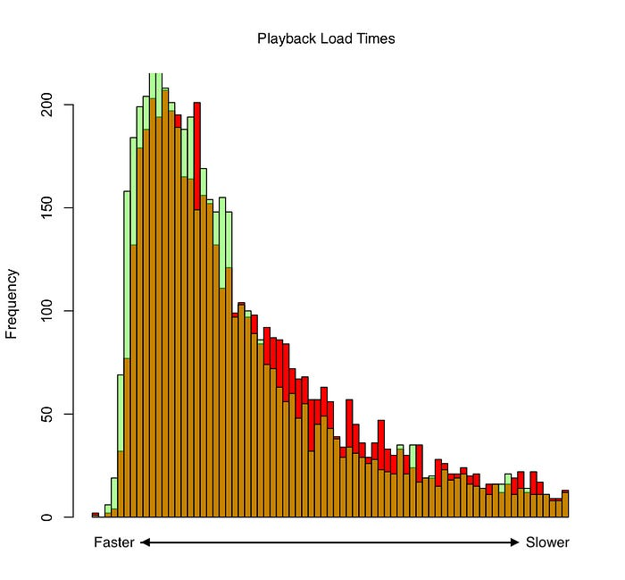

# Modernizing the Web Playback UI

> by Corey Grunewald & Matt Jaquish

Since 2013, the user experience of playing videos on the Netflix website has changed very little. During this period, teams at Netflix have rolled out [amazing video playback features](https://medium.com/netflix-techblog/netflix-now-supports-hdr-on-windows-10-1928b40ac7d), but the visual design and user controls of the playback UI have remained the same.


*The visual design and user controls of playback have been the same since 2013.*

Over the past two years, the Web UI team has had a long running goal to modernize the user experience of playback for our members. Playback consists of three primary canvases:

- **Pre Play:** A video to be shown to members before the main content (e.g. a season recap).
- **Video Playback:** The member is watching their selected content, and has access to controls to pause the video, change the volume, etc.
- **Post Play:** When the selected content ends, members are presented with the next episode in a series, or recommendations on what to watch next.

Through AB testing and subsequent learning, we have launched an updated, modern playback UI experience for our members. We want to share our journey of how we got to where we are today.


*The new, modern playback UI*

## If At First You Don’t Succeed…

Starting in 2016, our main priority for the modernization effort was to start using React to build and render the playback UI components. While the rest of the website transitioned to using React for the UI in the Summer of 2015, the playback UI continued to use a custom, vanilla JavaScript framework. Only a few engineers on the team had experience with the framework, which could create bottlenecks when working on fixes or features. By moving to React, we would enable more developers to contribute to building a better experience because of the familiarity and ergonomics it provided.

Along with improving developer throughput, we needed to eliminate the intricate bridge we had created between the custom framework and the existing React components used for the website. Building the playback UI with React meant that we could get rid of that complexity.

As with most product changes at Netflix, we treated the playback UI modernization as an AB test. With our visual design and data analytics partners, we worked out an AB test design. Our control cell would be our current visual design and feature set using the custom framework to render the UI. Our experiment treatment would be a new visual design for all canvases of playback (Pre Play, Video Playback, and Post Play), with the UI components built using React.

We were excited to get started. There was a green field ahead of us! However, we soon realized that we were too excited to start building and designing, and didn’t spend enough time thinking about if we even **should**.

We worked for months creating new React components, porting over logic, and rewriting the CSS for the new visual design. By the Summer of 2016, we were ready to launch the test. _Drumroll please…_ we failed.

## Doing Too Much at Once

Members using the new player design built on top of React were streaming less content. We were mystified that the test wasn’t a win. We assumed users wouldn’t have issues with the new visual design since it was now aligned with the rest of the website, and other platform’s playback UIs. We had to dig into where we were harming the user experience — and we found a few places.

### Isolating Changes

Our initial test design had a fatal flaw — we changed both the visual design and the underlying UI architecture. When we got back the negative test results, it was difficult to determine which change was causing impact. Was it the design, the UI architecture, or both? After a more thorough look at metrics, we found that both the new visual design and move to React were impacting members in different ways. **This became a hard-earned lesson in ensuring that all your test variables are isolated.**

### Rendering Performance Gap

In moving to React, we fundamentally changed the UI architecture for each playback canvas. When looking at performance metrics of the AB test, we found that our specific approach to using React to build components was actually causing playback startup to take longer than our custom framework, as well as drop more frames of video.


*Histogram of playback load times using the custom framework (green), overlayed with React (red).*

We were surprised by this discovery, but after a deeper comparison between our custom framework implementation and our usage of React, we understood why there was a gap. Our custom framework was binding directly to video player events to get UI state. Each component class would create a DOM node, wait for an event to be emitted from the video player, and update attributes on the DOM node based upon the event data. Meanwhile, in React, we utilized unidirectional data flow by having a root component receive all video player state, which would then pass that state down to all children components. Re-rendering for each video player state change from this root component contributed to the performance delta.

## Try, Try Again

Armed with knowing what was adversely impacted in the initial test, we were tasked with fixing those issues, and cleaning up our AB test design.

### Test Design

We decided that the next AB test needed to only focus on UI architecture changes. Moving to React didn’t mean that the visual design of the playback UI needed to change as well. The plan was to replicate the existing visual design on top of our React components.

### Need for Speed

In order to fix the gap in startup speed, we first had to measure where time was being spent during UI rendering. Instrumentation was added to track the time it took to hit key milestones of playback. This instrumentation was in the form of using performance markers throughout our components:

```
// Inside Player.jsx...

componentDidMount() {
    performance.mark(
        `playbackMilestone:start:${this.state.playbackView}`
    );
}

componentDidUpdate(prevProps, prevState) {
    if (prevState.playbackView !== this.state.playbackView) { 
        performance.mark(
            `playbackMilestone:end:${this.state.playbackView}`
        );
        performance.mark(
            `playbackMilestone:start:${this.state.playbackView}`
        );
    }
    if (this.state.playbackView === PlaybackViews.PLAYBACK) {
        // serialize and log playback performance data.
    }
}
```

The milestone data showed that rendering the initial loading view in React was taking much longer compared to our control cell. It turned out that we were rendering the playback controls component in parallel with the loading component. By ensuring the controls were only rendered when video playback was ready, we improved our render times while the video player was loading.

The next step was to prevent dropping frames during video playback. The built-in React performance tools were used to profile component render timing. We took several steps to improve render times:

- **React Best Practices: **We ensured that the UI components were implementing best practices when using React, i.e. using the shouldComponentUpdate lifecycle where necessary.
- **Less HOCs**: Where possible, we migrated away from using higher order components, by transitioning to using utility functions, or moving logic into a parent component
- **No Prop Spreads, and Collapsing Props: **Spreading props causes time to be spent iterating through objects. Collapsing multiple props into a single object where possible helps reduce comparison time in the shouldComponentUpdate lifecycle.
- **Observability: **Taking a page out of our custom framework’s playbook, we introduced observability of video player state into components that need to be re-rendered most often. This helped reduce render cycles at our root component.

With the visual design and performance changes made, a new AB test was launched. After patiently waiting, the results were in, _another drumroll please…_ members streamed the same amount with the React playback UI compared to the custom framework! In the Summer of 2017, we rolled out using React in playback for all members .

## Under the Hood: Simplifying Playback Logic

In addition to using React to make the UI component layer more accessible and easier to develop across multiple teams, we wanted to do the same for the player-related business logic. We have multiple teams working on different kinds of playback logic at the same time, such as: interactive titles (where the user makes choices to participate in the story), movie and episode playback, video previews in the browse experience, and unique content during Post Play

We chose to use Redux in order to single-source and encapsulate the complex playback business logic. Redux is a well-known library/pattern in web UI engineering, and it facilitates separation of concerns in ways that met our goals. By combining Redux with data normalization, we enabled parallel development across teams in addition to providing standardized, predictable ways of expressing complex business logic.

## Separating Video Lifecycle From UI Lifecycle

Allowing the UI component tree to control the logic concerning the lifecycle of the actual video can result in a slow user experience. UI component trees usually have their lifecycle represented in a standardized set of methods, such as React’s _componentDidMount_, _componentDidUpdate_, etc. When the logic for creating a new video playback is hidden in a UI lifecycle method that is deep inside of a component tree, the user must wait until that specific component is called before the playback can even be initiated. After being initiated, the user must wait until the playback is sufficiently loaded in order to begin viewing the video.

When the UI is rendered on the server, the initial DOM is shipped to the client. This DOM doesn’t include a loaded video or any buffered data needed to start playback. In the case of React, the client UI needs to rebuild itself on top of this initial DOM, and then go through a lifecycle sequence to begin loading the video.

However, if the logic for managing the video playback exists outside of the UI component tree, it can be executed from anywhere inside of the application, such as before the UI tree is rendered during the initial application loading sequence. By kicking off the creation of a video in parallel with rendering the UI, it gives the application more time to create, initialize, and buffer video playback so that when the UI has finished rendering, the user can start playing the video sooner.

## Standardizing the Data Representation of a Video Playback

Since video playback is composed of a series of dynamic events, it can pose a problem when there are different parts of an application that care about the state of a video playback. For example, one part of an application may be responsible for creating a video, another part responsible for configuring it based on user preferences, and yet another responsible for managing the real time control of playing, pausing, and seeking.

In order to encapsulate knowledge of a video playback, we created a standardized data structure to represent it. We were then able to create a single, central location to store the data structure for each video playback so that both the business logic and the UI could access them. This enabled intelligent rules governing video playbacks, multiple UIs that operate on a single set of data, and easier testing.

The standardized playback data structure can be created from any source of video: a custom video library, or a standard HTML video element. Using the normalized data frees the UI from having to know about the specific video implementation.

## Adding Support for Multiple Video Playbacks

When we have the playback data for every existing video single-sourced in the application independent of the UI, it allows the application to define business logic rules that coordinate single, or multiple video playbacks. If each video was hidden inside a particular instance of a UI component, and the components existed across completely different areas of the UI, it would be difficult to coordinate and would force the UI components to have knowledge of each other when they probably shouldn’t.

Some areas of logic that become easier with the UI-independent playback data and multiple players are:

- Volume & mute control.
- Play & pause control.
- Playback precedence for autoplay.
- Constraints on the number of players allowed to coexist.

## An Implementation of Application State

In order to provide a well-structured location for the UI-independent state, we decided to leverage Redux again. However, we also knew that we would need to allow multiple teams to work in the codebase as they added and removed logic that would be independent and not required by all use cases. As a result, we created an extremely thin layer on top of core Redux that allowed us to package up files related to specific domains of logic, and then compose Redux applications out of those domains.

A domain in our system is simply a static object that contains the following things:

- State data structure.
- State reducer.
- Actions.
- Middleware.
- Custom API to query state.

An application can choose to compose itself out of domains, or not use them at all. When a domain is used to create an application, the individual parts of the domain are automatically bound to its own domain state; it won’t have access to any other part of the application state outside of what it defined. The good thing is that the final external API of the application is the same whether it uses domains or not, thanks to the power of composition.

We empower two use cases: a single-level standard Redux application where each part knows about the entire state, or an application where each domain is enforced to only manage its own piece of the application’s substate. The benefit of identifying areas of logic that can be encapsulated into a logical domain is that the domain can easily be added, removed, or ported to any other application without breaking anything else.

## Enabling Plug & Play Logic

By leveraging our concept of domains, we were able to continue working on core playback UI features while other teams implemented custom logical domains to plug into our player application, such as logic for interactive titles. Interactive titles have custom playback logic, as well as custom UIs to enable the user to make story choices during playback. Now that we had both well-encapsulated UI (via React) and state with associated logic (via Redux and our domains), we had a system to manage complexity on multiple fronts. Since we continuously AB test a lot of features, the consistent encapsulation of logic makes it much easier to add and remove logic based on AB test data or feature flags. Having an enforced and consistent structure by thinking in terms of logic domains also helped us identify and formalize areas of our application that were previously inconsistent. By adding structure and predictability and giving up the absolute freedom to do anything in any way, it actually freed us and other teams to add more features, perform more testing, and create higher-quality code.

## A New Coat of Paint with A Better Engine

With new and improved state management and development patterns for fellow engineers to use, our final step in the modernization journey was to update the visual design of the UI.

From our previous learning about change isolation, the plan was to create an AB test that only focused on updating the UI in the video playback experience, and not modifying any other canvases of playback, or the architecture.

By utilizing our implementation of Redux and extending existing React components, it was easier than ever to turn our design prototypes into production code for the AB test. We rolled out the test in the Summer of 2018. We got back the results in the Fall, and found that members preferred the modern visual design along with new video player controls that allowed them to seek back and forth, or pause the video by simply clicking on the screen.

This final AB test in the modernization journey was easy to implement and analyze. By making mistakes and learning from them, we built intuition and best practices around ensuring you are not trying to do too many things at once.

---
**Tags:** JavaScript · React · Netflix · Redux · Ab Testing
