# Mount Mayhem at Netflix: Scaling Containers on Modern CPUs

Authors: [Harshad Sane](https://www.linkedin.com/in/harshad-sane-56711a11/), [Andrew Halaney](https://www.linkedin.com/in/andrew-halaney/)

Imagine this — you click play on Netflix on a Friday night and behind the scenes hundreds of containers spring to action in a few seconds to answer your call. At Netflix, scaling containers efficiently is critical to delivering a seamless streaming experience to millions of members worldwide. To keep up with responsiveness at this scale, we modernized our container runtime, only to hit a surprising bottleneck: the CPU architecture itself.

Let us walk you through the story of how we diagnosed the problem and what we learned about scaling containers at the hardware level.

## The Problem

When application demand requires that we scale up our servers, we get a new instance from AWS. To use this new capacity efficiently, pods are assigned to the node until its resources are considered fully allocated. A node can go from no applications running to being maxed out within moments of being ready to receive these applications.

As we migrated more and more from our old container platform to our new container platform, we started seeing some concerning trends. Some nodes were stalling for long periods of time, with a simple health check timing out after 30 seconds. An initial investigation showed that the mount table length was increasing dramatically in these situations, and reading it alone could take upwards of 30 seconds. Looking at systemd’s stack it was clear that it was busy processing these mount events as well and could lead to complete system lockup. Kubelet also timed out frequently talking to containerd in this period. Examining the mount table made it clear that these mounts were related to container creation.

The affected nodes were almost all r5.metal instances, and were starting applications whose container image contained many layers (50+).

## Challenge

### Mount Lock Contention

The flamegraph in Figure 1 clearly shows where containerd spent its time. Almost all of the time is spent trying to grab a kernel-level lock as part of the various mount-related activities when assembling the container’s root filesystem!

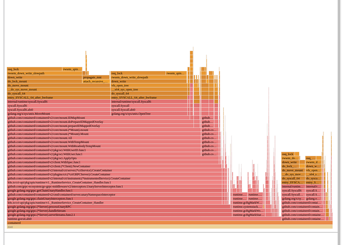
*Figure 1: Flamegraph depicting lock contention*

Looking closer, containerd executes the following calls for each layer if using user namespaces:

1. open_tree() to get a reference to the layer / directory
2. mount_setattr() to set the idmap to match the container’s user range, shifting the ownership so this container can access the files
3. move_mount() to create a bind mount on the host with this new idmap applied

These bind mounts are owned by the container’s user range and are then used as the lowerdirs to create the overlayfs-based rootfs for the container. Once the overlayfs rootfs is mounted, the bind mounts are then unmounted since they are not necessary to keep around once the overlayfs is constructed.

If a node is starting many containers at once, every CPU ends up busy trying to execute these mounts and umounts. The kernel VFS has various global locks related to the mount table, and each of these mounts requires taking that lock as we can see in the top of the flamegraph. Any system trying to quickly set up many containers is prone to this, and this is a function of the number of layers in the container image.

For example, assume a node is starting 100 containers, each with 50 layers in its image. Each container will need 50 bind mounts to do the idmap for each layer. The container’s overlayfs mount will be created using those bind mounts as the lower directories, and then all 50 bind mounts can be cleaned up via umount. Containerd actually goes through this process twice, once to determine some user information in the image and once to create the actual rootfs. This means the total number of mount operations on the start up path for our 100 containers is 100 * 2 * (1 + 50 + 50) = 20200 mounts, all of which require grabbing various global mount related locks!

## Diagnosis

### What’s Different In The New Runtime?

As alluded to in the introduction, Netflix has been undergoing a modernization of its container runtime. In the past a virtual kubelet + docker solution was used, whereas now a kubelet + containerd solution is being used. Both the old runtime and the new runtime used user namespaces, so what’s the difference here?

1. Old Runtime:  
All containers shared a single host user range. UIDs in image layers were shifted at untar time, so file permissions matched when containers accessed files. This worked because all containers used the same host user.
2. New Runtime:  
Each container gets a unique host user range, improving security — if a container escapes, it can only affect its own files. To avoid the costly process of untarring and shifting UIDs for every container, the new runtime uses the kernel’s idmap feature. This allows efficient UID mapping per container without copying or changing file ownership, which is why containerd performs many mounts.

Figure 2 below is a simplified example of how this idmap feature looks like:

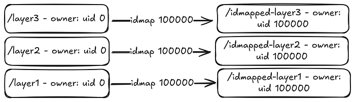
*Figure 2: idmap feature*

### Why Does Instance Type Matter?

As noted earlier, the issue was predominantly occurring on r5.metal instances. Once we identified the root issue we could easily reproduce by creating a container image with many layers and sending hundreds of workloads using the image to a test node.

To better understand why this bottleneck was more profound on some instances compared to others, we benchmarked container launches on different AWS instance types:

- r5.metal (5th gen Intel, dual-socket, multiple NUMA domains)
- m7i.metal-24xl (7th gen Intel, single-socket, single NUMA domain)
- m7a.24xlarge (7th gen AMD, single-socket, single NUMA domain)

### Baseline Results

Figure 3 shows the baseline results from scaling containers on each instance type

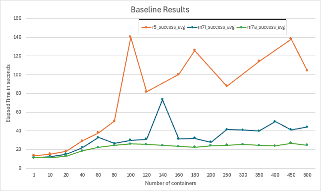

- At low concurrency (≤ ~20 containers), all platforms performed similarly
- As concurrency increased, r5.metal began to fail around 100 containers
- 7th generation AWS instances maintained lower launch times and higher success rates as concurrency grew
- m7a instances showed the most consistent scaling behavior with the lowest failure rates even at high concurrency

## Deep Dive

Using perf record and custom microbenchmarks, we can see the hottest code path was in the Linux kernel’s Virtual Filesystem (VFS) path lookup code — specifically, a tight spin loop waiting on a sequence lock in path_init(). The CPU spent most of its time executing the pause instruction, indicating many threads were spinning, waiting for the global lock, as shown in the disassembly snippet below

```
path_init():
…
mov mount_lock,%eax
test $0x1,%al
je 7c
pause
…
```

Using Intel’s Topdown Microarchitecture Analysis ([TMA](https://dyninst.github.io/scalable_tools_workshop/petascale2018/assets/slides/TMA%20addressing%20challenges%20in%20Icelake%20-%20Ahmad%20Yasin.pdf)), we observed:

- 95.5% of pipeline slots were stalled on contested accesses (tma_contested_accesses).
- 57% of slots were due to false sharing (multiple cores accessing the same cache line).
- Cache line bouncing and lock contention were the primary culprits.

Given a high amount of time being spent in contested accesses, the natural thinking from a perspective of hardware variations led to investigation of NUMA and Hyperthreading impact coming from the architecture to this subset

### NUMA Effects

Non-Uniform Memory Access (NUMA) is a system design where each processor has its own local memory for faster access but relies on an interconnect to access the memory attached to a remote processor. Introduced in the 1990s to improve scalability in multiprocessor systems, NUMA boosts performance but also introduces higher latency when a CPU needs to access memory attached to another processor. Figure 4 is a simple image describing local vs remote access patterns of a NUMA architecture

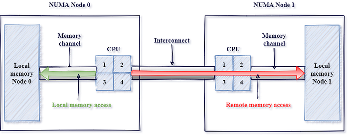
*Figure 4: Source: https://pmem.io/images/posts/numa_overview.png*

AWS instances come in a variety of shapes and sizes. To obtain the largest core count, we tested the 2-socket 5th generation metal instances (r5.metal), on which containers were orchestrated by the titus agent. Modern dual-socket architectures implement NUMA design, leading to faster local but higher remote access latencies. Although container orchestration can maintain locality, global locks can easily run into high latency effects due to remote synchronization. In order to test the impact of NUMA, we tested an AWS 48xl sized instance with 2 NUMA nodes or sockets versus an AWS 24xl sized instance, which represents a single NUMA node or socket. As seen from Figure 5, the extra hop introduces high latencies and hence failures very quickly.

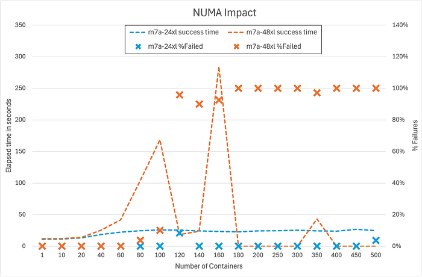
*Figure 5: Numa Impact*

### Hyperthreading Effects

- Hyperthreading (HT): Disabling HT on m7i.metal-24xl (Intel) improved container launch latencies by 20–30% as seen in Figure 6, since hyperthreads compete for shared execution resources, worsening the lock contention. When hyperthreading is enabled, each physical CPU core is split into two logical CPUs (hyperthreads) that share most of the core’s execution resources, such as caches, execution units, and memory bandwidth. While this can improve throughput for workloads that are not fully utilizing the core, it introduces significant challenges for workloads that rely heavily on global locks. By disabling hyperthreading, each thread runs on its own physical core, eliminating this competition for shared resources between hyperthreads. As a result, threads can acquire and release global locks more quickly, reducing overall contention and improving latency for operations that generally share underlying resources.

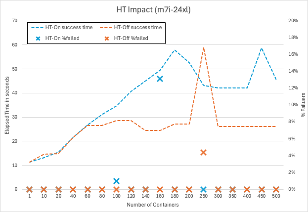
*Figure 6: Hyperthreading impact*

## Why Does Hardware Architecture Matter?

### Centralized Cache Architectures

Some modern server CPUs use a mesh-style interconnect to link cores and cache slices, with each intersection managing cache coherence for a subset of memory addresses. In these designs, all communication passes through a central queueing structure, which can only handle one request for a given address at a time. When a global lock (like the mount lock) is under heavy contention, all atomic operations targeting that lock are funneled through this single queue, causing requests to pile up and resulting in memory stalls and latency spikes.

In some well-known mesh-based architectures as shown in Figure 7 below, this central queue is called the “Table of Requests” (TOR), and it can become a surprising bottleneck when many threads are fighting for the same lock. If you’ve ever wondered why certain CPUs seem to “pause for breath” under heavy contention, this is often the culprit.

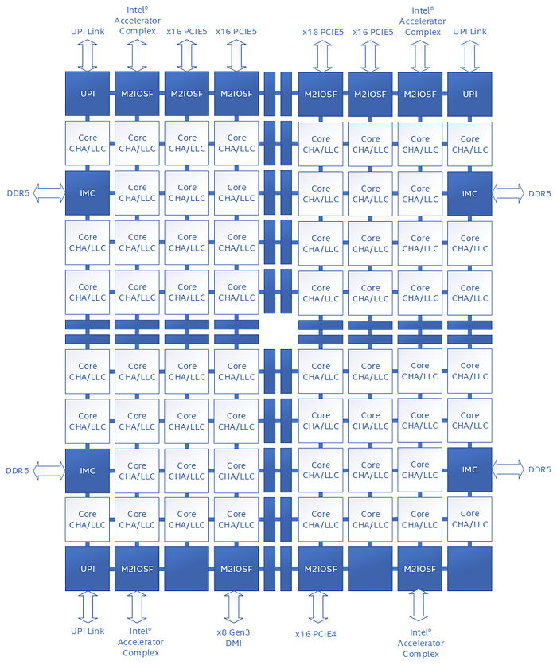
*Figure 7: Public document from one of the major CPU vendors Source:https://www.intel.com/content/dam/developer/articles/technical/ddio-analysis-performance-monitoring/Figure1.png*

### Distributed Cache Architectures

Some modern server CPUs use a distributed, chiplet-based architecture (Figure 8), where multiple core complexes, each with their own local last-level cache — are connected via a high-speed interconnect fabric. In these designs, cache coherence is managed within each core complex, and traffic between complexes is handled by a scalable control fabric. Unlike mesh-based architectures with centralized queueing structures, this distributed approach spreads contention across multiple domains, making severe stalls from global lock contention less likely. For those interested in the technical details, public documentation from major CPU vendors provides deeper insight into these distributed cache and chiplet designs.

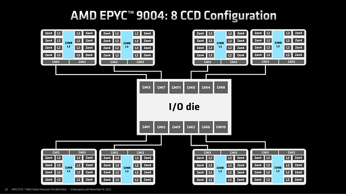
*Figure 8: Public document from one of the major CPU vendors, Source: (AMD EPYC 9004 Genoa Chiplet Architecture 8x CCD — ServeTheHome)*

Here is a comparison of the same workload run on m7i (centralized cache architecture) vs m7a (distributed cache architecture). Note that, in order to make it closely comparable, Hyperthreading (HT) was disabled on m7i, given previous regression seen in Figure 6, and experiments were run using same core counts. The result clearly shows a fairly consistent difference in performance of approximately 20% as shown in Figure 9

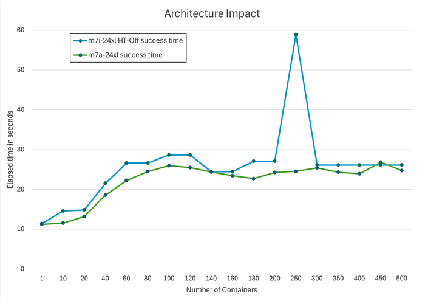
*Figure 9: Architectural impact between m7i and m7a*

### Microbenchmark Results

To prove the above theory related to NUMA, HT and micro-architecture, we developed a small [microbenchmark](https://github.com/Netflix/global-lock-bench) which basically invokes a given number of threads that then spins on a globally contended lock. Running the benchmark at increasing thread counts reveals the latency characteristics of the system under different scenarios. For example, Figure 10 below is the microbenchmark results with NUMA, HT and different microarchitectures.

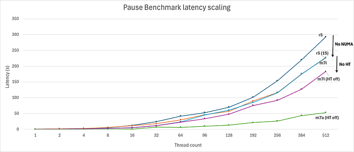
*Figure 10: Global lock contention benchmark results*

Results from this custom synthetic benchmark (pause_bench) confirmed:

- On r5.metal, eliminating NUMA by only using a single socket significantly drops latency at high thread counts
- On m7i.metal-24xl, disabling hyperthreading further improves scaling
- On m7a.24xlarge, performance scales the best, demonstrating that a distributed cache architecture handles cache-line contention in this case of global locks more gracefully.

## Improving Software Architecture

While understanding the impacts of the hardware architecture is important for assessing possible mitigations, the root cause here is contention over a global lock. Working with containerd upstream we came to two possible solutions:

1. Use the newer kernel mount API’s fsconfig() lowerdir+ support to supply the idmap’ed lowerdirs as fd’s instead of filesystem paths. This avoids the move_mount() syscall mentioned prior which requires global locks to mount each layer to the mount table
2. Map the common parent directory of all the layers. This makes the number of mount operations go from O(n) to O(1) per container, where n is the number of layers in the image

Since using the newer API requires using a new kernel, we opted to make the latter [change](https://github.com/containerd/containerd/pull/12092) to benefit more of the community. With that in place, no longer do we see containerd’s flamegraph being dominated by mount-related operations. In fact, as seen in Figure 11 below we had to highlight them in purple below to see them at all!

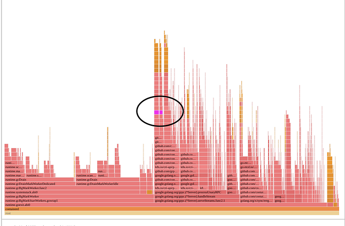
*Figure 11: Optimized solution*

## Conclusion

Our journey migrating to a modern kubelet + containerd runtime at Netflix revealed just how deeply intertwined software and hardware architecture can be when operating at scale. While kubelet/containerd’s usage of unique container users brought significant security gains, it also surfaced new bottlenecks rooted in kernel and CPU architecture — particularly when launching hundreds of many layered container images in parallel. Our investigation highlighted that not all hardware is created equal for this workload: centralized cache management amplified cache contention while distributed cache design smoothly scaled under load.

Ultimately, the best solution combined hardware awareness with software improvements. For an immediate mitigation we chose to route these workloads to CPU architectures that scaled better under these conditions. By changing the software design to minimize per-layer mount operations, we eliminated the global lock as a launch-time bottleneck — unlocking faster, more reliable scaling regardless of the underlying CPU architecture. This experience underscores the importance of holistic performance engineering: understanding and optimizing both the software stack and the hardware it runs on is key to delivering seamless user experiences at Netflix scale.

We trust these insights will assist others in navigating the evolving container ecosystem, transforming potential challenges into opportunities for building robust, high-performance platforms.


---

_Special thanks to the Titus and Performance Engineering teams at Netflix._

---
**Tags:** Performance · Containers · Netflix · Scaling · Cpu
