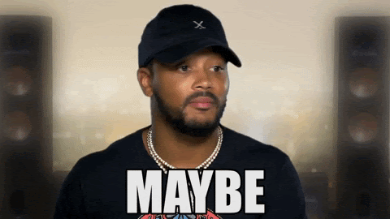
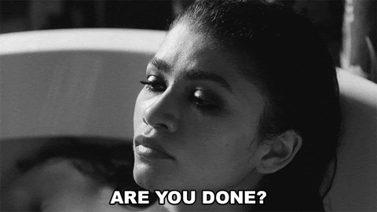
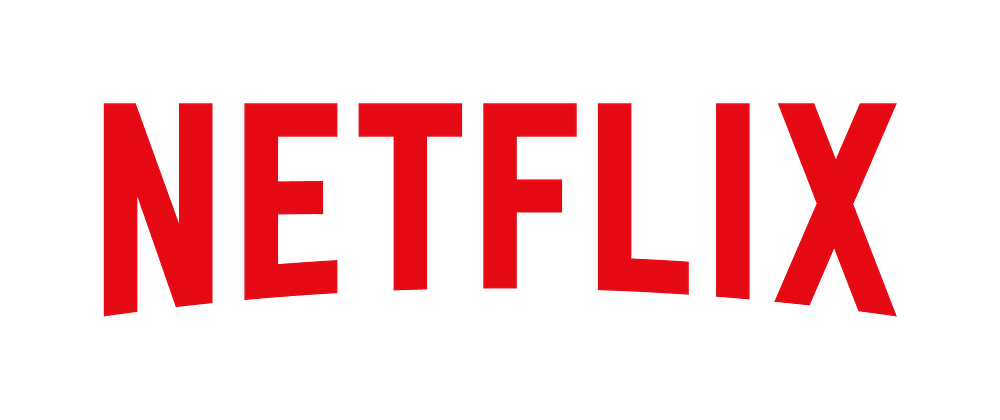
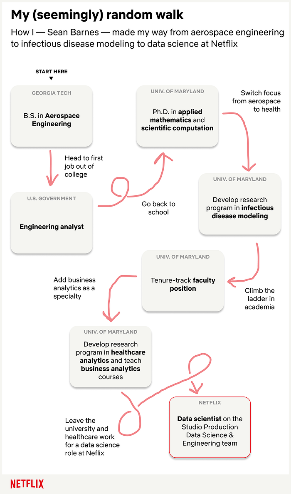
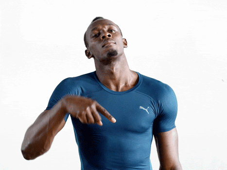
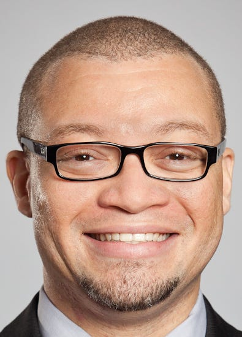

# My (Seemingly) Random Walk to Netflix

> Part of our series on who works in Analytics at Netflix — and what the role entails

_By Sean Barnes, Studio Production Data Science & Engineering_

I am going to tell you a story about a person that works for Netflix. That person grew up dreaming of working in the entertainment industry. They attended the University of Southern California, double majored in data science and television & film production, and graduated summa cum laude. Upon graduation, they received an offer from Netflix to become an analytics engineer, and pursue their lifelong dream of orchestrating the beautiful synergy of analytics and entertainment. Pretty straightforward, right?!

Such a linear trajectory would make for a compelling candidate, but in reality, many of us encounter a few twists and turns along the way. I am here to tell you that these twists and turns are OK, and in many cases, they make you better off in the long run. Whether they worked at a [manufacturer for very large industrial ventilation systems](./mythbusting-the-analytics-journey-58d692ea707e.md), or in finance, healthcare, or elsewhere in tech (big or small), most people on my team have unique paths to their current positions at Netflix. I am going to tell you my story, but I will also tell you about how bringing together people with diverse backgrounds can have unexpected benefits.

When I was growing up, I developed a strong interest in the space program. I went to space camp (nerd alert!), loved space movies (still do!), loved all things astronomy (still do!), and even recall watching a launch or two at school (yes, on those roll-out TV carts). Like any rational person, I set out on a course to pursue a career that would either put me in space or help to put others up there. I decided to attend the Georgia Institute of Technology (Go Jackets!!) and to major in aerospace engineering. I would eventually enroll in the combined BS/MS program, committing to aerospace long-term and to participating in undergraduate and graduate research. In parallel, I also began working as an intern for the U.S. Federal Government as an engineering analyst, which eventually converted into a full-time position. Along the way, I discovered three things that would have a significant impact on my future trajectory:

1. **No lab for me**: I did not like being in a lab, and I did not like the idea of spending a ton of time trying to improve the efficiency of some engineering part/system.
2. **Searching for (and not finding) a specialty: **There was not an aerospace engineering discipline that I was really interested in, and trust me, I really tried because I didn’t want to deviate from my linear career trajectory. Structures, dynamics, control systems, fluids, design…pass, pass, pass, pass, and pass!
3. **Programming joy**: I discovered an aptitude and joy for programming, and in particular, I really liked developing simulation models that could provide meaningful insights and support decision-making without actually building anything or conducting a real-life experiment.

Given these signals, I made the decision to pivot on my initial plan to work for NASA and designed a new plan more in line with my growing interests. That plan consisted of modifying my MS curriculum to support my newly found enthusiasm for simulation modeling, and transitioning to the Applied Mathematics and Scientific Computation doctoral program at the University of Maryland, College Park. This program was perfect for my interests, and allowed me to develop the interdisciplinary mathematical and computation skills that I have been using ever since. I connected with two advisors who were beginning to explore use cases for operations research in healthcare, which was the perfect opportunity to put my interdisciplinary training to work on meaningful real-world applications. I wrote my dissertation on simulation modeling of infectious disease transmission in healthcare facilities and community populations.

> **BOOM, I finally figured out what I was supposed to be doing. End of story, right?!**

Almost! Hang with me just a smidge longer. After defending my dissertation, I left my position with the U.S. Federal Government to become a tenure-track faculty in the Robert H. Smith School of Business at the University of Maryland, College Park. Yep, I stayed close to home, and worked there for 7 years. I grew a lot during this experience, and really enjoyed working with students and research collaborators. This is also the key period when most of my data science growth occurred, as I was developing my healthcare analytics research program and teaching analytics courses to MS and undergraduate students. Throughout this process, I developed skills in Python programming, data visualization, statistical analysis, machine learning, and optimization, both by doing and by teaching. However, in 2019, I explored several data science opportunities in the tech industry, and I was completely won over by the opportunity to join the [Studio Production Data Science & Engineering team at Netflix](https://netflixtechblog.com/studio-production-data-science-646ee2cc21a1).

There is a mathematical concept called a [_random walk_](https://en.wikipedia.org/wiki/Random_walk), which is essentially a path that is generated via a sequence of (seemingly) random steps. Those steps can be generated in any number of ways (e.g., by flipping a coin, observing changes in the stock market, or using a computer-generated sequence of random numbers), and there are numerous ways to adapt this concept to different applications (e.g., computer science, physics, finance, economics, and more). My (seemingly) random walk to Netflix looks a little something like this:

*Acknowledgment to Ritchie King for graphic design*

Why is my walk only _seemingly_ random? These steps may appear to be random, but what I now realize is that there are some common themes in my experience that align well with core components of Netflix culture. For instance, I am passionate about using data and models to inform decision-making, whether the application is in aerospace, healthcare, or entertainment. I really enjoy building relationships and collaborating with others. I also enjoy bringing analytics and modeling into new spaces for which these practices are relatively new, such as in healthcare and entertainment. Lastly, **I’m a learner and an educator, so I love learning new things and helping others learn as well.**

The next observation is also a newly gained perspective. I have recently been reading the book [_Algorithms to Live By_](https://algorithmstoliveby.com/), written by Brian Christian and Tom Griffiths. In the second chapter of the book, the authors describe how the algorithmic tradeoff between exploration and exploitation plays out in real life. **Exploration means to seek out new options so that you can learn more about the possibilities, whereas exploitation means to focus on the best option(s) that you have discovered thus far.** They provide examples of this tradeoff within the context of how one evaluates which restaurants to visit or which candidate to hire. A lot of my experiences before coming to Netflix were part of my exploration phase, which I now realize is totally OK. I believe this exploration is what is needed to find what truly brings joy, and also eliminate things that do not. And now, I have entered the exploitation phase of my career, where I am fully committed to bringing data science into interdisciplinary spaces.

OK, I know, it’s time to wrap this up.

Let me conclude by sharing a quick story about the unexpected benefits of hiring an infectious disease modeler to help accelerate the use of analytics in studio production. According to the U.S. Centers for Disease Control & Prevention, the first known case of COVID-19 was identified in December 2019, which was less than 6 months after my first day at Netflix. By March 2020 — less than 9 months into my tenure — cases of the virus were prevalent across the U.S. and the nation was beginning to shut down.

At studios across Hollywood, production was halted while executives and frontline workers alike scrambled to learn what they could about the virus and the risks associated with restarting production. Given my background, I emailed the vice president of my group (who hired me), and offered to help in any way that I could. He forwarded my email _directly to our CFO_ [1], which initiated a series of events that included the establishment of a medical advisory board [2], development of a simulation model and risk-scoring framework to help support decisions regarding our safe return to production [3], close collaboration with a truly amazing set of individuals and teams across the company, and even a [feature article in The Hollywood Reporter](https://www.hollywoodreporter.com/news/this-is-how-were-going-to-be-making-movies-at-least-for-another-year-or-two-netflix-execs-talk-filming-amid-the-pandemic). Most of this work continues to this day, as we hopefully approach better times ahead. I never could have imagined such a sequence of events when I first arrived in Los Angeles.

So for those of you out there who feel like you’re on a (seemingly) random walk…**YOU ARE NOT ALONE!** Many of us have to do the exploration before we find something that we’re willing to exploit over the long-term, and that process does not always follow [the linear trajectory that we imagine](https://www.linkedin.com/posts/linkedin_remember-career-paths-are-different-for-activity-6785229605147025408-z8li) when we are taking the first steps away from our origins. Try to find the common themes and skills that you have developed across your diverse experiences, and craft that story for potential employers.

And to the potential employers out there, **TAKE SOME RISKS!** Think more deeply about what the ‘non-traditional’ candidate may bring to your organization. You never know, some circumstances may arise for which those (seemingly) less-relevant skills and experiences may become more useful than you imagined. By doing so, you’ll be facilitating exploration _as an_ _organization_, and learning about how to build teams that are truly innovative. So together, employers and employees alike, let’s take our (seemingly) random walks, and explore the possibilities until we find those pockets in space where we can exploit the opportunities and accomplish our greatest goals.

*Me (several years ago)*

---

### Footnotes

1. Which, by the way, is a _very_ Netflix thing to do
2. Featuring one of my long-time infectious disease research collaborators and mentors
3. Embarrassingly named the Barnes Model and the Barnes Scale, respectively, by one of my stunning colleagues

---

_If this post resonates with you and you’d like to explore opportunities with Netflix, check out our _[_analytics site_](http://research.netflix.com/research-area/analytics)_, search _[_open roles_](http://jobs.netflix.com/search?team=Data+Science+and+Engineering)_, and learn about our _[_culture_](http://jobs.netflix.com/culture)_. You can also find more stories like this _[_here_](./analytics-at-netflix-who-we-are-and-what-we-do-7d9c08fe6965.md)_._

---
**Tags:** Netfli · Data Science · Analytics · Career Paths · Academia
