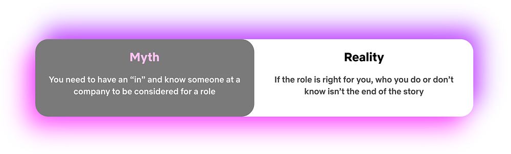
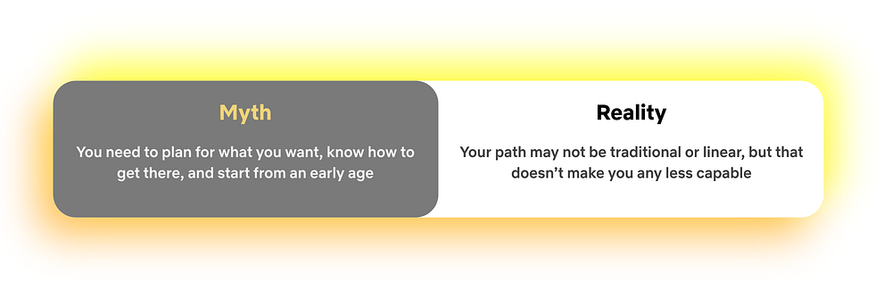
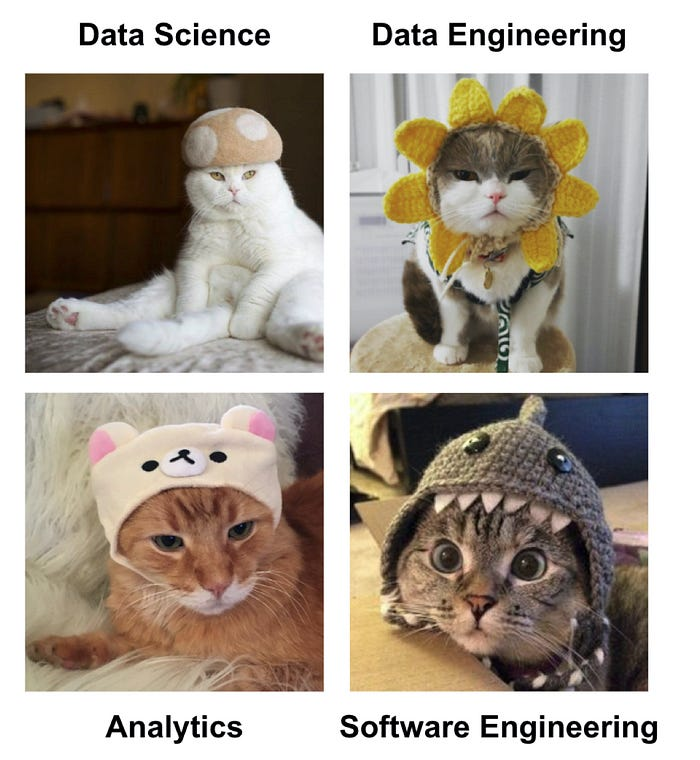
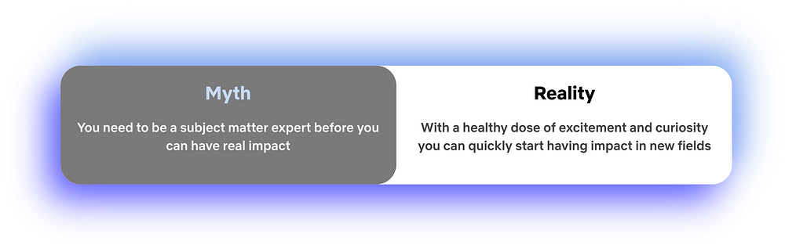
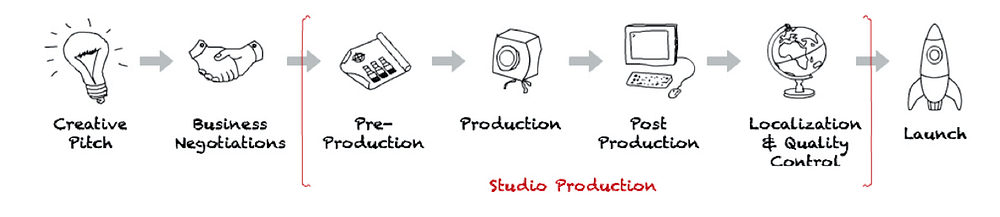

# Mythbusting the Analytics Journey

> Part of our series on who works in Analytics at Netflix — and what the role entails

_by Alex Diamond_

### This Q&A aims to mythbust some common misconceptions about succeeding in analytics at a big tech company.

This isn’t your typical recruiting story. I wasn’t actively looking for a new job and Netflix was the only place I applied. I didn’t know anyone who worked there and just submitted my resume through the Jobs page 🤷🏼‍♀️ . I wasn’t even entirely sure what the right role fit would be and originally applied for a different position, before being redirected to the Analytics Engineer role. So if you find yourself in a similar situation, don’t be discouraged!

## How did you come to Netflix?

Movies and TV have always been one of my primary sources of joy. I distinctly remember being a teenager, perching my laptop on the edge of the kitchen table to “borrow” my neighbor’s WiFi (_back in the days before passwords_ 👵🏻), and streaming my favorite Netflix show. I felt a little bit of ✨magic✨ come through the screen each time, and that always stuck with me. So when I saw the opportunity to actually contribute in some way to making the content I loved, I jumped at it. Working in Studio Data Science & Engineering (“Studio DSE”) was basically a dream come true.

Not only did I find the subject matter interesting, but the Netflix [culture](https://jobs.netflix.com/culture) seemed to align with how I do my best work. **I liked the idea of Freedom and Responsibility, especially if it meant having autonomy to execute projects all the way from inception through completion.** Another major point of interest for me was working with “stunning colleagues”, from whom I could continue to learn and grow.

## What was your path to working with data?

My road-to-data was more of a stumbling-into-data. I went to an alternative high school for at-risk students and had major gaps in my formal education — not exactly a head start. I then enrolled at a local public college at 16. When it was time to pick a major, I was struggling in every subject except one: Math. I completed a combined math bachelors + masters program, but without any professional guidance, networking, or internships, I was entirely lost. I had the piece of paper, but what next? I held plenty_ _of _jobs_ as a student, but now I needed a _career_.

*A visual representation of all the jobs I had in high school and college: From pizza, to gourmet rice krispie treats, to clothing retail, to doors and locks*

After receiving a grand total of *zero* interviews from sending out my resume, the natural next step was…more school. I entered a PhD program in Computer Science and shortly thereafter discovered I really liked the coding aspects more than the theory. So I earned the honor of being a PhD dropout.

*A visual representation of all the hats I’ve worn*

And here’s where things started to click! I used my newfound Python and SQL skills to land an entry-level Business Intelligence Analyst position at a company called Big Ass Fans. They make — you guessed it — very large industrial ventilation fans. I was given the opportunity to branch out and learn new skills to tackle any problem in front of me, aka my “becoming useful” phase. Within a few months I’d picked up BI tools, predictive modeling, and data ingestion/ETL. After a few years of wearing many different proverbial hats, I put them all to use in the Analytics Engineer role here. And ever since, Netflix has been a place where I can do my best work, put to use the skills I’ve gathered over the years, and grow in new ways.

## What does an ordinary day look like?

As part of the Studio DSE team, our work is focused on aiding the movie-making process for our Netflix Originals, leading all the way up to a title’s launch on the service. Despite the affinity for TV and movies that brought me here, I didn’t actually know very much about how they got made. But over time, and by asking lots of questions, I’ve picked up the industry lingo! (_Can you guess what “_[_DOOD_](https://en.wikipedia.org/wiki/Day_out_of_days_(filmmaking))_” stands for?_)

My main stakeholders are members of our Studio team. They’re experts on the production process and an invaluable resource for me, sharing their expertise and providing context when I don’t know what something means. True to the “people over process” philosophy, we adapt alongside our stakeholders’ needs throughout the production process. That means the work products don’t always fit what you might imagine a traditional Analytics Engineer builds — if such a thing even exists!

*A typical production lifecycle*

### On an ordinary day, my time is generally split evenly across:

- 🤝📢 Speaking with stakeholders to understand their primary needs
- 🐱💻 Writing code (SQL, Python)
- 📊📈 Building visual outputs (Tableau, memos, scrappy web apps)
- 🤯✍️ Brainstorming and vision planning for future work

**Some days have more of one than the others, but variety is the spice of life! The one constant is that my day always starts with a ridiculous amount of coffee. And that it later continues with even more coffee. ☕☕☕**

> My road-to-data was more of a stumbling-into-data.

## What advice would you give to someone just starting their career in data?

🐾 **Dip your toes in things.** As you try new things, your interests will evolve and you’ll pick up skills across a broad span of subject areas. The first time I tried building the front-end for a small web app, it wasn’t very pretty. But it piqued my interest and after a few times it started to become second nature.

💪 **Find your strengths and weaknesses**. You don’t have to be an expert in everything. Just knowing when to reach out for guidance on something allows you to uplevel your skills in that area over time. My weakness is statistics: I can use it when needed but it’s just not a subject that comes naturally to me. I own that about myself and lean on my stats-loving peers when needed.

🌸 **Look for roles that allow you to grow.** As you grow in your career, you’ll provide impact to the business in ways you didn’t even expect. As a business intelligence analyst, I gained data science skills. And in my current Analytics Engineer role, I’ve picked up a lot of product management and strategic thinking experience.

*This is what I look like.*

☝️ **One Last Thing**

I started off my career with the vague notion of, “I guess I want to be a data scientist?” But what that’s meant in practice has really varied depending on the needs of each job and project. It’s ok if you don’t have it all figured out. Be excited to try new things, lean into strengths, and don’t be afraid of your weaknesses — own them.

---

_If this post resonates with you and you’d like to explore opportunities with Netflix, check out our _[_analytics site_](http://research.netflix.com/research-area/analytics)_, search _[_open roles_](http://jobs.netflix.com/search?team=Data+Science+and+Engineering)_, and learn about our _[_culture_](http://jobs.netflix.com/culture)_. You can also find more stories like this _[_here_](./analytics-at-netflix-who-we-are-and-what-we-do-7d9c08fe6965.md)_._

---
**Tags:** Netflix · Analytics · Data Science · Data Visualization · Data Engineering
