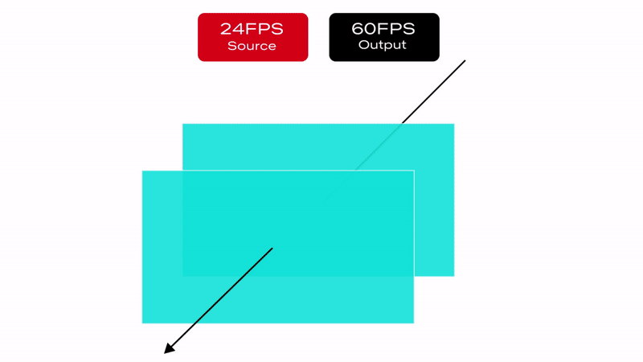
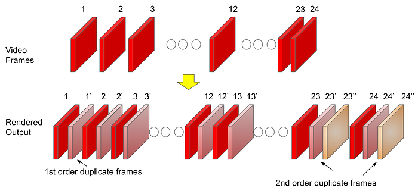
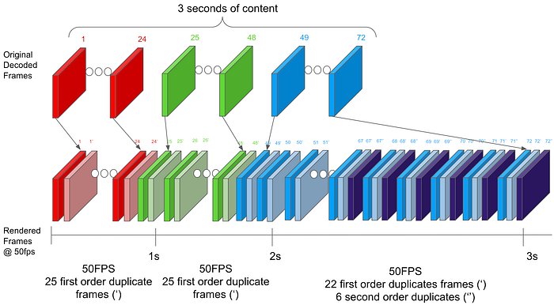

# Native Frame Rate Playback

_by _[_Akshay Garg_](https://www.linkedin.com/in/akshaygarg05/)_, _[_Roger Quero_](https://www.linkedin.com/in/rquero/)

## Introduction

Maximizing immersion for our members is an important goal for the Netflix product and engineering teams to keep our members entertained and fully engaged in our content. Leveraging a good mix of mature and cutting-edge client device technologies to deliver a smooth playback experience with glitch-free in-app transitions is an important step towards achieving this goal. In this article we explain our journey towards productizing a better viewing experience for our members by utilizing features and capabilities in consumer streaming devices.

If you have a streaming device connected to your TV, such as a Roku Set Top Box (STB) or an Amazon FireTV Stick, you may have come across an option in the device display setting pertaining to content frame rate. Device manufacturers often call this feature “Match Content Frame Rate”, “Auto adjust display refresh rate” or something similar. If you’ve ever wondered what these features are and how they can improve your viewing experience, keep reading — the following sections cover the basics of this feature and explain the details of how the Netflix application uses it.

## Problem

Netflix’s content catalog is composed of video captured and encoded in one of various frame rates ranging from 23.97 to 60 frames per second (fps). When a member chooses to watch a movie or a TV show on a **_source device_** (ex. Set-top box, Streaming stick, Game Console, etc…) the content is delivered and then decoded at its **_native frame rate_**, which is the frame rate it was captured and encoded in. After the decode step, the source device converts it to the HDMI output frame rate which was configured based on the capabilities of the HDMI input port of the connected **_sink device_** (TV, AVR, Monitor etc). In general, the output frame rate over HDMI is automatically set to 50fps for [PAL](https://en.wikipedia.org/wiki/PAL) regions and 60fps for [NTSC](https://en.wikipedia.org/wiki/NTSC) regions.

Netflix offers limited high frame rate content (50fps or 60fps), but the majority of our catalog and viewing hours can be attributed to members watching 23.97 to 30fps content. This essentially means that most of the time, our content goes through a process called **_frame rate conversion_** (aka FRC) on the source device which converts the content from its native frame rate to match the HDMI output frame rate by replicating frames. Figure 1 illustrates a simple FRC algorithm that converts 24fps content to 60fps.

*Figure 1 : 3:2 pulldown technique to convert 24FPS content to 60FPS*

Converting the content and transmitting it over HDMI at the output frame rate sounds logical and straightforward. In fact, FRC works well when the output frame rate is an integer multiple of the native frame rate ( ex. 24→48, 25→50, 30→60, 24→120, etc…). On the other hand, FRC introduces a visual artifact called **Judder** when non-integer multiple conversion is required (ex. 24→60, 25→60, etc…), which manifests as choppy video playback as illustrated below:

*With Judder*

*Without Judder*

It is important to note that the severity of the judder depends on the replication pattern. For this reason, judder is more prominent in PAL regions because of the process of converting 24fps content to 50fps over HDMI (see Figure 2):

- Total of 50 frames must be transmitted over HDMI per second
- Source device must replicate the original 24 frames to fill in the missing 26 frames
- 50 output frames from 24 original frames are derived as follows:
- 22 frames are duplicated ( total of 44 frames )
- 2 frames are repeated three times ( total of 6 frames )

*Figure 2: Example of a 24 to 50fps frame rate conversion algorithm*

As a review, judder is more pronounced when the frequency of the number of repeated frames is inconsistent and spread out e.g. in the scenario mentioned above, the frame replication factor varies between 2 and 3 resulting in a more prominent judder.

## Judder Mitigation Solutions

Now that we have a better understanding of the issue, let’s review the solutions that Netflix has invested in. Due to the fragmented nature of device capabilities in the ecosystem, we explored multiple solutions to address this issue for as many devices as possible. Each unique solution leverages existing or new source device capabilities and comes with various tradeoffs.

## Solution #1: Match HDMI frame rate to content Native Frame Rate

The first solution we explored and recently enabled leverages the capability of existing source & sink devices to change the outgoing frame rate on the HDMI link. Once this feature is enabled in the system settings, devices will match the HDMI output frame rate with the content frame rate, either exactly or an integer multiple, without user intervention.

While this sounds like the perfect solution, devices that support older HDMI technologies e.g. HDMI v<2.1, can’t change the frame rate without also changing the HDMI data rate. This results in what is often referred as an “HDMI bonk” which causes the TV to display a blank screen momentarily. Not only is this a disruptive experience for members, but the duration of the blank screen varies depending on how fast the source and sink devices can resynchronize. Figure 3 below is an example of how this transition looks:

*Figure 3: Native frame rate experience with screen blanking*

## Solution #2 : Match HDMI frame rate to content Native Frame Rate w/o screen blanking

Improvements in the recent HDMI standards (HDMI 2.1+) now allow a source device to send the video content at its native frame rate without needing an HDMI resynchronization. This is possible through an innovative technology called [Quick Media Switching](https://www.hdmi.org/spec21sub/quickmediaswitching) (QMS) which is an extension of [Variable Refresh Rate](https://www.hdmi.org/spec21sub/variablerefreshrate) (VRR) targeted for content playback scenarios. QMS allows a source device to maintain a constant data rate on the HDMI link even during transmission of content with different frame rates. It does so by adjusting the amount of non-visible padding data while keeping the amount of visible video data constant. Due to the constant HDMI data rate, the HDMI transmitter and receiver don’t need to resynchronize, leading to a seamless/glitch-free transition as illustrated in Figure 4.

HDMI QMS is positioned to be the ideal solution to address the problem we are presenting. Unfortunately, at present, this technology is relatively new and adoption into source and sink devices will take time.

*Figure 4: Native frame rate experience without screen blanking using HDMI QMS*

## Solution #3: Frame Rate Conversion within Netflix Application

Apart from the above HDMI specification dependent solutions, it is possible for an application like Netflix to manipulate the[ presentation time stamp](https://en.wikipedia.org/wiki/Presentation_timestamp) value of each video frame to minimize the effect of judder i.e. the application can present video frames to the underlying source device platform at a cadence that can help the source device to minimize the judder associated with FRC on the HDMI output link.

Let us understand this idea with the help of an example. Let’s go back to the same 24 to 50 fps FRC scenario that was covered earlier. But, instead of thinking about the FRC rate per second (24 ⇒ 50 fps), let’s expand the FRC calculation time period to 3 seconds (24*3 = 72 ⇒50*3 = 150 fps). For content with a native frame rate of 24 fps, the source device needs to get 72 frames from the streaming application in a period of 3 seconds. Now instead of sending 24 frames per second at a regular per second cadence, for each 3 second period the Netflix application can decide to send 25 frames in the first 2 seconds (25 x 2 = 50) and 22 frames in the 3rd second thereby still sending a total of 72 (50+22) frames in 3 seconds. This approach creates an even FRC in the first 2 seconds (25 frames replicated twice evenly) and in the 3rd second the source device can do a 22 to 50 fps FRC which will create less visual judder compared to the 24->50 fps FRC given a more even frame replication pattern. This concept is illustrated in Figure 5 below.

*Figure 5: FRC Algorithm from Solution#3 for 24 to 50 fps conversion*

NOTE: This solution was developed by [David Zheng](https://www.linkedin.com/in/david-weiguo-zheng-7409724/) in the Partner Experience Technology team at Netflix. Watch out for an upcoming article going into further details of this solution.

## How the Netflix Application Uses these Solutions

Given the possible solutions available to use and the associated benefits and limitations, the Netflix application running on a source device adapts to use one of these approaches based on factors such as source and sink device capabilities, user preferences and the specific use case within the Netflix application. Let’s walk through each of these aspects briefly.

## Device Capability

Every source device that integrates the Netflix application is required to let the application know if it and the connected sink device have the ability to send and receive video content at its native frame rate. In addition, a source device is required to inform whether it can support QMS and perform a seamless playback start of any content at its native frame rate on the connected HDMI link.

As discussed in the introduction section, the presence of a system setting like “Match Content Frame Rate” typically indicates that a source device is capable of this feature.

## User Preference

Even if a source device and the connected sink can support Native content frame rate streaming (seamless or non-seamless), a user might have selected not to do this via the source device system settings e.g. “Match Content Frame Rate” set to “Never”. Or they might have indicated a preference of doing this only when the native content frame rate play start can happen in a seamless manner e.g. “Match Content Frame Rate” set to “Seamless”.

The Netflix application needs to know this user selection in order to honor their preference. Hence, source devices are expected to relay this user preference to the Netflix application to help with this run-time decision making.

## Netflix Use Case

In spite of source device capability and the user preferences collectively indicating that the Native Content Frame Rate streaming should be enabled, the Netflix application can decide to disable this feature for specific member experiences. As an example, when the user is browsing Netflix content in the home UI, we cannot play Netflix trailers in their Native frame rate due to the following reasons:

- If using Solution # 1, when the Netflix trailers are encoded in varying content frame rates, switching between trailers will result in screen blanking, thereby making the UI browsing unusable.
- If using Solution # 2, sending Netflix trailers in their Native frame rate would mean that the associated UI components (movement of cursor, asset selection etc) would also be displayed at the reduced frame rate and this will result in a sluggish UI browsing experience. This is because on HDMI output from the source device, both graphics (Netflix application UI) and video components will go out at the same frame rate (native content frame rate of the trailer) after being blended together on the source device.

To handle these issues we follow an approach as shown in Figure 6 below where we enable the Native Frame Rate playback experience only when the user selects a title and watches it in full screen with minimal graphical UI elements.

*Figure 6: Native Frame Rate usage within Netflix application*

## Conclusion

This article presented features that aim to improve the content playback experience on HDMI source devices. The breadth of available technical solutions, user selectable preferences, device capabilities and the application of each of these permutations in the context of various in-app member journeys represent a typical engineering and product decision framework at Netflix. Here at Netflix, our goal is to maximize immersion for our members through introduction of new features that will improve their viewing experience and keep them fully engaged in our content.

## Acknowledgements

We would like to acknowledge the hard work of a number of teams that came together to deliver the features being discussed in this document. These include Core UI and JS Player development, Netflix Application Software development, AV Test and Tooling (earlier [article](./hdmi-scaling-netflix-certification-8e9cb3ec524f.md) from this team), Partner Engineering and Product teams in the [Consumer Engineering](https://jobs.netflix.com/team?slug=client-and-ui-engineering) organization and our data science friends in the [Data Science and Engineering](https://jobs.netflix.com/team?slug=data-science-and-engineering) organization at Netflix. Diagrams in this article are courtesy of our Partner Enterprise Platform XD team.

---
**Tags:** Hdmi · Qms · Netflix · Streaming · Set Top Box
