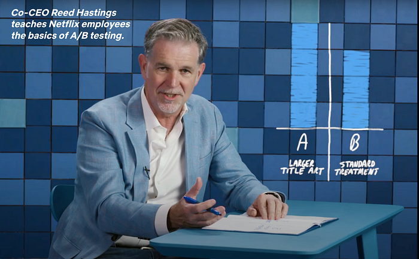
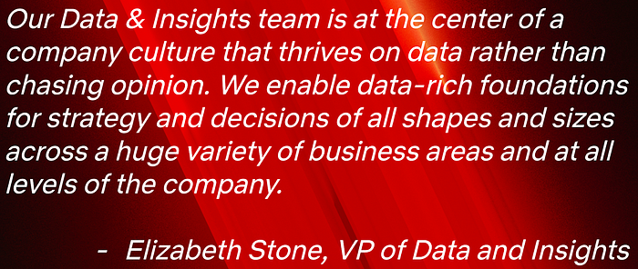
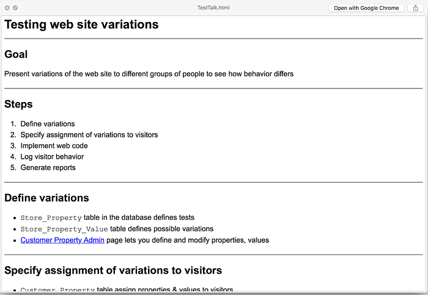
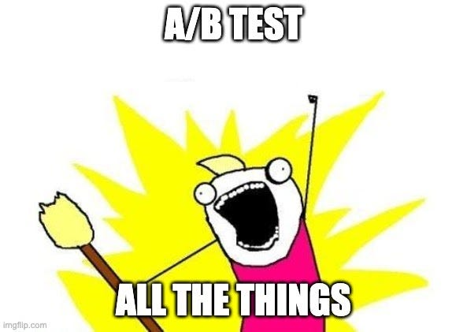
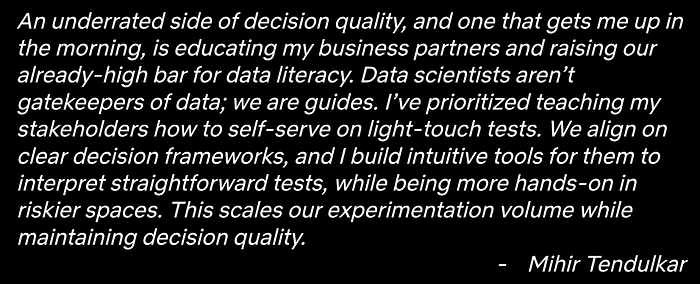

# Netflix: A Culture of Learning

[_Martin Tingley_](https://www.linkedin.com/in/martintingley/)_ with _[_Wenjing Zheng_](https://www.linkedin.com/in/wenjing-zheng/)_, _[_Simon Ejdemyr_](https://www.linkedin.com/in/simon-ejdemyr-22b920123/)_, _[_Stephanie Lane_](https://www.linkedin.com/in/stephanielane1/)_, _[_Colin McFarland_](https://www.linkedin.com/in/mcfrl/)_, _[_Mihir Tendulkar_](https://www.linkedin.com/in/tendulkar/)_, and _[_Travis Brooks_](https://www.linkedin.com/in/traviscb1998/)

> This is the last post in an overview series on experimentation at Netflix. Need to catch up? Earlier posts covered the basics of A/B tests ([Part 1](./decision-making-at-netflix-33065fa06481.md) and [Part 2](./what-is-an-a-b-test-b08cc1b57962.md) ), core statistical concepts ([Part 3](./interpreting-a-b-test-results-false-positives-and-statistical-significance-c1522d0db27a.md) and [Part 4](./interpreting-a-b-test-results-false-negatives-and-power-6943995cf3a8.md)), how to build confidence in a decision ([Part 5](./building-confidence-in-a-decision-8705834e6fd8.md)), and the the role of Experimentation and A/B testing within the larger Data Science and Engineering organization at Netflix ([Part 6](./experimentation-is-a-major-focus-of-data-science-across-netflix-f67923f8e985.md)).

Earlier posts in this series covered the why, what and how of A/B testing, all of which are necessary to reap the benefits of experimentation for product development. But without a little magic, these basics are still not enough.

The secret sauce that turns the raw ingredients of experimentation into supercharged product innovation is [culture](https://jobs.netflix.com/culture). There are never any shortcuts when developing and growing culture, and fostering a culture of experimentation is no exception. Building leadership buy-in for an approach to learning that emphasizes A/B testing, building trust in the results of tests, and building the technical capabilities to execute experiments at scale all take time — particularly within an organization that’s new to these ideas. But the pay-offs of using experimentation and the virtuous cycle of product development via the scientific method are well worth the effort. Our colleagues at [Microsoft](https://www.microsoft.com/en-us/research/group/experimentation-platform-exp/) have shared thoughtful publications on how to [Kickstart the Experimentation Flywheel](https://www.microsoft.com/en-us/research/group/experimentation-platform-exp/articles/it-takes-a-flywheel-to-fly-kickstarting-and-keeping-the-a-b-testing-momentum/) and build a culture of experimentation, while their “[Crawl, Walk, Run, Fly](https://exp-platform.com/Documents/2017-05%20ICSE2017_EvolutionOfExP.pdf)” model is a great tool for assessing the maturity of an experimentation practice.

At Netflix, we’ve been leveraging experimentation and the scientific method for decades, and are fortunate to have a mature experimentation culture. There is broad buy-in across the company, including from the C-Suite, that, whenever possible, results from A/B tests or other causal inference approaches are near-requirements for decision making. We’ve also invested in education programs to up-level company-wide understanding of how we use A/B tests as a framework for product development. In fact, most of the material from this blog series has been adapted from our internal Experimentation 101 and 201 classes, which are open to anyone at Netflix.

### Netflix is organized to learn

As a company, Netflix is organized to emphasize the importance of learning from data, including from A/B tests. Our Data and Insights organization has teams that partner with all corners of the company to deliver a better experience to our members, from understanding content preferences around the globe to delivering a seamless customer support experience. We use qualitative and quantitative consumer research, analytics, experimentation, predictive modeling, and other tools to develop a deep understanding of our members. And we own the data pipelines that power everything from executive-oriented dashboards to the personalization systems that help connect each Netflix member with content that will spark joy for them. This data-driven mindset is ubiquitous at all levels of the company, and the Data and Insights organization is represented at the highest echelon of [Netflix Leadership](https://about.netflix.com/en/about-us).

As discussed in [Part 6](./experimentation-is-a-major-focus-of-data-science-across-netflix-f67923f8e985.md), there are experimentation and causal inference focussed data scientists who collaborate with product innovation teams across Netflix. These data scientists design and execute tests to support learning agendas and contribute to decision making. By diving deep into the details of single test results, looking for patterns across tests, and exploring other data sources, these Netflix data scientists build up domain expertise about aspects of the Netflix experience and become valued partners to product managers and engineering leaders. Data scientists help shape the evolution of the Netflix product through opportunity sizing and identifying areas ripe for innovation, and frequently propose hypotheses that are subsequently tested.

We’ve also invested in a broad and flexible experimentation platform that allows our experimentation program to scale with the ambitions of the company to learn more and better serve Netflix members. Just as the Netflix product itself has evolved over the years, our approach to developing technologies to support experimentation at scale continues to evolve. In fact, we’ve been working to improve experimentation platform solutions at Netflix for more than 20 years — our first investments in tooling to support A/B tests came way back in 2001.

*Early experimentation tooling developed by Stan Lanning at Netflix, in 2001.*

### Learning and experimentation are ubiquitous across Netflix

Netflix has a unique internal [culture](https://jobs.netflix.com/culture) that reinforces the use of experimentation and the scientific method as a means to deliver more joy to all of our current and future members. As a company, we aim to be curious, and to truly and honestly understand our members around the world, and how we can better entertain them. We are also open minded, knowing that great ideas can come from unlikely sources. There’s no better way to learn and make great decisions than to confirm or falsify ideas and hypotheses using the power of rigorous testing. Openly and candidly sharing test results allows everyone at Netflix to develop intuition about our members and ideas for how we can deliver an ever better experience to them — and then the virtuous cycle starts again.

In fact, Netflix has so many tests running on the product at any given time that a member may be simultaneously allocated to several tests. There is not one Netflix product: at any given time, we are testing out a large number of product variants, always seeking to learn more about how we can deliver more joy to our current members and attract new members. Some tests, such as the Top 10 list, are easy for users to notice, while others, such as changes to the [personalization and search systems](https://research.netflix.com/business-area/personalization-and-search) or how Netflix [encodes and delivers streaming video](https://research.netflix.com/business-area/streaming), are less obvious.

At Netflix, we are not afraid to test boldly, and to challenge fundamental or long-held assumptions. The Top 10 list is a great example of both: it’s a large and noticeable change that surfaces a new type of evidence on the Netflix product. Large tests like this can open up whole new areas for innovation, and are actively socialized and debated within the company (see below). On the other end of the spectrum, we also run tests on much smaller scales in order to optimize every aspect of the product. A great example is the testing we do to find just the right text copy for every aspect of the product. By the numbers, we run far more of these smaller and less noticeable tests, and we invest in end-to-end infrastructure that simplifies their execution, allowing product teams to rapidly go from hypothesis to test to roll out of the winning experience. As an example, the [Shakespeare project](https://netflixtechblog.medium.com/words-matter-testing-copy-with-shakespeare-5df48b38158a) provides an end-to-end solution for rapid text copy testing that integrates with the centralized Netflix experimentation platform. More generally, we are always on the lookout for new areas that can benefit from experimentation, or areas where additional methodology or tooling can produce new or faster learnings.

### Debating tests and the importance of humility

Netflix has mature operating mechanisms to debate, make, and socialize product decisions. **Netflix does not make decisions by committee or by seeking consensus. Instead, for every significant decision there is a single “****[Informed Captain](https://jobs.netflix.com/culture)****” who is ultimately responsible for making a judgment call after digesting relevant data and input from colleagues (including dissenting perspectives). Wherever possible, A/B test results or causal inference studies are an expected input to this decision making process.**

In fact, not only are test results expected for product decisions — it’s expected that decisions on investment areas for innovation and testing, test plans for major innovations, and results of major tests are all summarized in memos, socialized broadly, and actively debated. The forums where these debates take place are broadly accessible, ensuring a diverse set of viewpoints provide feedback on test designs and results, and weigh in on decisions. Invites for these forums are open to anyone who is interested, and the price of admission is reading the memo. Despite strong executive attendance, there’s a notable lack of hierarchy in these forums, as we all seek to be led by the data.

Netflix data scientists are active and valued participants in these forums. Data scientists are expected to speak for the data, both what can and what cannot be concluded from experimental results, the pros and cons of different experimental designs, and so forth. Although they are not informed captains on product decisions, data scientists, as interpreters of the data, are active contributors to key product decisions.

Product evolution via experimentation can be a humbling experience. At Netflix, we have experts in every discipline required to develop and evolve the Netflix service (product managers, UI/UX designers, data scientists, engineers of all types, experts in recommendation systems and streaming video optimization — the list goes on), who are constantly coming up with novel hypotheses for how to improve Netflix. But only a small percentage of our ideas turn out to be winners in A/B tests. That’s right: despite our broad expertise, our members let us know, through their actions in A/B tests, that most of our ideas do not improve the service. We build and test hundreds of product variants each year, but only a small percentage end up in production and rolled out to the more than 200 million Netflix members around the world.

The low win rate in our experimentation program is both humbling and empowering. It’s hard to maintain a big ego when anyone at the company can look at the data and see all the big ideas and investments that have ultimately not panned out. But nothing proves the value of decision making through experimentation like seeing ideas that all the experts were bullish on voted down by member actions in A/B tests — and seeing a minor tweak to a sign up flow turn out to be a massive revenue generator.

At Netflix, we do not view tests that do not produce winning experience as “failures.” When our members vote down new product experiences with their actions, we still learn a lot about their preferences, what works (and does not work!) for different member cohorts, and where there may, or may not be, opportunities for innovation. Combining learnings from tests in a given innovation area, such as the Mobile UI experience, helps us paint a more complete picture of the types of experiences that do and do not resonate with our members, leading to new hypotheses, new tests, and, ultimately, a more joyful experience for our members. And as our member base continues to grow globally, and as consumer preferences and expectations continue to evolve, we also revisit ideas that were unsuccessful when originally tested. Sometimes there are signals from the original analysis that suggest now is a better time for that idea, or that it will provide value to some of our newer member cohorts.

Because Netflix tests all ideas, and because most ideas are not winners, our culture of experimentation democratizes ideation. Product managers are always hungry for ideas, and are open to innovative suggestions coming from anyone in the company, regardless of seniority or expertise. After all, we’ll test anything before rolling it out to the member base, and even the experts have low success rates! We’ve seen time and time again at Netflix that product suggestions large and small that arise from engineers, data scientists, even our executives, can result in unexpected wins.

*(Left) Very few of our ideas are winners. (Right) Experimentation democratizes ideation. Because we test all ideas, and because most do not win, there’s an openness to product ideas coming from all corners of the business: anyone can raise their hand and make a suggestion.*

A culture of experimentation allows more voices to contribute to ideation, and far, far more voices to help inform decision making. It’s a way to get the best ideas from everyone working on the product, and to ensure that the innovations that are rolled out are vetted and approved by members.

A better product for our members and an internal culture that is humble and values ideas and evidence: experimentation is a win-win proposition for Netflix.

### Emerging research areas

Although Netflix has been running experiments for decades, we’ve only scratched the surface relative to what we want to learn and the capabilities we need to build to support those learning ambitions. There are open challenges and opportunities across experimentation and causal inference at Netflix: exploring and implementing new methodologies that allow us to learn faster and better; developing software solutions that support research; evolving our internal experimentation platform to better serve a growing user community and ever increasing size and throughput of experiments. And there’s a continuous focus on evolving and growing our experimentation culture through internal events and education programs, as well as external contributions. Here are a few themes that are on our radar:

**Increasing velocity: beyond fixed time horizon experimentation.**

This series has focused on fixed time horizon tests: sample sizes, the proportion of traffic allocated to each treatment experience, and the test duration are all fixed in advance. In principle, the data are examined only once, at the conclusion of the test. This ensures that the false positive rate (see [Part 3](./interpreting-a-b-test-results-false-positives-and-statistical-significance-c1522d0db27a.md)) is not increased by [peeking at the data numerous times](http://library.usc.edu.ph/ACM/KKD%202017/pdfs/p1517.pdf). In practice, we’d like to be able to call tests early, or to adapt how incoming traffic is allocated as we learn incrementally about which treatments are successful and which are not, in a way that preserves the statistical properties described earlier in this series. To enable these benefits, Netflix is investing in sequential experimentation that permits for valid decision making at any time, versus waiting until a fixed time has passed. These methods are already being used to ensure [safe deployment of Netflix client applications](./safe-updates-of-client-applications-at-netflix-1d01c71a930c.md). We are also investing in support for experimental designs that adaptively allocate traffic throughout the test towards promising treatments. The goal of both these efforts is the same: more rapid identification of experiences that benefit members.

**Scaling support for quasi experimentation and causal inference.**

Netflix has learned an enormous amount, and dramatically improved almost every aspect of the product, using the classic online A/B tests, or randomized controlled trials, that have been the focus of this series. But not every business question is amenable to A/B testing, whether due to an inability to randomize at the individual level, or due to factors, such as [spillover effects](https://en.wikipedia.org/wiki/Spillover_(experiment)), that may violate key assumptions for valid causal inference. In these instances, we often rely on the rigorous evaluation of quasi-experiments, where units are not assigned to a treatment or control condition by a random process. But the term “quasi-experimentation” itself covers a broad category of experimental design and methodological approaches that differ between the myriad academic backgrounds represented by the Netflix data science community. How can we synthesize best practices across domains and scale our approach to enable more colleagues to leverage quasi-experimentation?

Our early successes in this space have been driven by investments in knowledge sharing across business verticals, education, and enablement via tooling. Because quasi-experiment use cases span many domains at Netflix, identifying common patterns has been a powerful driver in developing shared libraries that scientists can use to evaluate individual quasi-experiments. And to support our continued scale, we’ve built internal tooling that coalesces data retrieval, design evaluation, analysis, and reproducible reporting, all with the goal to enable our scientists.

We expect our investments in research, tooling, and education for quasi-experiments to grow over time. In success, we will enable both scientists and their cross functional partners to learn more about how to deliver more joy to current and future Netflix members.

**Experimentation Platform as a Product**.

We treat the Netflix Experimentation Platform as an internal product, complete with its own product manager and innovation roadmap. We aim to provide an end-to-end paved path for configuring, allocating, monitoring, reporting, storing and analyzing A/B tests, focusing on experimentation use cases that are optimized for simplicity and testing velocity. Our goal is to make experimentation a simple and integrated part of the product lifecycle, with little effort required on the part of engineers, data scientists, or PMs to create, analyze, and act on tests, with automation available wherever the test owner wants it.

However, if the platform’s default paths don’t work for a specific use case, experimenters can leverage our [democratized contribution model](./reimagining-experimentation-analysis-at-netflix-71356393af21.md), or reuse pieces of the platform, to build out their own solutions. As experimenters innovate on the boundaries of what’s possible in measurement methodology, experimental design, and automation, the Experimentation Platform team partners to commoditize these innovations and make them available to the broader organization.

Three core principles guide product development for our experimentation platform:

- Complexities and nuances of testing such as allocations and methodologies should, typically, be abstracted away from the process of running a single test, with emphasis instead placed on **opinionated defaults that are sensible for a set of use cases or testing areas.**
- Manual intervention at specific steps in the test execution should, typically, be optional, with emphasis instead on test owners being able to** invest their attention where they feel it adds value and leave other areas to automation**.
- Designing, executing, reporting, deciding, and learning are all different phases of the experiment lifecycle that have differing needs and users, and each stage benefits from **purpose built tooling for each use**.

### Conclusion

Netflix has a strong culture of experimentation, and results from A/B tests, or other applications of the scientific method, are generally expected to inform decisions about how to improve our product and deliver more joy to members. To support the current and future scale of experimentation required by the growing Netflix member base and the increasing complexity of our business, Netflix has invested in culture, people, infrastructure, and internal education to make A/B testing broadly accessible across the company.

And we are continuing to evolve our culture of learning and experimentation to deliver more joy to Netflix members around the world. As our member base and business grows, smaller differences between treatment and control experiences become materially important. That’s also true for subsets of the population: with a growing member base, we can become more targeted and look to deliver positive experiences to cohorts of users, defined by geographical region, device type, etc. As our business grows and expands, we are looking for new places that could benefit from experimentation, ways to run more experiments and learn more with each, and ways to accelerate our experimentation program while making experimentation accessible to more of our colleagues.

But the biggest opportunity is to deliver more joy to our members through the virtuous cycle of experimentation.

Interested in learning more? Explore our [research site](http://research.netflix.com/).

Interested in joining us? Explore our [open roles](https://jobs.netflix.com/).

---
**Tags:** Ab Testing · Causal Inference · Experimentation · Decision Making
