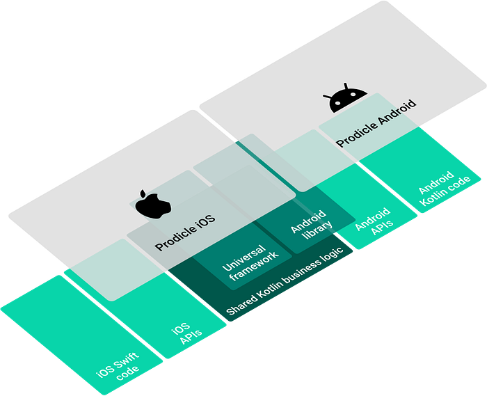
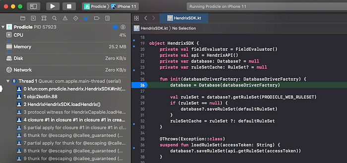

# Netflix Android and iOS Studio Apps — now powered by Kotlin Multiplatform

By [David Henry](https://www.linkedin.com/in/davidmatthewhenry/) & [Mel Yahya](https://www.linkedin.com/in/hemel-yahya-b193681b/)

Over the last few years Netflix has been developing a mobile app called Prodicle to innovate in the physical production of TV shows and movies. The world of physical production is fast-paced, and needs vary significantly between the country, region, and even from one production to the next. The nature of the work means we’re developing write-heavy software, in a distributed environment, on devices where less than ⅓ of our users have very reliable connectivity whilst on set, and with a limited margin for error. For these reasons, as a small engineering team, we’ve found that optimizing for reliability and speed of product delivery is required for us to serve our evolving customers’ needs successfully.

The high likelihood of unreliable network connectivity led us to lean into mobile solutions for robust client side persistence and offline support. The need for fast product delivery led us to experiment with [a multiplatform architecture](./making-our-android-studio-apps-reactive-with-ui-components-redux-5e37aac3b244.md). Now we’re taking this one step further by using [Kotlin Multiplatform](https://kotlinlang.org/lp/mobile/) to write platform agnostic business logic _once_ in Kotlin and compiling to a Kotlin library for Android and a native Universal Framework for iOS via [Kotlin/Native](https://kotlinlang.org/docs/reference/native-overview.html).

## Kotlin Multiplatform

> Kotlin Multiplatform allows you to use a single codebase for the business logic of iOS and Android apps. You only need to write platform-specific code where it’s necessary, for example, to implement a native UI or when working with platform-specific APIs.

Kotlin Multiplatform approaches cross-platform mobile development differently from some well known technologies in the space. Where other technologies abstract away or completely replace platform specific app development, Kotlin Multiplatform is complementary to existing platform specific technologies and is geared towards replacing platform agnostic business logic. It’s a new tool in the toolbox as opposed to replacing the toolbox.

This approach works well for us for several reasons:

1. Our Android and iOS studio apps have a shared architecture with similar or in some cases identical business logic written on both platforms.
2. Almost 50% of the production code in our Android and iOS apps is decoupled from the underlying platform.
3. **Our appetite for exploring the latest technologies offered by respective platforms (Android Jetpack Compose, Swift UI, etc) isn’t hampered in any way.**

So, what are we doing with it?

## Experience Management

As noted earlier, our user needs vary significantly from one production to the next. This translates to a large number of app configurations to toggle feature availability and optimize the in-app experience for each production. Decoupling the code that manages these configurations from the apps themselves helps to reduce complexity as the apps grow. Our first exploration with code sharing involves the implementation of a mobile SDK for our internal experience management tool, Hendrix.

At its core, Hendrix is a simple interpreted language that expresses how configuration values should be computed. These expressions are evaluated in the current app session context, and can access data such as A/B test assignments, locality, device attributes, etc. For our use-case, we’re configuring the availability of production, version, and region specific app feature sets.

Poor network connectivity coupled with frequently changing configuration values in response to user activity means that on-device rule evaluation is preferable to server-side evaluation.

This led us to build a lightweight Hendrix mobile SDK — a great candidate for Kotlin Multiplatform as it requires significant business logic and is entirely platform agnostic.

## Implementation

For brevity, we’ll skip over the Hendrix specific details and touch on some of the differences involved in using Kotlin Multiplatform in place of Kotlin/Swift.

### Build

For Android, it’s business as usual. The Hendrix Multiplatform SDK is imported via gradle as an Android library project dependency in the same fashion as any other dependency. On the iOS side, the native binary is included in the Xcode project as a universal framework.

### Developer ergonomics

Kotlin Multiplatform source code can be edited, recompiled, and can have a debugger attached with breakpoints in Android Studio and Xcode (including lldb support). Android Studio works out of the box, Xcode support is achieved via TouchLabs’ [xcode-kotlin](https://github.com/touchlab/xcode-kotlin) plugin.

*Debugging Kotlin source code from Xcode.*

### Networking

Hendrix interprets rule set(s) — remotely configurable files that get downloaded to the device. We’re using [Ktor](https://ktor.io/)’s Multiplatform HttpClient to embed our networking code within the SDK.

### Disk cache

Of course, network connectivity may not always be available so downloaded rule sets need to be cached to disk. For this, we’re using [SQLDelight](https://cashapp.github.io/sqldelight/) along with it’s Android and Native Database drivers for Multiplatform persistence**.**

## Final thoughts

We’ve followed the evolution of Kotlin Multiplatform keenly over the last few years and believe that the technology has reached an inflection point. The tooling and build system integrations for Xcode have improved significantly such that the complexities involved in integration and maintenance are outweighed by the benefit of not having to write and maintain multiple platform specific implementations.

Opportunities for additional code sharing between our Android and iOS studio apps are plentiful. Potential future applications of the technology become even more interesting when we consider that [Javascript transpilation](https://kotlinlang.org/docs/reference/js-overview.html) is also possible.

We’re excited by the possibility of evolving our studio mobile apps into thin UI layers with shared business logic and will continue to share our learnings with you on that journey.

---
**Tags:** Android · IOS · Kotlin Multiplatform · Kotlin · Mobile App Development
