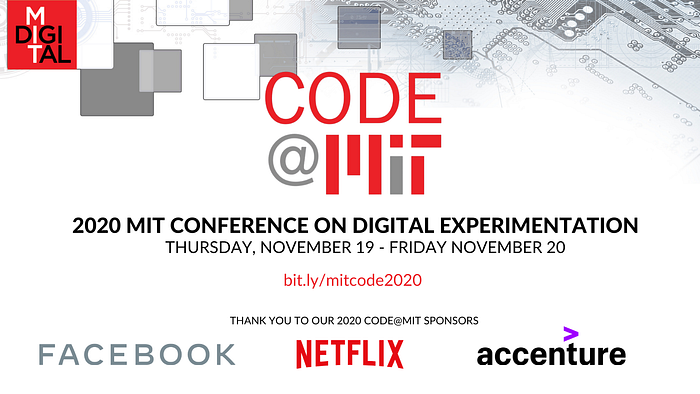
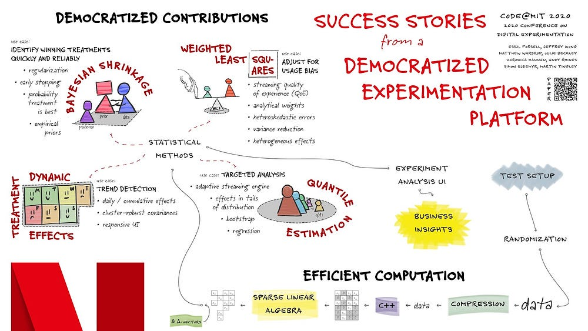

# Netflix at MIT CODE 2020

[_Martin Tingley_](https://www.linkedin.com/in/martintingley/)

In November, Netflix was a proud sponsor of the [2020 Conference on Digital Experimentation](http://ide.mit.edu/events/2020-conference-digital-experimentation-code) (CODE), hosted by the MIT Initiative on the Digital Economy. As well as providing sponsorship, Netflix data scientists were active participants, with three contributions.

[Eskil Forsell](https://www.linkedin.com/in/eskilforsell/en/) and colleagues presented a poster describing [_Success stories from a democratized experimentation platform_](https://drive.google.com/file/d/1TjTkgSzGQXtFxro5vdInUUIpsmJPdCiO/view?usp=sharing). Over the last few years, we’ve been [Reimagining Experimentation Analysis at Netflix](./reimagining-experimentation-analysis-at-netflix-71356393af21.md) with an open platform that supports contributions of metrics, methods and visualizations. This poster, reproduced below, highlights some of the success stories we are now seeing, as data scientists across Netflix partner with our platform team to broaden the suite of methodologies we can support at scale. Ultimately, these successes support confident decision making from our experiments, and help Netflix deliver more joy to our members!

[Simon Ejdemyr](https://www.linkedin.com/in/simon-ejdemyr-22b920123/) presented a talk describing how Netflix is exploring [Low-latency multivariate Bayesian shrinkage in online experiments](https://drive.google.com/file/d/11vKsMl_U8aUbaj3_TQ6Ewdc3iD0Ytpq_/view?usp=sharing). This work is another example of the benefits of the open Experimentation Platform at Netflix, as we are able to research and implement new methods directly within our production environment, where we can assess their performance in real applications. In such empirical validations of our Bayesian implementation, we see meaningful improvements to statistical precision, including reductions in sign and magnitude errors that can be common to traditional approaches to identifying winning treatments.

Finally, [Jeffrey Wong](https://www.linkedin.com/in/jeffctwong/) participated in a Practitioners Panel discussion with [Lilli Dworkin](https://www.linkedin.com/in/lilidworkin/) (Facebook) and [Ronny Kohavi](https://www.linkedin.com/in/ronnyk/) (Airbnb), moderated by [Dean Eckles](https://www.linkedin.com/in/eckles/). One theme of the discussion was the challenge of applying the cutting edge causal inference methods that are developed by academic researchers in the context of the highly scaled and automated experimentation platforms at major technology companies. To address these challenges, Netflix has made a deliberate investment in [Computational Causal Inference](./computational-causal-inference-at-netflix-293591691c62.md), an interdisciplinary and collaborative approach to accelerating causal inference research and providing data-science-centric software that helps us address scaling issues.

CODE was a great opportunity for us to share the progress we’ve made at Netflix, and to learn from our colleagues from academe and industry. We are all looking forward to CODE 2021, and to engaging with the experimentation community throughout 2021.

---
**Tags:** Experimentation · A B Testing · Causal Inference · Data Science
