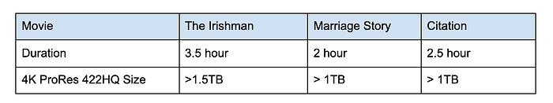
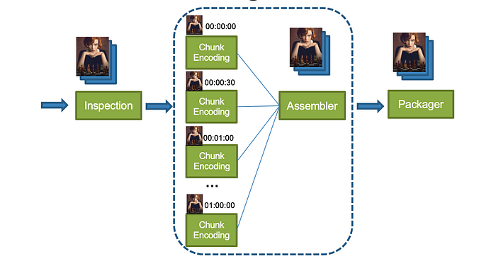
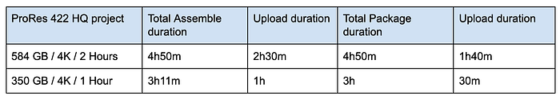
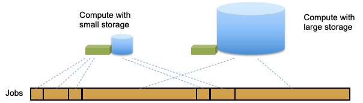
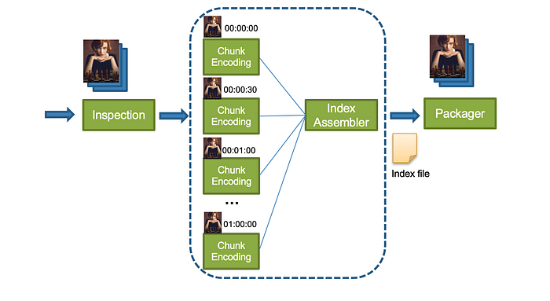
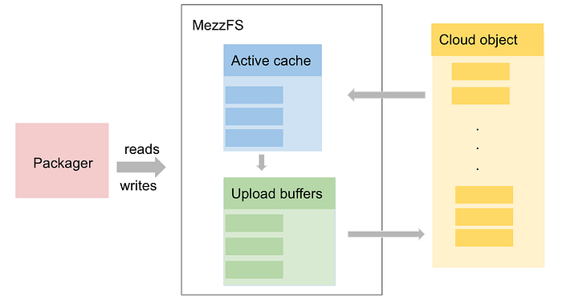
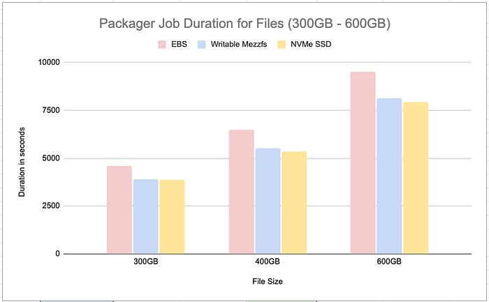

# Netflix Cloud Packaging in the Terabyte Era

By [_Xiaomei Liu_](https://www.linkedin.com/in/xiaomei-liu-b475711/)_, _[_Rosanna Lee_](https://www.linkedin.com/in/rosanna-lee-197920/)_, _[_Cyril Concolato_](https://www.linkedin.com/in/cyril-concolato-567a522/)

### Introduction

Behind the scenes of the beloved Netflix streaming service and content, there are many technology innovations in media processing. Packaging has always been an important step in media processing. After content ingestion, inspection and encoding, the packaging step encapsulates encoded video and audio in codec agnostic container formats and provides features such as audio video synchronization, random access and DRM protection. Our previous tech blog [Packaging award-winning shows with award-winning technology](./packaging-award-winning-shows-with-award-winning-technology-c1010594ba39.md) detailed our packaging technology deployed on the streaming side.

As Netflix becomes a producer of award winning content, the studio and content creation needs are also pushing the envelope of technology advancements. As an example, cloud-based post-production editing and collaboration pipelines demand a complex set of functionalities, including the generation and hosting of high quality proxy content. Supporting those workflows poses new challenges to our packaging service.

### The Terabyte Era

Apple ProRes encoded video and PCM audio with Quicktime container are one of the most popular formats in professional post-production editing. The ProRes codec family provides great editing performance and image quality. ProRes 422 HQ offers visually lossless preservation of the highest quality professional HD video and is a great video format choice for high quality editing proxy.

As described by the white paper _Apple ProRes_ ([link](https://www.apple.com/final-cut-pro/docs/Apple_ProRes_White_Paper.pdf)), the target data rate of the Apple ProRes HQ for 1920x1080 at 29.97 is 220 Mbps. With the wide adoption of 4K content across the production pipeline, the generation of ProRes 422 HQ at the resolution of 3840x2160 requires our processing pipeline to encode and package content in the order of terabytes. The following table gives us an example of file sizes for 4K ProRes 422 HQ proxies.

*Table 1: Movie and File Size Examples*

### Initial Architecture

A simplified view of our initial cloud video processing pipeline is illustrated in the following diagram. The inspection stage examines the input media for compliance with Netflix’s delivery specifications and generates rich metadata. This metadata includes both file level information such as video encoding format, video frame rate, and resolution, as well as frame level information such as frame offset, frame dependency, and frame active region to facilitate downstream processing stages. After the inspection stage, we leverage the cloud scaling functionality to slice the video into chunks for the encoding to expedite this computationally intensive process (more details in [High Quality Video Encoding at Scale](https://netflixtechblog.com/high-quality-video-encoding-at-scale-d159db052746)) with parallel chunk encoding in multiple cloud instances. Once all the chunks are encoded, they are physically stitched back into a final encoded bitstream. Lastly, the packager kicks in, adding a system layer to the asset, making it ready to be consumed by the clients.

*Figure 1: A Simplified Video Processing Pipeline*

With this architecture, chunk encoding is very efficient and processed in distributed cloud computing instances. However, assembly and packaging become the processing bottleneck, especially when the file size increases to the terabyte range. From chunk encoding to assembly and packaging, the result of each previous processing step must be uploaded to cloud storage and then downloaded by the next processing step.

Uploading and downloading data always come with a penalty, namely latency. While the input to our encoders, assemblers and packager instances is mounted using [MezzFS](./mezzfs-mounting-object-storage-in-netflixs-media-processing-platform-cda01c446ba.md) and therefore read in parallel to be processed, output data is uploaded only after all processing is complete. The following table breaks down the various processing (including download) and uploading phases within an assembler and packager instance operating on large media files. It is worth pointing out that cloud processing is always subject to variable network conditions.

*Table 2: Assembler and Packager Processing Time*

Additionally, in this architecture, the packager still needs access to local storage for its packaged output (before uploading it to the final cloud destination) and any intermediate output if there are multiple passes in the processing. Since not all projects are terabytes projects, allocating the largest cloud storage to all packager instances is not an efficient use of cloud resources. We took the approach of allocating small or large cloud storage space depending on the actual packaging input size (Figure 2). Jobs processing large files were directed to instances with cloud storage large enough to hold intermediate results and packaged output.

*Figure 2: Cloud Resource and Job Sizes*

This initial architecture was designed at a time when packaging from a list of chunks was not possible and terabyte-sized files were not considered. It is very clear now that there will be significant processing savings if the physical assembly of the encoded chunks can be avoided. Also, the use of different sizes of local storage is not optimal, given that we can only support a small number of storage configurations, and given that the configurations need periodic updates as the maximum file size in the catalog inevitably grows.

### Improved Architecture

In order to address the limitations of our initial architecture, we proceeded to make some optimizations.

**Virtual Assembly**

Figure 3 describes how a virtual assembly of the encoded chunks replaces the physical assembly used in our previous architecture. In this approach, an index assembler generates an index file, maintaining the temporal order of the encoded chunks. Care has been taken to ensure all chunks are accounted for and are in the right order during the virtual assembly to ensure the consistency of the final packaged stream and the original source. The index file keeps track of the physical location (URL) of each chunk and also keeps track of the physical location (URL + byte offset + size) of each video frame to facilitate downstream processing. The main advantage of using an assembled index is that any processing downstream of the video encoding can be abstracted away from the physical storage of the encoded video. Media processing services downstream of video encoding have intelligent downloaders that consume the assembled index file in order to mount the encoded video as video frames or encoded chunks. This is also the case with the packager, which reads and writes the encoded chunks only when it is generating the packaged output.

*Figure 3: Video Processing with Index and Virtual Assembly*

Using virtual assembly greatly improves the latency performance of the ProRes 422 HQ proxy generation by removing one round trip of cloud downloading and cloud uploading by the physical assembler.

**Writable MezzFS**

As described in a previous blog post, [MezzFS](./mezzfs-mounting-object-storage-in-netflixs-media-processing-platform-cda01c446ba.md) is a tool developed by Netflix that allows cloud storage objects to be mounted as local files via [FUSE](https://en.wikipedia.org/wiki/Filesystem_in_Userspace). It allows our encoders and packagers to do random access reads of cloud storage objects without having to download an entire object before beginning their processing.

With similar goals in mind for write operations, we set about supporting storage of objects in the cloud without incurring any local storage and before the entire object has been created so that data generation and uploading can occur simultaneously. There are existing distributed file systems for the cloud as well as off-the-shelf FUSE modules for S3. We chose to enhance MezzFS instead of using these other solutions because the cloud storage system where packager stores its output is a custom object store service built on top of S3 with additional security features. Doing so has the added advantage of being able to design and tune the enhancement to suit the requirements of packager and our other encoding applications.

The requirements and challenges for supporting write operations are different from those for read operations. Our previous blog post described how MezzFS addresses the challenges for reads using various techniques, such as adaptive buffering and regional caches, to make the system performant and to lower costs. For write operations, those challenges do not apply. Furthermore, the goal for writes is not to build a general purpose system that supports arbitrary writers, but rather one that maximizes potential packager performance. In order to do so, we started by analyzing the packager’s IO patterns and configuring the packager to make its patterns more friendly to cloud writes.

The problematic pattern of packagers is that they do not always generate data linearly. They sometimes update parts of the file that had been written earlier for various reasons. For example, both ISOBMFF (ISO/IEC 14496–12) and [Apple Quicktime](https://developer.apple.com/library/archive/documentation/QuickTime/QTFF/QTFFPreface/qtffPreface.html) use box structures to represent packaged media. The ‘moov’ box represents the metadata header describing the media while the ‘mdat’ box encapsulates the media content. Boxes start with a header which gives size and type of the box before the box content. When a packager is encapsulating the media content into the ‘mdat’ box, the size of the box is not known until all the media data are processed. To optimize the packager for writable MezzFS, we did not utilize the packager features that require multi-pass processing, intermediate storage and frequent update of headers.

With this packager constraint, there are a number of ways to design a writable MezzFS feature, but we wanted a solution that best fit the IO patterns of the packager in terms of latency, network utilization, and memory usage. In order to do that, the storage cloud object is modeled as a number of fixed size parts. MezzFS maintains a pool of upload buffers that correspond to a subset of these parts. As the packager creates and writes data to the object, data fills up the buffers, which are automatically uploaded asynchronously to the cloud. You can think of packaging as creating a stream of output that is stored directly in the cloud.

What happens when the packager references bytes that have already been uploaded (e.g. when it updates the ‘mdat’ size)? Any single read or write operation may involve a mix of previously uploaded and yet-to-be uploaded bytes. MezzFS borrows from how operating systems handle page faults. It downloads the part(s) that contain the referenced, uploaded bytes and keeps them in an LRU _active_ cache. Packager’s read/write operations are then translated into operations on the upload buffers and/or buffers in the active cache. The buffers in the active cache are uploaded to the cloud as the cache becomes full. Just as with virtual memory management systems, locality of reference is important in determining the active cache size and performance. If the packager updates random, unrelated parts of the file within short periods of time, thrashing would occur and performance would be degraded. Our analysis of packager’s IO patterns determined that the packager makes updates with close proximity to each other — at most few parts at a time — thus making this design viable.

*Figure 4: Overview of Writable MezzFS Design*

Use of MezzFS is not without its cost in terms of performance. Use of FUSE means that file operations must go through MezzFS instead of directly to the kernel. As faster disk technology such as NVMe SSD are adopted, this overhead becomes increasingly noticeable and the time saved by uploading while packaging is counterbalanced by this overhead. As shown in Figure 5, packaging locally using non-NVMe local storage such as AWS Elastic Block Store (EBS) and then uploading takes more time than using MezzFS, but doing the same with NVMe SSD takes less time.

*Figure 5: Performance Comparison of Packager Jobs using Writable MezzFS*

However, time savings is not the only factor to consider when choosing between different upload techniques. Use of writable MezzFS offers the advantage of not requiring a large disk — larger and faster disks incur higher monetary costs and multiple disk size configurations make resource scheduling and sharing more challenging.

## Conclusion

Supporting packaging of media content at terabytes scale is challenging. With innovation from system architecture, platform engineering and underlying packaging tools, processing terabyte-sized media files is now supported with greater efficiency.

The overall ProRes video processing speed is increased from 50GB/Hour to 300GB/Hour. From a different perspective, the processing time to movie runtime ratio is reduced from 6:1 to about 1:1. This significantly improves the Studio high quality proxy generation efficiency and workflow latency.

In addition to speed improvements, there is no longer a need to keep different configurations of local storage for cloud packagers. All the cloud packager instances now share a single scheduling queue with optimized compute resource utilization. There is also no need for multi-terabyte local storage, and no more unexpected out-of-disk processing failures. The single-sized local disk storage is future-proof for movies with longer runtime and higher resolution.

### Acknowledgements

We would like to thank _Anush Moorthy_, _Subbu Venkatrav_ and _Chao Chen _for their contribution to virtual assembly, _Zoran Simic_ and _Barak Alon_ for their contribution to writable MezzFS.

### We’re hiring!

If you are passionate about media processing and platform engineering, come join us at Netflix! The Media Systems team is [hiring](https://jobs.netflix.com/jobs/127695186). Please contact [_Flavio Ribeiro_](mailto:flavior@netflix.com) for more information.
