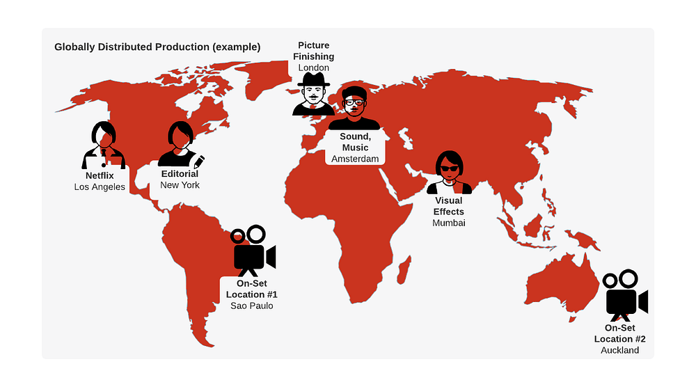
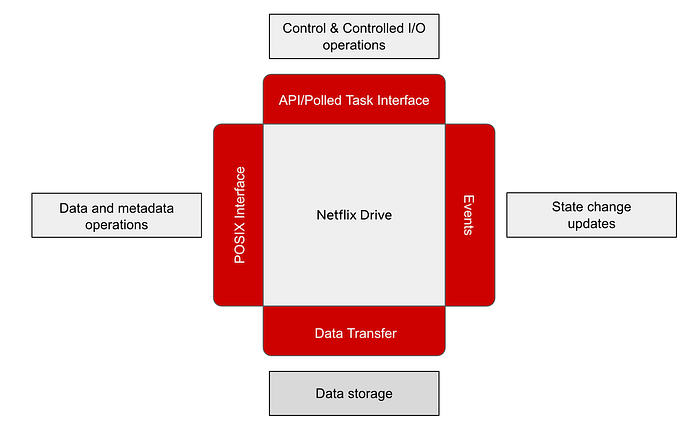
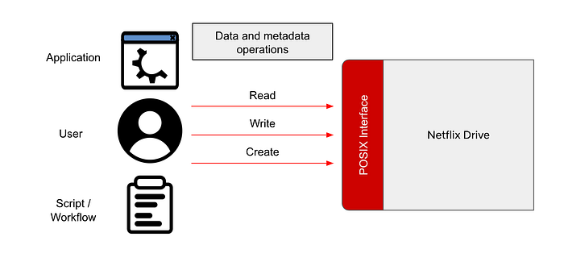
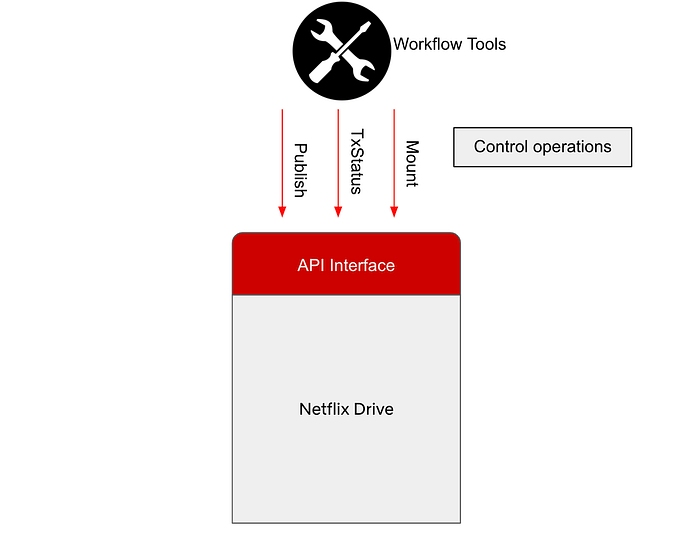
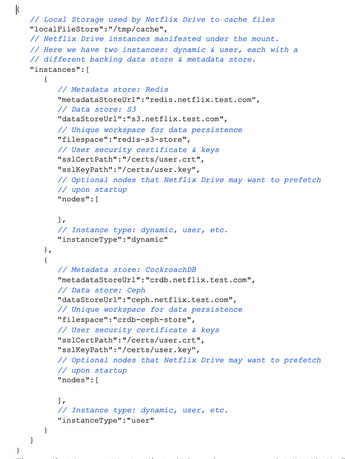
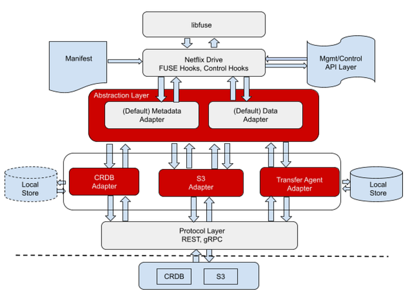
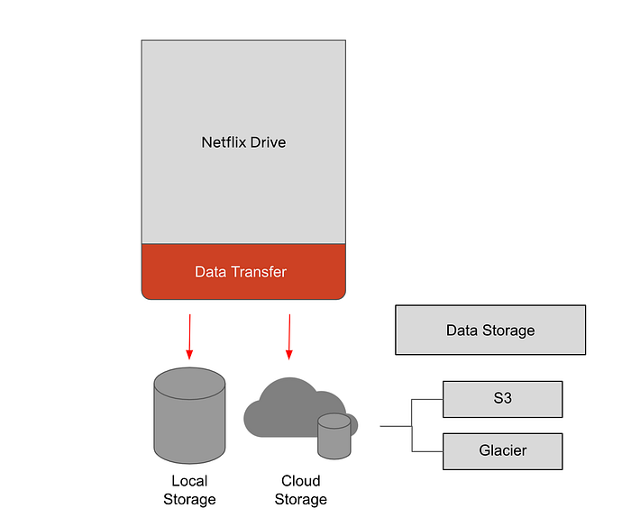

# Netflix Drive

> A file and folder interface for Netflix Cloud Services

_Written by _[_Vikram Krishnamurthy_](https://www.linkedin.com/in/vikram-krishnamurthy-0883726/)_, _[_Kishore Kasi_](https://www.linkedin.com/in/kishore-kasi-8a63165/)_, _[_Abhishek Kapatkar_](https://www.linkedin.com/in/abhishekkapatkar/)_, _[_Tejas Chopra_](https://www.linkedin.com/in/chopratejas/)_, _[_Prudhviraj Karumanchi_](https://www.linkedin.com/in/prudhviraj9/)_, _[_Kelsey Francis_](https://www.linkedin.com/in/kfrancis/), [_Shailesh Birari_](https://www.linkedin.com/in/shaileshbirari/)

In this post, we are introducing Netflix Drive, a Cloud drive for media assets and providing a high level overview of some of its features and interfaces. We intend this to be a first post in a series of posts covering Netflix Drive. In the future posts, we will do an architectural deep dive into the several components of Netflix Drive.

Netflix, and particularly Studio applications (and Studio in the Cloud) produce petabytes of data backed by billions of media assets. Several artists and [workflows](./production-media-management-transforming-media-workflows-by-leveraging-the-cloud-1174699e4a08.md) that may be globally distributed, work on different projects, and each of these projects produce content that forms a part of the large corpus of assets.

Here is an example of globally distributed production where several artists and workflows work in conjunction to create and share assets for one or many projects.

*Fig 1: Globally distributed production with artists working on different assets from different parts of the world*

There are workflows in which these artists may want to view a subset of these assets from this large dataset, for example, pertaining to a specific project. These artists may want to create personal workspaces and work on generating intermediate assets. To support such use cases, access control at the user workspace and project workspace granularity is extremely important for presenting a globally consistent view of pertinent data to these artists.

Netflix Drive aims to solve this problem of exposing different namespaces and attaching appropriate access control to help build a scalable, performant, globally distributed platform for storing and retrieving pertinent assets.

> **Netflix Drive is envisioned to be a Cloud Drive for Studio and Media applications and lends itself to be a generic paved path solution for all content in Netflix.**

It exposes a file/folder interface for applications to save their data and an API interface for control operations. Netflix Drive relies on a data store that will be the persistent storage layer for assets, and a metadata store which will provide a relevant mapping from the file system hierarchy to the data store entities. The major pieces, as shown in _Fig. 2_, are the **file system interface, the API interface, and the metadata and data stores.** We will delve into these in the following sections.

*Fig 2: Netflix Drive components*

## File interface for Netflix Drive

Creative applications such as Nuke, Maya, Adobe Photoshop store and retrieve content using files and folders. Netflix Drive relies on FUSE ([File System In User Space](https://github.com/libfuse/libfuse)) to provide POSIX files and folders interface to such applications. A FUSE based POSIX interface provides feature customization elasticity, deployment configuration flexibility as well as a standard and seamless file/folder interface. A similar user space abstraction is available for Windows ([WinFSP](http://www.secfs.net/winfsp/)) and MacOS ([MacFUSE](https://osxfuse.github.io/))

The operations that originate from user, application and system actions on files and folders translate to a well defined set of function and system calls which are forwarded by the Linux Virtual File System Layer (or a pass-through/filter driver in Windows) to the FUSE layer in user space. The resulting metadata and data operations will be implemented by appropriate metadata and data adapters in Netflix Drive.

*Fig 3: POSIX interface of Netflix Drive*

The POSIX files and folders interface for Netflix Drive is designed as a layered system with the FUSE implementation hooks forming the top layer. This layer will provide entry points for all of the relevant VFS calls that will be implemented. Netflix Drive contains an abstraction layer below FUSE which allows different metadata and data stores to be plugged into the architecture by having their corresponding adapters implement the interface. We will discuss more about the layered architecture in the section below.

## API Interface for Netflix Drive

Along with exposing a file interface which will be a hub of all abstractions, Netflix Drive also exposes API and Polled Task interfaces to allow applications and workflow tools to trigger control operations in Netflix Drive.

For example, applications can explicitly use REST endpoints to publish files stored in Netflix Drive to cloud, and later use a REST endpoint to retrieve a subset of the published files from cloud. The API interface can also be used to track the transfers of large files and allows other applications to be built on top of Netflix Drive.

*Fig 4: Control interface of Netflix Drive*

The Polled Task interface allows studio and media workflow orchestrators to post or dispatch tasks to Netflix Drive instances on disparate workstations or containers. This allows Netflix Drive to be bootstrapped with an empty namespace when the workstation comes up and dynamically project a specific set of assets relevant to the artists’ work sessions or workflow stages. Further these assets can be projected into a namespace of the artist’s or application’s choosing.

Alternatively, workstations/containers can be launched with the assets of interest prefetched at startup. These allow artists and applications to obtain a workstation which already contains relevant files and optionally add and delete asset trees during the work session. For example, artists perform transformative work on files, and use Netflix Drive to store/fetch intermediate results as well as the final copy which can be transformed back into a media asset.

## Bootstrapping Netflix Drive

Given the two different modes in which applications can interact with Netflix Drive, now let us discuss how Netflix Drive is bootstrapped.

On startup, Netflix Drive expects a _manifest_ that contains information about the data store, metadata store, and credentials (tied to a user login) to form an instance of namespace hierarchy. A Netflix Drive mount point may contain multiple Netflix Drive namespaces.

A _dynamic instance _allows_ _Netflix Drive to show a user-selected and user-accessible subset of data from a large corpus of assets. A _user instance_ allows it to act like a Cloud Drive, where users can work on content which is automatically synced in the background periodically to Cloud. On restart on a new machine, the same files and folders will be prefetched from the cloud. We will cover the different namespaces of Netflix Drive in more detail in a subsequent blog post.

Here is an example of a typical bootstrap manifest file.

*A sample manifest file.*

The manifest is a persistent artifact which renders a user workstation its Netflix Drive personality. It survives instance failures and is able to recreate the same stateful interface on any newly deployed instance.

## Metadata and Data Store Abstractions

In order to allow a variety of different metadata stores and data stores to be easily plugged into the architecture, Netflix Drive exposes abstract interfaces for both metadata and data stores. Here is a high level diagram explaining the different layers of abstractions in Netflix Drive

*Fig 5: Layered architecture of Netflix Drive*

### Metadata Store Characteristics

Each file in Netflix Drive would have one or many corresponding metadata nodes, corresponding to different versions of the file. The file system hierarchy would be modeled as a tree in the metadata store where the root node is the top level folder for the application.

Each metadata node will contain several attributes, such as checksum of the file, location of the data, user permissions to access data, file metadata such as size, modification time, etc. A metadata node may also provide support for extended attributes which can be used to model ACLs, symbolic links, or other expressive file system constructs.

Metadata Store may also expose the concept of workspaces, where each user/application can have several workspaces, and can share workspaces with other users/applications. These are higher level constructs that are very useful to Studio applications.

### Data Store Characteristics

Netflix Drive relies on a data store that allows streaming bytes into files/objects persisted on the storage media. The data store should expose APIs that allow Netflix Drive to perform I/O operations. The transfer mechanism for transport of bytes is a function of the data store.

In the first manifestation, Netflix Drive is using an object store (such as Amazon S3) as a data store. In order to expose file store-like properties, there were some changes needed in the object store. Each file can be stored as one or more objects. For Studio applications, file sizes may exceed the maximum object size for Cloud Storage, and so, the data store service should have the ability to store multiple parts of a file as separate objects. It is the responsibility of the data store service to tie these objects to a single file and inform the metadata store of the single unique Id for these several object parts. **This Data store internally implements the chunking of file into several parts, encrypting of the content, and life cycle management of the data.**

**Multi-tiered architecture**

Netflix Drive allows multiple data stores to be a part of the same installation via its bootstrap manifest.

*Fig 6: Multiple data stores of Netflix Drive*

Some studio applications such as encoding and transcoding have different I/O characteristics than a typical cloud drive.

Most of the data produced by these applications is ephemeral in nature, and is read often initially. The final encoded copy needs to be persisted and the ephemeral data can be deleted. To serve such applications, Netflix Drive can persist the ephemeral data in storage tiers which are closer to the application that allow lower read latencies and better economies for read request, since cloud storage reads incur an egress cost. Finally, once the encoded copy is prepared, this copy can be persisted by Netflix Drive to a persistent storage tier in the cloud. A single data store may also choose to archive some subset of content stored in cheaper alternatives.

## Security

Studio applications require strict adherence to security models where only users or applications with specific permissions should be allowed to access specific assets. Security is one of the cornerstones of Netflix Drive design. Netflix Drive dynamic namespace design allows an artist or workflow to access only a small subset of the assets based on the workspace information and access control and is one of the benefits of using Netflix Drive in Studio workflows. Netflix Drive encapsulates the authentication and authorization models in its metadata store. These are translated into POSIX ACLs in Netflix Drive. In the future, Netflix Drive can allow more expressive ACLs by leveraging extended attributes associated with Metadata nodes corresponding to an asset.

Netflix Drive is currently being used by several Studio teams as the paved path solution for working with assets and is integrated with several media suite applications. As of today, Netflix Drive can be installed on **CentOS, MacOS **and** Windows. **In the future blog posts, we will cover implementation details, learnings, performance analysis of Netflix Drive, and some of the applications and workflows built on top of Netflix Drive.

If you are passionate about building Storage and Infrastructure solutions for Netflix Data Platform, we are always looking for talented engineers and managers. Please check out our [job listings](https://jobs.netflix.com/jobs/67097816)

---
**Tags:** Netflix · Storage · S3 · Studio · Infrastructure
