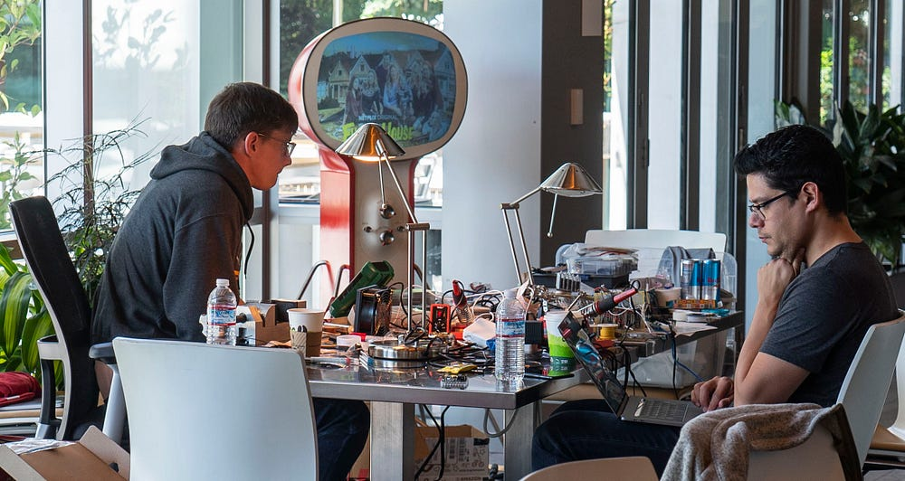
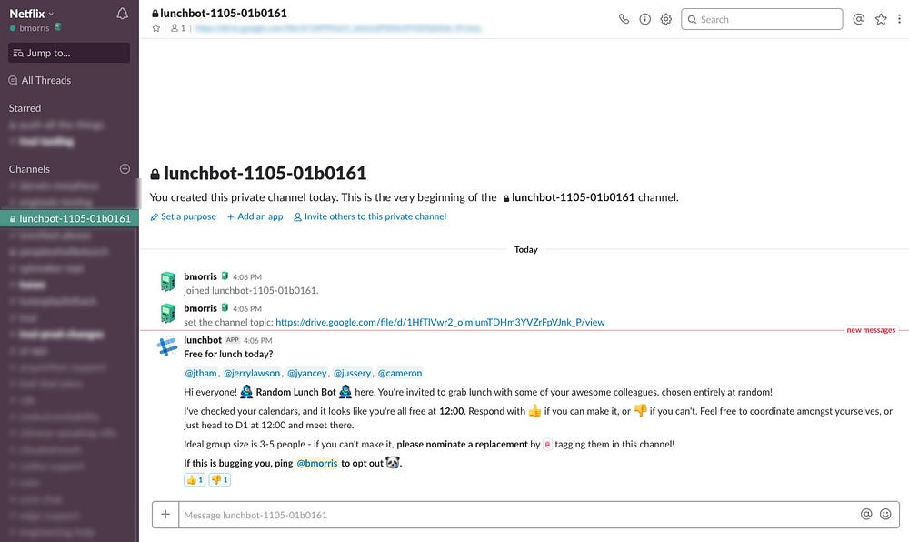

# Netflix Hack Day — Fall 2018

_by _[_Tom Richards_](https://www.linkedin.com/in/tomrichards)_,_[_ _](https://twitter.com/daniel_jacobson)[_Carenina Motion_](https://twitter.com/careninam)_, _[_Ruslan Meshenberg_](https://twitter.com/rusmeshenberg)_, _[_Leslie Posada_](https://www.linkedin.com/profile/view?id=4270321)_, and _[_Kaely Coon_](https://www.linkedin.com/in/kaelycoon/)

Hack Days are a big deal at Netflix. They’re a chance to bring together employees from all our different disciplines to explore new ideas and experiment with emerging technologies.

This Hack Day, there were hacks that ranged from making improvements to the product, to enhancing our internal tools, to just having some fun. We know even the silliest idea can spur something more.

Below, you can find videos made by the hackers of some of our favorite hacks from this event. You can also check out highlights from our past events: [March 2018](https://medium.com/netflix-techblog/netflix-hack-day-winter-2018-b36ee09699d6), [August 2017](https://medium.com/netflix-techblog/netflix-hack-day-summer-2017-ef3ba81a8a77), [January 2017](https://medium.com/netflix-techblog/netflix-hack-day-winter-2017-73590a2fe513), [May 2016](http://techblog.netflix.com/2016/05/netflix-hack-day-spring-2016.html)[, November 2015](http://techblog.netflix.com/2015/11/netflix-hack-day-autumn-2015.html),[ March 2015](http://techblog.netflix.com/2015/03/netflix-hack-day-winter-2015.html),[ February 2014](http://techblog.netflix.com/2014/02/netflix-hack-day.html) &[ August 2014](http://techblog.netflix.com/2014/08/netflix-hack-day-summer-2014.html).

The most important value of our Hack Days is that they support a culture of innovation. We believe in this work, even if it never makes it in the product, and we love to share the creativity and thought put into these ideas.

Major credit and thanks goes to all the teams who put together a great round of hacks in 24 hours.

---

## Jump to Shark

Jump to Shark allows you to skip right to the best (and bloodiest) bits and pieces of _Sharknado_.

_By _[_Juliano Moraes_](https://www.linkedin.com/in/moraesjuliano/)_ and _[_Shivaun Robinson_](https://www.linkedin.com/in/shivaunrobinson/)

## Eye Nav

Apple’s ARKit is a lot of fun to play with, and has enabled much-loved features like Animoji. We care a lot about Accessibility, so we’re eager to try a hack that would allow people to navigate the iOS app just by moving their eyes. The same technology that enables Face ID is great for accurately tracking eye position and facial expression. We used eye tracking to move the pointer around the screen, and measured the time spent on the same area to trigger the equivalent of a tap. We then used a facial gesture (tongue sticking out) to dismiss a screen. We’re hopeful that this kind of technology will become a part of mainstream Accessibility APIs in the future.

_By _[_Ben Hands_](https://twitter.com/benhands)_, _[_John Fox_](https://www.linkedin.com/in/johnfox4/)_, and _[_Steve Henderson_](https://twitter.com/hevets)

## Lunch Bot

Eating lunch together is a great way to meet new people and catch up with our coworkers, but sometimes we’re too busy to make the effort and end up eating lunch at our desks. To solve this problem, I created LunchBot. Every morning, LunchBot invites a random group of coworkers to eat lunch together — and checks their calendars to make sure they’re all free at the same time.

_By _[_Ben Morris_](https://twitter.com/bendmorris)

---
**Tags:** Netflix · Sharks · Slackbot · Eye Tracking · Hackathons
