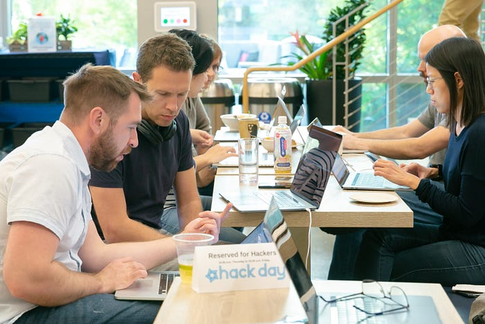

# Netflix Hack Day — Fall 2019

_By _[_Tom Richards_](https://www.linkedin.com/in/tomrichards)_, _[_Carenina Garcia Motion_](https://twitter.com/careninam)_, and _[_Leslie Posada_](https://www.linkedin.com/in/leslie-posada-30151b1/)

**Hack Day at Netflix is an opportunity to build and show off a feature, tool, or quirky app. The goal is simple: experiment with new ideas/technologies, engage with colleagues across different disciplines, and have fun!**

We know even the silliest idea can spur something more.

The most important value of our Hack Days is that they support a culture of innovation. We believe in this work, even if it never ships, and enjoy sharing the creativity and thought put into these ideas.

Below, you can find videos made by the hackers of some of our favorite hacks from this event.

---

## Nostalgiflix

Nostalgiflix** **is a chrome extension that transforms your Netflix web browser into an interactive TV time machine covering three decades (80’s, 90’s, and 00’s.) By dragging the UI slider around, you can view titles originally released within the selected year ( based on their historic box office and episode air dates.) More importantly you can also adjust the video filters in real-time to creatively downgrade the viewing experience, further enhancing the nostalgic effect. We think this feature could encourage our users to watch more of our older content while having fun reliving those moments of cinematic history.

_By _[_Joey Cato_](https://twitter.com/joeycato)_, _[_Nazanin Delam_](https://twitter.com/naz_intech)_, _[_Sumana Mohan_](http://www.linkedin.com/in/msumana/)_, _[_Jeff Shi_](https://www.linkedin.com/in/shijeff/)_, _[_Lily Dwyer_](https://twitter.com/lilymdwyer)_, and _[_Vishal Mishra_](https://www.linkedin.com/in/mishravishal/)

## World of CS

This is a real time visualization of all contacts around the world. Each square on the map represent one of our global contact centers, spanning from Salt Lake City to Brazil, India, and Japan. The heatmap in the background is a historical trend of calls over the last hour, showing which countries are currently most active in contacting customer service. Every line you see is a live customer contact — starting at the customer’s country and ending at the contact center it was routed to. Four different types of contacts are represented in this visualization, white for regular phone calls, light blue for chats, green for calls that are initiated through our mobile apps on android and iOS, and red for contacts which are escalated from one representative to another.

_By _[_Sushruth Puttaswamy_](https://www.linkedin.com/in/sushruth-puttaswamy-6587225)_ and _[_Adam Krasny_](https://www.linkedin.com/in/adamkrasny)

## Bird Box — Automatic AD

Audio Descriptive tracks provide descriptive narration in addition to dialog, helping visually impaired and blind members enjoy our shows. For the Hack Day project, we explored using recent research¹ to automatically generate descriptions, then used our own internal authoring tools to refine the output. We then used synthetic audio and automated mixing techniques to deliver a final audio description track.

_By _[_Adam Wang_](https://www.linkedin.com/in/adam-wang-000a623/)_, _[_Andy Swan_](https://www.linkedin.com/in/andrew-swan-23318a1/)_, _[_Raja Senapati_](https://www.linkedin.com/in/rajasenapati/)_, _[_Shilpa Jois_](https://www.linkedin.com/in/shilpa-jois/)_, _[_Anjali Chablani_](https://www.linkedin.com/in/anjali-chablani-93a1773/)_, _[_Deepa Krishnan_](https://www.linkedin.com/in/deepa-krishnan-593b60/)_, _[_Vidya Sundaram_](https://www.linkedin.com/in/vidya-sundaram-89430a7/)_, and _[_Casey Wilms_](http://linkedin/)

---

You can also check out highlights from our past events: [May 2019](https://medium.com/netflix-techblog/netflix-studio-hack-day-may-2019-b4a0ecc629eb), [November 2018](https://medium.com/netflix-techblog/netflix-hack-day-fall-2018-c05dda4b98c1), [March 2018](https://medium.com/netflix-techblog/netflix-hack-day-winter-2018-b36ee09699d6), [August 2017](https://medium.com/netflix-techblog/netflix-hack-day-summer-2017-ef3ba81a8a77), [January 2017](https://medium.com/netflix-techblog/netflix-hack-day-winter-2017-73590a2fe513), [May 2016](http://techblog.netflix.com/2016/05/netflix-hack-day-spring-2016.html)[, November 2015](http://techblog.netflix.com/2015/11/netflix-hack-day-autumn-2015.html),[ March 2015](http://techblog.netflix.com/2015/03/netflix-hack-day-winter-2015.html),[ February 2014](http://techblog.netflix.com/2014/02/netflix-hack-day.html) &[ August 2014](http://techblog.netflix.com/2014/08/netflix-hack-day-summer-2014.html).

Thanks to all the teams who put together a great round of hacks in 24 hours

---

### Footnotes

1. [Weakly Supervised Dense Event Captioning in Videos](http://papers.nips.cc/paper/7569-weakly-supervised-dense-event-captioning-in-videos.pdf)  
Duan, Xuguang and Huang, Wenbing and Gan, Chuang and Wang, Jingdong and Zhu, Wenwu and Huang, Junzhou  
Advances in Neural Information Processing Systems 31 Curran Associates, Inc.. p. 3062–3072. 2018

---
**Tags:** Hackathons · Netflix · Customer Service · Computer Vision · Nostalgia
