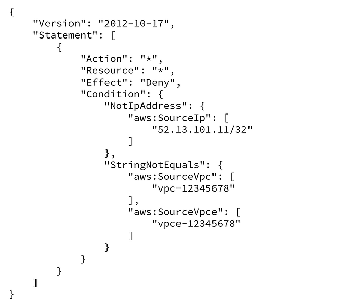
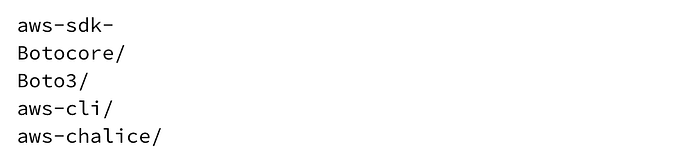
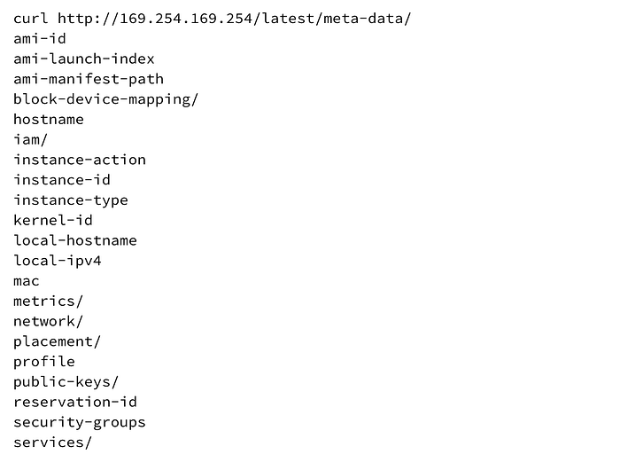
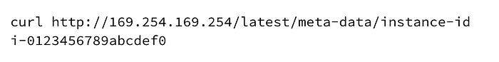
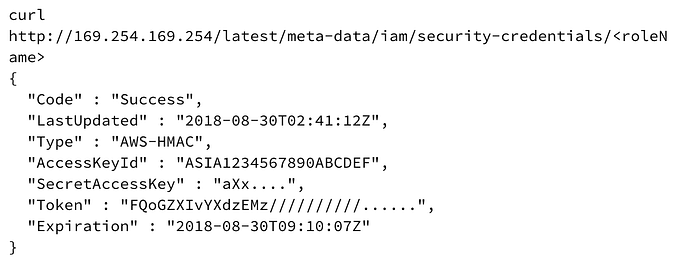
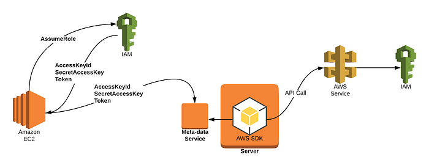
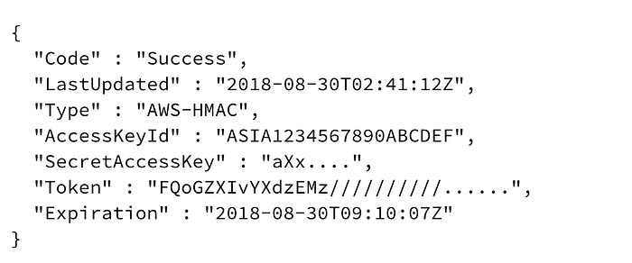
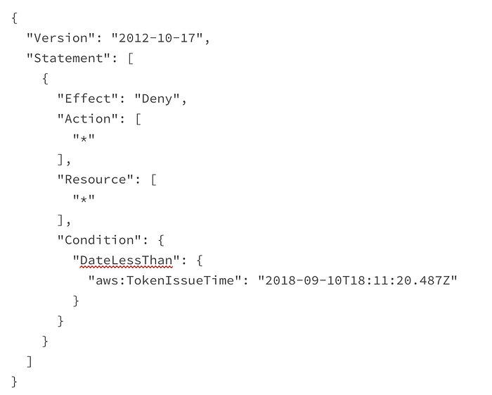
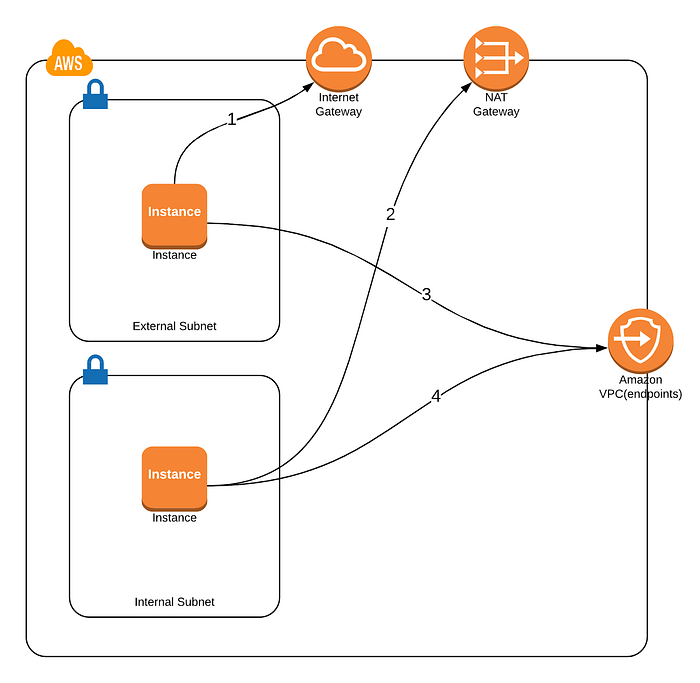

# Netflix Information Security: Preventing Credential Compromise in AWS

by [Will Bengtson](https://www.linkedin.com/in/william-bengtson/)

Previously we wrote about a method for [detecting credential compromise](https://medium.com/netflix-techblog/netflix-cloud-security-detecting-credential-compromise-in-aws-9493d6fd373a) in your AWS environment. **The** methodology focused on a continuous learning model and first use principle. This solution still is reactive in nature — we only detect credential compromise after it has already happened.. Even with detection capabilities, there is a risk that exposed credentials can provide access to sensitive data and/or the ability to cause damage in our environment.

Today, we would like to share two additional layers of security: API enforcement and metadata protection. These layers can be used to help prevent credential compromise in your environment.

## Scope

In this post, we’ll discuss how to prevent or mitigate compromise of credentials due to certain classes of vulnerabilities such as Server Side Request Forgery (SSRF) and XML External Entity (XXE) injection. If an attacker has remote code execution (RCE) or local presence on the AWS server, these methods discussed will not prevent compromise. For more information on how the AWS services mentioned work, see the Background section at the end of this post.

## Protecting Your Credentials

There are many ways that you can protect your AWS temporary credentials. The two methods covered here are:

- Enforcing where API calls are allowed to originate from.
- Protecting the EC2 Metadata service so that credentials cannot be retrieved via a vulnerability in an application such as Server Side Request Forgery ([SSRF](https://www.owasp.org/index.php/Server_Side_Request_Forgery)).

## Credential Enforcement

Credential enforcement only allows API calls to succeed if they originate from a known environment. In AWS, this can be achieved by creating an IAM policy that checks the origin of the API call. To achieve this, it is important to understand where API calls come from (described below in Background). An example policy is shown below.

One way to deploy this is to create a [managed policy](https://docs.aws.amazon.com/IAM/latest/UserGuide/access_policies_managed-vs-inline.html) that encompasses your entire account across all regions. To do this, describe each region and collect your NAT gateway IPs, VPC IDs, and VPC endpoint IDs to create the policy language for the managed policy (similar to the example above) that can be attached to the IAM Roles that you want to protect. The limitation of this method is that you can only protect IAM Roles that are used on EC2 instances deployed to the internal subnet. IAM Roles that are associated with EC2 instances in the external subnet should be excluded. Exposing your service publicly through a Load Balancer would allow you to deploy your EC2 instance into the internal subnet and allow you to attach this policy to your IAM Role.

**Another limitation to this method is that AWS often makes calls on your behalf that are triggered by certain API calls. For example, when you restore an encrypted RDS instance, AWS will make KMS calls on your behalf to figure out which key should be used in the restore process. When these services make calls for you, the AWS credentials that are tied to the IAM Role that made the first call are used. The originating IP address will be one from AWS and not reflect what is in your policy.** You can see this in CloudTrail by looking from events with **sourceIPAddress** resembling **<service>.amazonaws.com**. Even with this limitation, you will find that you can protect most IAM Roles and find workarounds to address this.

## Metadata Service Protection

As described above, the EC2 Metadata service is the mechanism for providing credentials to your application running on an EC2 instance in AWS. It is available by making a request to the IP address of 169.254.169.254. The current AWS Metadata service does not require any HTTP headers to be present and allows any process to make HTTP requests.

Server Side Request Forgery (SSRF) is a vulnerability that allows an attacker to trick the application into making a HTTP/HTTPS requests on their behalf. One of the most common attacks against applications that are vulnerable to SSRF target the Metadata service credential path. When an attacker exploits a SSRF vulnerability, they cannot control which HTTP headers are sent in the request. The lack of header control by an attacker enables a required header on the metadata service to mitigate this class of vulnerability. If an attacker is able to set HTTP headers, such as having a shell on the server and controlling headers in a curl command, the header protection is useful in protecting against an attacker that does not realize there is a header required.

If the Metadata service required a HTTP Header when talking to it, the SSRF attack vector that aims to steal your AWS credentials can be mitigated. In the past it was not possible to create your own Metadata proxy to protect the Metadata service from attacks such as SSRF. The Metadata proxies you might find in open source are typically scoped to providing credentials for containers running on your hosts and not able to protect against these attacks. We have been working with AWS to enable the ability to protect against this attack by setting the **User-Agent** HTTP Header when making requests to the Metadata service from the AWS SDKs to something known. By knowing what **User-Agents **will be set when official AWS SDKs make requests to the Metadata service and combining this with the fact that in the SSRF vulnerability scenario you cannot control HTTP Headers, we are now able to proxy traffic to the Metadata service and reject requests without the appropriate **User-Agent** HTTP Header, thus mitigating the SSRF attack vector on AWS Credentials.

The current **User-Agents** that you will see when proxying traffic from the SDKs start with the following strings:

## Summary

Default configuration in the cloud leaves your environment at increased risk in the event of a credential exposure/compromise. Coupling a Metadata proxy with API enforcement increases the security stance of your AWS environment, implementing defense in depth protections. Combining this approach with [Detecting Credential Compromise in AWS](https://medium.com/netflix-techblog/netflix-cloud-security-detecting-credential-compromise-in-aws-9493d6fd373a) paves a road for protecting IAM in your cloud environment.

Be sure to let us know if you implement this, or something better, in your own environment.

_Will Bengtson, for Netflix Security Tools and Operations_

---

## Background

## What is a credential?

“Credential” in this post is the Amazon Web Services (AWS) API key that is used to describe and make changes within an AWS account.

The main focus are the credentials that are used on an [AWS Elastic Compute Cloud (EC2)](https://aws.amazon.com/ec2) instance, although the outlined approach is valid beyond EC2. AWS provides an ability to assign permissions to an instance through an [Identity and Access Management (IAM)](https://aws.amazon.com/iam/) Role. A Role in AWS provides permissions to applications and/or users. This role is attached to an EC2 instance through an instance profile, which provides credentials to the underlying applications running on the EC2 instance through the EC2 Metadata service.

## What is the EC2 Metadata service?

The [EC2 Metadata service](https://docs.aws.amazon.com/AWSEC2/latest/UserGuide/ec2-instance-metadata.html) is a service provided by AWS that supplies information to your services/applications deployed on EC2 servers such as network information, instance-id, etc. It is read-only, mostly static, and every process with network access on your server can connect to it by default. It also provides operational data such as the availability-zone the application is deployed in, the private IP address, user data that was given to launch your server with, and most importantly for this paper: the AWS credentials that the application uses for making API calls to AWS. These credentials are temporary session credentials that range in a validity from one to six hours. When the expiration for the credentials nears, new session credentials will be generated and available from the Metadata service for your application to use. This provides a seamless experience with continuous access to AWS APIs with short lived credentials. The AWS SDKs are programmed to check the Metadata service prior to credential expiration to retrieve the new set of short lived credentials. The Metadata service is available from instances using the IP address 169.254.169.254. That base URL path of the Metadata service takes form of http://169.254.169.254/<version>/.

The Metadata service is versioned. The most common path used will be the **latest** version of the metadata. Example response from the base Metadata path for the latest metadata is below:

Each path of the Metadata service provides detailed information for the referenced sub-path. For example, querying the ec2 instance-id yields the instance-id of the current instance.

AWS credentials are available by accessing the following path:

## Credential Life Cycle in AWS

Credentials in AWS are either static or temporary (session-based). Each type of credential is valid from **_anywhere in the world by default_**. This makes it extremely easy to get up and running in AWS, but also part of the **_problem_** we are attempting to solve in this post.

Static credentials are credentials that are associated with a user in the [AWS Identity Access and Management (IAM)](https://aws.amazon.com/iam/) service. AWS allows you to generate up to two sets of static credentials per IAM User. These credentials never expire and it is recommended to rotate them. Due to the fact that they never expire, it is almost always best to avoid their use to mitigate risk if a credential is exposed. Realistically, there are reasons to use static credentials occasionally. For example, not all software is cloud native and may require static credentials to function.

Temporary or session-based credentials are the preferred credentials when computing in the cloud. If a session-based credential is exposed, the potential impact of exposure is lower because the credential will eventually expire. AWS typically associates session-based credentials with IAM Roles. The lifecycle of credentials on AWS instances is shown in the graphic below.

When you launch a server in AWS with an IAM Role, AWS creates session credentials that are valid for 1–6 hours. The AWS EC2 service retrieves credentials from the IAM service through an “AssumeRole” API call to the Security Token Service (STS) and retrieves the temporary session credentials. These credentials are passed on to the EC2 Metadata service that is used by your EC2 server. The AWS SDK retrieves these credentials and uses them when making API calls to AWS services. Each API call is evaluated by the IAM service to determine if the role attached to the EC2 instance has permission to make that call and if the temporary credential is still valid. If the role has permission and the token has not expired, the call succeeds. Likewise if the role does not have the permission or the token has expired, the call fails. The EC2 service handles renewal of the credentials and replacing them in the EC2 Metadata service.

Each temporary credential that is issued by the STS service is given an expiration timestamp.

When you make a call, the IAM service will validate that the credentials are still valid (not expired) and check the signature. If both validate, the call is then evaluated to see if the role has the given permissions assigned. The only way to revoke a temporary credential in AWS is to place a policy on the IAM Role that denies all calls where the session credentials were generated before a certain date.

An example policy is shown below:

## Where do API calls come from?

When making a network connection, your data travels from point A, the source, to point B, the destination. Such connections can traverse many paths depending on where A and B are each located on the network.

1. AWS observes the public IP address of your instance as the source IP address if your AWS instance is deployed in an external subnet (public network with a public IP). This is because AWS API calls go directly to the internet.
2. AWS observes the NAT gateway public IP address as the source IP address if your AWS instance is deployed in an internal subnet (private network no public IP). This is because AWS API calls go through a NAT Gateway in order to get to the AWS Service.
3. If your instance (public network public IP) makes a call that goes through a VPC endpoint or Private link, AWS observes the private IP address of your instance.
4. If your instance (private network no public IP) makes a call that goes through a VPC endpoint or Private link, AWS observes the private IP address of your instance.

---
**Tags:** AWS · Cloud Security · Netflixsecurity · Cloud Computing · Security
