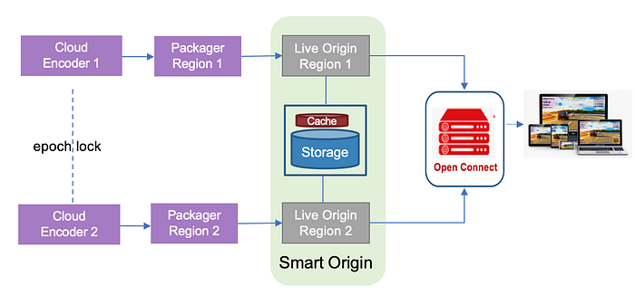
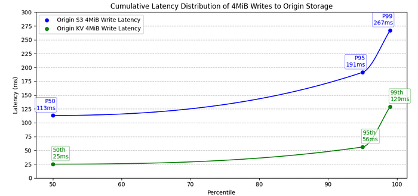
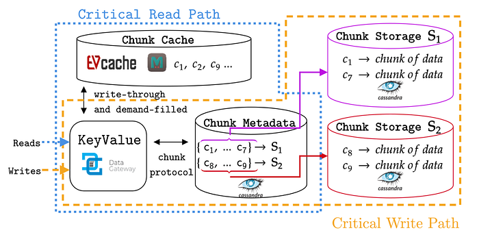
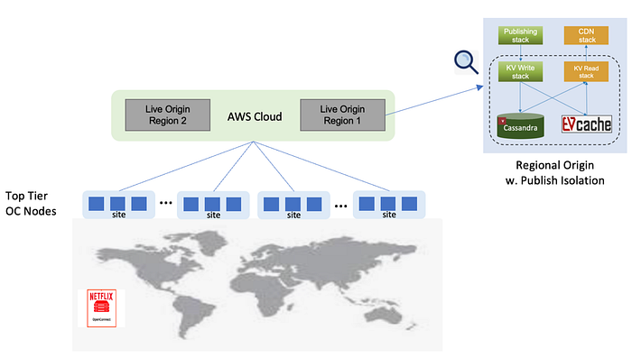
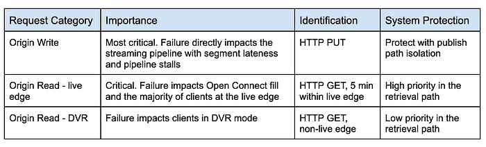
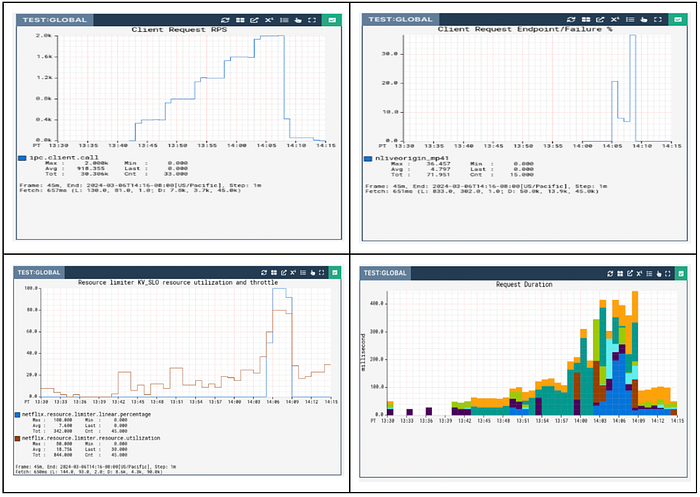

# Netflix Live Origin

[Xiaomei Liu](https://www.linkedin.com/in/xiaomei-liu-b475711/), [Joseph Lynch](https://www.linkedin.com/in/joseph-lynch-9976a431/), [Chris Newton](https://www.linkedin.com/in/chrisnewton2/)

## Introduction

[Behind the Streams: Building a Reliable Cloud Live Streaming Pipeline for Netflix](./building-a-reliable-cloud-live-streaming-pipeline-for-netflix-8627c608c967.md) introduced the architecture of the streaming pipeline. This blog post looks at the custom Origin Server we built for Live — the Netflix Live Origin. It sits at the demarcation point between the cloud live streaming pipelines on its upstream side and the distribution system, Open Connect, Netflix’s in-house Content Delivery Network (CDN), on its downstream side, and acts as a broker managing what content makes it out to Open Connect and ultimately to the client devices.

*Live Streaming Distribution and Origin Architecture*

Netflix Live Origin is a multi-tenant microservice operating on EC2 instances within the AWS cloud. We lean on standard HTTP protocol features to communicate with the Live Origin. The Packager pushes segments to it using PUT requests, which place a file into storage at the particular location named in the URL. The storage location corresponds to the URL that is used when the Open Connect side issues the corresponding GET request.

Live Origin architecture is influenced by key technical decisions of the live streaming architecture. First, resilience is achieved through redundant regional live streaming pipelines, with failover orchestrated at the server-side to reduce client complexity. The implementation of **[epoch locking at the cloud encoder](./building-a-reliable-cloud-live-streaming-pipeline-for-netflix-8627c608c967.md)** enables the origin to select a segment from either encoding pipeline. Second, Netflix adopted a manifest design with [segment templates and constant segment duration](./behind-the-streams-live-at-netflix-part-1-d23f917c2f40.md) to avoid frequent manifest refresh. The constant duration templates enable Origin to predict the segment publishing schedule.

## Multi-pipeline and multi-region aware origin

Live streams inevitably contain defects due to the non-deterministic nature of live contribution feeds and strict real-time segment publishing timelines. Common defects include:

- **Short segments:** Missing video frames and audio samples.
- **Missing segments:** Entire segments are absent.
- **Segment timing discontinuity:** Issues with the Track Fragment Decode Time.

Communicating segment discontinuity from the server to the client via a segment template-based manifest is impractical, and these defective segments can disrupt client streaming.

The redundant cloud streaming pipelines operate independently, encompassing distinct cloud regions, contribution feeds, encoder, and packager deployments. This independence substantially mitigates the probability of simultaneous defective segments across the dual pipelines. Owing to its strategic placement within the distribution path, the live origin naturally emerges as a component capable of intelligent candidate selection.

The Netflix Live Origin features multi-pipeline and multi-region awareness. When a segment is requested, the live origin checks candidates from each pipeline in a deterministic order, selecting the first valid one. Segment defects are detected via lightweight media inspection at the packager. This defect information is provided as metadata when the segment is published to the live origin. In the rare case of concurrent defects at the dual pipeline, the segment defects can be communicated downstream for intelligent client-side error concealment.

## Open Connect streaming optimization

When the Live project started, Open Connect had become highly optimised for VOD content delivery — [nginx](https://freenginx.org/en/) had been chosen many years ago as the Web Server since it is highly capable in this role, and a number of enhancements had been added to it and to the underlying operating system (BSD). Unlike traditional CDNs, Open Connect is more of a distributed origin server — VOD assets are pre-positioned onto carefully selected server machines (OCAs, or Open Connect Appliances) rather than being filled on demand.

Alongside the VOD delivery, an on-demand fill system has been used for non-VOD assets — this includes artwork and the downloadable portions of the clients, etc. These are also served out of the same [nginx](https://freenginx.org/en/) workers, albeit under a distinct server block, using a distinct set of hostnames.

Live didn’t fit neatly into this ‘small object delivery’ model, so we extended the proxy-caching functionality of [nginx](https://freenginx.org/en/) to address Live-specific needs. We will touch on some of these here related to optimized interactions with the Origin Server. Look for a future blog post that will go into more details on the Open Connect side.

The segment templates provided to clients are also provided to the OCAs as part of the Live Event Configuration data. Using the Availability Start Time and Initial Segment number, the OCA is able to determine the legitimate range of segments for each event at any point in time — requests for objects outside this range can be rejected, preventing unnecessary requests going up through the fill hierarchy to the origin. If a request makes it through to the origin, and the segment isn’t available yet, the origin server will return a 404 Status Code (indicating File Not Found) with the expiration policy of that error so that it can be cached within Open Connect until just before that segment is expected to be published.

If the Live Origin knows when segments are being pushed to it, and knows what the live edge is — when a request is received for the immediately next object, rather than handing back another 404 error (which would go all the way back through Open Connect to the client), the Live Origin can ‘hold open’ the request, and service it once the segment has been published to it. By doing this, the degree of chatter within the network handling requests that arrive early has been significantly reduced. As part of this, millisecond grain caching was added to [nginx](https://freenginx.org/en/) to enhance the standard HTTP Cache Control, which only works at second granularity, a long time when segments are generated every 2 seconds.

### Streaming metadata enhancement

The HTTP standard allows for the addition of request and response headers that can be used to provide additional information as files move between clients and servers. The HTTP headers provide notifications of events within the stream in a highly scalable way that is independently conveyed to client devices, regardless of their playback position within the stream.

These notifications are provided to the origin by the live streaming pipeline and are inserted by the origin in the form of headers, appearing on the segments generated at that point in time (and persist to future segments — they are cumulative). Whenever a segment is received at an OCA, this notification information is extracted from the response headers and used to update an in-memory data structure, keyed by event ID; and whenever a segment is served from the OCA, the latest such notification data is attached to the response. This means that, given any flow of segments into an OCA, it will always have the most recent notification data, even if all clients requesting it are behind the live edge. In fact, the notification information can be conveyed on any response, not just those supplying new segments.

### Cache invalidation and origin mask

An invalidation system has been available since the early days of the project. It can be used to “flush” all content associated with an event by altering the key used when looking up objects in cache — this is done by incorporating a version number into the cache key that can then be bumped on demand. This is used during pre-event testing so that the network can be returned to a pristine state for the test with minimal fuss.

Each segment published by the Live Origin conveys the encoding pipeline it was generated by, as well as the region it was requested from. Any issues that are found after segments make their way into the network can be remedied by an enhanced invalidation system that takes such variants into account. It is possible to invalidate (that is, cause to be considered expired) segments in a range of segment numbers, but only if they were sourced from encoder A, or from Encoder A, but only if retrieved from region X.

In combination with Open Connect’s enhanced cache invalidation, the Netflix Live Origin allows _selective encoding pipeline masking_ to exclude a range of segments from a particular pipeline when serving segments to Open Connect. The enhanced cache invalidation and origin masking enable live streaming operations to hide known problematic segments (e.g., segments causing client playback errors) from streaming clients once the bad segments are detected, protecting millions of streaming clients during the DVR playback window.

## Origin storage architecture

Our original storage architecture for the Live Origin was simple: just use [AWS S3](https://aws.amazon.com/s3/) like we do for SVOD. This served us well initially for our low-traffic events, but as we scaled up we discovered that Live streaming has unique latency and workload requirements that differ significantly from on-demand where we have significant time ahead-of-time to pre-position content. While S3 met its stated uptime guarantees, our strict 2-second retry budget inherent to Live events (where every write is critical) led us to explore optimizations specifically tailored for real-time delivery at scale. AWS S3 is an amazing object store, but our Live streaming requirements were closer to those of a global low-latency highly-available database. So, we went back to the drawing board and started from the requirements. The Origin required:

1. [HA Writes] Extremely high _write_ availability, ideally as close to full write availability within a single AWS region, with low second replication delay to other regions. Any failed write operation within 500ms is considered a bug that must be triaged and prevented from re-occurring.
2. [Throughput] High write throughput, with hundreds of MiB replicating across regions
3. [Large Partitions] Efficiently support O(MiB) writes that accumulate to O(10k) keys per partition with O(GiB) total size per event.
4. [Strong Consistency] Within the same region, we needed read-your-write semantics to hit our <1s read delay requirements (must be able to read published segments)
5. [Origin Storm] During worst-case load involving Open Connect edge cases, we may need to handle O(**GiB**) of read throughput _without affecting writes_.

Fortunately, Netflix had previously invested in building a [KeyValue Storage Abstraction](./introducing-netflixs-key-value-data-abstraction-layer-1ea8a0a11b30.md) that cleverly leveraged [Apache Cassandra](https://youtu.be/sQ-_jFgOBng?t=1061) to provide chunked storage of MiB or even GiB values. This abstraction was initially built to support cloud saves of Game state. The Live use case would push the boundaries of this solution, however, in terms of availability for writes (#1), cumulative partition size (#3), and read throughput during Origin Storm (#5).

### High Availability for Writes of Large Payloads

The [KeyValue Payload Chunking and Compression Algorithm](https://youtu.be/paTtLhZFsGE?t=1077) breaks O(MiB) work down so each part can be idempotently retried and hedged to maintain strict latency service level objectives, as well as spreading the data across the full cluster. When we combine this algorithm with Apache Cassandra’s local-quorum consistency model, which allows write availability even with an entire Availability Zone outage, plus a write-optimized [Log-Structured Merge Tree](https://en.wikipedia.org/wiki/Log-structured_merge-tree) (LSM) storage engine, we could meet the first four requirements. After iterating on the performance and availability of this solution, we were not only able to achieve the write availability required, but did so with a P99 _tail_ latency that was similar to the status quo’s P50 _average _latency while also handling cross-region replication behind the scenes for the Origin. This new solution was significantly more expensive (as expected, databases backed by SSD cost more), but minimizing cost was _not_ a key objective and low latency with high availability was:

*Storage System Write Performance*

### High Availability Reads at Gbps Throughputs

Now that we solved the write reliability problem, we had to handle the Origin Storm failure case, where potentially dozens of Open Connect top-tier caches could be requesting multiple O(MiB) video segments at once. Our back-of-the-envelope calculations showed worst-case read throughput in the O(100Gbps) range, which would normally be extremely expensive for a strongly-consistent storage engine like Apache Cassandra. With careful tuning of chunk access, we were able to respond to reads at network line rate (100Gbps) from Apache Cassandra, but we observed unacceptable performance and availability degradation on concurrent writes. To resolve this issue, we introduced write-through caching of chunks using our distributed caching system [EVCache](https://github.com/Netflix/EVCache), which is based on Memcached. This allows almost all reads to be served from a highly scalable cache, allowing us to easily hit 200Gbps and beyond without affecting the write path, achieving read-write separation.

### Final Storage Architecture

In the final storage architecture, the Live Origin writes and reads to KeyValue, which manages a write-through cache to EVCache (memcached) and implements a safe chunking protocol that spreads large values and partitions them out across the storage cluster (Apache Cassandra). This allows almost all read load to be handled from cache, with only misses hitting the storage. This combination of cache and highly available storage has met the demanding needs of our Live Origin for over a year now.

*Storage System High Level Architecture*

Delivering this consistent low latency for large writes with cross-region replication and consistent write-through caching to a distributed cache required solving numerous hard problems with novel techniques, which we plan to share in detail during a future post.

## Scalability and scalable architecture

Netflix’s live streaming platform must handle a high volume of diverse stream renditions for each live event. This complexity stems from supporting various video encoding formats (each with multiple encoder ladders), numerous audio options (across languages, formats, and bitrates), and different content versions (e.g., with or without advertisements). The combination of these elements, alongside concurrent event support, leads to a significant number of unique stream renditions per live event. This, in turn, necessitates a high Requests Per Second (RPS) capacity from the multi-tenant live origin service to ensure publishing-side scalability.

In addition, Netflix’s global reach presents distinct challenges to the live origin on the retrieval side. During the Tyson vs. Paul fight event in 2024, a historic peak of 65 million concurrent streams was observed. Consequently, a scalable architecture for live origin is essential for the success of large-scale live streaming.

### Scaling architecture

We chose to build a highly scalable origin instead of relying on the traditional origin shields approach for better end-to-end cache consistency control and simpler system architecture. The live origin in this architecture directly connects with top-tier Open Connect nodes, which are geographically distributed across several sites. To minimize the load on the origin, only designated nodes per stream rendition at each site are permitted to directly fill from the origin.

*Netflix Live Origin Scalability Architecture*

While the origin service can autoscale horizontally using EC2 instances, there are other system resources that are not autoscalable, such as storage platform capacity and AWS to Open Connect backbone bandwidth capacity. Since in live streaming, not all requests to the live origin are of the same importance, the origin is designed to prioritize more critical requests over less critical requests when system resources are limited. The table below outlines the request categories, their identification, and protection methods.

### Publishing isolation

Publishing traffic, unlike potentially surging CDN retrieval traffic, is predictable, making path isolation a highly effective solution. As shown in the scalability architecture diagram, the origin utilizes separate EC2 publishing and CDN stacks to protect the latency and failure-sensitive origin writes. In addition, the storage abstraction layer features distinct clusters for key-value (KV) read and KV write operations. Finally, the storage layer itself separates read (EVCache) and write (Cassandra) paths. This comprehensive path isolation facilitates independent cloud scaling of publishing and retrieval, and also prevents CDN-facing traffic surges from impacting the performance and reliability of origin publishing.

### Priority rate limiting

Given Netflix’s scale, managing incoming requests during a traffic storm is challenging, especially considering non-autoscalable system resources. The Netflix Live Origin implemented priority-based rate limiting when the underlying system is under stress. This approach ensures that requests with greater user impact are prioritized to succeed, while requests with lower user impact are allowed to fail during times of stress in order to protect the streaming infrastructure and are permitted to retry later to succeed.

Leveraging Netflix’s microservice platform priority rate limiting feature, the origin prioritizes live edge traffic over DVR traffic during periods of high load on the storage platform. The live edge vs. DVR traffic detection is based on the predictable segment template. The template is further cached in memory on the origin node to enable priority rate limiting without access to the datastore, which is valuable especially during periods of high datastore stress.

To mitigate traffic surges, TTL cache control is used alongside priority rate limiting. When the low-priority traffic is impacted, the origin instructs Open Connect to slow down and cache identical requests for 5 seconds by setting a max-age = 5s and returns an HTTP 503 error code. This strategy effectively dampens traffic surges by preventing repeated requests to the origin within that 5-second window.

The following diagrams illustrate origin priority rate limiting with simulated traffic. The nliveorigin_mp41 traffic is the low-priority traffic and is mixed with other high-priority traffic. In the first row: the 1st diagram shows the request RPS, the 2nd diagram shows the percentage of request failure. In the second row, the 1st diagram shows datastore resource utilization, and the 2nd diagram shows the origin retrieval P99 latency. The results clearly show that only the low-priority traffic (nliveorigin_mp41) is impacted at datastore high utilization, and the origin request latency is under control.

*Origin Priority Rate Limiting*

### 404 storm and cache optimization

Publishing isolation and priority rate limiting successfully protect the live origin from DVR traffic storms. However, the traffic storm generated by requests for non-existent segments presents further challenges and opportunities for optimization.

The live origin structures metadata hierarchically as event > stream rendition > segment, and the segment publishing template is maintained at the stream rendition level. This hierarchical organization allows the origin to preemptively reject requests with an HTTP 404(not found)/410(Gone) error, leveraging highly cacheable event and stream rendition level metadata, avoiding unnecessary queries to the segment level metadata:

- If the event is unknown, reject the request with 404
- If the event is known, but the segment request timing does not match the expected publishing timing, reject the request with 404 and cache control TTL matching the expected publishing time
- If the event is known, the requested segment is never generated or misses the retry deadline, reject the request with a 410 error, preventing the client from repeatedly requesting

At the storage layer, metadata is stored separately from media data in the control plane datastore. Unlike the media datastore, the control plane datastore does not use a distributed cache to avoid cache inconsistency. Event and rendition level metadata benefits from a high cache hit ratio when in-memory caching is utilized at the live origin instance. During traffic storms involving non-existent segments, the cache hit ratio for control plane access easily exceeds 90%.

The use of in-memory caching for metadata effectively handles 404 storms at the live origin without causing datastore stress. This metadata caching complements the storage system’s distributed media cache, providing a complete solution for traffic surge protection.

## Summary

The Netflix Live Origin, built upon an optimized storage platform, is specifically designed for live streaming. It incorporates advanced media and segment publishing scheduling awareness and leverages enhanced intelligence to improve streaming quality, optimize scalability, and improve Open Connect live streaming operations.

## Acknowledgement

Many teams and stunning colleagues contributed to the Netflix live origin. Special thanks to [Flavio Ribeiro](https://www.linkedin.com/in/flavioribeiro/?originalSubdomain=br) for advocacy and sponsorship of the live origin project; to [Raj Ummadisetty](https://www.linkedin.com/in/rummadis/), [Prudhviraj Karumanchi](https://www.linkedin.com/in/prudhviraj9/) for the storage platform; to [Rosanna Lee](https://www.linkedin.com/in/rosanna-lee-197920/), [Hunter Ford](https://www.linkedin.com/in/hunterford/), and [Thiago Pontes](https://www.linkedin.com/in/thiagopnts/) for storage lifecycle management; to [Ameya Vasani](https://www.linkedin.com/in/ameya-vasani-8904304/) for e2e test framework; [Thomas Symborski](https://www.linkedin.com/in/thomas-symborski-b4216728/) for orchestrator integration; to [James Schek](https://www.linkedin.com/in/jschek/) for Open Connect integration; to [Kevin Wang](https://www.linkedin.com/in/kzwang/) for platform priority rate limit; to [Di Li](https://www.linkedin.com/in/di-li-09663968/), [Nathan Hubbard](mailto:nhubbard@netflix.com) for origin scalability testing.

---
**Tags:** Live Streaming · Live Origin · Cloud Storage · Content Delivery Network
