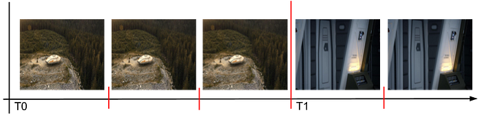
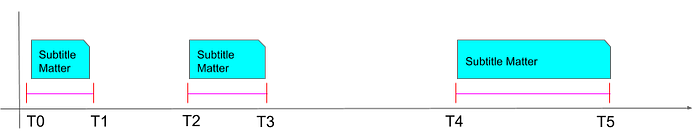
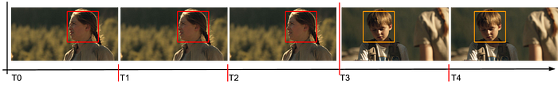
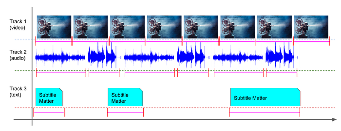
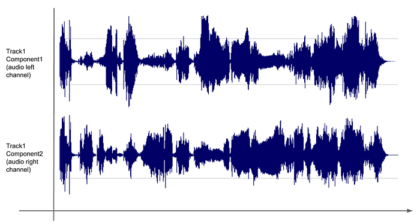
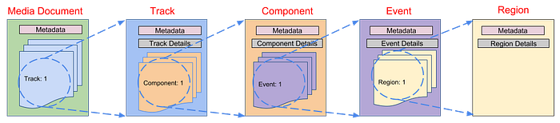

# Netflix Media Database — the Media Timeline Data Model

In [the previous post](https://medium.com/netflix-techblog/the-netflix-media-database-nmdb-9bf8e6d0944d) in this series, we described some important Netflix business needs as well as traits of the media data system — called “**N**etflix **M**edia **D**ata**B**ase” (NMDB) that is used to address them. The curious reader might have noticed that a majority of these characteristics relate to properties of the data managed by NMDB. Specifically, structured data that is modeled around the notion of a media timeline, with additional spatial properties. This blog post details the structure of the media timeline data model used by NMDB called a “**Media Document**”.

## The Media Document Model

The Media Document model is intended to be a flexible framework that can be used to represent static as well as dynamic (varying with time and space) metadata for various media modalities. For example, we would like to be able to represent (1) per-frame color and luminosity information for a video file with 29.97 fps [NTSC](https://en.wikipedia.org/wiki/NTSC) frame rate, (2) subtitle [styling](https://www.w3.org/TR/ttml2/#styling) and [layout](https://www.w3.org/TR/ttml2/#layout) information in a timed text file that is using units of the “[media timebase](https://www.w3.org/TR/ttml2/#parameter-attribute-timeBase)”, as well as (3) spatial attributes of time varying 3D models generated by [VFX](https://en.wikipedia.org/wiki/Visual_effects) artists, all with full precision in temporal as well as spatial dimensions.

The Media Document model is designed to be versatile, to allow representing a wide number of document types, ranging from documents resulting from the analysis of an encoded video stream and containing [VMAF](https://github.com/Netflix/vmaf) scores, to documents providing information about events happening simultaneously within multiple timed text streams, to documents providing structured information about a series of [DPX](https://en.wikipedia.org/wiki/Digital_Picture_Exchange) images forming a movie clip. To satisfy all these use cases, the Media Document is built around a few core principles that are detailed in the following.

### Timing Model

We use the Media Document model to represent timed metadata for our media assets. Hence, we designed it primarily around the notion of timed events. Timed events can be used to represent both intrinsically “periodic” as well as “event-based” timelines. Figure 1 visualizes a periodic sequence of successive video frames. The event of interest, in this case, is a shot change event that occurs after the third frame.


*Figure 1: A sequence of video frames that span a shot change*

A Media Document instance snippet corresponding to Figure 1 could be as follows.

```
{
  …
  “events”: [ 
  { 
    “startTime”: T0,
    “endTime”: T1,
    “metadata”: {
      “shotEnvironment”: “outdoors”
    }
  },
  { 
     “startTime”: T1,
     “endTime”: T2,
     “metadata”: {
       “shotEnvironment”: “indoors”
     }
  },
  … 
  ]
…
}
```

Timed events are similar to [TTML](https://www.w3.org/TR/ttml2/) (Timed Text Markup Language) subtitle events but with the main difference that in the case of the Media Document, these events are not meant to be displayed to end-users. Rather, they represent metadata about the media asset, that corresponds to the specified time interval. In our model, we made the choice that all events in a given Media Document instance correspond to a single timeline, matching the timeline of the media asset (we would like to point out that the Media Document timing model is equivalent to the timing model associated with the _par_ element from the [SMIL](https://www.w3.org/TR/SMIL/) specification.). One goal behind this choice is to facilitate timed queries, within a document instance (“_get all events happening between 56 seconds and 80 seconds in the movie_”) but also across document instances (“_is there any active subtitle in all languages of a movie between 132 seconds and 149 seconds in the movie?_”).


*Figure 2: A media timeline corresponding to subtitle events*

In our model, each event occupies a time interval on the timeline. We do not make any assumption on how events are related. For example, in [ISO Base Media File Format (BMFF)](https://en.wikipedia.org/wiki/ISO_base_media_file_format) files, samples may not overlap and are contiguous within a track. In the Media Document model however, events may overlap. There may also be gaps in the timeline, i.e., intervals without events. Figure 2 shows an event-based subtitle timeline where some of the intervals do not have events. A Media Document instance snippet corresponding to Figure 2 could be as follows.

```
{
   …
  “events”: [
  {
    “startTime”: T0,
    “endTime”: T1,
    “metadata”: {
      “subtitle”: “Hi there! How are you?”
    }
  },
  {
    “startTime”: T2,
    “endTime”: T3,
    “metadata”: {
      “subtitle”: “Thanks for asking — i am good. How are you?”
    }
  },
  {
    “startTime”: T4,
    “endTime”: T5,
    “metadata”: {
      “subtitle”: “Very well — thanks a lot!”
    }
  }
  ]
…
}
```

### Spatial Model

Just like the timing model, a Media Document is associated with a single spatial coordinate space, and events may be further qualified by spatial attributes, providing details on where the event occurs in this coordinate space. This enables us to offer spatial queries (“_get all events appearing in this region of the media asset across the entire movie_”) or spatio-temporal queries (“_get all events happening during given time interval(s) in given region(s)_”).


*Figure 3: A sequence of video frames where the spatial region of interest varies over time*

Figure 3 shows the visualization of a video timeline composed of two temporal events that are separated by a shot change. Within each temporal event, a different spatial region (corresponding to a human face and illustrated with a colored rectangle) forms the region of interest. A complete Media Document instance corresponding to this media timeline is depicted at the end of this section.

### Nested Structure

Inspired by industry leading media container formats, such as the SMPTE [Interoperable Master Format](https://medium.com/netflix-techblog/imf-a-prescription-for-versionitis-e0b4c1865c20) (IMF) or ISO BMFF, the Media Document model groups events that have similar properties. Two nested levels of grouping are available: _tracks_ and _components_. Our model is flexible: two events spanning a common interval of a timeline may be placed in the same component, or in two different components of the same track, or even in components of different tracks.

The semantics of components and tracks may be defined freely by the author of the Media Document instance. In a typical instantiation for multiplexed media assets, a Media Document instance would contain a track element per media modality in the media asset, i.e., a Media Document instance for an audio-video asset would have two tracks. Such a scenario is illustrated in Figure 4 for an asset containing the audio, video as well as the text modality.


*Figure 4: A media timeline comprising multiple tracks*

As was alluded to above, a Media Document instance snippet corresponding to Figure 4 could be as follows.

```
{
  ...
  "tracks": [
  {
    "id": "1",
    "metadata": {"type": "video"},
    ...
  },
  {
    "id": "2",
    "metadata": {"type": "audio"},
    ...
  },
  {
    "id": "3",
    "metadata": {"type": "text"},
    ...
  }
]
}
```

Alternatively, for a multi-channel audio asset, the Media Document instance would have one track, but within the track, a separate component element would provide the metadata and events for each channel, as shown in Figure 5.


*Figure 5: A media timeline that shows multiple components belonging to a single track*

A Media Document snippet corresponding to Figure 5 could be as follows.

```
{
  ...
  "tracks": [
  {
    "id": "1",
    "metadata": {"type": "stereo audio"},
    "components": [
    {
      "id": "0",
      "metadata": {"channel": "left"},
      ...
    },
    {
      "id": "1",
      "metadata": {"channel": "right"},
      ...
    },
    ]
  }
  ]
}
```

The overall nested structure of a Media Document is shown in Figure 6. Each level requires authors to specify information that is common (mandatory) for all Media Document instantiations (an _id_ at each level, _temporal and spatial resolution units_ at the component level, _time interval_ information at the event level, _spatial_ information at the region level). Further, each level allows authors to provide _metadata_ that is specific to each Media Document type at each level (e.g., VMAF score for each frame at the event level or average at the document level, or loudness information for audio at a component or track level).


*Figure 6: Data structure hierarchy of the Media Document*

While a Media Document instance could be represented in any of the popular serialization formats such as [JSON](http://json.org/), [Google Protocol Buffers](https://developers.google.com/protocol-buffers/), or [XML](https://www.w3.org/XML/), we use JSON as the preferred format. This partly stems from the common use of JSON as the payload format between different web-based systems. More importantly, many of the popular distributed document indexing databases such as [Elasticsearch](https://www.elastic.co/products/elasticsearch) and [MongoDB](https://www.mongodb.com/) work with JSON documents. Choosing JSON as our serialization format opens up the possibility to use any of these scalable document databases to index Media Document instances. Note that indexing of the event level time interval information as well as the region level spatial information provides spatio-temporal query-ability out of the box.

The following example shows a complete Media Document instance that represents face detection metadata through the timeline of the video sequence shown in Figure 3. The video sequence in question is a high-definition video sequence (1920x1080 spatial resolution) with a frame rate of 23.976 frames per second. It comprises two distinct temporal events. Each of these events contains a single spatial region of interest that corresponds to the bounding box rectangle for a detected human face.

```
{
  "metadata":{
    "algorithm": "video_face_detection"
  },
  "tracks": [
  {
    "id": "0",
    "components": [
    {
      "id": "0",
      "eventRateNumerator": 24000,
      "eventRateDenominator": 1001,
      "xSize": 1920,
      "ySize": 1080,
      "events": [
      {
        "startTime": 0,
        "endTime": 2,
        "regions": [
        {
          "xmin": 1152,
          "xmax": 1536,
          "ymin": 108,
          "ymax": 648
        }
        ]
      },
      {
        "startTime": 3,
        "endTime": 4,
        "regions": [
        {
          "xmin": 576,
          "xmax": 960,
          "ymin": 108,
          "ymax": 648
        }
        ]
      }
      ]
    }
    ]
  }
  ]
}
```

## The Media Document Schema

The previous section presented the basic principles of the Media Document model. Media Document objects are widely used within various Netflix media processing workflows. Following is a typical life cycle:

1. a media processing algorithm, running for example in the [Archer](https://medium.com/netflix-techblog/simplifying-media-innovation-at-netflix-with-archer-3f8cbb0e2bcb) platform, produces a Media Document instance of a specific type, within which the _metadata_ portions contain domain-specific metadata (e.g., bounding boxes for text in video frames);
2. the Media Document instance is ingested, persisted and indexed into NMDB;
3. an NMDB user queries a set of specific Media Document instances having similar characteristics. Typically those are spatio-temporal queries with additional domain-specific characteristics (e.g. “find all occurrences of text in the middle of the screen”)
4. domain specific APIs are used to expose specific Media Document instances to downstream users.

In order to sustain this life cycle at the Netflix scale, we realized that it was necessary to adopt a “schema-on-write” approach. In this approach, every Media Document type is associated with a schema. All Media Document instances of a specific type that are submitted to NMDB first undergo validation against the schema defined for that type. A Media Document instance is rejected if it does not comply with validation rules. More specifically, we decided to express our validations rules using a subset of the JSON Schema syntax. Hence a producer of Media Document instances is first asked to provide the JSON schema that describes the structure of the associated Media Document type. This approach leads to several benefits:

- We can ensure that all Media Document instances associated with a domain are structured similarly. This allows us to write domain-specific queries and to get consistent results. For example, if all media document instances representing subtitle content follow the same structure (e.g. a TTML _body_ element containing a _div_ element containing a _p_ element potential containing _span_ elements), it is possible to make a query asking for all TTML events that use [_ruby_ annotation](https://medium.com/netflix-techblog/implementing-japanese-subtitles-on-netflix-c165fbe61989#2ca1), and the query can run against one Media Document instance or the entire set in that domain.
- We can ensure that for the same Media Document type a property of a given name at a given location in document tree is of a precise type and not a general purpose string. This enables, for example, enforcing the type of a property that is numeric in nature to be a numeric type. One could then conduct range queries against the property (specifically, we have carefully picked a subset of JSON schema to ensure that no element can have an ambiguous definition or allows for incompatible interpretations, i.e., every object is specified down to its primitive types, which include _string_, _boolean_, _number_, and _integer_.). In the absence of schema, reading a Media Document instance could degrade to something like the following pseudo code. Such an implementation gets hard to maintain from a software perspective and results in lesser read performance.

```
if (property1 instanceOf String) {
  …
} else if (property1 instanceOf Integer) {
    …
} else if (property1 instanceOf Boolean) {
  …
  if (property2 instanceOf Double) {
    …
  } else if (property2 instanceOf List) {
    …
  }
…
}
```

- We can automatically provide strongly-typed APIs that enable consumption of Media Document instances of a specific type. Users of NMDB are relieved from having to write code to parse Media Document instances and are provided with strongly-typed code to process them and propose domain specific APIs.

Furthermore, because developers require flexibility in their Media Document definitions and often need to evolve their domain-specific metadata or more generally their domain-specific Media document types over time, we allow updating the Media Document schema. However, to retain the benefits indicated above, we have limited updates on schema to only addition of optional fields. This ensures both forward and backward compatibility between Media Document instances and Media Document readers while maintaining the stability of Media Document instance indexing and querying. In a nutshell, this design choice has helped ease adoption of the NMDB system while enabling us to operate NMDB at scale. Finally, when a non-compatible change of schema is necessary, one could create a new Media Document type.

## What’s Next

In the next blog post, we will dig deeper into our implementation of the NMDB system. We will discuss our design choices for realizing the service availability and service scale requirements that arise from the Netflix business needs.

_— by Subbu Venkatrav, Arsen Kostenko, Shinjan Tiwary, Sreeram Chakrovorthy, Cyril Concolato, Rohit Puri and Yi Guo_

---
**Tags:** Nmdb · Media Timeline · Data Schema · Media Document · Schema On Write
