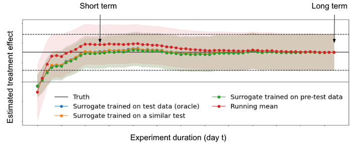
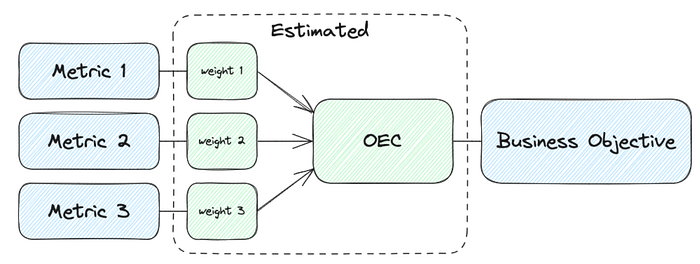
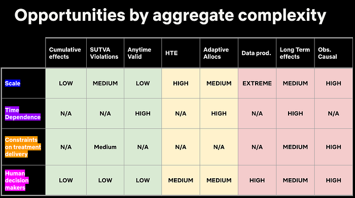
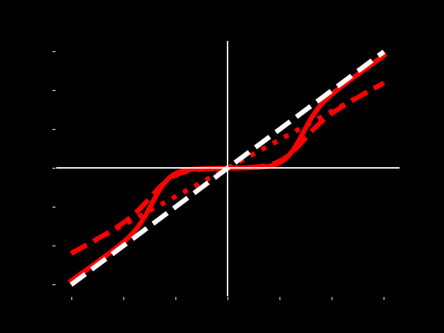

# Netflix Original Research: MIT CODE 2023

Netflix was thrilled to be the premier sponsor for the 2nd year in a row at the [2023 Conference on Digital Experimentation](https://ide.mit.edu/events/2023-conference-on-digital-experimentation-mit-codemit/) (CODE@MIT) in Cambridge, MA. The conference features a balanced blend of academic and industry research from some_ wicked smart_ folks, and we’re proud to have contributed a number of talks and posters along with a plenary session.

Our contributions kicked off with a concept that is crucial to our understanding of A/B tests: surrogates!

Our first talk was given by [Aurelien Bibaut](https://www.linkedin.com/in/aurelien-bibaut/) (with co-authors [Nathan Kallus](https://www.linkedin.com/in/kallus/), [Simon Ejdemyr](https://www.linkedin.com/in/simon-ejdemyr-22b920123/) and [Michael Zhao](https://www.linkedin.com/in/mfzhao/)) in which we discussed how to confidently measure long-term outcomes using short term surrogates in the presence of bias. For example, how do we estimate the effects of innovations on retention a year later without running all our experiments for a year? We proposed an estimation method using cross-fold procedures, and construct valid confidence intervals for long term effects before that effect is fully observed.

Later on, [Michael Zhao](https://www.linkedin.com/in/mfzhao/) (with [Maria Dimakopoulou](https://www.linkedin.com/in/maria-dimakopoulou-4567428a/overlay/about-this-profile/), [Vickie Zhang](https://www.linkedin.com/in/zhangvickie/), [Anh Le](https://www.linkedin.com/in/anhqle/) and [Nathan Kallus](https://www.linkedin.com/in/kallus/)) spoke about the evaluation of surrogate index models for product decision making. **Using 200 real A/B tests performed at Netflix, we showed that surrogate-index models, constructed using only 2 weeks of data, lead to the same product ship decisions ~95% of the time when compared to making a call based on 2 months of data.** This means we can reliably run shorter tests with confidence without needing to wait months for results!

Our next topic focused on how to understand and balance competing engagement metrics; for example, should 1 hour of gaming equal 1 hour of streaming? [Michael Zhao](https://www.linkedin.com/in/mfzhao/) and [Jordan Schafer](https://www.linkedin.com/in/jjschafer/) shared a poster on how they built an Overall Evaluation Criterion (OEC) metric that provides holistic evaluation for A/B tests, appropriately weighting different engagement metrics to serve a single overall objective. This new framework has enabled fast and confident decision making in tests, and is being actively adapted as our business continues to expand into new areas.

In the second plenary session of the day, [Martin Tingley](https://www.linkedin.com/in/martintingley/) took us on a compelling and fun journey of complexity, exploring key challenges in digital experimentation and how they differ from the challenges faced by agricultural researchers a century ago. He highlighted different areas of complexity and provided perspectives on how to tackle the right challenges based on business objectives.

Our final talk was given by [Apoorva Lal](https://www.linkedin.com/in/apoorvalal/) (with co-authors [Samir Khan](https://www.linkedin.com/in/samir-khan-9536a9175/) and [Johan Ugander](https://www.linkedin.com/in/jugander/)) in which we show how partial identification of the dose-response function (DRF) under non-parametric assumptions can be used to provide more insightful analyses of experimental data than the standard ATE analysis does. We revisited a study that reduced like-minded content algorithmically, and showed how we could extend the binary ATE learning to answer how the amount of like-minded content a user sees affects their political attitudes.

We had a blast connecting with the CODE@MIT community and bonding over our shared enthusiasm for not only rigorous measurement in experimentation, but also stats-themed stickers and swag!

*One of our stickers this year, can you guess what this is showing?!*

We look forward to next year’s iteration of the conference and hope to see you there!

_Psst! We’re hiring Data Scientists across a variety of domains at Netflix — check out our _[_open roles._](https://jobs.netflix.com/search?q=data+scientist)

---
**Tags:** Research · Conference · Ab Testing
