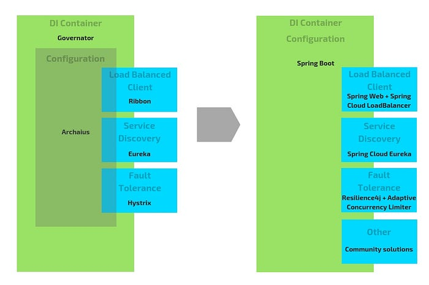

# Netflix OSS and Spring Boot — Coming Full Circle

> Taylor Wicksell, Tom Cellucci, Howard Yuan, Asi Bross, Noel Yap, and David Liu

In 2007, Netflix started on a long road towards fully operating in the cloud. Much of Netflix’s backend and mid-tier applications are built using Java, and as part of this effort Netflix engineering built several cloud infrastructure libraries and systems — [Ribbon](https://github.com/Netflix/ribbon) for load balancing, [Eureka](https://github.com/Netflix/eureka) for service discovery, and [Hystrix](https://github.com/Netflix/hystrix) for fault tolerance. To stitch all of these components together, additional libraries were created — [Governator](https://github.com/Netflix/governator) for dependency injection with lifecycle management and [Archaius](https://github.com/Netflix/archaius) for configuration. All of these Netflix libraries and systems were open-sourced around 2012 and are still used by the community to this day.

In 2015, Spring Cloud Netflix reached 1.0. This was a community effort to stitch together the Netflix OSS components using Spring Boot instead of Netflix internal solutions. Over time this has become the preferred way for the community to adopt Netflix’s Open Source software. We are happy to announce that starting in 2018, Netflix is also making the transition to Spring Boot as our core Java framework, leveraging the community’s contributions via [Spring Cloud Netflix](https://spring.io/projects/spring-cloud-netflix).

Why is Netflix adopting Spring Boot after having invested so much in internal solutions? In the early 2010s, key requirements for Netflix cloud infrastructure were reliability, scalability, efficiency, and security. Lacking suitable alternatives, we created solutions in-house. Fast forward to 2018, the Spring product has evolved and expanded to meet all of these requirements, some through the usage and adaptation of Netflix’s very own software! In addition, community solutions have evolved beyond Netflix’s original needs. **Spring provides great experiences for data access (****[spring-data](https://spring.io/projects/spring-data)****), complex security management (****[spring-security](https://spring.io/projects/spring-security)****), integration with cloud providers (****[spring-cloud-aws](https://spring.io/projects/spring-cloud-aws)****), and many many more.**

The evolution of Spring and its features align very well with where we want to go as a company. Spring has shown that they are able to provide well-thought-out, documented, and long lasting abstractions and APIs. Together with the community they have also provided quality implementations from these abstractions and APIs. This abstract-and-implement methodology match well with a core Netflix principle of being “[highly aligned, loosely coupled](https://jobs.netflix.com/culture)”. Leveraging Spring Boot will allow us to build for the enterprise while remaining agile for our business.

The Spring Boot transition is not something we are undertaking alone. We have been in collaboration with [Pivotal](https://pivotal.io/) throughout the process. Whether it be Github issues and feature requests, in-person conversations at conferences or real-time chats over Gitter/Slack, the responses from Pivotal have been excellent. This level of communication and support gives us great confidence in Pivotal’s ability to maintain and evolve the Spring ecosystem.

Moving forward, we plan to leverage the strong abstractions within Spring to further modularize and evolve the Netflix infrastructure. Where there is existing strong community direction — such as the upcoming Spring Cloud Load Balancer — we intend to leverage these to replace aging Netflix software. Where there is new innovation to bring — such as the new [Netflix Adaptive Concurrency Limiters](https://medium.com/@NetflixTechBlog/performance-under-load-3e6fa9a60581) — we want to help contribute these back to the community.

The union of Netflix OSS and Spring Boot began outside of Netflix. We now embrace it inside of Netflix. This is just the beginning of a long journey, and we will be sure to provide updates and interesting findings as we go. We want to give special thanks to the many people who have contributed to this effort over the years, and hope to be part of future innovations to come.

---
**Tags:** Java · Spring · Cloud Computing · Open Source · Software Engineering
