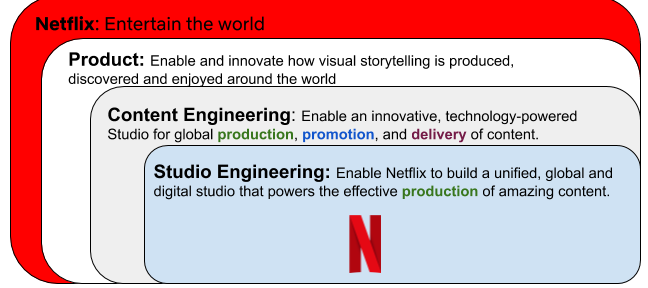
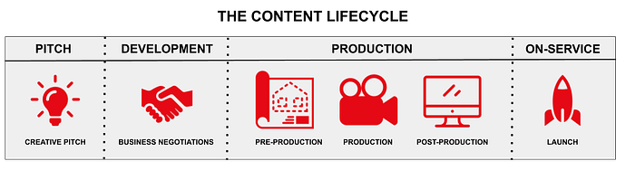

# Netflix Studio Engineering Overview

---

By [Steve Urban](https://www.linkedin.com/in/surban/), [Sridhar Seetharaman](https://www.linkedin.com/in/connectwithsridhar/), [Shilpa Motukuri](https://www.linkedin.com/in/shilpamotukuri/), [Tom Mack](https://www.linkedin.com/in/tommack8/), [Erik Strauss](https://www.linkedin.com/in/erikstrauss/), [Hema Kannan](https://www.linkedin.com/in/hemamalinikannan/), [CJ Barker](https://www.linkedin.com/in/cjbarkbark/)

Netflix is revolutionizing the way a modern studio operates. Our mission in **Studio Engineering** is to build a unified, global, and digital studio that powers the effective production of amazing content.

Netflix produces some of the world’s most beloved and award-winning films and series, including The Irishman, The Crown, La Casa de Papel, Ozark, and Tiger King. In an effort to effectively and efficiently produce this content we are looking to improve and automate many areas of the production process. We combine our entertainment knowledge and our technical expertise to provide innovative technical solutions from the initial pitch of an idea to the moment our members hit play.

## Why Does Studio Engineering Exist?

*Studio Engineering’s ‘Why’*

The journey of a Netflix Original title from the moment it first comes to us as a pitch, to that press of the play button is incredibly complex. Producing great content requires a significant amount of coordination and collaboration from Netflix employees and external vendors across the various production phases. This process starts before the deal has been struck and continues all the way through launch on the service, involving people representing finance, scheduling, human resources, facilities, asset delivery, and many other business functions. In this overview, we will shed light on the complexity and magnitude of this journey and update this post with links to deeper technical blogs over time.

*Pitch-to-Play*

## Mission at a Glance

- **Creative pitch**: Combine the best of machine learning and human intuition to help Netflix understand how a proposed title compares to other titles, estimate how many subscribers will enjoy it, and decide whether or not to produce it.
- **Business negotiations: **Empower the Netflix Legal team with data to help with deal negotiations and acquisition of rights to produce and stream the content.
- **Pre-Production:** Provide solutions to plan for resource needs, and discovery of people and vendors to continue expanding the scale of our productions. Any given production requires the collaboration of hundreds of people with varying expertise, so finding exactly the right people and vendors for each job is essential.
- **Production: **Enable content creation from script to screen that optimizes the production process for efficiency and transparency. Free up creative resources to focus on what’s important: producing amazing and entertaining content.
- **Post-Production:** Help our creative partners collaborate to refine content into their final vision with digital content logistics and orchestration.

## What’s Next?

Studio Engineering will be publishing a series of articles providing business and technical insights as we further explore the details behind the journey from pitch to play. Stay tuned as we expand on each stage of the content lifecycle over the coming months!

Here are some related articles to Studio Engineering:

- [Studio Technologies](https://jobs.netflix.com/teams/studio-technologies)
- [Ready for changes with Hexagonal Architecture](./ready-for-changes-with-hexagonal-architecture-b315ec967749.md)
- [GraphQL Search Indexing](./graphql-search-indexing-334c92e0d8d5.md)
- [Netflix Studio Hack Day — May 2019](./netflix-studio-hack-day-may-2019-b4a0ecc629eb.md)

---
**Tags:** Engineering · Studio · Productions · Entertainment · Innovation
