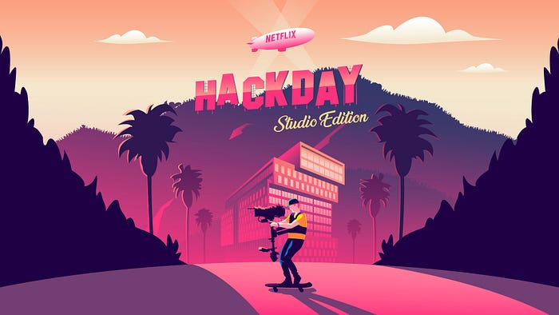

# Netflix Studio Hack Day — May 2019

_By _[_Tom Richards_](https://www.linkedin.com/in/tomrichards)_, _[_Carenina Garcia Motion_](https://twitter.com/careninam)_, and _[_Marlee Tart_](https://www.linkedin.com/in/marlee-tart-40b66417/)

Hack Days are a big deal at Netflix. They’re a chance to bring together employees from all our different disciplines to explore new ideas and experiment with emerging technologies.

For the most recent hack day, we channeled our creative energy towards our studio efforts. The goal remained the same: team up with new colleagues and have fun while learning, creating, and experimenting. We know even the silliest idea can spur something more.

**The most important value of hack days is that they support a culture of innovation. We believe in this work, even if it never ships, and love to share the creativity and thought put into these ideas.**

Below, you can find videos made by the hackers of some of our favorite hacks from this event.

---

## Project Rumble Pak

You’re watching your favorite episode of Voltron when, after a suspenseful pause, there’s a huge explosion — and your phone starts to vibrate in your hands.

The Project Rumble Pak hack day project explores how haptics can enhance the content you’re watching. With every explosion, sword clank, and laser blast, you get force feedback to amp up the excitement.

For this project, we synchronized Netflix content with haptic effects using Immersion Corporation technology.

By [Hans van de Bruggen](http://twitter.com/verbiate) and [Ed Barker](http://twitter.com/edbarker)

## The Voice of Netflix

Introducing The Voice of Netflix. We trained a neural net to spot words in Netflix content and reassemble them into new sentences on demand. For our stage demonstration, we hooked this up to a speech recognition engine to respond to our verbal questions in the voice of Netflix’s favorite characters. Try it out yourself at [blogofsomeguy.com/v](http://blogofsomeguy.com/v)!

By [Guy Cirino](https://twitter.com/guycirino) and [Carenina Garcia Motion](http://careninam/)

## TerraVision

TerraVision re-envisions the creative process and revolutionizes the way our filmmakers can search and discover filming locations. Filmmakers can drop a photo of a look they like into an interface and find the closest visual matches from our centralized library of locations photos. We are using a computer vision model trained to recognize places to build reverse image search functionality. The model converts each image into a small dimensional vector, and the matches are obtained by computing the nearest neighbors of the query.

_By _[_Noessa Higa_](https://www.linkedin.com/in/noessa/)_, _[_Ben Klein_](https://www.linkedin.com/in/benjamin-klein-usa/)_, _[_Jonathan Huang_](https://www.linkedin.com/in/jonhyh/)_, _[_Tyler Childs_](https://twitter.com/TylerChilds)_, _[_Tie Zhong_](https://www.linkedin.com/in/tzhong/)_, and _[_Kenna Hasson_](https://twitter.com/kennahasson)

## Get Out!

Have you ever found yourself needing to give the Evil Eye™ to colleagues who are hogging your conference room after their meeting has ended?

Our hack is a simple web application that allows employees to select a Netflix meeting room anywhere in the world, and press a button to kick people out of their meeting room if they have overstayed their meeting. First, the app looks up calendar events associated with the room and finds the latest meeting in the room that should have already ended. It then automatically calls in to that meeting and plays walk-off music similar to the Oscar’s to not-so-subtly encourage your colleagues to Get Out! We built this hack using Java (Springboot framework), the Google OAuth and Calendar APIs (for finding rooms) and Twilio API (for calling into the meeting), and deployed it on AWS.

_By _[_Abi Seshadri_](https://www.linkedin.com/in/abi-seshadri/)_ and _[_Rachel Rivera_](https://www.linkedin.com/in/rachelrivera1/)

---

You can also check out highlights from our past events: [November 2018](https://medium.com/netflix-techblog/netflix-hack-day-fall-2018-c05dda4b98c1), [March 2018](https://medium.com/netflix-techblog/netflix-hack-day-winter-2018-b36ee09699d6), [August 2017](https://medium.com/netflix-techblog/netflix-hack-day-summer-2017-ef3ba81a8a77), [January 2017](https://medium.com/netflix-techblog/netflix-hack-day-winter-2017-73590a2fe513), [May 2016](http://techblog.netflix.com/2016/05/netflix-hack-day-spring-2016.html)[, November 2015](http://techblog.netflix.com/2015/11/netflix-hack-day-autumn-2015.html),[ March 2015](http://techblog.netflix.com/2015/03/netflix-hack-day-winter-2015.html),[ February 2014](http://techblog.netflix.com/2014/02/netflix-hack-day.html) &[ August 2014](http://techblog.netflix.com/2014/08/netflix-hack-day-summer-2014.html).

Thanks to all the teams who put together a great round of hacks in 24 hours.

---
**Tags:** Hackathons · Netflix · Computer Vision · Meetings · Voltron
