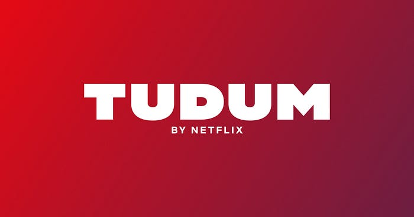
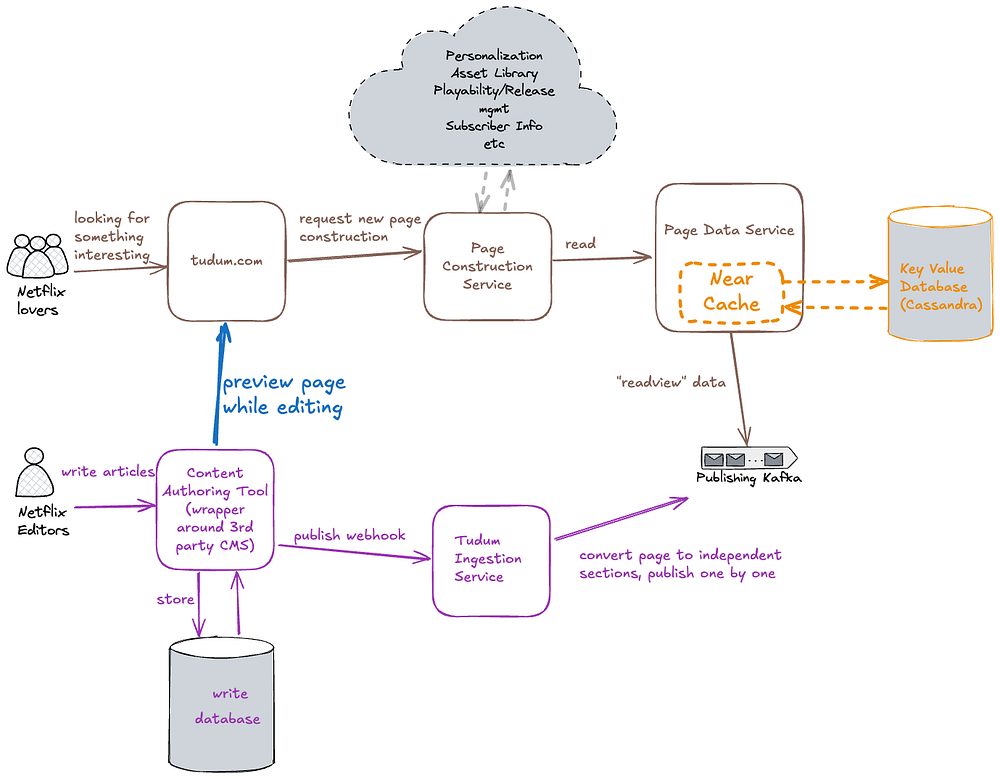
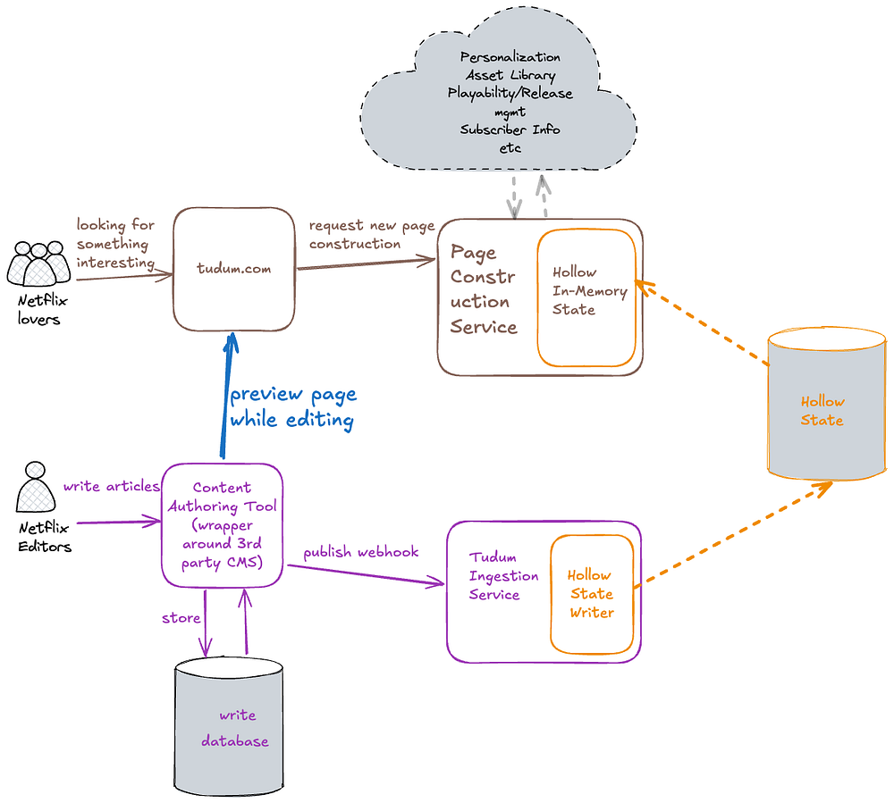
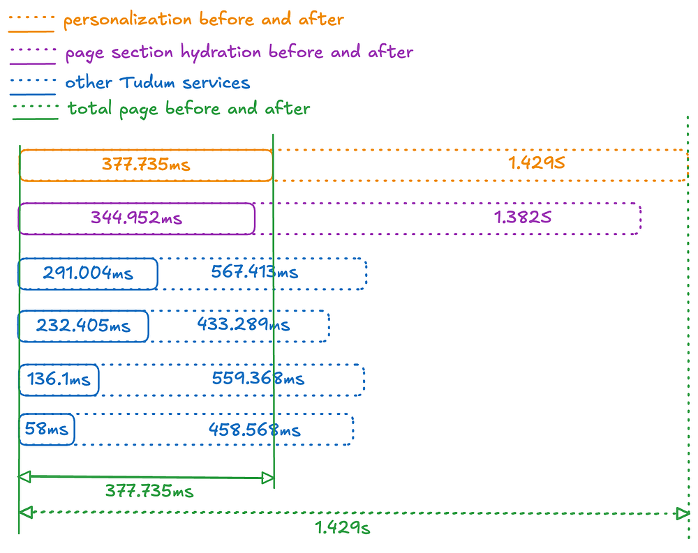

# Netflix Tudum Architecture: from CQRS with Kafka to CQRS with RAW Hollow

By [Eugene Yemelyanau](https://www.linkedin.com/in/eugeneemelyanov/), [Jake Grice](https://www.linkedin.com/in/jake-grice/)

## Introduction

[_Tudum.com_](http://tudum.com/)_ is Netflix’s official fan destination, enabling fans to dive deeper into their favorite Netflix shows and movies. Tudum offers exclusive first-looks, behind-the-scenes content, talent interviews, live events, guides, and interactive experiences. “Tudum” is named after the sonic ID you hear when pressing play on a Netflix show or movie. Attracting over 20 million members each month, Tudum is designed to enrich the viewing experience by offering additional context and insights into the content available on Netflix._

## Initial architecture

**At the end of 2021, when we envisioned Tudum’s implementation, we considered architectural patterns that would be maintainable, extensible, and well-understood by engineers. With the goal of building a flexible, configuration-driven system, we looked to ******server-driven UI****** (SDUI) as an appealing solution. SDUI is a design approach where the server dictates the structure and content of the UI, allowing for dynamic updates and customization without requiring changes to the client application. Client applications like web, mobile, and TV devices, act as rendering engines for SDUI data.** After our teams weighed and vetted all the details, the dust settled and we landed on an approach similar to Command Query Responsibility Segregation ([CQRS](https://www.geeksforgeeks.org/cqrs-command-query-responsibility-segregation/)). At Tudum, we have two main use cases that CQRS is perfectly capable of solving:

- **Tudum’s editorial team** brings exclusive interviews, first-look photos, behind the scenes videos, and many more forms of fan-forward content, and compiles it all into pages on the [Tudum.com](http://tudum.com/) website. This content comes onto Tudum in the form of individually published pages, and content elements within the pages. In support of this, Tudum’s architecture includes a write path to store all of this data, including internal comments, revisions, version history, asset metadata, and scheduling settings.
- **Tudum visitors** consume published pages. In this case, Tudum needs to serve personalized experiences for our beloved fans, and accesses only the latest version of our content.

*Initial Tudum data architecture*

The high-level diagram above focuses on storage & distribution, illustrating how we leveraged Kafka to separate the write and read databases. The write database would store internal page content and metadata from our CMS. The read database would store read-optimized page content, for example: CDN image URLs rather than internal asset IDs, and movie titles, synopses, and actor names instead of placeholders. This content ingestion pipeline allowed us to regenerate all consumer-facing content on demand, applying new structure and data, such as global navigation or branding changes. The Tudum Ingestion Service converted internal CMS data into a read-optimized format by applying page templates, running validations, performing data transformations, and producing the individual content elements into a Kafka topic. The Data Service Consumer, received the content elements from Kafka, stored them in a high-availability database (Cassandra), and acted as an API layer for the Page Construction service and other internal Tudum services to retrieve content.

A key advantage of decoupling read and write paths is the ability to scale them independently. It is a well-known architectural approach to connect both write and read databases using an event driven architecture. As a result, content edits would **_eventually_** appear on [tudum.com](http://tudum.com/).

## Challenges with eventual consistency

Did you notice the emphasis on “**_eventually_**?” A major downside of this architecture was the delay between making an edit and observing that edit reflected on the website. For instance, when the team publishes an update, the following steps must occur:

1. Call the REST endpoint on the 3rd party CMS to save the data.
2. Wait for the CMS to notify the Tudum Ingestion layer via a webhook.
3. Wait for the Tudum Ingestion layer to query all necessary sections via API, validate data and assets, process the page, and produce the modified content to Kafka.
4. Wait for the Data Service Consumer to consume this message from Kafka and store it in the database.
5. Finally, after some **cache refresh delay**, this data would **_eventually_** become available to the Page Construction service. Great!

By introducing a highly-scalable eventually-consistent architecture we were missing the ability to quickly render changes after writing them — an important capability for internal previews.

In our performance profiling, we found the source of delay was our Page Data Service which acted as a facade for an underlying [Key Value Data Abstraction](./introducing-netflixs-key-value-data-abstraction-layer-1ea8a0a11b30.md) database. Page Data Service utilized a **near cache** to accelerate page building and reduce read latencies from the database.

This cache was implemented to optimize the N+1 key lookups necessary for page construction by having a complete data set in memory. When engineers hear “_slow reads_,” the immediate answer is often “_cache_,” which is exactly what our team adopted. The KVDAL near cache can refresh in the background on every app node. Regardless of which system modifies the data, the cache is updated with each refresh cycle. If you have 60 keys and a refresh interval of 60 seconds, the near cache will update one key per second. This was problematic for previewing recent modifications, as these changes were only reflected with each cache refresh. As Tudum’s content grew, cache refresh times increased, further extending the delay.

## RAW Hollow

As this pain point grew, a new technology was being developed that would act as our silver bullet. [RAW Hollow](https://hollow.how/raw-hollow-sigmod.pdf) is an innovative in-memory, co-located, compressed object database developed by Netflix, designed to handle small to medium datasets with support for strong read-after-write consistency. It addresses the challenges of achieving consistent performance with low latency and high availability in applications that deal with less frequently changing datasets. Unlike traditional SQL databases or fully in-memory solutions, RAW Hollow offers a unique approach where the entire dataset is distributed across the application cluster and resides in the memory of each application process.

This design leverages compression techniques to scale datasets up to 100 million records per entity, ensuring extremely low latencies and high availability. RAW Hollow provides eventual consistency by default, with the option for strong consistency at the individual request level, allowing users to balance between high availability and data consistency. It simplifies the development of highly available and scalable stateful applications by eliminating the complexities of cache synchronization and external dependencies. This makes RAW Hollow a robust solution for efficiently managing datasets in environments like Netflix’s streaming services, where high performance and reliability are paramount.

## Revised architecture

Tudum was a perfect fit to battle-test RAW Hollow while it was pre-GA internally. Hollow’s high-density near cache significantly reduces I/O. Having our primary dataset in memory enables Tudum’s various microservices (page construction, search, personalization) to access data synchronously in O(1) time, simplifying architecture, reducing code complexity, and increasing fault tolerance.

*Updated Tudum data architecture*

In our simplified architecture, we eliminated the Page Data Service, Key Value store, and Kafka infrastructure, in favor of RAW Hollow. By embedding the in-memory client directly into our read-path services, we avoid per-request I/O and reduce roundtrip time.

## Migration results

The updated architecture yielded a monumental reduction in data propagation times, and the reduced I/O led to faster request times as an added bonus. Hollow’s compression alleviated our concerns about our data being “too big” to fit in memory. Storing three years’ of unhydrated data requires only a 130MB memory footprint — 25% of its uncompressed size in an Iceberg table!

Writers and editors can preview changes in seconds instead of minutes, while still maintaining high-availability and in-memory caching for Tudum visitors — the best of both worlds.

But what about the faster request times? The diagram below illustrates the before & after timing to fulfil a request for Tudum’s home page. All of Tudum’s read-path services leverage Hollow in-memory state, leading to a significant increase in page construction speed and personalization algorithms. Controlling for factors like TLS, authentication, request logging, and WAF filtering, homepage construction time decreased from ~1.4 seconds to ~0.4 seconds!

*Home page construction time*

An attentive reader might notice that we have now tightly-coupled our Page Construction Service with the Hollow In-Memory State. This tight-coupling is used only in Tudum-specific applications. However, caution is needed if sharing the Hollow In-Memory Client with other engineering teams, as it could limit your ability to make schema changes or deprecations.

## Key Learnings

1. CQRS is a powerful design paradigm for scale, if you can tolerate some eventual consistency.
2. Minimizing the number of sequential operations can significantly reduce response times. I/O is often the main enemy of performance.
3. Caching is complicated. Cache invalidation is a hard problem. By holding an entire dataset in memory, you can eliminate an entire class of problems.

In the next episode, we’ll share how [Tudum.com](http://tudum.com/) leverages Server Driven UI to rapidly build and deploy new experiences for Netflix fans. Stay tuned!

## Credits

Thanks to [Drew Koszewnik](https://www.linkedin.com/in/koszewnik), [Govind Venkatraman Krishnan](https://www.linkedin.com/in/govindvenkatramankrishnan), [Nick Mooney](https://www.linkedin.com/in/nick-mooney-193849/), [George Carlucci](https://www.linkedin.com/in/georgecarlucci/)

---
**Tags:** Cqrs · Tudum · Kafka · Data Architecture
