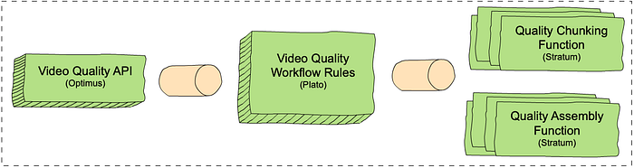
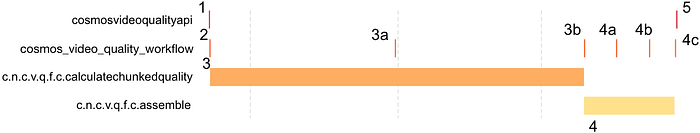
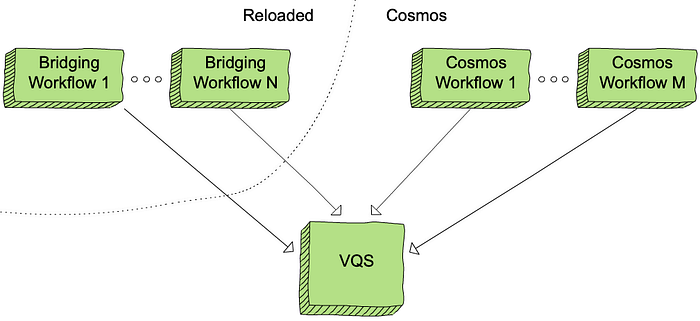
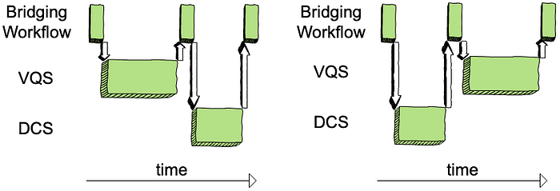

# Netflix Video Quality at Scale with Cosmos Microservices

by [_Christos G. Bampis_](https://www.linkedin.com/in/christosbampis/)_, _[_Chao Chen_](https://www.linkedin.com/in/chen-chao/)_, _[_Anush K. Moorthy_](https://www.linkedin.com/in/anush-moorthy-b8451142/)_ and _[_Zhi Li_](https://www.linkedin.com/in/henryzhili/)

## Introduction

Measuring video quality at scale is an essential component of the Netflix streaming pipeline. Perceptual quality measurements are used to drive [video encoding optimizations](https://netflixtechblog.com/optimized-shot-based-encodes-now-streaming-4b9464204830), perform [video codec comparisons](./performance-comparison-of-video-coding-standards-an-adaptive-streaming-perspective-d45d0183ca95.md), carry out A/B testing and optimize streaming QoE decisions to mention a few. In particular, the [VMAF](https://netflixtechblog.com/toward-a-practical-perceptual-video-quality-metric-653f208b9652) metric lies at the core of improving the Netflix member’s streaming video quality. It has become a _de facto _standard for perceptual quality measurements within Netflix and, thanks to its [open-source nature](https://github.com/Netflix/vmaf), throughout the video industry.

As VMAF evolves and is integrated with more encoding and streaming workflows within Netflix, we need scalable ways of fostering video quality innovations. For example, when we design a new version of VMAF, we need to effectively roll it out throughout the entire Netflix catalog of movies and TV shows. This article explains how we designed microservices and workflows on top of the [Cosmos platform](./the-netflix-cosmos-platform-35c14d9351ad.md) to bolster such video quality innovations.

## The coupling problem

Until recently, video quality measurements were generated as part of our [Reloaded](https://www.youtube.com/watch?v=JouA10QJiNc) production system. This system is responsible for processing incoming media files, such as video, audio and subtitles, and making them playable on the streaming service. The Reloaded system is a well-matured and scalable system, but its monolithic architecture can slow down rapid innovation. More importantly, within Reloaded, video quality measurements are generated together with video encoding. This tight coupling means that it is not possible to achieve the following without re-encoding:

A) rollout of new video quality algorithms

B) maintaining the data quality of our catalog (e.g. via bug fixes).

Re-encoding the entire catalog in order to generate updated quality scores is an extremely costly solution and hence infeasible. Such coupling problems abound with our Reloaded architecture, and hence the Media Cloud Engineering and Encoding Technologies teams have been working together to develop a solution that addresses many of the concerns with our previous architecture. We call this system [Cosmos](./the-netflix-cosmos-platform-35c14d9351ad.md).

Cosmos is a computing platform for workflow-driven, media-centric microservices. Cosmos offers several benefits as highlighted in the linked blog, such as separation of concerns, independent deployments, observability, rapid prototyping and productization. Here, we describe how we architected the video quality service using Cosmos and how we managed the migration from Reloaded to Cosmos for video quality computations while running a production system.

## Video quality as a service

In Cosmos, all video quality computations are performed by an independent microservice called the Video Quality Service (VQS). VQS takes as input two videos: a source and its derivative, and returns back the measured perceptual quality of the derivative. The measured quality could be a single value, in cases where only a single metric’s output is needed (e.g., VMAF), or it could also return back multiple perceptual quality scores, in cases where the request asks for such computation (e.g., VMAF and [SSIM](http://www.cns.nyu.edu/pub/eero/wang03-reprint.pdf)).

VQS, like most Cosmos services, consists of three domain-specific and scale-agnostic layers. Each layer is built on top of a corresponding scale-aware Cosmos subsystem. There is an external-facing API layer (Optimus), a rule-based video quality workflow layer (Plato) and a serverless compute layer (Stratum). The inter-layer communication is based on our internally developed and maintained Timestone queuing system. The figure below shows each layer and the corresponding Cosmos subsystem in parenthesis.

*An overview of the Video Quality Service (VQS) in Cosmos.*

1. The VQS API layer exposes endpoints: one to request quality measurements (measureQuality) and one to get quality results asynchronously (getQuality).
2. The VQS workflow layer consists of rules that determine how to measure video quality. Similar to [chunk-based encoding](https://netflixtechblog.com/high-quality-video-encoding-at-scale-d159db052746), the VQS workflow consists of chunk-based quality calculations, followed by an assembly step. This enables us to use our scale to increase throughput and reduce latencies. The chunk-based quality step computes the quality for each chunk and the assembly step combines the results of all quality computations. For example, if we have two chunks with two and three frames and VMAF scores of [50, 60] and [80, 70, 90] respectively, the assembly step combines the scores into [50, 60, 80, 70, 90]. The chunking rule calls out to the chunk-based quality computation function in Stratum (see below) for all the chunks in the video, and the assembly rule calls out to the assembly function.
3. The VQS Stratum layer consists of two functions, which perform the chunk-based quality calculation and assembly.

## Deep dive into the VQS workflow

The following trace graph from our observability portal, Nirvana, sheds more light on how VQS works. The request provides the source and the derivative whose quality is to be computed and requests that the VQS provides quality scores using VMAF, PSNR and SSIM as quality metrics.

*A simplified trace graph from Nirvana.*

Here is a step-by-step description of the processes involved:

1. VQS is called using the measureQuality endpoint. The VQS API layer will translate the external request into VQS-specific data models.

2. The workflow is initiated. Here, based on the video length, the throughput and latency requirements, available scale etc., the VQS workflow decides that it will split the quality computation across two chunks and hence, it creates two messages (one for each chunk) to be executed independently by the chunk-based quality computation Stratum function. All three requested quality metrics will be calculated for each chunk.

3. Quality calculation begins for each chunk. The figure does not show the chunk start times separately, however, each chunked quality computation starts and completes (annotated as 3a and 3b) independently based on resource availability.

3b. Plato initiates assembly once all chunked quality computations complete.

4. Assembly begins, with separate invocations to the assembler stratum functions for each metric. As before, the start time for each metric’s assembly can vary. Such separation of computation allows us to fail partially, return early, scale independently depending on metric complexity etc.

4a & 4b. Assembly for two of the metrics (e.g. PSNR and SSIM) is complete.

4c & 5. Assembly for VMAF is complete and the entire workflow is thus completed. The quality results are now available to the caller via the getQuality endpoint.

The above is a simplified illustration of the workflow, however, in practice, the actual design is extremely flexible, and supports a variety of features, including different quality metrics, adaptive chunking strategies, producing quality at different temporal granularities (frame-level, segment level and aggregate) and measuring quality for different use cases, such as measuring quality for different device types (like a phone), SDR, HDR and others.

## Living a double life

While VQS is a dedicated video quality microservice that addresses the aforementioned coupling with video encoding, there is another aspect to be addressed. The entire Reloaded system is currently being migrated into Cosmos. This is a big, cross-team effort which means that some applications are still in Reloaded, while others have already made it into Cosmos. How do we leverage VQS, while some applications that consume video quality measurements are still in Reloaded? In other words, how do we manage living a life in both worlds?

## A bridge between two worlds

To live such a life, we developed several “bridging” workflows, which allow us to route video quality traffic from Reloaded into Cosmos. Each of these workflows also acts as a translator of Reloaded data models into appropriate Cosmos-service data models. Meanwhile, Cosmos-only workflows can be integrated with VQS without the need for bridging. This allows us to not only operate in both worlds and provide existing video quality features, but also roll out new features ubiquitously (either for Reloaded or Cosmos customer applications).

*Living a double life, VQS is at the center of both!*

## Data conversions as a service

To complete our design, we have to solve one last puzzle. While we have a way to call VQS, the VQS output is designed to avoid the centralized data modeling of Reloaded. For example, VQS relies on the [Netflix Media Database](./the-netflix-media-database-nmdb-9bf8e6d0944d.md) (NMDB) to store and index the quality scores, while the Reloaded system uses a mix of non-queryable data models and files. To aid our transition, we introduced another Cosmos microservice: the Document Conversion Service (DCS). DCS is responsible for converting between Cosmos data models and Reloaded data models. Further, DCS also interfaces with NMDB and hence is capable of converting from the data store to Reloaded file-based data and vice-versa. DCS has several other end points that perform similar data conversion when needed so the above described Roman-riding can occur gracefully.

*Left: DCS is called to convert the output of VQS into a requested data model. Right: DCS converts Reloaded data models into Cosmos data models before calling VQS.*

## Where we are now and what’s next

We have migrated almost all of our video quality computations from Reloaded into Cosmos. VQS currently represents the largest workload fueled by the Cosmos platform. Video quality has matured in Cosmos and we are invested in making VQS more flexible and efficient. Besides supporting existing video quality features, all our new video quality features have been developed in VQS. Stay tuned for more details on these algorithmic innovations.

## Acknowledgments

This work was made possible with the help of many stunning Netflix colleagues. We would like to thank [George Ye](https://www.linkedin.com/in/george-ye-8568b24/) and [Sujana Sooreddy](https://www.linkedin.com/in/sujanas/) for their contributions to the Reloaded-Cosmos bridge development, [Ameya Vasani](https://www.linkedin.com/in/ameya-vasani-8904304/) and [Frank San Miguel](https://www.linkedin.com/in/franksanmiguel/) for contributing to power up VQS at scale and [Susie Xia](https://www.linkedin.com/in/susie-xia/) for helping with performance analysis. Also, the Media Content Playback team, the Media Compute/Storage Infrastructure team and the entire Cosmos platform team that brought Cosmos to life and whole-heartedly supported us in our venture into Cosmos.

If you are interested in becoming a member of our team, we are hiring! Our current job postings can be found here:

[https://jobs.netflix.com/jobs/101109705](https://jobs.netflix.com/jobs/101109705)

[https://jobs.netflix.com/jobs/127695186](https://jobs.netflix.com/jobs/127695186)

[https://jobs.netflix.com/jobs/126802582](https://jobs.netflix.com/jobs/126802582)

---
**Tags:** Cosmos Microservice · Vmaf · Video Quality · Netflix
