# Netflix’s Distributed Counter Abstraction

By: [Rajiv Shringi](https://www.linkedin.com/in/rajiv-shringi/), [Oleksii Tkachuk](https://www.linkedin.com/in/oleksii-tkachuk-98b47375/), [Kartik Sathyanarayanan](https://www.linkedin.com/in/kartik894/)

## Introduction

In our previous blog post, we introduced [Netflix’s TimeSeries Abstraction](./introducing-netflix-timeseries-data-abstraction-layer-31552f6326f8.md), a distributed service designed to store and query large volumes of temporal event data with low millisecond latencies. Today, we’re excited to present the **Distributed Counter Abstraction**. This counting service, built on top of the TimeSeries Abstraction, enables distributed counting at scale while maintaining similar low latency performance. As with all our abstractions, we use our [Data Gateway Control Plane](https://netflixtechblog.medium.com/data-gateway-a-platform-for-growing-and-protecting-the-data-tier-f1ed8db8f5c6) to shard, configure, and deploy this service globally.

Distributed counting is a challenging problem in computer science. In this blog post, we’ll explore the diverse counting requirements at Netflix, the challenges of achieving accurate counts in near real-time, and the rationale behind our chosen approach, including the necessary trade-offs.

**Note**: _When it comes to distributed counters, terms such as ‘accurate’ or ‘precise’ should be taken with a grain of salt. In this context, they refer to a count very close to accurate, presented with minimal delays._

## Use Cases and Requirements

At Netflix, our counting use cases include tracking millions of user interactions, monitoring how often specific features or experiences are shown to users, and counting multiple facets of data during [A/B test experiments](https://netflixtechblog.com/its-all-a-bout-testing-the-netflix-experimentation-platform-4e1ca458c15), among others.

At Netflix, these use cases can be classified into two broad categories:

1. **Best-Effort**: For this category, the count doesn’t have to be very accurate or durable. However, this category requires near-immediate access to the current count at low latencies, all while keeping infrastructure costs to a minimum.
2. **Eventually Consistent**: This category needs accurate and durable counts, and is willing to tolerate a slight delay in accuracy and a slightly higher infrastructure cost as a trade-off.

Both categories share common requirements, such as high throughput and high availability. The table below provides a detailed overview of the diverse requirements across these two categories.

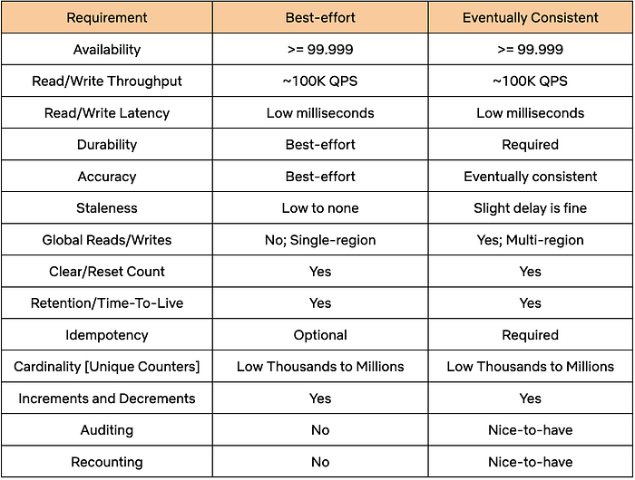

## Distributed Counter Abstraction

To meet the outlined requirements, the Counter Abstraction was designed to be highly configurable. It allows users to choose between different counting modes, such as **Best-Effort** or **Eventually Consistent**, while considering the documented trade-offs of each option. After selecting a mode, users can interact with APIs without needing to worry about the underlying storage mechanisms and counting methods.

Let’s take a closer look at the structure and functionality of the API.

## API

Counters are organized into separate namespaces that users set up for each of their specific use cases. Each namespace can be configured with different parameters, such as Type of Counter, Time-To-Live (TTL), and Counter Cardinality, using the service’s Control Plane.

The Counter Abstraction API resembles Java’s [AtomicInteger](https://docs.oracle.com/en/java/javase/22/docs/api/java.base/java/util/concurrent/atomic/AtomicInteger.html) interface:

**AddCount/AddAndGetCount**: Adjusts the count for the specified counter by the given delta value within a dataset. The delta value can be positive or negative. The _AddAndGetCount_ counterpart also returns the count after performing the add operation.

```
{
  "namespace": "my_dataset",
  "counter_name": "counter123",
  "delta": 2,
  "idempotency_token": { 
    "token": "some_event_id",
    "generation_time": "2024-10-05T14:48:00Z"
  }
}
```

The idempotency token can be used for counter types that support them. Clients can use this token to safely retry or [hedge](https://research.google/pubs/the-tail-at-scale/) their requests. Failures in a distributed system are a given, and having the ability to safely retry requests enhances the reliability of the service.

**GetCount**: Retrieves the count value of the specified counter within a dataset.

```
{
  "namespace": "my_dataset",
  "counter_name": "counter123"
}
```

**ClearCount**: Effectively resets the count to 0 for the specified counter within a dataset.

```
{
  "namespace": "my_dataset",
  "counter_name": "counter456",
  "idempotency_token": {...}
}
```

Now, let’s look at the different types of counters supported within the Abstraction.

## Types of Counters

The service primarily supports two types of counters: **Best-Effort** and **Eventually Consistent**, along with a third experimental type: **Accurate**. In the following sections, we’ll describe the different approaches for these types of counters and the trade-offs associated with each.

## Best Effort Regional Counter

This type of counter is powered by [EVCache](https://netflixtechblog.com/announcing-evcache-distributed-in-memory-datastore-for-cloud-c26a698c27f7), Netflix’s distributed caching solution built on the widely popular [Memcached](https://memcached.org/). It is suitable for use cases like A/B experiments, where many concurrent experiments are run for relatively short durations and an approximate count is sufficient. Setting aside the complexities of provisioning, resource allocation, and control plane management, the core of this solution is remarkably straightforward:

```
// counter cache key
counterCacheKey = <namespace>:<counter_name>

// add operation
return delta > 0
    ? cache.incr(counterCacheKey, delta, TTL)
    : cache.decr(counterCacheKey, Math.abs(delta), TTL);

// get operation
cache.get(counterCacheKey);

// clear counts from all replicas
cache.delete(counterCacheKey, ReplicaPolicy.ALL);
```

EVCache delivers extremely high throughput at low millisecond latency or better within a single region, enabling a multi-tenant setup within a shared cluster, saving infrastructure costs. However, there are some trade-offs: it lacks cross-region replication for the _increment_ operation and does not provide [consistency guarantees](https://netflix.github.io/EVCache/features/#consistency), which may be necessary for an accurate count. Additionally, idempotency is not natively supported, making it unsafe to retry or hedge requests.

**_Edit_: A note on probabilistic data structures:**

**Probabilistic data structures like ****[HyperLogLog](https://en.wikipedia.org/wiki/HyperLogLog)**** (HLL) can be useful for tracking an approximate number of distinct elements, like distinct views or visits to a website, but are not ideally suited for implementing distinct increments and decrements for a given key.** [Count-Min Sketch](https://en.wikipedia.org/wiki/Count%E2%80%93min_sketch) (CMS) is an alternative that can be used to adjust the values of keys by a given amount. Data stores like [Redis](https://redis.io/) support both [HLL](https://redis.io/docs/latest/develop/data-types/probabilistic/hyperloglogs/) and [CMS](https://redis.io/docs/latest/develop/data-types/probabilistic/count-min-sketch/). However, we chose not to pursue this direction for several reasons:

- We chose to build on top of data stores that we already operate at scale.
- Probabilistic data structures do not natively support several of our requirements, such as resetting the count for a given key or having TTLs for counts. Additional data structures, including more sketches, would be needed to support these requirements.
- On the other hand, the EVCache solution is quite simple, requiring minimal lines of code and using natively supported elements. However, it comes at the trade-off of using a small amount of memory per counter key.

## Eventually Consistent Global Counter

While some users may accept the limitations of a Best-Effort counter, others opt for precise counts, durability and global availability. In the following sections, we’ll explore various strategies for achieving durable and accurate counts. Our objective is to highlight the challenges inherent in global distributed counting and explain the reasoning behind our chosen approach.

**Approach 1: Storing a Single Row per Counter**

Let’s start simple by using a single row per counter key within a table in a globally replicated datastore.

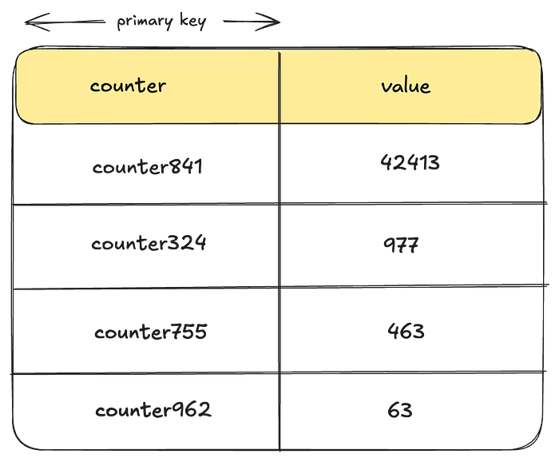

Let’s examine some of the drawbacks of this approach:

- **Lack of Idempotency**: There is no idempotency key baked into the storage data-model preventing users from safely retrying requests. Implementing idempotency would likely require using an external system for such keys, which can further degrade performance or cause race conditions.
- **Heavy Contention**: To update counts reliably, every writer must perform a Compare-And-Swap operation for a given counter using locks or transactions. Depending on the throughput and concurrency of operations, this can lead to significant contention, heavily impacting performance.

**Secondary Keys**: One way to reduce contention in this approach would be to use a secondary key, such as a _bucket_id_, which allows for distributing writes by splitting a given counter into _buckets_, while enabling reads to aggregate across buckets. The challenge lies in determining the appropriate number of buckets. A static number may still lead to contention with _hot keys_, while dynamically assigning the number of buckets per counter across millions of counters presents a more complex problem.

Let’s see if we can iterate on our solution to overcome these drawbacks.

**Approach 2: Per Instance Aggregation**

To address issues of hot keys and contention from writing to the same row in real-time, we could implement a strategy where each instance aggregates the counts in memory and then flushes them to disk at regular intervals. Introducing sufficient jitter to the flush process can further reduce contention.

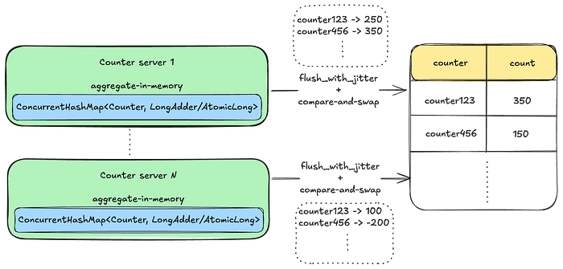

However, this solution presents a new set of issues:

- **Vulnerability to Data Loss**: The solution is vulnerable to data loss for all in-memory data during instance failures, restarts, or deployments.
- **Inability to Reliably Reset Counts**: Due to counting requests being distributed across multiple machines, it is challenging to establish consensus on the exact point in time when a counter reset occurred.
- **Lack of Idempotency: **Similar to the previous approach, this method does not natively guarantee idempotency. One way to achieve idempotency is by consistently routing the same set of counters to the same instance. However, this approach may introduce additional complexities, such as leader election, and potential challenges with availability and latency in the write path.

That said, this approach may still be suitable in scenarios where these trade-offs are acceptable. However, let’s see if we can address some of these issues with a different event-based approach.

**Approach 3: Using Durable Queues**

In this approach, we log counter events into a durable queuing system like [Apache Kafka](https://kafka.apache.org/) to prevent any potential data loss. By creating multiple topic partitions and hashing the counter key to a specific partition, we ensure that the same set of counters are processed by the same set of consumers. This setup simplifies facilitating idempotency checks and resetting counts. Furthermore, by leveraging additional stream processing frameworks such as [Kafka Streams](https://kafka.apache.org/documentation/streams/) or [Apache Flink](https://flink.apache.org/), we can implement windowed aggregations.

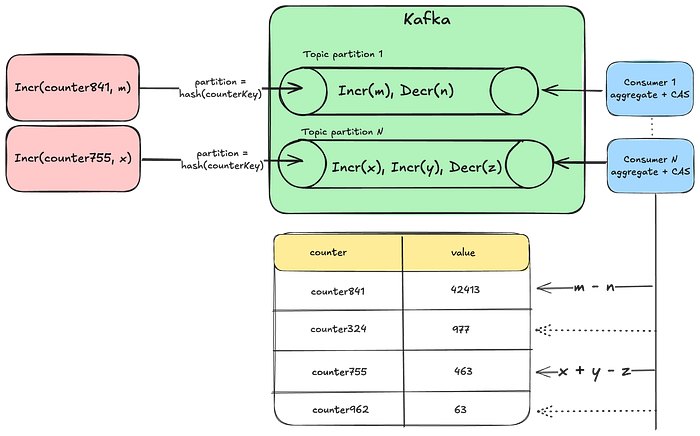

However, this approach comes with some challenges:

- **Potential Delays**: Having the same consumer process all the counts from a given partition can lead to backups and delays, resulting in stale counts.
- **Rebalancing Partitions**: This approach requires auto-scaling and rebalancing of topic partitions as the cardinality of counters and throughput increases.

Furthermore, all approaches that pre-aggregate counts make it challenging to support two of our requirements for accurate counters:

- **Auditing of Counts**: Auditing involves extracting data to an offline system for analysis to ensure that increments were applied correctly to reach the final value. This process can also be used to track the provenance of increments. However, auditing becomes infeasible when counts are aggregated without storing the individual increments.
- **Potential Recounting**: Similar to auditing, if adjustments to increments are necessary and recounting of events within a time window is required, pre-aggregating counts makes this infeasible.

Barring those few requirements, this approach can still be effective if we determine the right way to scale our queue partitions and consumers while maintaining idempotency. However, let’s explore how we can adjust this approach to meet the auditing and recounting requirements.

**Approach 4: Event Log of Individual Increments**

In this approach, we log each individual counter increment along with its **event_time** and **event_id**. The event_id can include the source information of where the increment originated. The combination of event_time and event_id can also serve as the idempotency key for the write.

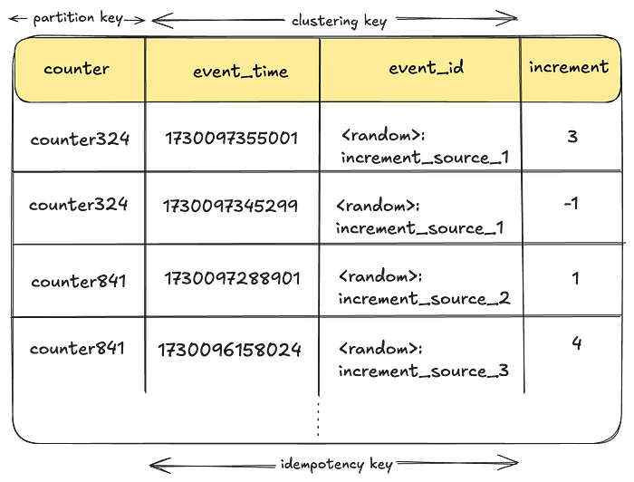

However, _in its simplest form_, this approach has several drawbacks:

- **Read Latency**: Each read request requires scanning all increments for a given counter potentially degrading performance.
- **Duplicate Work**: Multiple threads might duplicate the effort of aggregating the same set of counters during read operations, leading to wasted effort and subpar resource utilization.
- **Wide Partitions**: If using a datastore like [Apache Cassandra](https://cassandra.apache.org/_/index.html), storing many increments for the same counter could lead to a [wide partition](https://thelastpickle.com/blog/2019/01/11/wide-partitions-cassandra-3-11.html), affecting read performance.
- **Large Data Footprint**: Storing each increment individually could also result in a substantial data footprint over time. Without an efficient data retention strategy, this approach may struggle to scale effectively.

The combined impact of these issues can lead to increased infrastructure costs that may be difficult to justify. However, adopting an event-driven approach seems to be a significant step forward in addressing some of the challenges we’ve encountered and meeting our requirements.

How can we improve this solution further?

## Netflix’s Approach

We use a combination of the previous approaches, where we log each counting activity as an event, and continuously aggregate these events in the background using queues and a sliding time window. Additionally, we employ a bucketing strategy to prevent wide partitions. In the following sections, we’ll explore how this approach addresses the previously mentioned drawbacks and meets all our requirements.

**Note**: _From here on, we will use the words “_**_rollup_**_” and “_**_aggregate_**_” interchangeably. They essentially mean the same thing, i.e., collecting individual counter increments/decrements and arriving at the final value._

**TimeSeries Event Store:**

We chose the [TimeSeries Data Abstraction](./introducing-netflix-timeseries-data-abstraction-layer-31552f6326f8.md) as our event store, where counter mutations are ingested as event records. Some of the benefits of storing events in TimeSeries include:

**High-Performance**: The TimeSeries abstraction already addresses many of our requirements, including high availability and throughput, reliable and fast performance, and more.

**Reducing Code Complexity**: We reduce a lot of code complexity in Counter Abstraction by delegating a major portion of the functionality to an existing service.

TimeSeries Abstraction uses Cassandra as the underlying event store, but it can be configured to work with any persistent store. Here is what it looks like:

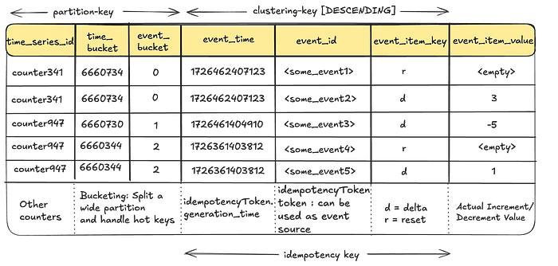

**Handling Wide Partitions**: The _time_bucket_ and _event_bucket_ columns play a crucial role in breaking up a wide partition, preventing high-throughput counter events from overwhelming a given partition. _For more information regarding this, refer to our previous _[_blog_](./introducing-netflix-timeseries-data-abstraction-layer-31552f6326f8.md).

****No Over-Counting******: The ****_event_time_****, ****_event_id_**** and ****_event_item_key_**** columns form the idempotency key for the events for a given counter, enabling clients to retry safely without the risk of over-counting.**

**Event Ordering**: TimeSeries orders all events in descending order of time allowing us to leverage this property for events like count resets.

**Event Retention**: The TimeSeries Abstraction includes retention policies to ensure that events are not stored indefinitely, saving disk space and reducing infrastructure costs. Once events have been aggregated and moved to a more cost-effective store for audits, there’s no need to retain them in the primary storage.

Now, let’s see how these events are aggregated for a given counter.

**Aggregating Count Events:**

As mentioned earlier, collecting all individual increments for every read request would be cost-prohibitive in terms of read performance. Therefore, a background aggregation process is necessary to continually converge counts and ensure optimal read performance.

_But how can we safely aggregate count events amidst ongoing write operations?_

This is where the concept of _Eventually Consistent _counts becomes crucial. _By intentionally lagging behind the current time by a safe margin_, we ensure that aggregation always occurs within an immutable window.

Lets see what that looks like:

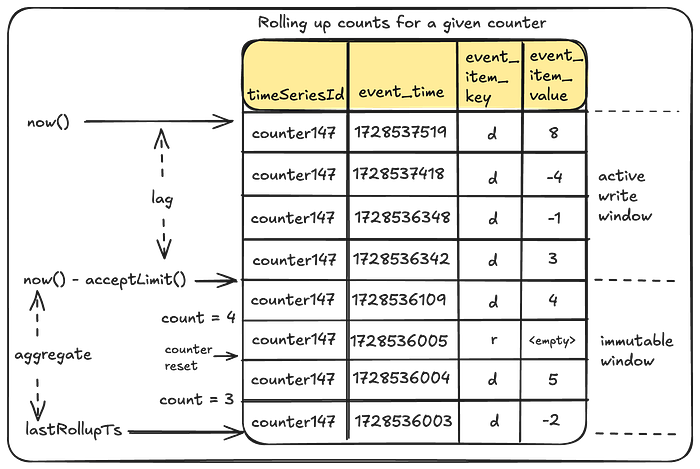

Let’s break this down:

- **lastRollupTs**: This represents the most recent time when the counter value was last aggregated. For a counter being operated for the first time, this timestamp defaults to a reasonable time in the past.
- **Immutable Window and Lag**: Aggregation can only occur safely within an immutable window that is no longer receiving counter events. The “acceptLimit” parameter of the TimeSeries Abstraction plays a crucial role here, as it rejects incoming events with timestamps beyond this limit. During aggregations, this window is pushed slightly further back to account for clock skews.

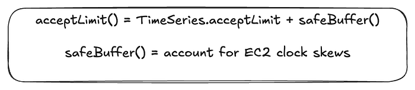

This does mean that the counter value will lag behind its most recent update by some margin (typically in the order of seconds). _This approach does leave the door open for missed events due to cross-region replication issues. See “Future Work” section at the end._

- **Aggregation Process**: The rollup process aggregates all events in the aggregation window _since the last rollup _to arrive at the new value.


**Rollup Store:**

We save the results of this aggregation in a persistent store. The next aggregation will simply continue from this checkpoint.

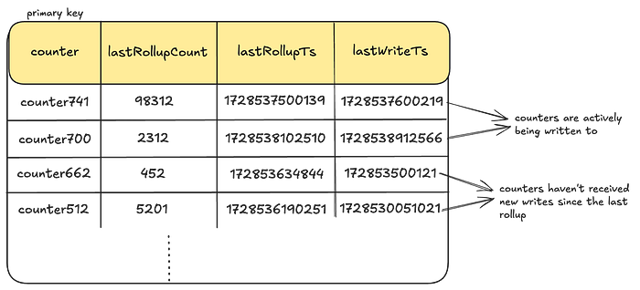

We create one such Rollup table _per dataset_ and use Cassandra as our persistent store. However, as you will soon see in the Control Plane section, the Counter service can be configured to work with any persistent store.

**LastWriteTs**: Every time a given counter receives a write, we also log a **last-write-timestamp** as a columnar update in this table. This is done using Cassandra’s [USING TIMESTAMP](https://docs.datastax.com/en/cql-oss/3.x/cql/cql_reference/cqlInsert.html#cqlInsert__timestamp-value) feature to predictably apply the Last-Write-Win (LWW) semantics. This timestamp is the same as the _event_time_ for the event. In the subsequent sections, we’ll see how this timestamp is used to keep some counters in active rollup circulation until they have caught up to their latest value.

**Rollup Cache**

To optimize read performance, these values are cached in EVCache for each counter. We combine the **lastRollupCount** and **lastRollupTs** _into a single cached value per counter_ to prevent potential mismatches between the count and its corresponding checkpoint timestamp.

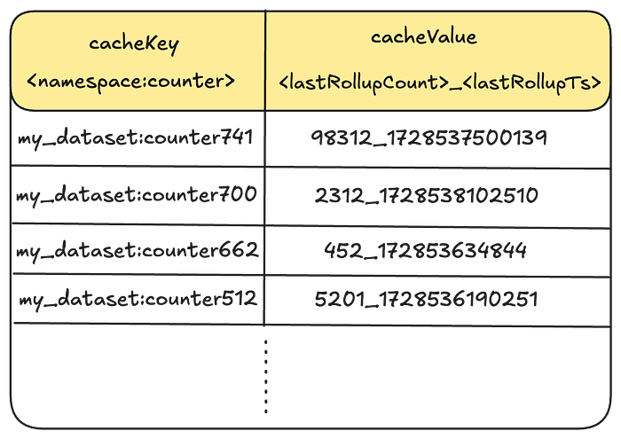

But, how do we know which counters to trigger rollups for? Let’s explore our Write and Read path to understand this better.

**Add/Clear Count:**


An _add_ or _clear_ count request writes durably to the TimeSeries Abstraction and updates the last-write-timestamp in the Rollup store. If the durability acknowledgement fails, clients can retry their requests with the same idempotency token without the risk of overcounting.** **Upon durability, we send a _fire-and-forget _request to trigger the rollup for the request counter.

**GetCount:**

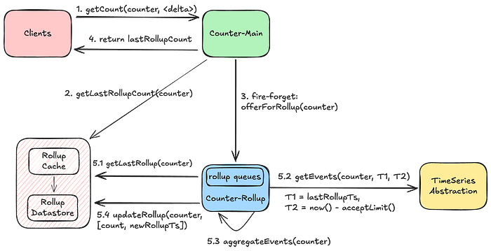

We return the last rolled-up count as_ a quick point-read operation_, accepting the trade-off of potentially delivering a slightly stale count. We also trigger a rollup during the read operation to advance the last-rollup-timestamp, enhancing the performance of _subsequent_ aggregations. This process also _self-remediates _a stale count if any previous rollups had failed.

With this approach, the counts_ continually converge_ to their latest value. Now, let’s see how we scale this approach to millions of counters and thousands of concurrent operations using our Rollup Pipeline.

**Rollup Pipeline:**

Each **Counter-Rollup** server operates a rollup pipeline to efficiently aggregate counts across millions of counters. This is where most of the complexity in Counter Abstraction comes in. In the following sections, we will share key details on how efficient aggregations are achieved.

**Light-Weight Roll-Up Event: **As seen in our Write and Read paths above, every operation on a counter sends a light-weight event to the Rollup server:

```
rollupEvent: {
  "namespace": "my_dataset",
  "counter": "counter123"
}
```

Note that this event does not include the increment. This is only an indication to the Rollup server that this counter has been accessed and now needs to be aggregated. Knowing exactly which specific counters need to be aggregated prevents scanning the entire event dataset for the purpose of aggregations.

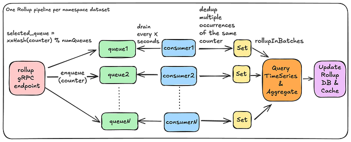

**In-Memory Rollup Queues:** A given Rollup server instance runs a set of _in-memory_ queues to receive rollup events and parallelize aggregations. In the first version of this service, we settled on using in-memory queues to reduce provisioning complexity, save on infrastructure costs, and make rebalancing the number of queues fairly straightforward. However, this comes with the trade-off of potentially missing rollup events in case of an instance crash. For more details, see the “Stale Counts” section in “Future Work.”

**Minimize Duplicate Effort**: We use a fast non-cryptographic hash like [XXHash](https://xxhash.com/) to ensure that the same set of counters end up on the same queue. Further, we try to minimize the amount of duplicate aggregation work by having a separate rollup stack that chooses to run _fewer_ _beefier_ instances.

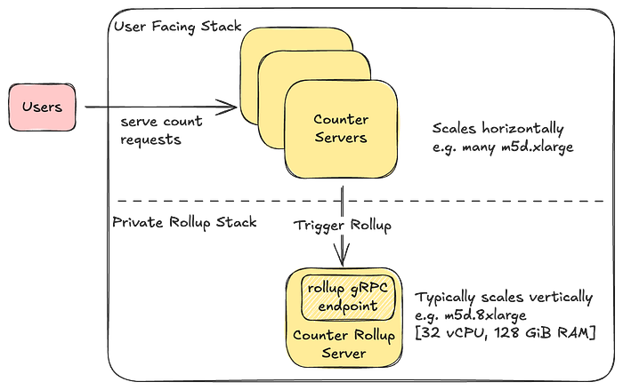

**Availability and Race Conditions: **Having a single Rollup server instance can minimize duplicate aggregation work but may create availability challenges for triggering rollups. _If_ we choose to horizontally scale the Rollup servers, we allow threads to overwrite rollup values while avoiding any form of distributed locking mechanisms to maintain high availability and performance. This approach remains safe because aggregation occurs within an immutable window. Although the concept of _now()_ may differ between threads, causing rollup values to sometimes fluctuate, the counts will eventually converge to an accurate value within each immutable aggregation window.

**Rebalancing Queues**: If we need to scale the number of queues, a simple Control Plane configuration update followed by a re-deploy is enough to rebalance the number of queues.

```
      "eventual_counter_config": {             
          "queue_config": {                    
            "num_queues" : 8,  // change to 16 and re-deploy
...
```

**Handling Deployments**: During deployments, these queues shut down gracefully, draining all existing events first, while the new Rollup server instance starts up with potentially new queue configurations. There may be a brief period when both the old and new Rollup servers are active, but as mentioned before, this race condition is managed since aggregations occur within immutable windows.

**Minimize Rollup Effort**: Receiving multiple events for the same counter doesn’t mean rolling it up multiple times. We drain these rollup events into a Set, ensuring _a given counter is rolled up only once_ _during a rollup window_.

**Efficient Aggregation: **Each rollup consumer processes a batch of counters simultaneously. Within each batch, it queries the underlying TimeSeries abstraction in parallel to aggregate events within specified time boundaries. The TimeSeries abstraction optimizes these range scans to achieve low millisecond latencies.

**Dynamic Batching**: The Rollup server dynamically adjusts the number of time partitions that need to be scanned based on cardinality of counters in order to prevent overwhelming the underlying store with many parallel read requests.

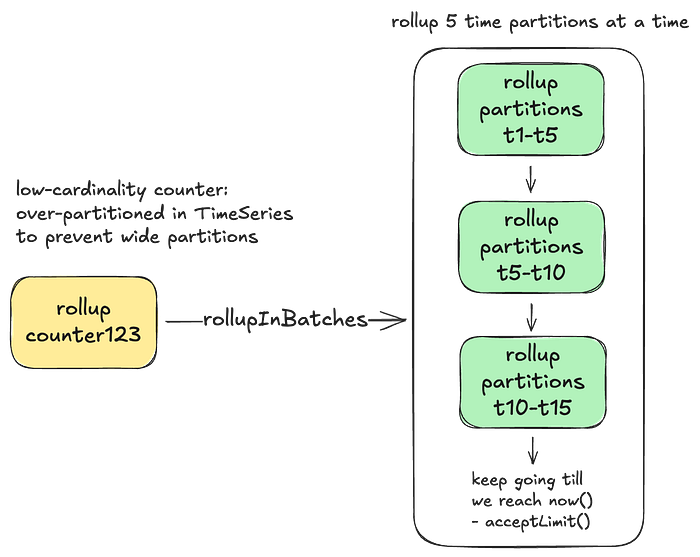

**Adaptive Back-Pressure**: Each consumer waits for one batch to complete before issuing the rollups for the next batch. It adjusts the wait time between batches based on the performance of the previous batch. This approach provides back-pressure during rollups to prevent overwhelming the underlying TimeSeries store.

**Handling Convergence**:

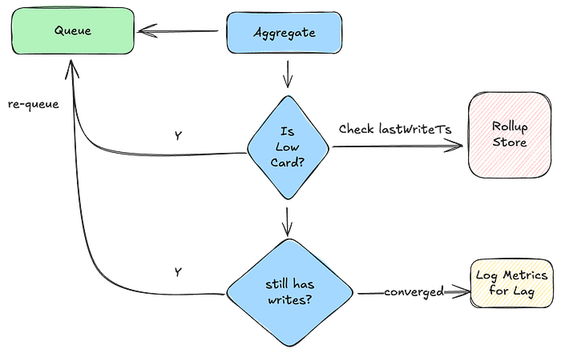

In order to prevent **low-cardinality** counters from lagging behind too much and subsequently scanning too many time partitions, they are kept in constant rollup circulation. For **high-cardinality** counters, continuously circulating them would consume excessive memory in our Rollup queues. This is where the **last-write-timestamp** mentioned previously plays a crucial role. The Rollup server inspects this timestamp to determine if a given counter needs to be re-queued, ensuring that we continue aggregating until it has fully caught up with the writes.

Now, let’s see how we leverage this counter type to provide an up-to-date current count in near-realtime.

## Experimental: Accurate Global Counter

We are experimenting with a slightly modified version of the Eventually Consistent counter. Again, take the term ‘Accurate’ with a grain of salt. The key difference between this type of counter and its counterpart is that the _delta_, representing the counts since the last-rolled-up timestamp, is computed in real-time.

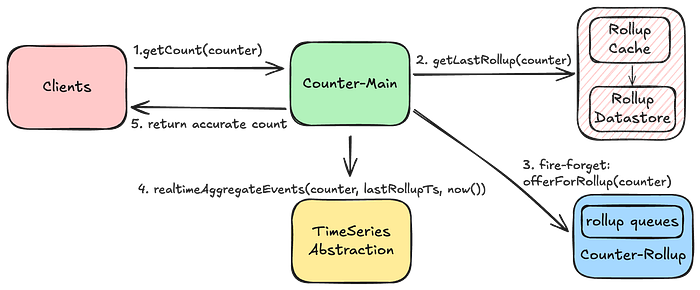

And then, _currentAccurateCount = lastRollupCount + delta_

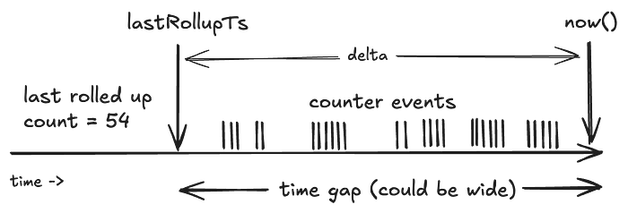

Aggregating this delta in real-time can impact the performance of this operation, depending on the number of events and partitions that need to be scanned to retrieve this delta. The same principle of rolling up in batches applies here to prevent scanning too many partitions in parallel. Conversely, if the counters in this dataset are_ _accessed_ _frequently, the time gap for the delta remains narrow, making this approach of fetching current counts quite effective.

Now, let’s see how all this complexity is managed by having a unified Control Plane configuration.

## Control Plane

The [Data Gateway Platform Control Plane](https://netflixtechblog.medium.com/data-gateway-a-platform-for-growing-and-protecting-the-data-tier-f1ed8db8f5c6) manages control settings for all abstractions and namespaces, including the Counter Abstraction. Below, is an example of a control plane configuration for a namespace that supports eventually consistent counters with low cardinality:

```
"persistence_configuration": [
  {
    "id": "CACHE",                             // Counter cache config
    "scope": "dal=counter",                                                   
    "physical_storage": {
      "type": "EVCACHE",                       // type of cache storage
      "cluster": "evcache_dgw_counter_tier1"   // Shared EVCache cluster
    }
  },
  {
    "id": "COUNTER_ROLLUP",
    "scope": "dal=counter",                    // Counter abstraction config
    "physical_storage": {                     
      "type": "CASSANDRA",                     // type of Rollup store
      "cluster": "cass_dgw_counter_uc1",       // physical cluster name
      "dataset": "my_dataset_1"                // namespace/dataset   
    },
    "counter_cardinality": "LOW",              // supported counter cardinality
    "config": {
      "counter_type": "EVENTUAL",              // Type of counter
      "eventual_counter_config": {             // eventual counter type
        "internal_config": {                  
          "queue_config": {                    // adjust w.r.t cardinality
            "num_queues" : 8,                  // Rollup queues per instance
            "coalesce_ms": 10000,              // coalesce duration for rollups
            "capacity_bytes": 16777216         // allocated memory per queue
          },
          "rollup_batch_count": 32             // parallelization factor
        }
      }
    }
  },
  {
    "id": "EVENT_STORAGE",
    "scope": "dal=ts",                         // TimeSeries Event store
    "physical_storage": {
      "type": "CASSANDRA",                     // persistent store type
      "cluster": "cass_dgw_counter_uc1",       // physical cluster name
      "dataset": "my_dataset_1",               // keyspace name
    },
    "config": {                              
      "time_partition": {                      // time-partitioning for events
        "buckets_per_id": 4,                   // event buckets within
        "seconds_per_bucket": "600",           // smaller width for LOW card
        "seconds_per_slice": "86400",          // width of a time slice table
      },
      "accept_limit": "5s",                    // boundary for immutability
    },
    "lifecycleConfigs": {
      "lifecycleConfig": [
        {
          "type": "retention",                 // Event retention
          "config": {
            "close_after": "518400s",
            "delete_after": "604800s"          // 7 day count event retention
          }
        }
      ]
    }
  }
]
```

Using such a control plane configuration, we compose multiple abstraction layers using containers deployed on the same host, with each container fetching configuration specific to its scope.

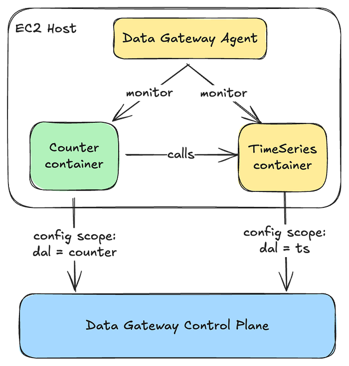

## Provisioning

As with the TimeSeries abstraction, our automation uses a bunch of user inputs regarding their workload and cardinalities to arrive at the right set of infrastructure and related control plane configuration. You can learn more about this process in a talk given by one of our stunning colleagues, [Joey Lynch](https://www.linkedin.com/in/joseph-lynch-9976a431/) : [How Netflix optimally provisions infrastructure in the cloud](https://www.youtube.com/watch?v=Lf6B1PxIvAs).

## Performance

At the time of writing this blog, this service was processing close to **75K count requests/second**_ globally_ across the different API endpoints and datasets:

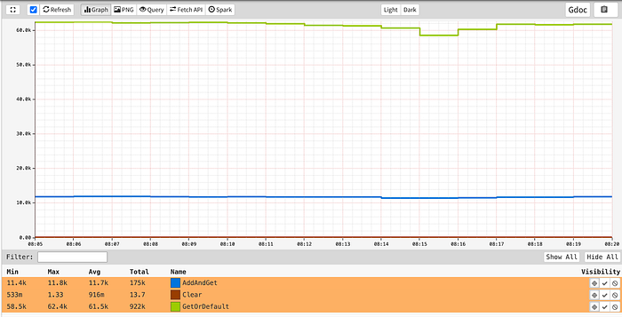

while providing** single-digit millisecond** latencies for all its endpoints:

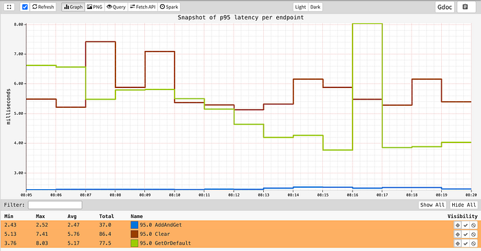

## Future Work

While our system is robust, we still have work to do in making it more reliable and enhancing its features. Some of that work includes:

- **Regional Rollups: **Cross-region replication issues can result in missed events from other regions. An alternate strategy involves establishing a rollup table for each region, and then tallying them in a global rollup table. A key challenge in this design would be effectively communicating the clearing of the counter across regions.
- **Error Detection and Stale Counts**: Excessively stale counts can occur if rollup events are lost or if a rollup fails and isn’t retried. This isn’t an issue for frequently accessed counters, as they remain in rollup circulation. This issue is more pronounced for counters that aren’t accessed frequently. Typically, the initial read for such a counter will trigger a rollup,_ self-remediating _the issue. However, for use cases that cannot accept potentially stale initial reads, we plan to implement improved error detection, rollup handoffs, and durable queues for resilient retries.

## Conclusion

Distributed counting remains a challenging problem in computer science. In this blog, we explored multiple approaches to implement and deploy a Counting service at scale. While there may be other methods for distributed counting, our goal has been to deliver blazing fast performance at low infrastructure costs while maintaining high availability and providing idempotency guarantees. Along the way, we make various trade-offs to meet the diverse counting requirements at Netflix. We hope you found this blog post insightful.

Stay tuned for **Part 3 **of Composite Abstractions at Netflix, where we’ll introduce our **Graph Abstraction**, a new service being built on top of the [Key-Value Abstraction](./introducing-netflixs-key-value-data-abstraction-layer-1ea8a0a11b30.md) _and_ the [TimeSeries Abstraction](./introducing-netflix-timeseries-data-abstraction-layer-31552f6326f8.md) to handle high-throughput, low-latency graphs.

## Acknowledgments

Special thanks to our stunning colleagues who contributed to the Counter Abstraction’s success: [Joey Lynch](https://www.linkedin.com/in/joseph-lynch-9976a431/), [Vinay Chella](https://www.linkedin.com/in/vinaychella/), [Kaidan Fullerton](https://www.linkedin.com/in/kaidanfullerton/), [Tom DeVoe](https://www.linkedin.com/in/tomdevoe/), [Mengqing Wang](https://www.linkedin.com/in/mengqingwang/), [Varun Khaitan](https://www.linkedin.com/in/varun-khaitan/)

---
**Tags:** Distributed Systems · Counter · Scalability · System Design Interview · Software Architecture
