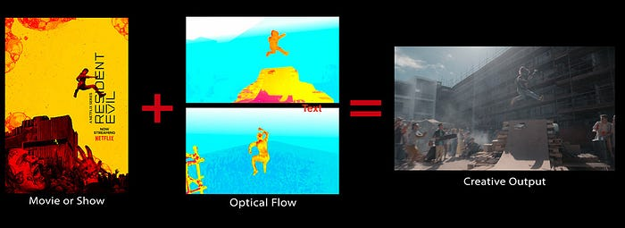
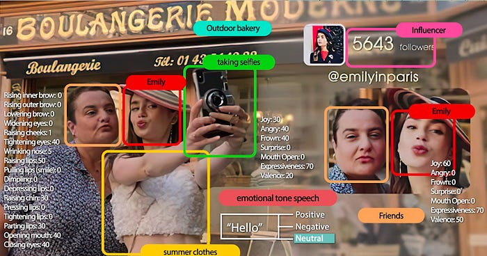

# New Series: Creating Media with Machine Learning

By [Vi Iyengar](https://www.linkedin.com/in/vi-pallavika-iyengar-144abb1b/), [Keila Fong](https://www.linkedin.com/in/keilafong/), [Hossein Taghavi](https://www.linkedin.com/in/mhtaghavi/), [Andy Yao](https://www.linkedin.com/in/yaoandy/), [Kelli Griggs](https://www.linkedin.com/in/kelli-griggs-32990125/), [Boris Chen](https://www.linkedin.com/in/boris-chen-b921a214/), [Cristina Segalin](https://www.linkedin.com/in/cristinasegalin/), [Apurva Kansara](https://www.linkedin.com/in/apurvakansara/), [Grace Tang](https://www.linkedin.com/in/tsmgrace/), [Billur Engin](https://www.linkedin.com/in/billurengin/), [Amir Ziai](https://www.linkedin.com/in/amirziai/), [James Ray](https://www.linkedin.com/in/james-ray-090b9414/), [Jonathan Solorzano-Hamilton](https://www.linkedin.com/in/peachpie/)

Welcome to the first post in our multi-part series on how Netflix is developing and using machine learning (ML) to help creators make better media — from TV shows to trailers to movies to promotional art and so much more.

Media is at the heart of Netflix. It’s our medium for delivering a range of emotions and experiences to our members. Through each engagement, media is how we bring our members continued joy.

**This blog series will take you behind the scenes, showing you how we use the power of machine learning to create stunning media at a global scale.**

### Episodes:

1. [Match Cutting: Finding Cuts with Smooth Visual Transitions Using Machine Learning](./match-cutting-at-netflix-finding-cuts-with-smooth-visual-transitions-31c3fc14ae59.md)
2. [Causal Machine Learning for Creative Insights](https://netflixtechblog.medium.com/causal-machine-learning-for-creative-insights-4b0ce22a8a96)
3. [Scalable Annotation Service — Marken](https://medium.com/p/f5ba9266d428)
4. [Discovering Creative Insights in Promotional Artwork](./discovering-creative-insights-in-promotional-artwork-295e4d788db5.md)
5. [Scaling Media Machine Learning at Netflix](./scaling-media-machine-learning-at-netflix-f19b400243.md)
6. [Building a Media Understanding Platform for ML Innovations](https://medium.com/p/9bef9962dcb7)
7. [Detecting Scene Changes in Audiovisual Content](./detecting-scene-changes-in-audiovisual-content-77a61d3eaad6.md)
8. [AVA Discovery View: Surfacing Authentic Moments](./ava-discovery-view-surfacing-authentic-moments-b8cd145491cc.md)
9. [Building In-Video Search](./building-in-video-search-936766f0017c.md)
10. [Detecting Speech and Music in Audio Content](https://netflixtechblog.medium.com/detecting-speech-and-music-in-audio-content-afd64e6a5bf8)
11. [Video annotator: a framework for efficiently building video classifiers using vision-language models and active learning](./video-annotator-building-video-classifiers-using-vision-language-models-and-active-learning-8ebdda0b2db4.md)

At Netflix, we launch thousands of new TV shows and movies every year for our members across the globe. Each title is promoted with a custom set of artworks and video assets in support of helping each title find their audience of fans. Our goal is to empower creators with innovative tools that support them in effectively and efficiently create the best media possible.

With media-focused ML algorithms, we’ve brought science and art together to revolutionize how content is made. Here are just a few examples:

- We maintain a growing suite of _video understanding_ models that categorize characters, storylines, emotions, and cinematography. These timecode tags enable efficient discovery, freeing our creators from hours of categorizing footage so they can focus on creative decisions instead.
- **We arm our creators with rich insights derived from our personalization system, helping them better understand our members and gain knowledge to produce content that maximizes their joy.**
- We invest in novel algorithms for bringing hard-to-execute editorial techniques easily to creators’ fingertips, such as [match cutting](./match-cutting-at-netflix-finding-cuts-with-smooth-visual-transitions-31c3fc14ae59.md) and automated rotoscoping/matting.

One of our competitive advantages is the instant feedback we get from our members and creator teams, like the success of assets for content choosing experiences and internal asset creation tools. We use these measurements to constantly refine our research, examining which algorithms and creative strategies we invest in. The feedback we collect from our members also powers our causal machine learning algorithms, providing invaluable creative insights on asset generation.

In this blog series, we will explore our media-focused ML research, development, and opportunities related to the following areas:

- Computer vision: video understanding search and match cut tools
- VFX and Computer graphics: matting/rotoscopy, volumetric capture to digitize actors/props/sets, animation, and relighting
- Audio and Speech
- Content: understanding, extraction, and knowledge graphs
- Infrastructure and paradigms

We are continuously investing in the future of media-focused ML. One area we are expanding into is multimodal content understanding — a fundamental ML research that utilizes multiple sources of information or modality (e.g. video, audio, closed captions, scripts) to capture the full meaning of media content. **Our teams have demonstrated value and observed success by modeling different combinations of modalities, such as video and text, video and audio, script alone, as well as video, audio and scripts together.** Multimodal content understanding is expected to solve the most challenging problems in content production, VFX, promo asset creation, and personalization.

We are also using ML to transform the way we create Netflix TV shows and movies. Our filmmakers are embracing [Virtual Production](https://www.wetafx.co.nz/research-and-tech/technology/virtual-production/) (filming on specialized light and MoCap stages while being able to view a virtual environment and characters). Netflix is building prototype stages and developing deep learning algorithms that will maximize cost efficiency and adoption of this transformational tech. With virtual production, we can digitize characters and sets as 3D models, estimate lighting, easily relight scenes, optimize color renditions, and replace in-camera backgrounds via semantic segmentation.

Most importantly, in close collaboration with creators, we are building human-centric approaches to creative tools, from VFX to trailer editing. Context, not control, guides the work for data scientists and algorithm engineers at Netflix. Contributors enjoy a tremendous amount of latitude to come up with experiments and new approaches, rapidly test them in production contexts, and scale the impact of their work. Our leadership in this space hinges on our reliance on each individual’s ideas and drive towards a common goal — **making Netflix the home of the best content and creative experience in the world.**

Working on media ML at Netflix is a unique opportunity to push the boundaries of what’s technically and creatively possible. It’s a cutting edge and quickly evolving research area. The progress we’ve made so far is just the beginning. Our goal is to research and develop machine learning and computer vision tools that put power into the hands of creators and support them in making the best media possible.

We look forward to sharing our work with you across this blog series and beyond.

If these types of challenges interest you, please let us know! We are always looking for great people who are inspired by [machine learning](https://jobs.netflix.com/search?q=%22machine+learning%22) and [computer vision](https://jobs.netflix.com/search?q=%22computer+vision%22) to join our team.

---
**Tags:** Machine Learning · Media · Movies
