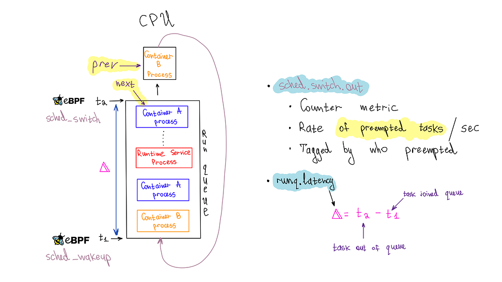
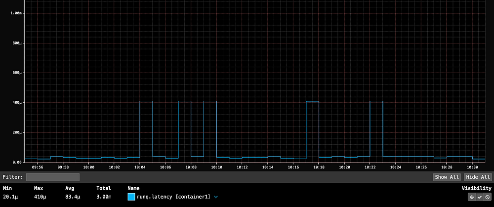
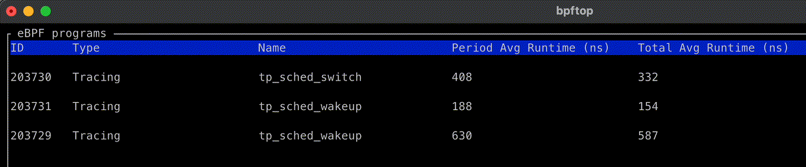

# Noisy Neighbor Detection with eBPF

_By _[_Jose Fernandez_](https://www.linkedin.com/in/josefernandezmn/)_, _[_Sebastien Dabdoub_](https://www.linkedin.com/in/sebastien-dabdoub-2a5a0958/)_, _[_Jason Koch_](https://www.linkedin.com/in/jason-koch-5692172/)_, _[_Artem Tkachuk_](https://www.linkedin.com/in/artemtkachuk/)

The Compute and Performance Engineering teams at Netflix regularly investigate performance issues in our multi-tenant environment. The first step is determining whether the problem originates from the application or the underlying infrastructure. One issue that often complicates this process is the "noisy neighbor" problem. On [Titus](https://netflixtechblog.com/titus-the-netflix-container-management-platform-is-now-open-source-f868c9fb5436), our multi-tenant compute platform, a "noisy neighbor" refers to a container or system service that heavily utilizes the server's resources, causing performance degradation in adjacent containers. We usually focus on CPU utilization because it is our workloads’ most frequent source of noisy neighbor issues.

Detecting the effects of noisy neighbors is complex. Traditional performance analysis tools such as [perf](https://www.brendangregg.com/perf.html) can introduce significant overhead, risking further performance degradation. Additionally, these tools are typically deployed after the fact, which is too late for effective investigation._ _Another challenge is that debugging noisy neighbor issues requires significant low-level expertise and specialized tooling_. _In this blog post, we'll reveal how we leveraged **[eBPF](https://ebpf.io/)** to achieve continuous, low-overhead instrumentation of the Linux scheduler, enabling effective self-serve monitoring of noisy neighbor issues. You’ll learn how Linux kernel instrumentation can improve your infrastructure observability with deeper insights and enhanced monitoring.

## Continuous Instrumentation of the Linux Scheduler

To ensure the reliability of our workloads that depend on low latency responses, we instrumented the [run queue](https://en.wikipedia.org/wiki/Run_queue) latency for each container, which measures the time processes spend in the scheduling queue before being dispatched to the CPU. Extended waiting in this queue can be a telltale of performance issues, especially when containers are not utilizing their total CPU allocation. Continuous instrumentation is critical to catching such matters as they emerge, and eBPF, with its hooks into the Linux scheduler with minimal overhead, enabled us to monitor run queue latency efficiently.

To emit a run queue latency metric, we leveraged three eBPF hooks: `sched_wakeup`**, **`sched_wakeup_new`**,** and `sched_switch`.


*Diagram of how run queue latency is measured and instrumented*

The `sched_wakeup`** **and `sched_wakeup_new` hooks are invoked when a process changes state from 'sleeping' to 'runnable.' They let us identify when a process is ready to run and is waiting for CPU time. During this event, we generate a timestamp and store it in an eBPF hash map using the process ID as the key.

```
struct {
    __uint(type, BPF_MAP_TYPE_HASH);
    __uint(max_entries, MAX_TASK_ENTRIES);
    __uint(key_size, sizeof(u32));
    __uint(value_size, sizeof(u64));
} runq_enqueued SEC(".maps");

SEC("tp_btf/sched_wakeup")
int tp_sched_wakeup(u64 *ctx)
{
    struct task_struct *task = (void *)ctx[0];
    u32 pid = task->pid;
    u64 ts = bpf_ktime_get_ns();

    bpf_map_update_elem(&runq_enqueued, &pid, &ts, BPF_NOEXIST);
    return 0;
}
```

Conversely, the `sched_switch` hook is triggered when the CPU switches between processes. This hook provides pointers to the process currently utilizing the CPU and the process about to take over. We use the upcoming task's process ID (PID) to fetch the timestamp from the eBPF map. This timestamp represents when the process entered the queue, which we had previously stored. We then calculate the run queue latency by simply subtracting the timestamps.

```
SEC("tp_btf/sched_switch")
int tp_sched_switch(u64 *ctx)
{
    struct task_struct *prev = (struct task_struct *)ctx[1];
    struct task_struct *next = (struct task_struct *)ctx[2];
    u32 prev_pid = prev->pid;
    u32 next_pid = next->pid;
 
    // fetch timestamp of when the next task was enqueued
    u64 *tsp = bpf_map_lookup_elem(&runq_enqueued, &next_pid);
    if (tsp == NULL) {
        return 0; // missed enqueue
    }

    // calculate runq latency before deleting the stored timestamp
    u64 now = bpf_ktime_get_ns();
    u64 runq_lat = now - *tsp;

    // delete pid from enqueued map
    bpf_map_delete_elem(&runq_enqueued, &next_pid);
    ....
```

One of the advantages of eBPF is its ability to provide pointers to the actual kernel data structures representing processes or threads, also known as tasks in kernel terminology. This feature enables access to a wealth of information stored about a process. We required the process's cgroup ID to associate it with a container for our specific use case. However, the cgroup information in the process struct is safeguarded by an[ RCU (Read Copy Update) lock](https://elixir.bootlin.com/linux/v6.6.16/source/include/linux/sched.h#L1225).

To safely access this RCU-protected information, we can leverage [kfuncs](https://docs.kernel.org/bpf/kfuncs.html) in eBPF. kfuncs are kernel functions that can be called from eBPF programs. There are kfuncs available to lock and unlock RCU read-side critical sections. These functions ensure that our eBPF program remains safe and efficient while retrieving the cgroup ID from the task struct.

```
void bpf_rcu_read_lock(void) __ksym;
void bpf_rcu_read_unlock(void) __ksym;

u64 get_task_cgroup_id(struct task_struct *task)
{
    struct css_set *cgroups;
    u64 cgroup_id;
    bpf_rcu_read_lock();
    cgroups = task->cgroups;
    cgroup_id = cgroups->dfl_cgrp->kn->id;
    bpf_rcu_read_unlock();
    return cgroup_id;
}
```

Once the data is ready, we must package it and send it to userspace. For this purpose, we chose the eBPF [ring buffer](https://nakryiko.com/posts/bpf-ringbuf/). It is efficient, high-performing, and user-friendly. It can handle variable-length data records and allows data reading without necessitating extra memory copying or syscalls. However, the sheer number of data points was causing the userspace program to use too much CPU, so we implemented a rate limiter in eBPF to sample the data.

```
struct {
    __uint(type, BPF_MAP_TYPE_RINGBUF);
    __uint(max_entries, RINGBUF_SIZE_BYTES);
} events SEC(".maps");

struct {
    __uint(type, BPF_MAP_TYPE_PERCPU_HASH);
    __uint(max_entries, MAX_TASK_ENTRIES);
    __uint(key_size, sizeof(u64));
    __uint(value_size, sizeof(u64));
} cgroup_id_to_last_event_ts SEC(".maps");

struct runq_event {
    u64 prev_cgroup_id;
    u64 cgroup_id;
    u64 runq_lat;
    u64 ts;
};

SEC("tp_btf/sched_switch")
int tp_sched_switch(u64 *ctx)
{
    // ....
    // The previous code
    // ....
 
    u64 prev_cgroup_id = get_task_cgroup_id(prev);
    u64 cgroup_id = get_task_cgroup_id(next);
 
    // per-cgroup-id-per-CPU rate-limiting 
    // to balance observability with performance overhead
    u64 *last_ts = 
        bpf_map_lookup_elem(&cgroup_id_to_last_event_ts, &cgroup_id);
    u64 last_ts_val = last_ts == NULL ? 0 : *last_ts;

    // check the rate limit for the cgroup_id in consideration
    // before doing more work
    if (now - last_ts_val < RATE_LIMIT_NS) {
        // Rate limit exceeded, drop the event
        return 0;
    }

    struct runq_event *event;
    event = bpf_ringbuf_reserve(&events, sizeof(*event), 0);
  
    if (event) {
        event->prev_cgroup_id = prev_cgroup_id;
        event->cgroup_id = cgroup_id;
        event->runq_lat = runq_lat;
        event->ts = now;
        bpf_ringbuf_submit(event, 0);
        // Update the last event timestamp for the current cgroup_id
        bpf_map_update_elem(&cgroup_id_to_last_event_ts, &cgroup_id,
            &now, BPF_ANY);

    }

    return 0;
}
```

Our userspace application, developed in Go, processes events from the ring buffer to emit metrics to our metrics backend, [Atlas](https://netflixtechblog.com/introducing-atlas-netflixs-primary-telemetry-platform-bd31f4d8ed9a). Each event includes a run queue latency sample with a cgroup ID, which we associate with containers running on the host. We categorize it as a system service if no such association is found. When a cgroup ID is associated with a container, we emit a percentile timer Atlas metric (`runq.latency`) for that container. We also increment a counter metric (`sched.switch.out`) to monitor preemptions occurring for the container's processes. Access to the `prev_cgroup_id` of the preempted process allows us to tag the metric with the cause of the preemption, whether it's due to a process within the same container (or cgroup), a process in another container, or a system service.

It's important to highlight that both the `runq.latency` metric and the `sched.switch.out` metrics are needed to determine if a container is affected by noisy neighbors, which is the goal we aim to achieve — relying solely on the `runq.latency `metric can lead to misconceptions. For example, if a container is at or over its cgroup CPU limit, the scheduler will throttle it, resulting in an apparent spike in run queue latency due to delays in the queue. If we were only to consider this metric, we might incorrectly attribute the performance degradation to noisy neighbors when it's actually because the container is hitting its CPU quota. However, simultaneous spikes in both metrics, mainly when the cause is a different container or system process, clearly indicate a noisy neighbor issue.

## A Noisy Neighbor Story

Below is the `runq.latency` metric for a server running a single container with ample CPU capacity. The 99th percentile averages 83.4µs (microseconds), serving as our baseline. Although there are some spikes reaching 400µs, the latency remains within acceptable parameters.


*container1’s 99th percentile runq.latency averages 83µs (microseconds), with spikes up to 400µs, without adjacent containers. This serves as our baseline for a container not contending for CPU on a host.*

At 10:35, launching `container2`, **which fully utilized all CPUs on the host**, caused a significant 131-millisecond spike (131,000 microseconds) in `container1`'s P99 run queue latency. This spike would be noticeable in the userspace application if it were serving HTTP traffic. If userspace app owners reported an unexplained latency spike, we could quickly identify the noisy neighbor issue through run queue latency metrics.


*Launching container2 at 10:35, which maxes out all CPUs on the host, caused a 131-millisecond spike in container1’s P99 run queue latency due to increased preemptions by system processes. This indicates a noisy neighbor issue, where system services compete for CPU time with containers.*

The `sched.switch.out` metric indicates that the spike was due to increased preemptions by system processes, highlighting a noisy neighbor issue where system services compete with containers for CPU time. Our metrics show that the noisy neighbors were actually system processes, likely triggered by `container2` consuming all available CPU capacity.

## Optimizing eBPF Code

We developed an open-source eBPF process monitoring tool called [bpftop](./announcing-bpftop-streamlining-ebpf-performance-optimization-6a727c1ae2e5.md) to measure the overhead of eBPF code in this kernel hot path. Our profiling with `bpftop` shows that the instrumentation adds less than 600 nanoseconds to each `sched_*` hook. We conducted a performance analysis on a Java service running in a container, and the instrumentation did not introduce significant overhead. The performance variance with the run queue profiling code active versus inactive was not measurable in milliseconds.

During our research on how eBPF statistics are measured in the kernel, we identified an opportunity to improve the calculation. We submitted this [patch](https://git.kernel.org/pub/scm/linux/kernel/git/torvalds/linux.git/commit/?id=ce09cbdd988887662546a1175bcfdfc6c8fdd150), which was included in the Linux kernel 6.10 release.



Through trial and error and using `bpftop`, we identified several optimizations that helped maintain low overhead for our eBPF code:

- We found that `BPF_MAP_TYPE_HASH` was the most performant for storing enqueued timestamps. Using `BPF_MAP_TYPE_TASK_STORAGE` resulted in nearly a twofold performance decline. `BPF_MAP_TYPE_PERCPU_HASH` was slightly less performant than `BPF_MAP_TYPE_HASH`, which was unexpected and requires further investigation.
- `BPF_MAP_TYPE_LRU_HASH` maps are 40–50 nanoseconds slower per operation than regular hash maps. Due to space concerns from PID churn, we initially used them for enqueued timestamps. Ultimately, we settled on `BPF_MAP_TYPE_HASH` with an increased size to mitigate this risk.
- The `BPF_CORE_READ` helper adds 20–30 nanoseconds per invocation. In the case of raw tracepoints, specifically those that are "BTF-enabled" (`tp_btf/*`), it is safe and more efficient to access the task struct members directly. Andrii Nakryiko recommends this approach in this [blog post](https://nakryiko.com/posts/bpf-core-reference-guide/#btf-enabled-bpf-program-types-with-direct-memory-reads).
- The `sched_switch`, `sched_wakeup`, and `sched_wakeup_new` are all triggered for kernel tasks, which are identifiable by their PID of 0. We found monitoring these tasks unnecessary, so we implemented several early exit conditions and conditional logic to prevent executing costly operations, such as accessing BPF maps, when dealing with a kernel task. Notably, kernel tasks operate through the scheduler queue like any regular process.

## Conclusion

Our findings highlight the value of low-overhead continuous instrumentation of the Linux kernel with eBPF. We have integrated these metrics into customer dashboards, enabling actionable insights and guiding multitenancy performance discussions. We can also now use these metrics to refine CPU isolation strategies to minimize the impact of noisy neighbors. Additionally, thanks to these metrics, we've gained deeper insights into the Linux scheduler.

This work has also deepened our understanding of eBPF technology and underscored the importance of tools like `bpftop` for optimizing eBPF code. As eBPF adoption increases, we foresee more infrastructure observability and business logic shifting to it. One promising project in this space is [sched_ext](https://github.com/sched-ext/scx), which has the potential to revolutionize how scheduling decisions are made and tailored to specific workload needs.

---
**Tags:** Ebpf · Linux · Containers · Performance · Observability
