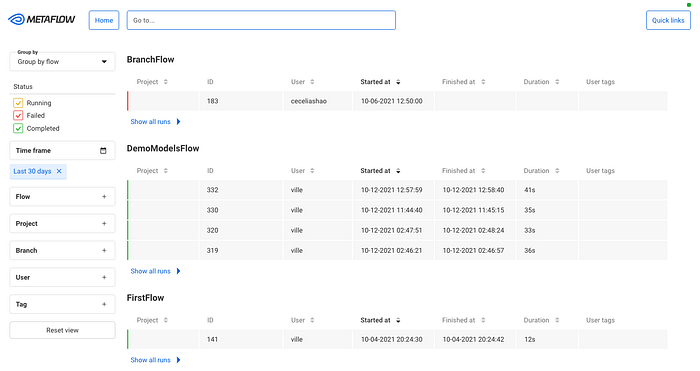
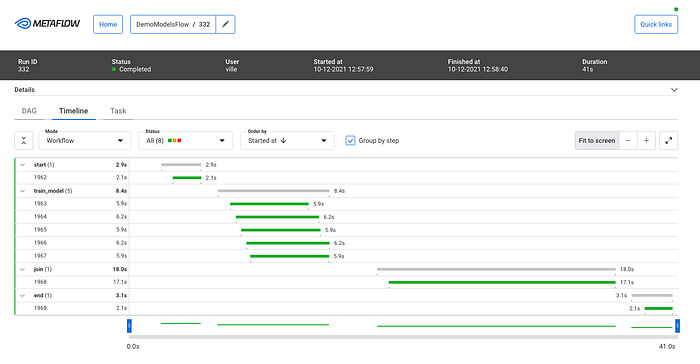
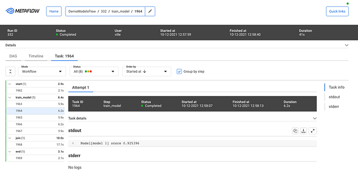
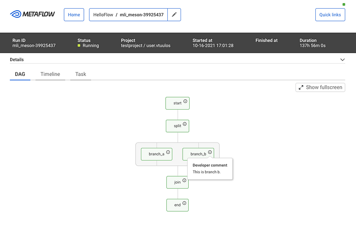
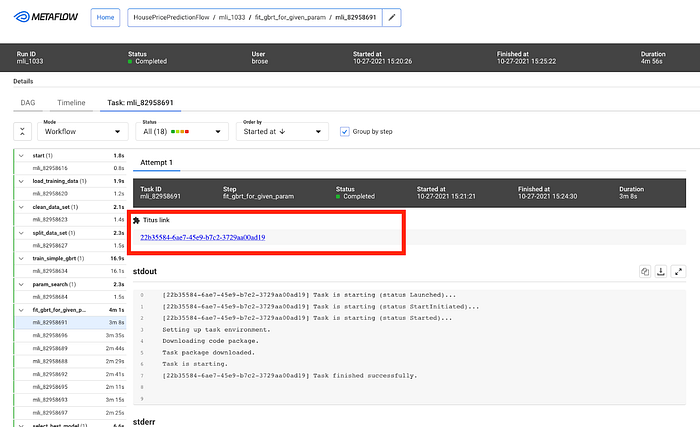

# Open-Sourcing a Monitoring GUI for Metaflow, Netflix’s ML Platform

_tl;dr Today, we are open-sourcing a long-awaited _[_GUI for Metaflow_](https://github.com/Netflix/metaflow-ui#readme)_. The _[_Metaflow GUI_](https://demo.public.outerbounds.xyz/)_ allows data scientists to monitor their workflows in real-time, track experiments, and see detailed logs and results for every executed task. _**_The GUI can be extended with plugins, allowing the community to build integrations to other systems, custom visualizations, and embed upcoming features of Metaflow directly into its views._**

[Metaflow is a full-stack framework for data science](https://metaflow.org/) that we started developing at Netflix over four years ago and which [we open-sourced in 2019](./open-sourcing-metaflow-a-human-centric-framework-for-data-science-fa72e04a5d9.md). It allows data scientists to define ML workflows, test them locally, scale-out to the cloud, and deploy to production in idiomatic Python code. Since open-sourcing, the Metaflow community has been growing quickly: it is now the 7th most starred active project on Netflix’s GitHub account with [nearly 4800 stars](https://github.com/netflix/metaflow). Outside Netflix, Metaflow is used to power machine learning in production by hundreds of companies across industries from bioinformatics to real estate.

Since its inception, Metaflow has been a command-line-centric tool. It makes it easy for data scientists to express even complex machine learning applications in idiomatic Python, test them locally, or scale them out in the cloud — all using their favorite IDEs and terminals. Following our [culture of freedom and responsibility](https://jobs.netflix.com/culture), Metaflow grants data scientists the freedom to choose the right modeling approach, handle data and features flexibly, and construct workflows easily while ensuring that the resulting project executes responsibly and robustly on the production infrastructure.

As the number and criticality of projects running on Metaflow increased — some of which are [very central to our business](./supporting-content-decision-makers-with-machine-learning-995b7b76006f.md) — our ML platform team started receiving an increasing number of support requests. Frequently, the questions were of the nature “can you help me understand why my flow takes so long to execute” or “how can I find the logs for a model that failed last night.” Technically, Metaflow provides a [Python API](https://docs.metaflow.org/metaflow/client) that allows the user to inspect all details e.g., in a notebook, but writing code in a notebook to answer basic questions like this felt overkill and unnecessarily tedious. After observing the situation for months, we started forming an understanding of the kind of a new user interface that could address the growing needs of our users.

## Requirements for a Metaflow GUI

Metaflow is [a human-centered system by design](https://docs.metaflow.org/introduction/what-is-metaflow#the-philosophy-of-metaflow). We consider our Python API and the CLI to be integral parts of the overall user interface and user experience, which singularly focuses on making it easier to build production-ready ML projects from scratch. In our approach, Python code provides a highly expressive and productive user interface for expressing complex business logic, such as ML models and workflows. At the same time, the CLI allows users to execute specific commands quickly and even automate common actions. When it comes to complex, real-life development work like this, it would be hard to achieve the same level of productivity on a graphical user interface.

However, textual UIs are quite lacking when it comes to discoverability and getting a holistic understanding of the system’s state. The questions we were hearing reflected this gap: we were lacking a user interface that would allow the users, quite simply, to figure out quickly _what is happening_ in their Metaflow projects.

Netflix has a long history of developing [innovative tools for observability](https://netflixtechblog.com/tagged/observability), so when we began to specify requirements for the new GUI, we were able to leverage experiences from the previous GUIs built for other use cases, as well as real-life user stories from Metaflow users. We wanted to scope the GUI tightly, focusing on a specific gap in the Metaflow experience:

1. The GUI should allow the users to **see what flows and tasks are executing** and what is happening inside them. Notably, we didn’t want to replace any of the functionality in the Metaflow APIs or CLI with the GUI — just to complement them. This meant that the GUI would be _read-only_: all actions like writing code and starting executions should happen on the users’ IDE and terminal as before. We also had no need to build a model-monitoring GUI yet, which is a wholly separate problem domain.
2. The GUI would be **targeted at professional data scientists**. Instead of a fancy GUI for demos and presentations, we wanted a serious productivity tool with carefully thought-out user workflows that would fit seamlessly into our toolchain of data science. This requires attention to small details: for instance, users should be able to copy a link to any view in the GUI and share it e.g., on Slack, for easy collaboration and support (or to integrate with the [Metaflow Slack bot](https://github.com/outerbounds/metaflowbot)). And, there should be natural affordances for navigating between the CLI, the GUI, and notebooks.
3. The GUI should be **scalable and snappy**: it should handle our existing repository consisting of millions of runs, some of which contain tens of thousands of tasks without hiccups. Based on our experiences with other GUIs operating at Netflix-scale, this is not a trivial requirement: scalability needs to be baked into the design from the very beginning. Sluggish GUIs are hard to debug and fix afterwards, and they can have a significantly negative impact on productivity.
4. The GUI should **integrate well with other GUIs**. A modern ML stack consists of many independent systems like data warehouses, compute layers, model serving systems, and, in particular, notebooks. It should be possible to find runs and tasks of interest in the Metaflow GUI and use a task-specific view to jump to other GUIs for further information. Our landscape of tools is constantly evolving, so we didn’t want to hardcode these links and views in the GUI itself. Instead, following the integration-friendly ethos of Metaflow, we want to embed relevant information in the GUI as plugins.
5. Finally, we wanted to **minimize the operational overhead** of the GUI. In particular, under no circumstances should the GUI impact Metaflow executions. The GUI backend should be a simple service, optionally sitting alongside the existing Metaflow metadata service, providing a read-only, real-time view to the stored state. The frontend side should be easily extensible and maintainable, suggesting that we wanted a modern React app.

## Monitoring GUI for Metaflow

As our ML Platform team had limited frontend resources, we reached out to [Codemate](http://codemate.com/) to help with the implementation. As it often happens in software engineering projects, the project took longer than expected to finish, mostly because the problem of tracking and visualizing thousands of concurrent objects in real-time in a highly distributed environment is a surprisingly non-trivial problem (duh!). After countless iterations, we are finally very happy with the outcome, which we have now used in production for a few months.

When you open the GUI, you see an overview of all flows and runs, both current and historical, which you can group and filter in various ways:

*Runs Grouped by flows*

We can use this view for **experiment tracking**: Metaflow records every execution automatically, so data scientists can track all their work using this view. Naturally, the view can be grouped by user. They can also tag their runs and filter the view by tags, allowing them to focus on particular subsets of experiments.

After you click a specific run, you see all its tasks on a timeline:

*Timeline view for a run*

The timeline view is extremely useful in understanding performance bottlenecks, distribution of task runtimes, and finding failed tasks. At the top, you can see global attributes of the run, such as its status, start time, parameters etc. You can click a specific task to see more details:

*Task view*

This task view shows logs produced by a task, its results, and optionally links to other systems that are relevant to the task. For instance, if the task had deployed a model to a model serving platform, the view could include a link to a UI used for monitoring microservices.

As specified in our requirements, the GUI should work well with Metaflow CLI. To facilitate this, the top bar includes a navigation component where the user can copy-paste any _pathspec, _i.e., a path to any object in the Metaflow universe, which are prominently shown in the CLI output. This way, the user can easily move from the CLI to the GUI to observe runs and tasks in detail.

While the CLI is great, it is challenging to visualize flows. Each flow can be represented as a Directed Acyclic Graph (DAG), and so the GUI provides a much better way to visualize a flow. The DAG view presents all the steps of a flow and how they are related. Each step may have developer comments. They are colored to indicate the current state. Split steps are grouped by shaded boxes, while steps that participated in a foreach are grouped by a double shade box. Clicking on a step will take you to the Task view.

*DAG View*

Users at different organizations will likely have some special use cases that are not directly supported. The Metaflow GUI is extensible through its [plugin API](https://github.com/Netflix/metaflow-ui/tree/master/plugin-api). For example, Netflix has its container orchestration platform called [Titus](https://netflixtechblog.com/titus-the-netflix-container-management-platform-is-now-open-source-f868c9fb5436). Users can configure tasks to utilize Titus to scale up or out. When failures happen, users will need to access their Titus containers for more information, and within the task view, a simple plugin provides a link for further troubleshooting.

*Example task-level plugin*

## Try it at home!

We know that our user stories and requirements for a Metaflow GUI are not unique to Netflix. A number of companies in the Metaflow community have requested GUI for Metaflow in the past. To support the thriving community and invite 3rd party contributions to the GUI, we are open-sourcing our Monitoring GUI for Metaflow today!

You can find [detailed instructions for how to deploy the GUI here](https://github.com/Netflix/metaflow-ui#readme). If you want to see the GUI in action before deploying it, [Outerbounds](https://outerbounds.co/), a new startup founded by our ex-colleagues, has deployed [a public demo instance of the GUI](https://demo.public.outerbounds.xyz/). Outerbounds also hosts [an active Slack community](https://slack.outerbounds.co/) of Metaflow users where you can find support for GUI-related issues and share feedback and ideas for improvement.

With the new GUI, data scientists don’t have to fly blind anymore. Instead of reaching out to a platform team for support, they can easily see the state of their workflows on their own. We hope that Metaflow users outside Netflix will find the GUI equally beneficial, and companies will find creative ways to improve the GUI with [new plugins](https://github.com/Netflix/metaflow-ui/tree/master/plugin-api).

For more context on the development process and motivation for the GUI, you can watch [this recording of the GUI launch meetup](https://www.youtube.com/watch?v=1feubdiYla0).

---
**Tags:** Metaflow · Machine Learning · Python · Netflix · Open Source
