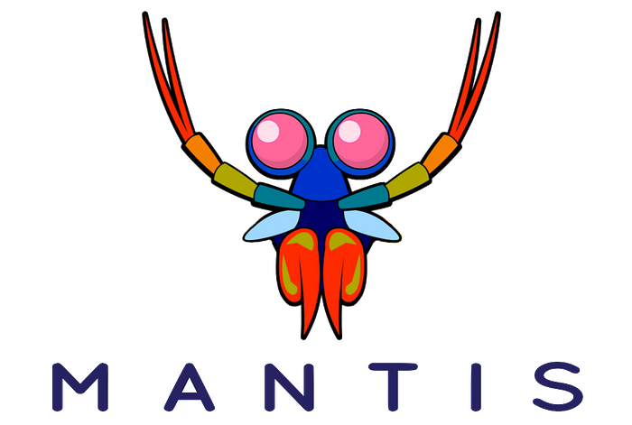

# Open Sourcing Mantis: A Platform For Building Cost-Effective, Realtime, Operations-Focused Applications

_By Cody Rioux, Daniel Jacobson, Jeff Chao, Neeraj Joshi, Nick Mahilani, Piyush Goyal, Prashanth Ramdas, Zhenzhong Xu_

Today we’re excited to announce that we’re open sourcing [Mantis](https://netflix.github.io/mantis/), a platform that helps Netflix engineers better understand the behavior of their applications to ensure the highest quality experience for our members. We believe the challenges we face here at Netflix are not necessarily unique to Netflix which is why we’re sharing it with the broader community.

As a streaming microservices ecosystem, the Mantis platform provides engineers with capabilities to minimize the costs of observing and operating complex distributed systems without compromising on operational insights. Engineers have built cost-efficient applications on top of Mantis to quickly identify issues, trigger alerts, and apply remediations to minimize or completely avoid downtime to the Netflix service. Where other systems may take over ten minutes to process metrics accurately, Mantis reduces that from tens of minutes down to seconds, effectively reducing our Mean-Time-To-Detect. This is crucial because any amount of downtime is brutal and comes with an incredibly high impact to our members — every second counts during an outage.

As the company continues to grow our member base, and as those members use the Netflix service even more, having cost-efficient, rapid, and precise insights into the operational health of our systems is only growing in importance. For example, a five-minute outage today is equivalent to a two-hour outage at the time of our[ last Mantis blog post](https://medium.com/netflix-techblog/stream-processing-with-mantis-78af913f51a6).

## Mantis Makes It Easy to Answer New Questions

The traditional way of working with metrics and logs alone is not sufficient for large-scale and growing systems. Metrics and logs require that you to know what you want to answer ahead of time. Mantis on the other hand allows us to sidestep this drawback completely by giving us the ability to answer new questions without having to add new instrumentation. Instead of logs or metrics, Mantis enables a democratization of events where developers can tap into an event stream from any instrumented application on demand. By making consumption on-demand, you’re able to freely publish all of your data to Mantis.

## Mantis is Cost-Effective in Answering Questions

Publishing 100% of your operational data so that you’re able to answer new questions in the future is traditionally cost prohibitive at scale. Mantis uses an on-demand, reactive model where you don’t pay the cost for these events until something is subscribed to their stream. To further reduce cost, Mantis reissues the same data for equivalent subscribers. In this way, Mantis is differentiated from other systems by allowing us to achieve streaming-based observability on events while empowering engineers with the tooling to reduce costs that would otherwise become detrimental to the business.

From the beginning, we’ve built Mantis with this exact guiding principle in mind: Let’s make sure we minimize the costs of observing and operating our systems without compromising on required and opportunistic insights.

## Guiding Principles Behind Building Mantis

The following are the guiding principles behind building Mantis.

1. ****We should have access to raw events.**** Applications that publish events into Mantis should be free to publish every single event. If we prematurely transform events at this stage, then we’re already at a disadvantage when it comes to getting insight since data in its original form is already lost.
2. **We should be able to access these events in realtime.** Operational use cases are inherently time sensitive by nature. The traditional method of publishing, storing, and then aggregating events in batch is too slow. Instead, we should process and serve events one at a time as they arrive. This becomes increasingly important with scale as the impact becomes much larger in far less time.
3. **We should be able to ask new questions of this data without having to add new instrumentation to your applications.** It’s not possible to know ahead of time every single possible failure mode our systems might encounter despite all the rigor built in to make these systems resilient. When these failures do inevitably occur, it’s important that we can derive new insights with this data. You should be able to publish as large of an event with as much context as you want. That way, when you think of a new questions to ask of your systems in the future, the data will be available for you to answer those questions.
4. **We should be able to do all of the above in a cost-effective way.** As our business critical systems scale, we need to make sure the systems in support of these business critical systems don’t end up costing more than the business critical systems themselves.

With these guiding principles in mind, let’s take a look at how Mantis brings value to Netflix.

## How Mantis Brings Value to Netflix

Mantis has been in production for over four years. Over this period several critical operational insight applications have been built on top of the Mantis platform.

A few noteworthy examples include:

[**Realtime monitoring of Netflix streaming health**](https://medium.com/netflix-techblog/sps-the-pulse-of-netflix-streaming-ae4db0e05f8a) which examines all of Netflix’s streaming video traffic in realtime and accurately identifies negative impact on the viewing experience with fine-grained granularity. This system serves as an early warning indicator of the overall health of the Netflix service and will trigger and alert relevant teams within seconds.

[**Contextual Alerting**](https://www.youtube.com/watch?v=6UwcqiNsZ8U) which analyzes millions of interactions between dozens of Netflix microservices in realtime to identify anomalies and provide operators with rich and relevant context. The realtime nature of these Mantis-backed aggregations allows the Mean-Time-To-Detect to be cut down from tens of minutes to a few seconds. Given the scale of Netflix this makes a huge impact.

[**Raven**](https://www.youtube.com/watch?v=uODxUJ5Jwis) which allows users to perform ad-hoc exploration of realtime data from hundreds of streaming sources using our Mantis Query Language (MQL).

[**Cassandra Health check**](https://www.youtube.com/watch?v=w3WbVMavy2I) which analyzes rich operational events in realtime to generate a holistic picture of the health of every Cassandra cluster at Netflix.

**Alerting on Log** data which detects application errors by processing data from thousands of Netflix servers in realtime.

[**Chaos Experimentation monitoring**](https://medium.com/netflix-techblog/chap-chaos-automation-platform-53e6d528371f) which tracks user experience during a Chaos exercise in realtime and triggers an abort of the chaos exercise in case of an adverse impact.

**Realtime Personally Identifiable Information (PII)** data detection samples data across all streaming sources to quickly identify transmission of sensitive data.

## Try It Out Today

To learn more about Mantis, you can check out the main [Mantis page](https://netflix.github.io/mantis/). You can try out Mantis today by spinning up your first Mantis cluster [locally using Docker](https://netflix.github.io/mantis/gettingstarted/docker/) or using the [Mantis CLI to bootstrap a minimal cluster in AWS](https://netflix.github.io/mantis/gettingstarted/cloud/). You can also start [contributing to Mantis](https://github.com/Netflix/mantis/blob/master/CONTRIBUTING.md) by getting the code on [Github](https://github.com/netflix/mantis) or engaging with the [community](https://netflix.github.io/mantis/community/) on the [users](https://groups.google.com/forum/#!forum/mantis-oss-users) or [dev](https://groups.google.com/forum/#!forum/mantis-oss-dev) mailing list.

## Acknowledgements

A lot of work has gone into making Mantis successful at Netflix. We’d like to thank all the contributors, in alphabetical order by first name, that have been involved with Mantis at various points of its existence:

Andrei Ushakov, Ben Christensen, Ben Schmaus, Chris Carey, Danny Yuan, Erik Meijer, Indrajit Roy Choudhury, Josh Evans, Justin Becker, Kathrin Probst, Kevin Lew, Ram Vaithalingam, Ranjit Mavinkurve, Sangeeta Narayanan, Santosh Kalidindi, Seth Katz, Sharma Podila.

---
**Tags:** Observability · Stream Processing · Reliability · Microservices · Realtime
